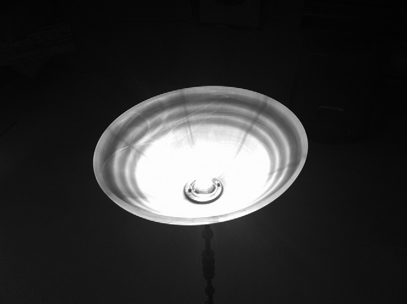
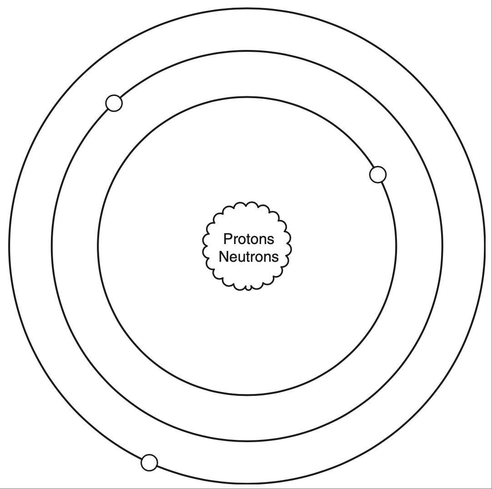
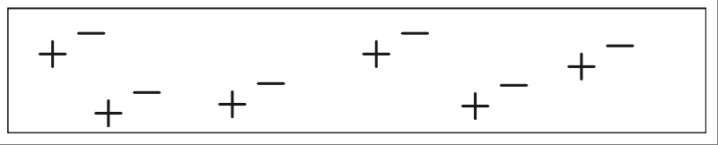
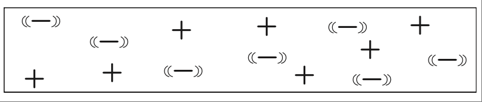
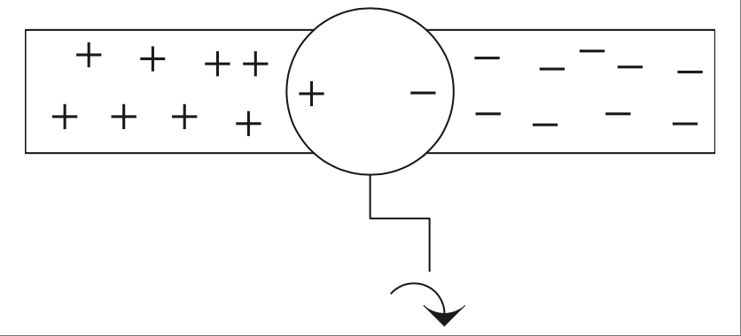
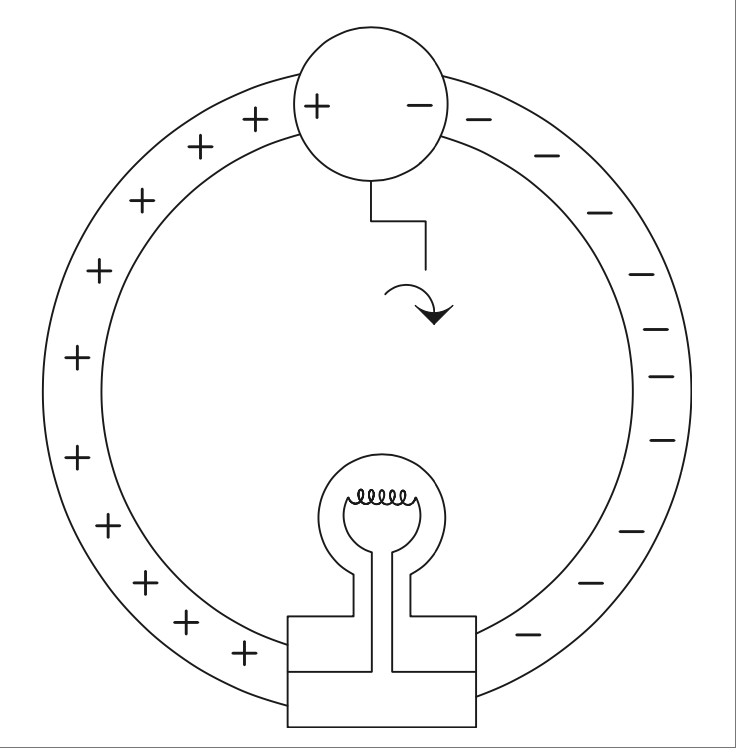
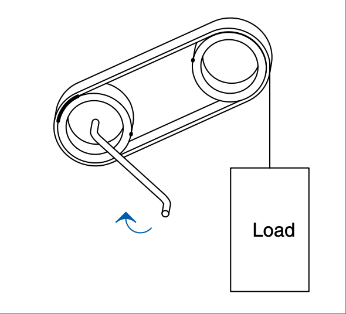
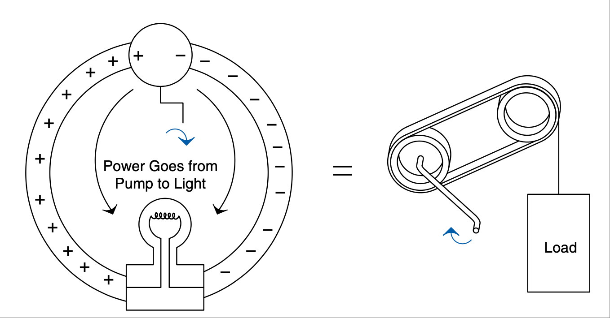

.. _c0:

CHAPTER 0 What Is Electricity Really?
==========================================

CHICKEN VS. EGG
------------------

Which came first, the chicken or the egg? I was faced with just such a quandary when I set down to create the original edition of this book. The way that I found people got the most out of the topics was to get some basic ideas and concepts down first; however, those ideas were built on a presumption of a certain amount of knowledge. On the other hand, I realized that the knowledge that was to be presented would make more sense if you first understood these concepts—thus my chicken-versus-egg dilemma.

Suffice it to say that I jumped ahead to explaining the chicken (the chicken being all about using electricity to our benefit). I was essentially assuming that the reader knew what an egg was (the “egg” being a grasp on what electricity is). Truth be told, it was a bit of a cheat on my part, [1]_ and on top of that I never expected the book to be such a runaway success. Turns out there are lots of people out there who want to know more about the magic of this ever-growing electronic world around us. So, for this new and improved edition of the book, I will digress and do my best to explain the “egg.” Skip ahead if you have an idea of what it’s all about, [2]_ or maybe stick around to see if this is an enlightening look at what electricity really is.

.. [1] Do we all make compromises in the face of impossible deadlines? Are the deadlines only impossible because of our own procrastination? Those are both very heavy-duty questions, not unlike that of the chicken-versus-egg debate.☺

.. [2] Thus, the whole Chapter 0 idea; you can argue that 0 or 1 is the right number to start counting with, so pick whichever chapter you want to begin with of these two and have at it.

SO WHAT IS ELECTRICITY?
-------------------------

The electron—what is it? Well, we haven’t ever seen one, but we have found ways to measure a bunch of them. Meters, oscilloscopes, and all sorts of detectors tell us how electrons move and what they do. We have also found ways to make them turn motors, light up light bulbs, power cell phones, computers, and thou- sands of other really cool things. The impact on our society is immeasurable, it goes to the very core, we even use the symbol of a light bulb turning on as an analogy to having a great idea. Not bad for something that only became part of the world at large a little over 100 years ago. Ironically it is this very light bulb I hope to metaphorically turn on for the readers of this book.

   
What is electricity though? Actually, that is a very good question. If you dig deep enough you can find RSPs [3]_ all over the world who debate this very topic. I have no desire to that join that debate (having not attained RSP status yet). So I will tell you the way I see it and think about it so that it makes sense in my head. Since I am just a hick from a small town, I hope that my explanation will make it easier for you to understand as well.

.. [3] RSP = Really Smart Person. As you will soon learn, I do hope to get an acronym or two into everyday vernacular for the common engineer. BTW, I believe that many engineers are RSPs; it seems to be a common trait among people of that profession.

THE ATOM
-----------

We need to begin by learning about a very small particle that is referred to as an atom. A simple representation of one is shown in :ref:`Figure 0.1 <Figure 0.1>`.

Atoms [4]_ are made up of three types of particles: protons, neutrons, and elec- trons. Only two of these particles have a feature that we call charge. The proton carries a positive charge and the electron carries a negative charge, whereas the neutron carries no charge at all. The individual protons and neutrons are much more massive than the wee little electron. Although they aren’t the same size, the proton and the electron do carry equal amounts of opposite charge.

.. [4] The atom is really, really small. We can sort of “see” an atom these days with some pretty cool instruments, but it is kind of like the way a blind person “sees” Braille by feeling it.

.. _Figure 0.1:

**FIGURE 0.1 Very basic symbol of an atom.**

Now, don’t let the simple circles of my diagram lead you to believe that this is the path that electrons move in. They actually scoot around in a more energetic 3D motion that physicists refer to as a shell. There are many types and shapes of shells, but the specifics are beyond the scope of this text. You do need to under- stand that when you dump enough energy into an atom, you can get an electron to pop off and move fancy free. When this happens the rest of the atom has a net positive charge [5] and the electron a net negative charge. [6]_ Actually, they have these charges when they are part of the atom. They simply cancel each other out so that when you look at the atom as a whole the net charge is zero.

.. [5] An atom with a net charge is also known as an ion.

.. [6] Often referred to as a free electron.

Now, atoms don’t like having electrons missing from their shells, so as soon as another one comes along it will slip into the open slot in that atom’s shell. The amount of energy or work it takes to pop one of these electrons loose depends on the type of atom we are dealing with. When the atom is a good insulator, such as rubber, these electrons are stuck hard in their shells. They aren’t moving for anything. Take a look at the sketch in :ref:`Figure 0.2 <Figure 0.2>`.

.. _Figure 0.2:

**FIGURE 0.2 Electrons are “stuck” in these shells in an insulator; they can’t really leave and move fancy free.**

.. _Figure 0.3:

**FIGURE 0.3 An electron sea.**

In an insulator, these electron charges are “stuck” in place, orbiting the nucleus of the atom—similar to water frozen in a pipe. [7]_ Do take note that there are just as many positive charges as there are negative charges.

With a good conductor though, such as copper, the electrons in the outer shells of the atoms will pop off at the slightest touch; in metal elements these electrons bounce around from atom to atom so easily that we refer to them as an electron sea, or you might hear them referred to as free electrons. More visuals of this idea are shown in :ref:`Figure 0.3 <Figure 0.3>`.

You should note that there are still just as many positive charges as there are negative charges. The difference now is not the number of charges; it is the fact that they can move easily. This time they are like water in the pipe that isn’t frozen but liquid—albeit a pipe that is already full of water, so to speak. Getting the electrons to move just requires a little push and away they go. [8]_ One effect of all these loose electrons is the silvery-shiny appearance that metals have. No wonder the element that we call silver is one of the best conductors there is.

One more thing: A very fundamental property of charge is that like charges repel and opposite charges attract. [9]_ If you bring a free electron next to another free electron, it will tend to push the other electron away from it. Getting the positively charged atoms to move is much more difficult; they are stuck in place in virtually all solid materials, but the same thing applies to positive charges as well. [10]_

.. [7] I like the frozen water analogy; just don’t take it too far and think you just need to melt them to get them to move!

.. [8] Analogies are a great way to understand something, but you have to take care not to take them too far. In this case, take note that you can’t simply tip your wire up and get the electrons to fall out, so it isn’t exactly like water in a pipe.

.. [9] It strikes me that this is somewhat fundamental to human relationships. “Good” girls are often attracted to “bad” boys, and many other analogies that come to mind.

.. [10] There are definitely cases where you can move positive charges around. (In fact, it often happens when you feel a shock.) It’s just that most of the types of materials, circuits, and so on that we deal with in electronics are about moving the tiny, super-small, commonly easy-to-move electron. For that other cool stuff, I suggest you find a good book on electromagnetic physics.

.. admonition:: Thumb Rules

    - Electricity is fundamentally charges, both positive and negative.
    - Energy is work.
    - There are just as many positive as negative charges in both a conductor and an insulator.
    - In a good conductor, the electrons move easily, like liquid water.
    - In a good insulator, the electrons are stuck in place, like frozen water (but not exactly; they don’t “melt”).
    - Like charges repel and opposite charges attract.

NOW WHAT?
------------

So now we have an idea of what insulators and conductors are and how they relate to electrons and atoms. What is this information good for, and why do we care? Let’s focus on these charges and see what happens when we get them to move around.

First, let’s get these charges to move to a place and stay there. To do this we’ll take advantage of the cool effect that these charges have on each other, which we discussed earlier. Remember, opposite charges attract, whereas the same charges repel. There is a cool, mysterious, magical field around these charges. We call it the electrostatic field. This is the very same field that creates everything from static cling to lightning bolts. Have you ever rubbed a balloon on your head and stuck it on the wall? If so, you have seen a demonstration of an electrostatic field. If you took that a little further and waved the balloon closely over the hair on your arm, you might notice how the hairs would track the movement of the balloon. The action of rubbing the balloon caused your head to end up with a net total charge on it and the opposite charge on the balloon. The act of rubbing these materials together [11]_ caused some electrons to move from one surface to the other, charging both your head and the balloon.

This electrostatic field can exert a force on other things with charges. Think about it for a moment: If we could figure out a way to put some charges on one end of our conductor, that would push the like charges away and in so doing cause those charges to move.

:ref:`Figure 0.4 <Figure 0.4>` shows a hypothetical device that separates these charges. I will call it an electron pump and hook it up to our copper conductor we mentioned previously.

In our electron pump, when you turn the crank, one side gets a surplus of electrons, or a negative charge, and on the other side the atoms are missing said electrons, resulting in a positive charge. [12]_

.. [11] Fun side note: Google this balloonrubbing experiment and see what charge is where. Also research the fact that this happens more readily with certain materials than others.

.. [12] There is actually a device that does this. It is called a Van de Graaff generator, so it really isn’t hypothetical, but I really like the word hypothetical. Just saying it seems to raise my IQ!

.. _Figure 0.4:

**FIGURE 0.4 Hypothetical electron pump.**

If you want to carry forward the water analogy, think of this as a pump hooked up to a pipe full of water and sealed at both ends. As you turn the pump, you build up pressure in the pipe—positive pressure on one side of the pump and negative pressure on the other. In the same way, as you turn the crank you build up charges on either side of the pump, and then these charges push out into the wire and sit there because they have no place to go. If you hook up a meter to either end you would measure a potential (think difference in charge) between the two wires. That potential is what we call voltage.

.. note::

    It’s important to realize that it is by the nature of the location of these charges that you measure a voltage. Note that I said location, not movement. Movement of these charges is what we call current (more on that later.) For now what you need to take away from this discussion is that it is an accumulation of charges that we refer to as voltage. The more like charges you get in one location, the stronger the electrostatic field you create. [13]_

Okay, it’s later now. We find that another very cool thing happens when we move these charges. Let’s go back to our pump and stick a light bulb on the ends of our wires, as shown in :ref:`Figure 0.5 <Figure 0.5>`.

Remember that opposite charges attract? When you hook up the bulb, on one side you have positive charges, on the other negative. These charges push through the light bulb, and as they do they heat up the filament and make it light up. If you stop turning the electron pump, this potential across the light bulb disappears and the charges stop moving. Start turning the pump and they start moving again. The movement of these charges is called current. [14]_ The really cool thing that happens is that we get another invisible field that is created when these charges move; it is called the electromagnetic field. If you have ever played with a magnet and some iron filings, you have seen the effects of this field. [15]_

.. [13] There isn’t a good water analogy for this field. You simply need to know it is there; it is important to understand that this field exists. If you still don’t grasp this field, get a balloon and play with it ’til you do. Remember, even the best analogies can break down. The point is to use the analogy to help you begin to grasp the topic, then experiment until you understand all the details.

.. [14] Current is coulombs per second, a measure of flow that has units of amperes, or amps.

.. _Figure 0.5:

**FIGURE 0.5 Electron pump with light bulb.**

So, to recap, if we have a bunch of charges hanging out, we call it voltage, and when we keep these charges in motion we call that current. Some typical water analogies look at voltage as pressure and current as flow. These are helpful to grasp the concept, but keep in mind that a key thing with these charges and their movements is the seemingly magical fields they produce. Voltage generates an electrostatic field (it is this field repelling or attracting other charges that creates the voltage “pressure” in the conductor). Current or flow or movement of the charges generates a magnetic field around the conductor. It is very important to grasp these concepts to enhance your understanding of what is going on. When you get down to it, it is these fields that actually move the work or energy from one end of a circuit to another.

Let’s go back to our pump and light bulb for a minute, as shown in :ref:`Figure 0.6 <Figure 0.6>`.

Turn the pump, and the bulb lights up. Stop turning and it goes out. Start turning and it immediately lights up again. This happens even if the wires are long! We see the effect immediately. Think of the circuit as a pair of pulleys and a belt. The charges are moving around the circuit, transferring power from one location to another—see :ref:`Figure 0.7 <Figure 0.7>`. [16]_

Fundamentally, we can think of the concept as shown in the drawing in :ref:`Figure 0.8 <Figure 0.8>`.

.. [15] In a permanent magnet, all the electrons in the material are scooting around their respective atoms in the same direction; it is the movement of these charges that creates the magnetic field.

.. [16] This diagram is a simplified version of a scalar wave diagram. I won’t go into scalar diagrams in depth here, to limit the amount of information you need to absorb. However, I do recommend that you learn about these when you feel ready.

.. _Figure 0.6:

.. figure:: ./img/f0.6.png
   :align: center
   :scale: 30%

**FIGURE 0.6 The electromagnetic and electronic fields transmit the work from the crank to the light bulb.**

.. _Figure 0.7:

**FIGURE 0.7 The belt transmits the work from the crank to the load.**

Even if the movement of the belt is slow, [17]_ we see the effects on the pulley immediately, at the moment the crank is turned. It is the same way with the light bulb. However, the belt is replaced by the circuit, and it is actually the electromagnetic [18]_ fields pushing charges around that transmit the work to the bulb. Without the effects of both of these fields, we couldn’t move the energy input at the crank to be output at the light bulb. It just wouldn’t happen.

.. [17] The charges in the wire are moving much more slowly than one might think. In fact, DC current moves at about 8 CM per hour. (In a typical wire that is, the exact speed depends on several factors, but it is much slower than you might think.) AC doesn’t even keep flowing, it just kind of bounces back and forth over a very small distance. If you think about it, you might wonder how flipping a switch can get a light to turn on so quickly. Thus the motor and belt analogy; it is the fact that the wire “pipe” is filled (in the same way the belt is connected to the pulley) with these charges that creates the instantaneous effect of a light turning on. 

.. [18] When I use the term electromagnetic, it is referring to the effects of both the electrostatic field and the magnetic field that we have been talking about.

.. _Figure 0.8:

**FIGURE 0.8 The cool magical fields act like the belt transmitting what we call energy, work, or power.**

Like the belt on the pulleys, the charges move around in a loop. But the work that is being done at the crank moves out to the light bulb, where it is used up making the light shine. Charges weren’t used up; current wasn’t used up. They all make the loop (just like the belt in the pulley example). It is energy that is used up. Energy is work; you turning the crank is work. The light bulb takes energy to shine. In the bulb, energy is converted into heat on the filament that makes it glow so bright that you get light. But remember, it is energy that it takes to make this happen. You need both voltage and current (along with their associated fields) to transfer energy from one point to another in an electric circuit.

.. admonition:: Thumb Rules

    - An accumulation of charges is what we call voltage.
    - Movement of charges is what we call current or amperage.
    - Energy is work; in a circuit the electromagnetic effects move energy from one point to another.

A PREVIEW OF THINGS TO COME
------------------------------

Now, all the electronic items that we are going to learn about are based on these charges and their movement. We will learn about resistance—the measure- ment of how difficult it is to get these electrons to pop loose and move around a circuit. We will learn about a diode, a device that can block these charges from moving in one direction while letting them pass in another. We will learn about a transistor and how (using principles similar to the diode) it can switch a current flow on and off. [19]_

We will learn about generators and batteries and find out they are simply different versions of the electron pump that we just talked about.

We will learn about motors, resistors, lights, and displays—all items that consume the power that comes from our electron pump.
But just remember, it all comes back to this basic concept of a charge, the fields around it when it sits there, and the fields that are created when the charges move.

IT JUST SEEMS MAGICAL
-------------------------

Once you grasp the idea of charges and how the presence and movement of these charges transfer energy, the magic of electricity is somewhat lost. If you get the way these charges are similar to a belt turning a pulley, you are already further ahead in understanding than I was when I graduated from college. Whatever you do, don’t let anyone tell you that you can’t learn [20]_ this stuff. It really isn’t all that magical, but it does require you to have an imagination. You might not be able to see it, but you surely can grasp the fundamentals of how it works.

So give it a try; don’t say you can’t do this, [21]_ because I am sure you can. If you read this book and don’t come away with a better grasp of all things electrical and electronic, please drop me a line and complain about it. As long as my inbox isn’t too clogged by email from all those raving reviews, I will be sure to get back to you.

.. admonition:: Thumb Rules

    - “Can’t” is a sucker too lazy to try.
    - Laziness is the mother of invention.

.. [19] These are called semiconductors, and with good reason: They lie somewhere (semi-) between an insulator and a conductor in their ability to move charges. As you will learn later, we capitalize on this fact and can create the cool effects that occur when you jam a couple of different types together.

.. [20] Am I alone in my distaste for so-called weed-out courses? You know, the ones that they put in the curriculum to get people to quit because they make them so hard. I personally believe that the goal of teachers should be to teach. It follows that the goal of a university should be to teach better, not just turn people away.

.. [21] My dad always said, “Can’t is a sucker too lazy to try!”, and after learning this, I also went on to develop a personal belief that laziness is the mother of invention. Does that mean the most successful inventors are those who are lazy enough to look for an easier way, but not too lazy to try it?
