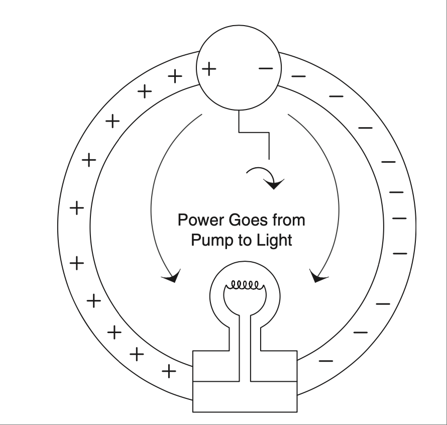

.. _c0:

第0章 电到底是什么?
==========================================
CHAPTER 0 What Is Electricity Really?

鸡 vs 蛋
------------------
CHICKEN VS. EGG

先有鸡还是先有蛋？当我开始写这本书的初版时，正面临这样的难题。我发现人们在理解本书主题时，最有效的方式是先掌握一些基本概念；然而，这些概念本身又是建立在一定知识基础之上的。另一方面，我也意识到，如果你先理解了这些概念，接下来的知识会更容易理解——于是就有了这个先鸡还是先蛋的困境。

可以说，我先跳到了讲鸡的部分（也就是讲如何利用电来造福我们）。我基本假设读者已经知道蛋是什么（也就是理解电是什么）。说实话，这算是我耍了个小聪明， [1]_ 更何况我从没想过这本书会如此畅销。结果发现，有很多人都想更深入了解这个不断扩展的电子世界的魔力。所以在这本全新升级版中，我决定回过头来，尽我所能地解释“蛋”。如果你已经知道电是什么，可以跳到后面去看， [2]_ 或者也可以留下来看看这部分是否能带来一些关于“电到底是什么”的启发。

.. [1] 我们在面对不可能完成的截止日期时，是否都会做出妥协？这些截止日期是否其实只是因为我们自己的拖延才变得不可能？这些问题和鸡蛋之争一样沉重。☺

.. [2] 这也正是“第0章”的想法来源；你可以争论到底是从0还是1开始计数才对，所以这两章你任选一章开始也行。

.. toggle::

    Which came first, the chicken or the egg? I was faced with just such a quandary when I set down to create the original edition of this book. The way that I found people got the most out of the topics was to get some basic ideas and concepts down first; however, those ideas were built on a presumption of a certain amount of knowledge. On the other hand, I realized that the knowledge that was to be presented would make more sense if you first understood these concepts—thus my chicken-versus-egg dilemma.

    Suffice it to say that I jumped ahead to explaining the chicken (the chicken being all about using electricity to our benefit). I was essentially assuming that the reader knew what an egg was (the “egg” being a grasp on what electricity is). Truth be told, it was a bit of a cheat on my part, [1-en]_ and on top of that I never expected the book to be such a runaway success. Turns out there are lots of people out there who want to know more about the magic of this ever-growing electronic world around us. So, for this new and improved edition of the book, I will digress and do my best to explain the “egg.” Skip ahead if you have an idea of what it’s all about, [2-en]_ or maybe stick around to see if this is an enlightening look at what electricity really is.

    .. [1-en] Do we all make compromises in the face of impossible deadlines? Are the deadlines only impossible because of our own procrastination? Those are both very heavy-duty questions, not unlike that of the chicken-versus-egg debate.☺

    .. [2-en] Thus, the whole Chapter 0 idea; you can argue that 0 or 1 is the right number to start counting with, so pick whichever chapter you want to begin with of these two and have at it.

那么，什么是电？
-------------------------
SO WHAT IS ELECTRICITY?

电子——它是什么？嗯，我们从来没有真正“看到”过它，但我们已经找到了很多测量它的方法。各种仪表、示波器和探测器可以告诉我们电子是如何移动的，它们会做什么。我们还找到了让它们驱动电机、点亮灯泡、为手机和计算机供电，甚至驱动成千上万个酷炫装置的方法。电对社会的影响是不可估量的，它已经渗透到社会的核心。我们甚至用灯泡亮起的形象来比喻灵光一现的创意。对于一种只是在一百多年前才被广泛应用的东西来说，这可真了不起。具有讽刺意味的是，我希望这本书能在读者脑中点亮那个象征性的灯泡。

   
那么，电到底是什么？这个问题问得非常好。如果你深挖下去，会发现全世界的 RSP [3]_ 都在争论这个话题。我可不想加入那场争论（毕竟我还没达到 RSP 的水平）。所以我会用自己的方式告诉你我的理解和思考方式，这些方式在我脑中是说得通的。既然我是个来自小镇的土包子，我希望我的解释也能让你更容易理解。

.. [3] RSP = Really Smart Person（真正聪明的人）。你很快就会知道，我希望将几个缩写带入普通工程师的日常语言中。顺便说一句，我相信很多工程师都是 RSP，这似乎是这个职业人群的共同特质。

.. toggle::

    The electron—what is it? Well, we haven’t ever seen one, but we have found ways to measure a bunch of them. Meters, oscilloscopes, and all sorts of detectors tell us how electrons move and what they do. We have also found ways to make them turn motors, light up light bulbs, power cell phones, computers, and thou- sands of other really cool things. The impact on our society is immeasurable, it goes to the very core, we even use the symbol of a light bulb turning on as an analogy to having a great idea. Not bad for something that only became part of the world at large a little over 100 years ago. Ironically it is this very light bulb I hope to metaphorically turn on for the readers of this book.

    .. figure:: ./img/10-0.png
        :align: center

    
    What is electricity though? Actually, that is a very good question. If you dig deep enough you can find RSPs [3-en]_ all over the world who debate this very topic. I have no desire to that join that debate (having not attained RSP status yet). So I will tell you the way I see it and think about it so that it makes sense in my head. Since I am just a hick from a small town, I hope that my explanation will make it easier for you to understand as well.

    .. [3-en] RSP = Really Smart Person. As you will soon learn, I do hope to get an acronym or two into everyday vernacular for the common engineer. BTW, I believe that many engineers are RSPs; it seems to be a common trait among people of that profession.

原子
-----------
THE ATOM

我们需要先了解一种非常微小的粒子——原子。:ref:`Figure 0.1 <Figure 0.1>` 显示了一个简单的原子示意图。

原子 [4]_ 由三种粒子组成：质子、中子和电子。其中只有两种粒子带有我们所说的“电荷”。质子带正电，电子带负电，而中子则不带电。质子和中子的质量远远大于那颗小小的电子。虽然它们大小不同，但质子和电子所带的电量是相等而相反的。

.. [4] 原子真的非常非常小。我们现在可以通过一些非常酷的仪器“看到”原子，但这有点像盲人通过触摸点字“看”字一样。

.. _Figure 0.1:

.. figure:: ./img/f0.1.png
   :align: center
   :scale: 30%

   **FIGURE 0.1 非常基础的原子符号图。**

不过，不要被我图中的简单圆圈误导，以为电子真是那样绕圈运行的。它们实际上在一个更有能量的三维空间里运动，物理学家称之为“壳层”。壳层的种类和形状很多，但细节超出了本书的范围。你只需要知道，当你给原子注入足够的能量时，电子就会被“弹”出来，自由移动。当这种情况发生时，原子剩下的部分就带有净正电荷 [5]_ ，而电子带有净负电荷。 [6]_ 实际上，它们在原子中就已经带有这些电荷，只不过彼此抵消了，所以整个原子看起来是电中性的。

.. [5] 带净电荷的原子也叫离子。

.. [6] 通常称为自由电子。

原子不喜欢壳层里缺电子的状态，所以一旦有另一个电子靠近，它会迅速填补这个空位。把电子从壳层里“弹”出来所需的能量，取决于原子的类型。如果原子是绝缘体，例如橡胶，这些电子被牢牢困在壳层里，根本动不了。看看 :ref:`Figure 0.2 <Figure 0.2>` 的图示吧。

.. _Figure 0.2:

.. figure:: ./img/f0.2.png
   :align: center
   :scale: 30%

   **FIGURE 0.2 电子被“困”在绝缘体的壳层中，无法自由移动。**

.. _Figure 0.3:

   **FIGURE 0.3 电子海。**

在绝缘体中，这些电子就像是“冻结”在原子核周围的轨道上——类似于冻结在水管中的水。 [7]_ 请注意，这里正负电荷的数量是相等的。

但在良导体（如铜）中，外层壳的电子几乎一碰就会跳脱出来；在金属元素中，这些电子在原子间自由穿梭，以至于我们称它们为“电子海”，有时也叫“自由电子”。这个概念在 :ref:`Figure 0.3 <Figure 0.3>` 中也有所图示。

请注意，正负电荷的数量仍然是相等的。区别不在于电荷的数量，而在于这些电荷是否容易移动。在这里，它们就像水管中未结冰的水——当然，水管里已经是满的了。要让电子移动，仅需稍微“推”一下，它们就出发了。 [8]_ 所有这些自由电子还带来了金属的银亮外观。难怪我们叫做“银”（silver）的元素是最好的导体之一。

还有一点：电荷的一个基本特性就是同性相斥，异性相吸。 [9]_ 如果你把一个自由电子靠近另一个，它们会互相排斥。至于带正电的原子，想让它们移动要困难得多——在几乎所有固体材料中它们都被固定住了，但它们也遵循相同的规律。 [10]_

.. [7] 我喜欢用冻结的水来比喻；不过不要以为只要“加热”就能让它们动起来！

.. [8] 类比有助于理解，但也要小心不要用过头。在这个例子中，你不能把电线举起来让电子“倒”出来，所以它不像水那么简单。

.. [9] 这好像也适用于人际关系。“乖”女孩总是被“坏”男孩吸引，还有很多类似的类比呢。

.. [10] 的确有一些情况是可以移动正电荷的。（比如你感受到静电放电的时候。）但在电子学中，我们主要讨论的是微小且易于移动的电子。想了解正电荷相关的高级内容，推荐你看看电磁物理方面的好书。

.. admonition:: 经验法则

    - 电的本质是正负电荷。
    - 能量就是“功”。
    - 在导体和绝缘体中，正负电荷数量是相等的。
    - 在良导体中，电子可以像液态水一样自由移动。
    - 在良绝缘体中，电子被困在原地，像冻结的水（但不是字面意义上的“融化”）。
    - 同性相斥，异性相吸。

.. toggle::

    We need to begin by learning about a very small particle that is referred to as an atom. A simple representation of one is shown in :ref:`Figure 0.1 <Figure 0.1>`.

    Atoms [4-en]_ are made up of three types of particles: protons, neutrons, and elec- trons. Only two of these particles have a feature that we call charge. The proton carries a positive charge and the electron carries a negative charge, whereas the neutron carries no charge at all. The individual protons and neutrons are much more massive than the wee little electron. Although they aren’t the same size, the proton and the electron do carry equal amounts of opposite charge.

    .. [4-en] The atom is really, really small. We can sort of “see” an atom these days with some pretty cool instruments, but it is kind of like the way a blind person “sees” Braille by feeling it.

    .. figure:: ./img/f0.1.png
        :align: center
        :scale: 30%

    **FIGURE 0.1 Very basic symbol of an atom.**

    Now, don’t let the simple circles of my diagram lead you to believe that this is the path that electrons move in. They actually scoot around in a more energetic 3D motion that physicists refer to as a shell. There are many types and shapes of shells, but the specifics are beyond the scope of this text. You do need to under- stand that when you dump enough energy into an atom, you can get an electron to pop off and move fancy free. When this happens the rest of the atom has a net positive charge [5-en]_ and the electron a net negative charge. [6-en]_ Actually, they have these charges when they are part of the atom. They simply cancel each other out so that when you look at the atom as a whole the net charge is zero.

    .. [5-en] An atom with a net charge is also known as an ion.

    .. [6-en] Often referred to as a free electron.

    Now, atoms don’t like having electrons missing from their shells, so as soon as another one comes along it will slip into the open slot in that atom’s shell. The amount of energy or work it takes to pop one of these electrons loose depends on the type of atom we are dealing with. When the atom is a good insulator, such as rubber, these electrons are stuck hard in their shells. They aren’t moving for anything. Take a look at the sketch in :ref:`Figure 0.2 <Figure 0.2>`.

    .. figure:: ./img/f0.2.png
        :align: center
        :scale: 30%

    **FIGURE 0.2 Electrons are “stuck” in these shells in an insulator; they can’t really leave and move fancy free.**

    .. figure:: ./img/f0.3.png
        :align: center
        :scale: 30%

    **FIGURE 0.3 An electron sea.**

    In an insulator, these electron charges are “stuck” in place, orbiting the nucleus of the atom—similar to water frozen in a pipe. [7-en]_ Do take note that there are just as many positive charges as there are negative charges.

    With a good conductor though, such as copper, the electrons in the outer shells of the atoms will pop off at the slightest touch; in metal elements these electrons bounce around from atom to atom so easily that we refer to them as an electron sea, or you might hear them referred to as free electrons. More visuals of this idea are shown in :ref:`Figure 0.3 <Figure 0.3>`.

    You should note that there are still just as many positive charges as there are negative charges. The difference now is not the number of charges; it is the fact that they can move easily. This time they are like water in the pipe that isn’t frozen but liquid—albeit a pipe that is already full of water, so to speak. Getting the electrons to move just requires a little push and away they go. [8-en]_ One effect of all these loose electrons is the silvery-shiny appearance that metals have. No wonder the element that we call silver is one of the best conductors there is.

    One more thing: A very fundamental property of charge is that like charges repel and opposite charges attract. [9-en]_ If you bring a free electron next to another free electron, it will tend to push the other electron away from it. Getting the positively charged atoms to move is much more difficult; they are stuck in place in virtually all solid materials, but the same thing applies to positive charges as well. [10-en]_

    .. [7-en] I like the frozen water analogy; just don’t take it too far and think you just need to melt them to get them to move!

    .. [8-en] Analogies are a great way to understand something, but you have to take care not to take them too far. In this case, take note that you can’t simply tip your wire up and get the electrons to fall out, so it isn’t exactly like water in a pipe.

    .. [9-en] It strikes me that this is somewhat fundamental to human relationships. “Good” girls are often attracted to “bad” boys, and many other analogies that come to mind.

    .. [10-en] There are definitely cases where you can move positive charges around. (In fact, it often happens when you feel a shock.) It’s just that most of the types of materials, circuits, and so on that we deal with in electronics are about moving the tiny, super-small, commonly easy-to-move electron. For that other cool stuff, I suggest you find a good book on electromagnetic physics.

    .. admonition:: Thumb Rules

        - Electricity is fundamentally charges, both positive and negative.
        - Energy is work.
        - There are just as many positive as negative charges in both a conductor and an insulator.
        - In a good conductor, the electrons move easily, like liquid water.
        - In a good insulator, the electrons are stuck in place, like frozen water (but not exactly; they don’t “melt”).
        - Like charges repel and opposite charges attract.

现在怎么办？
------------
NOW WHAT?

现在我们已经了解了什么是绝缘体和导体，以及它们与电子和原子的关系。那么这些信息有什么用？我们为什么要关心它？让我们关注这些电荷，看看当我们让它们移动时会发生什么。

首先，让我们尝试将这些电荷移动到某个地方并保持在那里。为此，我们将利用这些电荷之间相互作用所产生的奇妙效果，也就是我们之前讨论过的现象。记住，异性电荷相吸，同性电荷相斥。在这些电荷周围存在一种奇妙、神秘、魔幻的场，我们称之为静电场。正是这个场产生了从衣服粘连到闪电等各种现象。你曾经把气球在头发上摩擦然后把它粘在墙上吗？如果你做过，那么你就亲眼见识过静电场的作用。如果你更进一步，将气球在你的手臂上方挥动，你可能会注意到汗毛会随着气球的移动而摆动。摩擦气球的动作使你的头部带上了一个总电荷，而气球则带上了相反的电荷。将这些材料相互摩擦的过程 [11]_ 使一些电子从一个表面转移到了另一个表面，从而使你的头和气球都带上了电荷。

这种静电场可以对带电物体施加力。想象一下：如果我们能设法在导体的一端放上一些电荷，它就会把同性电荷推开，从而让这些电荷移动起来。

:ref:`Figure 0.4 <Figure 0.4>` 展示了一个分离这些电荷的假想装置。我把它叫做电子泵，并把它连接到我们前面提到的铜导体上。

在我们的电子泵中，当你转动曲柄时，一侧获得了多余的电子，也就是负电荷，而另一侧则由于电子的缺失而带上了正电荷。 [12]_

.. [11] 有趣的补充：在 Google 上搜索这个气球摩擦实验，看看每个部位带上了什么电荷。另外你也可以查查为什么有些材料比其他材料更容易发生这种现象。

    Fun side note: Google this balloonrubbing experiment and see what charge is where. Also research the fact that this happens more readily with certain materials than others.

.. [12] 实际上是有这种装置的，它叫范德格拉夫发生器（Van de Graaff generator），所以并不是完全假想，但我实在很喜欢“hypothetical”这个词，说出来仿佛让我变聪明了！

    There is actually a device that does this. It is called a Van de Graaff generator, so it really isn’t hypothetical, but I really like the word hypothetical. Just saying it seems to raise my IQ!

.. _Figure 0.4:

.. figure:: ./img/f0.4.png
   :align: center
   :scale: 30%

   **FIGURE 0.4 假想的电子泵。**

如果你愿意继续用水的类比，把它想象成一个连接在水管上的水泵，水管两端密封。当你转动泵时，会在水管中建立起压力——泵的一侧是正压，另一侧是负压。同样地，当你转动曲柄时，就会在泵的两侧积聚起电荷，这些电荷会被推入导线中并停留在那里，因为它们没有去处。如果你在导线的两端连接一个电压表，就可以测量出两根导线之间的电势差（也就是电荷的差异）。这个电势差我们称之为电压。

.. note::

    要明白你测得的电压是由于这些电荷的 **位置** 造成的。注意我说的是“位置”，不是“运动”。电荷的运动我们称之为电流（稍后会详细讨论）。现在你需要知道的是，我们所说的电压就是电荷的累积。某一处相同电荷越多，所产生的静电场就越强。 [13]_

好了，现在就是“稍后”。我们发现，当这些电荷开始移动时，还会发生一件非常酷的事情。让我们回到电子泵的例子，在导线两端连接一个灯泡，如 :ref:`Figure 0.5 <Figure 0.5>` 所示。

还记得异性电荷相吸吗？当你连接灯泡时，一边是正电荷，另一边是负电荷。这些电荷会通过灯泡移动，在通过时加热灯丝并使其发光。如果你停止转动电子泵，灯泡两端的电势差就会消失，电荷也停止流动。再次转动泵，它们又开始移动。电荷的这种运动被称为电流。 [14]_ 更酷的是，当电荷运动时会产生另一种看不见的场，这叫做电磁场。如果你曾经玩过磁铁和铁屑，那你就已经见识过这个场的效果了。 [15]_

.. [13] 这个静电场没有一个很好的水类比。你只需要知道它的存在；理解这个场是很重要的。如果你还没理解，就去找个气球玩一玩吧。记住，再好的类比也有用尽之时。类比的目的是帮助你入门，之后要靠实验去真正理解细节。

        There isn’t a good water analogy for this field. You simply need to know it is there; it is important to understand that this field exists. If you still don’t grasp this field, get a balloon and play with it ’til you do. Remember, even the best analogies can break down. The point is to use the analogy to help you begin to grasp the topic, then experiment until you understand all the details.

.. [14] 电流的单位是库仑每秒，也就是安培。

        Current is coulombs per second, a measure of flow that has units of amperes, or amps.

.. _Figure 0.5:

   **FIGURE 0.5 带灯泡的电子泵。**

总结一下，如果我们有一堆静止的电荷，那叫电压；如果我们让这些电荷流动，那叫电流。一些典型的水类比把电压比作压力，把电流比作流量。这些类比有助于理解概念，但要记住一个关键点——这些电荷及其运动所产生的场看起来就像是魔法一样。电压产生静电场（正是这个场吸引或排斥其他电荷，形成导体中的“电压压力”）。电流或电荷的流动会在导体周围产生磁场。掌握这些概念对于你理解电路中发生的事情至关重要。归根结底，是这些场将能量或功从电路的一端传输到另一端。

让我们再次看看电子泵和灯泡，如 :ref:`Figure 0.6 <Figure 0.6>` 所示。

转动泵，灯泡亮；停止转动，它就灭；再次转动，立刻又亮。即使导线很长，也能立刻看到效果。把电路想象成一组皮带轮和皮带。电荷在电路中循环移动，将能量从一个位置传输到另一个位置——参见 :ref:`Figure 0.7 <Figure 0.7>`。 [16]_

从根本上讲，我们可以用 :ref:`Figure 0.8 <Figure 0.8>` 中的图来理解这个概念。

.. [15] 在永磁体中，材料中的所有电子都沿着同一个方向绕着各自的原子运动；正是这些电荷的运动形成了磁场。

        In a permanent magnet, all the electrons in the material are scooting around their respective atoms in the same direction; it is the movement of these charges that creates the magnetic field.

.. [16] 这个图是标量波图的简化版本。我在这里不会深入讨论标量图，以减少你需要吸收的信息量。但我建议你在准备好时去深入了解一下。

        This diagram is a simplified version of a scalar wave diagram. I won’t go into scalar diagrams in depth here, to limit the amount of information you need to absorb. However, I do recommend that you learn about these when you feel ready.

.. _Figure 0.6:

   **FIGURE 0.6 电磁场和电子场将功从曲柄传输到灯泡。**

.. _Figure 0.7:

.. figure:: ./img/f0.7.png
   :align: center
   :scale: 30%

   **FIGURE 0.7 皮带将功从曲柄传输到负载。**

即使皮带移动得很慢， [17]_ 一旦转动曲柄，皮带轮上的效果就立刻显现。灯泡也是如此。不过在这里，皮带被电路取代，真正传递能量的是电磁场 [18]_ 推动电荷移动。如果没有这两个场的共同作用，我们无法将曲柄输入的能量传递到灯泡端，它根本不会亮。

.. [17] 导线中的电荷移动速度比你想象的慢得多。实际上，直流电流的流速大约为每小时8厘米。（在典型导线中，具体速度受多种因素影响，但总比你想的慢得多。） :term:`交流电` 甚至不是持续流动的，它只是来回摆动一个非常小的距离。如果你思考一下，可能会疑惑为什么一按开关灯就亮了。这也正是电机和皮带类比的意义所在；正是因为电线“管道”中充满了电荷（就像皮带已经连接到了皮带轮上），才造成了灯泡瞬间点亮的效果。

        The charges in the wire are moving much more slowly than one might think. In fact, DC current moves at about 8 CM per hour. (In a typical wire that is, the exact speed depends on several factors, but it is much slower than you might think.) :term:`AC` doesn’t even keep flowing, it just kind of bounces back and forth over a very small distance. If you think about it, you might wonder how flipping a switch can get a light to turn on so quickly. Thus the motor and belt analogy; it is the fact that the wire “pipe” is filled (in the same way the belt is connected to the pulley) with these charges that creates the instantaneous effect of a light turning on. 

.. [18] 我在这里说的“电磁”，是指我们所讨论的静电场和磁场的综合效应。

        When I use the term electromagnetic, it is referring to the effects of both the electrostatic field and the magnetic field that we have been talking about.

.. _Figure 0.8:

.. figure:: ./img/f0.8.png
   :align: center
   :scale: 30%

   **FIGURE 0.8 这些酷炫的魔法场就像皮带一样传输我们称为能量、功或功率的东西。**

就像皮带绕着皮带轮转一圈那样，电荷在电路中循环。但曲柄所做的“功”被传递到了灯泡处，在那里被消耗掉用于发光。电荷没有被消耗掉；电流也没有被消耗掉。它们都在回路中循环（就像皮带在皮带轮上转圈）。被消耗的是能量。能量就是功；你转动曲柄是在做功。灯泡需要能量才能发光。在灯泡中，能量转化为加热灯丝，使其发出亮光。但请记住，促成这一切的是能量。你需要电压和电流（以及它们相关的场）来在电路中从一个点将能量传输到另一个点。

.. admonition:: Thumb Rules

    - 电荷的积累称为电压。
    - 电荷的运动称为电流或安培数。
    - 能量就是功；在电路中，电磁效应将能量从一个点传输到另一个点。

.. toggle::

    So now we have an idea of what insulators and conductors are and how they relate to electrons and atoms. What is this information good for, and why do we care? Let’s focus on these charges and see what happens when we get them to move around.

    First, let’s get these charges to move to a place and stay there. To do this we’ll take advantage of the cool effect that these charges have on each other, which we discussed earlier. Remember, opposite charges attract, whereas the same charges repel. There is a cool, mysterious, magical field around these charges. We call it the electrostatic field. This is the very same field that creates everything from static cling to lightning bolts. Have you ever rubbed a balloon on your head and stuck it on the wall? If so, you have seen a demonstration of an electrostatic field. If you took that a little further and waved the balloon closely over the hair on your arm, you might notice how the hairs would track the movement of the balloon. The action of rubbing the balloon caused your head to end up with a net total charge on it and the opposite charge on the balloon. The act of rubbing these materials together [11]_ caused some electrons to move from one surface to the other, charging both your head and the balloon.

    This electrostatic field can exert a force on other things with charges. Think about it for a moment: If we could figure out a way to put some charges on one end of our conductor, that would push the like charges away and in so doing cause those charges to move.

    :ref:`Figure 0.4 <Figure 0.4>` shows a hypothetical device that separates these charges. I will call it an electron pump and hook it up to our copper conductor we mentioned previously.

    In our electron pump, when you turn the crank, one side gets a surplus of electrons, or a negative charge, and on the other side the atoms are missing said electrons, resulting in a positive charge. [12]_

    .. figure:: ./img/f0.4.png
        :align: center
        :scale: 30%

        **FIGURE 0.4 Hypothetical electron pump.**

    If you want to carry forward the water analogy, think of this as a pump hooked up to a pipe full of water and sealed at both ends. As you turn the pump, you build up pressure in the pipe—positive pressure on one side of the pump and negative pressure on the other. In the same way, as you turn the crank you build up charges on either side of the pump, and then these charges push out into the wire and sit there because they have no place to go. If you hook up a meter to either end you would measure a potential (think difference in charge) between the two wires. That potential is what we call voltage.

    .. note::

        It’s important to realize that it is by the nature of the location of these charges that you measure a voltage. Note that I said location, not movement. Movement of these charges is what we call current (more on that later.) For now what you need to take away from this discussion is that it is an accumulation of charges that we refer to as voltage. The more like charges you get in one location, the stronger the electrostatic field you create. [13]_

    Okay, it’s later now. We find that another very cool thing happens when we move these charges. Let’s go back to our pump and stick a light bulb on the ends of our wires, as shown in :ref:`Figure 0.5 <Figure 0.5>`.

    Remember that opposite charges attract? When you hook up the bulb, on one side you have positive charges, on the other negative. These charges push through the light bulb, and as they do they heat up the filament and make it light up. If you stop turning the electron pump, this potential across the light bulb disappears and the charges stop moving. Start turning the pump and they start moving again. The movement of these charges is called current. [14]_ The really cool thing that happens is that we get another invisible field that is created when these charges move; it is called the electromagnetic field. If you have ever played with a magnet and some iron filings, you have seen the effects of this field. [15]_

    .. figure:: ./img/f0.5.png
        :align: center
        :scale: 30%

        **FIGURE 0.5 Electron pump with light bulb.**

    So, to recap, if we have a bunch of charges hanging out, we call it voltage, and when we keep these charges in motion we call that current. Some typical water analogies look at voltage as pressure and current as flow. These are helpful to grasp the concept, but keep in mind that a key thing with these charges and their movements is the seemingly magical fields they produce. Voltage generates an electrostatic field (it is this field repelling or attracting other charges that creates the voltage “pressure” in the conductor). Current or flow or movement of the charges generates a magnetic field around the conductor. It is very important to grasp these concepts to enhance your understanding of what is going on. When you get down to it, it is these fields that actually move the work or energy from one end of a circuit to another.

    Let’s go back to our pump and light bulb for a minute, as shown in :ref:`Figure 0.6 <Figure 0.6>`.

    Turn the pump, and the bulb lights up. Stop turning and it goes out. Start turning and it immediately lights up again. This happens even if the wires are long! We see the effect immediately. Think of the circuit as a pair of pulleys and a belt. The charges are moving around the circuit, transferring power from one location to another—see :ref:`Figure 0.7 <Figure 0.7>`. [16]_

    Fundamentally, we can think of the concept as shown in the drawing in :ref:`Figure 0.8 <Figure 0.8>`.

    .. figure:: ./img/f0.6.png
        :align: center
        :scale: 30%

        **FIGURE 0.6 The electromagnetic and electronic fields transmit the work from the crank to the light bulb.**

    .. figure:: ./img/f0.7.png
        :align: center
        :scale: 30%

        **FIGURE 0.7 The belt transmits the work from the crank to the load.**

    Even if the movement of the belt is slow, [17]_ we see the effects on the pulley immediately, at the moment the crank is turned. It is the same way with the light bulb. However, the belt is replaced by the circuit, and it is actually the electromagnetic [18]_ fields pushing charges around that transmit the work to the bulb. Without the effects of both of these fields, we couldn’t move the energy input at the crank to be output at the light bulb. It just wouldn’t happen.

    .. figure:: ./img/f0.8.png
        :align: center
        :scale: 30%

        **FIGURE 0.8 The cool magical fields act like the belt transmitting what we call energy, work, or power.**

    Like the belt on the pulleys, the charges move around in a loop. But the work that is being done at the crank moves out to the light bulb, where it is used up making the light shine. Charges weren’t used up; current wasn’t used up. They all make the loop (just like the belt in the pulley example). It is energy that is used up. Energy is work; you turning the crank is work. The light bulb takes energy to shine. In the bulb, energy is converted into heat on the filament that makes it glow so bright that you get light. But remember, it is energy that it takes to make this happen. You need both voltage and current (along with their associated fields) to transfer energy from one point to another in an electric circuit.

    .. admonition:: Thumb Rules

        - An accumulation of charges is what we call voltage.
        - Movement of charges is what we call current or amperage.
        - Energy is work; in a circuit the electromagnetic effects move energy from one point to another.

未来展望
------------------------------
A PREVIEW OF THINGS TO COME

我们即将学习的所有电子元件，都是基于这些电荷及其运动原理。我们将学习电阻——一种衡量电子从原子中弹出并在电路中移动的难易程度的量。我们将学习二极管——一种可以阻止电荷向一个方向流动而允许其向另一个方向通过的器件。我们还将学习晶体管，它利用与二极管类似的原理来控制电流的开和关。 [19]_

我们还将学习发电机和电池，发现它们其实就是我们刚刚讨论的电子泵的不同版本。

我们还会学习电机、电阻器、灯和显示器——所有这些都是使用电子泵提供的电能的装置。
但请始终记住，这一切都源于电荷的基本概念，它静止时所产生的场，以及运动时所产生的场。

.. toggle::

    Now, all the electronic items that we are going to learn about are based on these charges and their movement. We will learn about resistance—the measurement of how difficult it is to get these electrons to pop loose and move around a circuit. We will learn about a diode, a device that can block these charges from moving in one direction while letting them pass in another. We will learn about a transistor and how (using principles similar to the diode) it can switch a current flow on and off. [19]_

    We will learn about generators and batteries and find out they are simply different versions of the electron pump that we just talked about.

    We will learn about motors, resistors, lights, and displays—all items that consume the power that comes from our electron pump.
    But just remember, it all comes back to this basic concept of a charge, the fields around it when it sits there, and the fields that are created when the charges move.

只是看起来很神奇
-------------------------
IT JUST SEEMS MAGICAL

一旦你理解了电荷，以及它们存在与运动所带来的能量转移，电的“魔力”似乎就不再神秘。如果你能理解这些电荷就像皮带驱动滑轮的方式一样工作，那么你对电学的理解已经超过了我大学毕业时的水平。无论如何，不要让任何人告诉你你学不会 [20]_ 这些东西。它其实并不神秘，但确实需要想象力。你可能看不到它，但你完全可以理解它的工作原理。

所以去试一试吧；不要说“我不会”， [21]_ 因为我相信你可以。如果你读完这本书却还是对电学和电子学一知半解，请给我写封邮件吐槽一下。只要我的收件箱还没被那些热情洋溢的好评淹没，我一定会回复你的。

.. admonition:: Thumb Rules

    - “不会”是懒得尝试的借口。
    - 懒惰才是发明之母。

.. [19] 它们叫做半导体，这个名字起得很好：在传导能力方面，它们介于绝缘体和导体之间。你将会学到，我们正是利用了这一点，通过将不同类型的材料组合，从而创造出各种酷炫的电子效果。
        
        These are called semiconductors, and with good reason: They lie somewhere (semi-) between an insulator and a conductor in their ability to move charges. As you will learn later, we capitalize on this fact and can create the cool effects that occur when you jam a couple of different types together.

.. [20] 是否只有我讨厌那些所谓的“淘汰课程”？你知道的，就是那些故意设得很难、目的是让学生退课的课程。我个人认为老师的目标应该是教学；大学的目标也应该是教学变得更好，而不是把人赶走。

        Am I alone in my distaste for so-called weed-out courses? You know, the ones that they put in the curriculum to get people to quit because they make them so hard. I personally believe that the goal of teachers should be to teach. It follows that the goal of a university should be to teach better, not just turn people away.

.. [21] 我爸总说：“不会是懒得尝试的傻瓜！”在了解这一点之后，我还形成了一个信念，那就是懒惰才是发明之母。这是否意味着最成功的发明家就是那些足够懒去寻找更轻松的方法，但又不懒到不去尝试的人？

        My dad always said, “Can’t is a sucker too lazy to try!”, and after learning this, I also went on to develop a personal belief that laziness is the mother of invention. Does that mean the most successful inventors are those who are lazy enough to look for an easier way, but not too lazy to try it?

.. toggle::

    Once you grasp the idea of charges and how the presence and movement of these charges transfer energy, the magic of electricity is somewhat lost. If you get the way these charges are similar to a belt turning a pulley, you are already further ahead in understanding than I was when I graduated from college. Whatever you do, don’t let anyone tell you that you can’t learn [20]_ this stuff. It really isn’t all that magical, but it does require you to have an imagination. You might not be able to see it, but you surely can grasp the fundamentals of how it works.

    So give it a try; don’t say you can’t do this, [21]_ because I am sure you can. If you read this book and don’t come away with a better grasp of all things electrical and electronic, please drop me a line and complain about it. As long as my inbox isn’t too clogged by email from all those raving reviews, I will be sure to get back to you.

    .. admonition:: Thumb Rules

        - “Can’t” is a sucker too lazy to try.
        - Laziness is the mother of invention.
