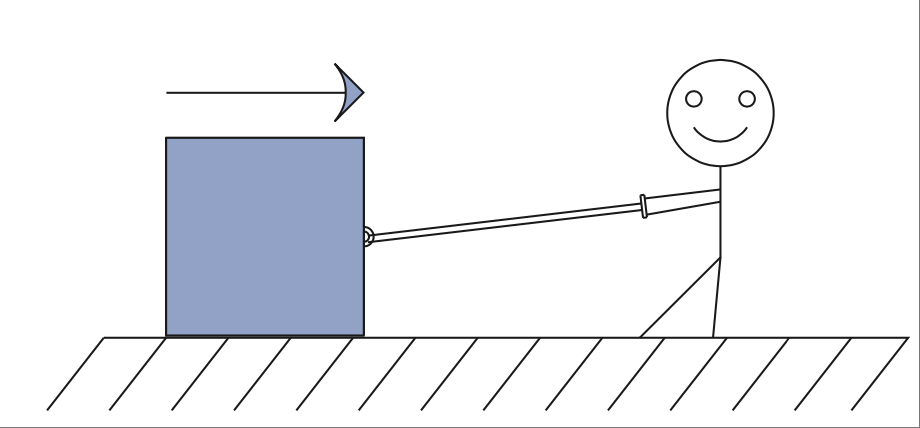
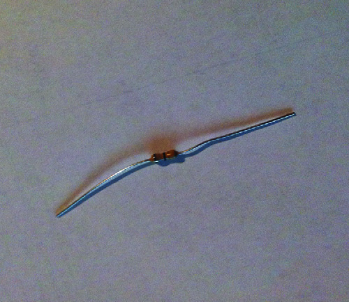
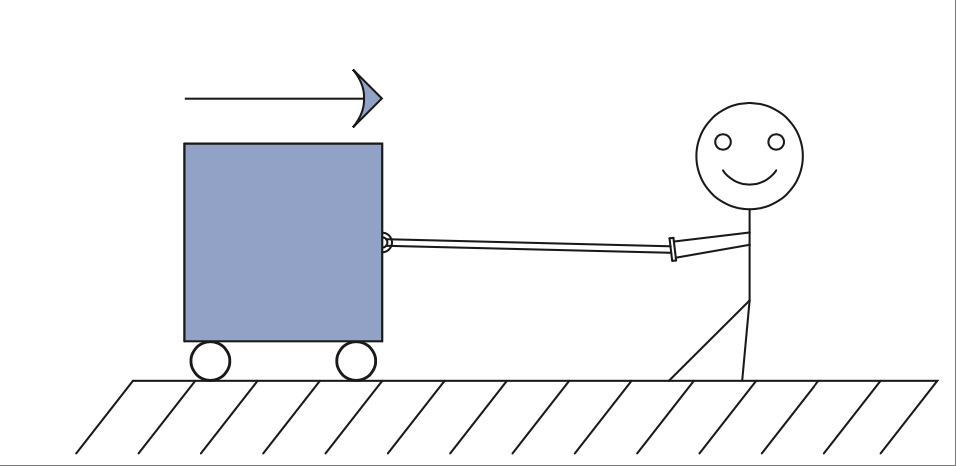
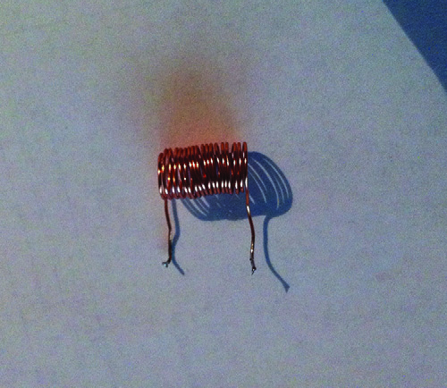
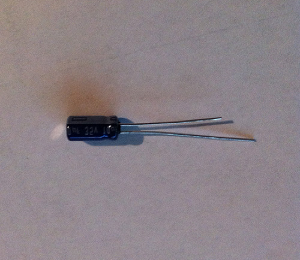
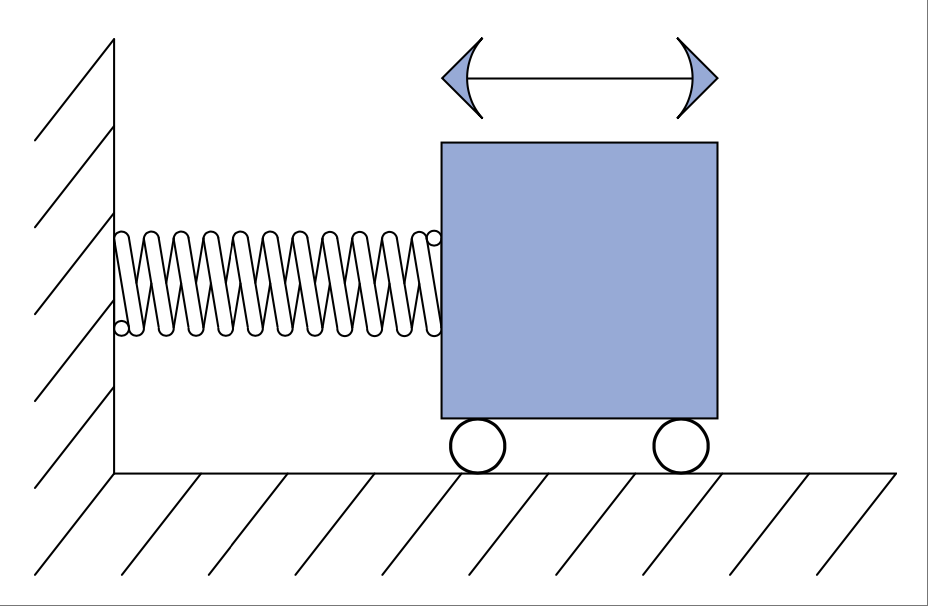

.. _c1:

第1章 工程101课本该教的三件事
====================================================================================
CHAPTER 1 Three Things They Should Have Taught in Engineering 101

你还记得你的工程入门课程吗？我敢说你可能都不确定自己是否上过所谓的101课程。很可能你确实上过，而且像我当时上的那门课一样，并没有太多实质内容。事实上，我除了记得那门课应该是“工程导论”之外，什么也记不起来了。

直到大学四年级临近毕业时，我才学到了一些非常实用的通用工程方法。它们如此有用，以至于我真诚地希望自己在大学一开始就能学到这三件事。事实上，我认为这是任何有志成为工程师的人都必须掌握的最基础知识。我向你保证，只要你在日常挑战中运用这些方法，你会更成功，除此之外，你的同事也会觉得你是个天才。如果你是学生读者，你会惊讶地发现，凭借这些技能你可以解决很多问题。它们是你接下来学习的基础构件。

.. toggle::

   Do you remember your engineering introductory course? At most, I’ll venture that you are not sure you even had a 101 course. It’s likely that you did and, like the course I had, it really didn’t amount to much. In fact, I don’t remember anything except that it was supposed to be an “introduction to engineering.”

   Much later in my senior year and shortly after I graduated, I learned some very useful general engineering methodologies. They are so beneficial that I sincerely wish they had taught these three things from the beginning of my coursework. In fact, it is my belief that this is basic, basic knowledge that any aspiring engineer should be required to know. I promise that by using these in your day-to-day challenges you will be more successful and, besides that, everyone you work with will think you are a genius. If you are a student reading this, you will be amazed at how many problems you can solve with these skills. They are the fundamental building blocks for what is to come.

单位计数！
-----------------
UNITS COUNT!

这是我最喜欢的一位老师在大四期间反复强调的一项技能。在我理解单位数学之前，我只能死记硬背数百个公式来应付考试。而在掌握了这个技能之后，我发现仅凭几个公式和一点代数，就可以解决几乎所有问题。这对我来说无疑是一个“顿悟”的时刻。突然间，世界变得有逻辑了。还记得物理中那些令人头疼的应用题吗？借助单位数学，那些题目变得轻而易举；甚至不用流一滴汗就能解出。

.. toggle::

   This is a skill that one of my favorite teachers drilled into me during my senior year. Until I understood unit math, I forced myself to memorize hundreds of equations just to pass tests. After applying this skill I found that, with just a few equations and a little algebra, you can solve nearly any problem. This was defi- nitely an “a-ha” moment for me. Suddenly the world made sense. Remember those dreaded story problems that you had to do in physics? Using unit math, those problems become a breeze; you can do them without even breaking a sweat.

数学单位
~~~~~~~~~~~~~~~
Unit Math

在这个过程中，数量所带的单位变得非常重要。你不能因为单位无法直接输入计算器就忽略它们。事实上，你要先确定你想要的答案单位，然后从答案倒推你需要做什么来解题。在动手计算数字之前，你就应该完成这个步骤。这个基本概念早在代数课上就已经讲过，但没人告诉你要在单位上也这么做。我们来看一个非常简单的例子。

    你需要知道你的汽车以多少英里每小时（mph）的速度行驶。你知道它在一分钟内行驶了一英里。第一步是确定答案的单位，在这个例子中是 mph，也就是 miles per hour（每小时英里数）。现在把它写下来（记住 per 的意思是“除以”）。

    .. math::

        \text{answer} = \text{something} \space . \space \frac{miles}{hour}

    然后将你已有的数据排列成一种能得出所需单位的格式：

    .. math::

        1 \cdot mile \times  \frac{1}{1 \cdot min} \times  \frac{60 \cdot min}{1 \cdot hour} = \text{answer}

    记住，分子上的单位可以与分母上相同的单位相抵消，如下所示：

    .. math::

        1 \cdot \text{mile} \times \frac{1}{1 \cdot \cancel{min}}  \times \frac{60 \cdot \cancel{min}}{1 \cdot hour} = \text{answer}

当所有可以抵消的单位都消除了，剩下的就是 60 mph，也就是正确答案。你可能会说：“这也太简单了吧。”你说得对！这正是关键所在——我们就是想让它变得更简单。如果你遵循这个基本格式，大多数你日常遇到的“应用题”都会轻松被你搞定。

另一个适合使用这种技巧的好地方是解题验证。如果答案的单位不对，那很可能说明你的计算有误。我总是在 MathCad（任何工程师都离不开的工具）中给使用的数字和公式标注单位。这样在看到最终结果单位正确时，就能确认公式设定无误。（好在 MathCad 会自动处理常见的单位换算。）所以，每当你面对一堆数据而不知从何下手时，第一步应该是确定你想要的答案单位。然后再整理这堆数据，使其单位与目标单位一致。

**记住这一点**
    让单位在问题中有意义，你得到的答案才会真正有意义。

.. toggle::

   With this process the units that the quantities are in become very important. You don’t just toss them aside because you can’t put them in your calculator. In fact, you figure out the units you want in your answer and then work the problem backward to figure out what you need to solve it. You do all this before you do anything with the numbers at all. This basic concept was taught way back in algebra class, but no one told you to do it with units. Let’s look at a very simple example.

      You need to know how fast your car is moving in miles per hour (mph). You know it traveled one mile in one minute. The first thing you need to do is figure out the units of the answer. In this case it is mph, or miles per hour. Now write that down (remember per means “divided by”).

      .. math::

         \text{answer} = \text{something} \space . \space \frac{miles}{hour}

      Now arrange the data that you have in a format that will give you the units you want in the answer:

      .. math::

         1 \cdot mile \times  \frac{1}{1 \cdot min} \times  \frac{60 \cdot min}{1 \cdot hour} = \text{answer}

      Remember, whatever is above the dividing line cancels out whatever is the same below the line, something like this:

      .. math::

         1 \cdot \text{mile} \times \frac{1}{1 \cdot \cancel{min}}  \times \frac{60 \cdot \cancel{min}}{1 \cdot hour} = \text{answer}

   When all the units that can be removed are gone, what you are left with is 60 mph, which is the correct answer. Now, you might be saying to yourself that was easy. You are right! That is the point after all—we want to make it easier. If you follow this basic format, most of the “story problems” you encounter every day will bow effortlessly to your machinations.

   Another excellent place to use this technique is for solution verification. If the answer doesn’t come out in the right units, most likely something was wrong in your calculation. I always put units on the numbers and equations I use in MathCad (a tool no engineer should be without). That way when you see the correct units at the end of your work, it confirms that the equations are set up properly. (The nice thing is that MathCad automatically handles the conver- sions that are often needed.) So, whenever you come upon a question that seems to have a whole pile of data and you have no idea where to begin, first figure out which units you want the answer in. Then shape that pile of data until the units match the units needed for the answer.

   **REMEMBER THIS**
      By letting the units mean something in the problem, the answer you get will actually mean something, too.

有时几乎就足够了
~~~~~~~~~~~~~~~~~~~~~~~~~~~~~~~~~~~
Sometimes Almost Is Good Enough

我父亲有句口头禅：“‘差不多’只适用于掷马蹄铁和手榴弹！”他通常在我“差不多”把工具收好或“差不多”打扫完房间之后这么说。小时候我可以说是“差不多”领域的专家。正如我爸指出的那样，有很多时候“差不多”根本不算数。

不过，就像这句老话所说的那样，用手榴弹“差不多”打中目标也许就够了。还有其他一些时候，“差不多”也可以接受。其中之一就是你在估算结果的时候。估算技能与单位数学相辅相成。

估算的技巧或艺术包括两个关键点：一是四舍五入为便于计算的数，二是理解比率和百分比。四舍五入很简单。比如你要相加 97 和 97。这两个数都接近 100，那就暂时当作 100 来算；加起来就是 200，差不多就是答案了。当然，这是对这个概念非常简化的解释，你可能会想：“为什么不直接把 97 输进计算器两次然后按等号？”原因是，随着问题变得更复杂，你更容易在分析中出错。我们把这个思想应用到前面的例子里：如果你加 97 和 97 之后计算器上显示的是 487，而你心里估算的结果是 200，那你很快就会意识到你按错了按钮。

比率和百分比可以帮助你了解一个变量对另一个变量有多大影响。假设你有两个系统，它们的输出会相加。在你的设计中，一个系统的输出是另一个的 100 倍。它们之间的比率是 100:1。如果输出结果偏差很大，你认为哪个系统更可能出问题？当你估算出它们之间的比率后，很明显哪个系统影响更大。

培养估算技能能帮助你在工程分析和故障排查时避免走弯路、事倍功半。它还能避免你在令人头痛的期末考试中犯下愚蠢错误！尽量在脑中练习估算。使用计算器和其他工具当然没问题——只要你在心里一直保留一个估算结果来校验你的答案。

当你进行估算时，你就是在通过允许一定误差的方式简化求解过程。你得到的估算答案是“差不多”正确，足以帮你发现其他可能出错的地方。

在掷马蹄铁的游戏中，“差不多”击中环形目标可以得分，但我怀疑你的老板是否会接受一个“差不多”能工作的电路。不过，如果你的估算“差不多”正确，它们能帮助你设计出一个连我爸都认为合格的电路。

.. admonition:: Thumb Rules
    
    - 在写公式时一定要考虑单位，它们能帮助你确认是否得到了正确答案。
    - 使用单位来构建正确的解题公式。方法是建立单位方程并通过抵消单位来得到想要的结果。
    - 使用估算来大致判断分析和排查中答案的范围；然后将估算值与实际结果比较以发现错误。

.. toggle::

   My father had a saying: “‘Almost’ only counts in horseshoes and hand grenades!”. He usually said this right after I “almost” put his tools away or I “almost” finished cleaning my room. Early in life I became somewhat of an expert in the field of “almost.” As my dad pointed out, there are many times when almost doesn’t count.

   However, as this bit of wisdom states, it probably is good enough to almost hit your target with a hand grenade. There are a few other times when almost is good enough, too. One of them is when you are trying to estimate a result. A skill that goes hand in hand with the idea of unit math is that of estimation.

   The skill or art of estimation involves two main points. The first is rounding to an easy number and the second is understanding ratios and percentages. The rounding part comes easy. Let’s say you are adding two numbers, 97 and 97. These are both nearly 100, so say they are 100 for a minute; add them together and you get 200, or nearly so. Now, this is a very simplified explanation of this idea, and you might think, “Why didn’t you just type 97 into your calculator a couple of times and press the equals sign?” The reason is, as the problems become more and more complex, it becomes easier to make a mistake that can cause you to be far off in your analysis. Let’s apply this idea to our previous example. If your calculator says 487 after you add 97 to 97, and you compare that with the estimate of 200 that you did in your head, you quickly realize that you must have hit a wrong button.

   Ratios and percentages help you get an idea of how much one thing affects another. Say you have two systems that add their outputs together. In your design, one system outputs 100 times more than the other. The ratio of one to the other is 100:1. If the output of this product is way off, which of these two systems do you think is most likely at fault? It becomes obvious that one system has a bigger effect when you estimate the ratio of one to the other.

   Developing the skill of estimation will help you eliminate hunting dead ends and chasing your tail when it comes to engineering analysis and troubleshooting. It will also keep you from making dumb mistakes on those pesky finals in school! Learn to estimate in your head as much as possible. It is okay to use calculators and other tools—just keep a running estimation in your head to check your work.

   When you are estimating, you are trying to simplify the process of getting to the answer by allowing a margin of error to creep in. The estimated answer you get will be “almost” right, and close enough to help you figure out where else you may have screwed up.

   In the game of horseshoes you get a few points for “almost” getting a ringer, but I doubt your boss will be happy with a circuit that “almost” works. How- ever, if your estimates are “almost” right, they can help you design a circuit that even my dad would think is good enough.

   .. admonition:: Thumb Rules
      
      - Always consider units in your equations; they can help you make sure you are getting the right answer.
      - Use units to create the right equation to solve the problem. Do this by making a unit equation and canceling units until you have the result you want.
      - Use estimation to determine approximately what the answer should be as you are analyzing and troubleshooting; then compare that to the results to identify mistakes.

如何可视化电气元件
----------------------------------------
HOW TO VISUALIZE ELECTRICAL COMPONENTS

机械工程师的工作相对轻松。他们大多数时候都能看见自己正在处理的对象。而作为电子工程师（EE），你通常没有这种奢侈的条件。你必须想象那些讨厌的电子是如何在你的电路中跳来跳去的。我们将介绍一些基本的类比，利用你熟悉的事物来建立对电路的直观理解。额外的好处是，你在机械方面的讨论中也能应对自如。这样做有几个理由：

- 一般人对物理世界的理解比对电学世界的理解更直观。这是因为我们用所有感官与物理世界互动，而电的世界对哪怕是受过教育的工程师来说，仍然很“神秘”——电路内部的很多事情是看不到、摸不到、听不到的。想想看，你按下灯的开关，灯就亮了；你不会真的去思考电是如何让它亮起来的。但如果你在地板上拖动一个重箱子，你肯定会明白“摩擦力”的原理。
- 这两个学科的规律是完全相同的。一旦你理解了一个，就能理解另一个。这很棒，因为你只需要学一次原理。在 Darren 的世界里，我们把 EE 称为 “sparky”，把 ME 称为 “wrench”。如果你真正“领悟”了这个课程，“sparky” 就能和最牛的 “wrench” 一较高下，反之亦然。
- 一旦你能感知电路内部正在发生的事情，你就能成为一个极其精确的故障排查员。人脑是一个不可思议的模拟器，与计算机不同，它可以基于不完整的信息直觉地得出正确的结论。我相信，通过学习这些类比，你可以增强大脑组合系统运作线索和结果的能力，从而得出正确的分析。这将帮助你的大脑“模拟”一个电路。

.. toggle::

   Mechanical engineers have it easy. They can see what they are working on most of the time. As an EE, you do not usually have that luxury. You have to imagine how those pesky electrons are flittering around in your circuit. We are going to cover some basic comparisons that use things you are familiar with to create an intuitive understanding of a circuit. As a side benefit, you will be able to hold your own in a mechanical discussion as well. There are several reasons to do this:

   - The typical person understands the physical world more intuitively than he understands the electrical one. This is because we interact with the physical world using all our senses, whereas the electrical world is still very “magical,” even to an educated engineer—much of what happens inside a circuit cannot be seen, felt, or heard. Think about it. You flip on a light switch and the light goes on; you really don’t consider how the electricity caused it to happen. But, drag a heavy box across the floor, and you certainly understand the principle of friction.
   - The rules for both disciplines are exactly the same. Once you understand one, you will understand the other. This is great, because you only have to learn the principles once. In the world of Darren we call EEs “sparkies” and MEs “wrenches.” If you grok [1]_ this lesson, a “sparky” can hold his own with the best “wrench” around, and vice versa.
   - When you get a feel for what is happening inside a circuit, you can be an amazingly accurate troubleshooter. The human mind is an incredible instru- ment for simulation, and unlike a computer, it can make intuitive leaps to correct conclusions based on incomplete information. I believe that by learning these similarities you increase your mind’s ability to put together clues to the operation and results of a given system, resulting in correct ana- lysis. This will help your mind to “simulate” a circuit.

电气元件的物理等效物
~~~~~~~~~~~~~~~~~~~~~~~~~~~~~~~~~~~~~~~~~~~~~~~~~
Physical Equivalents of Electrical Components

在进入物理等效类比之前，我们先来理解一下电压、电流和功率。电压是电路中电荷的势能。电流是电路中流动的电荷数量 [2]_。有时候，最老套的类比反而是最好的，这次也不例外。可以把它想象成玩具水枪中的水。电压就像是水枪中的压力。压力决定了水射出的距离，但如果是一把30英尺射程却只喷出小水流的水枪，那并不会让你全身湿透。电流就像是水枪中水流的大小，但如果水流很大却射不远，在水战中也没什么用。你需要的是一把超级水枪——29万亿型，能射出半英寸粗、射程30英尺的水柱。那才是真正的浇湿武器。在电学中，电压、电流和功率之间也是类似的关系。事实上，这是一个简单的关系式，如下：

.. math::
   :label: equation 1.1

   \text{voltage(电压)} \times \text{current(电流)} = \text{power(功率)}

.. _Figure 1.1:

.. figure:: ./img/23-0.png
   :align: center

   **FIGURE 1.1 原子最基本的符号。**

.. [1] Grok 的意思是深刻且个人地理解。我强烈推荐阅读 Robert Heinlein 的小说《异乡异客》来深入理解 grok 这个词。

   Grok means to understand at a deep and personal level. I highly recommend reading Robert Heinlein’s Stranger in a Strange Land for a deeper understanding of the word grok.

.. [2] 或者说“在运动”，正如我们在 :ref:`第0章 <c0>` 中学到的。

   Or moving as we learned in :ref:`Chapter 0 <c0>`.

要获得功率，电压和电流两者缺一不可。如果其中一个为零，那么输出功率也为零。记住，功率是电流和电压这两者的组合。

现在我们来讨论三个基本元件，以及它们与电压和电流之间的关系。几乎每个电路中都有三个基本元件：电阻、电感和电容。:ref:`Figure 1.1 <Figure 1.1>` 展示了它们的样子。脑海中形成它们如何与电荷相互作用的图像，是理解电子电路中正在发生的事情的关键。

.. toggle::

   Before we move on to the physical equivalents, let’s understand voltage, current, and power. Voltage is the potential of the charges in the circuit. Current is the amount of charge flowing [2]_ in the circuit. Sometimes the best analogies are the old overused ones, and that is true in this case. Think of it in terms of water in a squirt gun. Voltage is the amount of pressure in the gun. Pressure determines how far the water squirts, but a little pea shooter with a 30-foot shot and a dinky little stream won’t get you soaked. Current is the size of the water stream from the gun, but a large stream that doesn’t shoot far is not much help in a water fight. What you need is a super-soaker 29 gazillion, with a half-inch water stream that shoots 30 feet. Now that would be a powerful water-drenching weapon. Voltage, current, and power in electrical terms are related the same way. It is in fact a simple relationship; here is the equation:

   .. math::

      \text{voltage} \times \text{current} = \text{power}

   .. figure:: ./img/23-0.png
      :align: center

      **FIGURE 1.1 Very basic symbol of an atom.**

   To get power, you need both voltage and current. If either one of these is zero, you get zero power output. Remember, power is a combination of these two items: current and voltage.

   Now let’s discuss three basic components and look at how they relate to voltage and current. There are three fundamental components in virtually every circuit, resistor, inductor, and capacitor. :ref:`Figure 1.1 <Figure 1.1>` shows what they look like. Getting a picture in your head of how they interact with electrical charges is fundamental to gaining insight about what is happening in an electronic circuit.

电阻类似于摩擦
~~~~~~~~~~~~~~~~~~~~~~~~~~~~~~~~~~~~~~~~~~~~
The Resistor Is Analogous to Friction

想想当你在地板上拖动一个重箱子时会发生什么，如 :ref:`Figure 1.2 <Figure 1.2>` 所示。一种叫做摩擦力的力量会阻碍箱子的移动。这种摩擦力与箱子的移动速度有关。你越是试图快速移动箱子，摩擦就越大。它可以通过下列公式描述：

.. math::
   :label: equation 1.2

   \text{friction(摩擦)} = \frac{\text{force(力)}}{\text{speed(速度)}}

.. _Figure 1.2:

   **FIGURE 1.2 a) 摩擦力阻碍小人拖动箱子。**

   (b)

   **FIGURE 1.2 b) 一个电阻。**

此外，摩擦力还会以热量的形式耗散系统中的能量。换句话说，摩擦会让东西变热。不信？现在就把你的双手摩擦一下。感觉到热了吗？那就是摩擦造成的。在电路中，电阻的作用就等于摩擦力。电阻阻碍电流的流动 [3]_，就像摩擦力阻碍箱子的运动一样。而且，猜猜看？它在这个过程中也会发热。有一个叫做欧姆定律的方程描述了这种关系：

.. math::
   :label: equation 1.3

   \text{resistance(电阻)} = \frac{\text{voltage(电压)}}{\text{current(电流)}}

你能看出它和摩擦公式的相似之处吗？它们实际上是一样的。唯一真正的区别在于你使用的单位不同。

.. [3] 电阻代表将我们在第0章中提到的那些讨厌的电子从一个原子“抠”到下一个原子所需的努力程度。
   
   Resistance represents the amount of effort it takes to pop one of those pesky electrons we talked about in Chapter 0 and to move it to the atom next to it.

.. toggle::

   Think about what happens when you drag a heavy box across the floor, as shown in :ref:`Figure 1.2 <Figure 1.2>`. A force called friction resists the movement of the box. This friction is related to the speed of the box. The faster you try to move the box, the more the friction resists the movement. It can be described by an equation:

   .. math::

      \text{friction} = \frac{\text{force}}{\text{speed}}

   .. figure:: ./img/f1.2a.png
      :align: center
      :scale: 50%

      **FIGURE 1.2 a) Friction resists smiley stick boy’s efforts. **

   .. figure:: ./img/24-0.png
      :align: center

      **FIGURE 1.2 b) A resistor.**

   Furthermore, the friction dissipates the energy loss in the system with heat. Let me rephrase that. Friction makes things get warm. Don’t believe me? Try rubbing your hands together right now. Did you feel the heat? That is caused by friction. The function of a resistor in an electrical circuit is equal to friction. The resistor resists the flow of electricity [3]_ just like friction resists the speed of the box. And, guess what? It heats up as it does so. An equation called Ohm’s Law describes this relationship:

   .. math::

      \text{resistance} = \frac{\text{voltage}}{\text{current}}

   Do you see the similarity to the friction equation? They are exactly the same. The only real difference is the units you are working in.

电感器类似于质量
~~~~~~~~~~~~~~~~~~~~~~~~~~~~~~~~~~~~~~~~~~~~
The Inductor Is Analogous to Mass

让我们继续用箱子的例子。首先，消除摩擦，以免影响理解。如 :ref:`Figure 1.3 <Figure 1.3>` 所示，箱子放在一条带有几乎无摩擦轮子的光滑轨道上。你会注意到，启动箱子需要做功，但一旦箱子开始移动，它就会顺畅地滑行。事实上，要让它停下来也需要做功。所需做功的多少取决于箱子的重量。这就是惯性定律。牛顿在电学被发现之前就提出了这个观点，但它同样适用于电感。质量阻碍速度的变化。相应地，电感阻碍电流的变化。

.. math::
   :label: equation 1.4

   \text{mass(质量)} = \frac{\text{force(力)}  \times \text{time(时间)}}{\text{speed(速度)}}

.. math::
   :label: equation 1.5

   \text{inductance(电感)} = \frac{\text{voltage(电压)}  \times \text{time(时间)}}{\text{current(电流)}}

.. _Figure 1.3:

   **FIGURE 1.3 a) 轮子消除了摩擦，但小人仍然很难让箱子加速或停下来。**

   **FIGURE 1.3 b) 一个电感器。**

.. toggle::

   Let’s stay with the box example for now. First, let’s eliminate friction, so as not to cloud our comprehension. The box shown in :ref:`Figure 1.3 <Figure 1.3>` is on a smooth track with virtually frictionless wheels. You notice that it takes some work to get the box going, but once it’s moving, it coasts along nicely. In fact, it takes work to get it to stop again. How much work depends on how heavy the box is. This is known as the law of inertia. Newton postulated this idea long before electricity was discovered, but it applies very well to inductance. Mass impedes a change in speed. Correspondingly, inductance impedes a change in current.

   .. math::

      \text{mass} = \frac{\text{force}  \times \text{time}}{\text{speed}}

   .. math::

      \text{inductance} = \frac{\text{voltage}  \times \text{time}}{\text{current}}

   .. figure:: ./img/f1.3a.png
      :align: center
      :scale: 50%

      **FIGURE 1.3 a) Wheels eliminate friction, but smiley has a hard time getting it up to speed and stopping it. **

   .. figure:: ./img/25-0.png
      :align: center

      **FIGURE 1.3 b) An inductor.**

电容器类似于弹簧
~~~~~~~~~~~~~~~~~~~~~~~~~~~~~~~~~~~~~~~~~~~~
The Capacitor Is Analogous to a Spring

那么弹簧是做什么的呢？在你的脑海中想象一个弹簧。把它拉长并保持，然后松开，会发生什么？它会像 :ref:`Figure 1.4 <Figure 1.4>` 所示那样弹回原位。弹簧具有储存能量的能力。当施加力时，它会储存能量直到释放。电容的作用类似于弹簧的弹性。（注：你可能从物理课本中记得的弹簧常数其实是弹性的倒数。）我一直觉得 capacitor 这个词用来表示储存能量的元件很贴切。[4]_

.. _Figure 1.4:

.. figure:: ./img/f1.4.png
   :scale: 50%
   :align: center

   **FIGURE 1.4 当你拉伸弹簧时储存能量/势能，电容器储存电势。**

.. math::
   :label: equation 1.6

   \text{spring(弹力)} = \frac{\text{speed(速度)}  \times \text{time(时间)}}{\text{force(力)}}

.. math::
   :label: equation 1.7

   \text{capacitance(电容)} = \frac{\text{current(电流)}  \times \text{time(时间)}}{\text{voltage(电压)}}

.. [4] 技术上来说，电感器也能储存能量。电容器储存在其内部及周围产生的电场中的能量；电感器储存在线圈周围产生的磁场中的能量。电感器中储存的能量在大电流时能被高效利用。这就是为什么大多数开关电源中都会有电感器作为主要无源元件。相反，电容器阻碍电压的变化。

   Technically, an inductor can store energy, too. In a capacitor the energy is stored in the electric field that is generated in and around the cap; in an inductor energy is stored in the magnetic field that is generated around the coils. This energy stored in an inductor can be tapped very efficiently at high currents. That is why most switching power supplies have an inductor in them as the primary passive component. Conversely, the cap impedes changes in voltage.

.. toggle::

   So what does a spring do? Take hold of a spring in your mind’s eye. Stretch it out and hold it, and then let it go. What happens? It snaps back into position, as shown in :ref:`Figure 1.4 <Figure 1.4>`. A spring has the capacity to store energy. When a force is applied, it will hold that energy ‘til it is released. Capacitance is similar to the elasticity of the spring. (Note: The spring constant that you might remember from physics texts is the inverse of the elasticity.) I always thought it was nice that the word capacitor is used to represent a component that has the capacity to store energy. [4]_

   .. figure:: ./img/f1.4.png
      :scale: 50%
      :align: center

   .. figure:: ./img/25-1.png

      **FIGURE 1.4 Energy/potential is stored when you stretch the spring, a capacitor stores potential.**

   .. math::

      \text{spring} = \frac{\text{speed}  \times \text{time}}{\text{force}}

   .. math::

      \text{capacitance} = \frac{\text{current}  \times \text{time}}{\text{voltage}}

谐振电路
~~~~~~~~~~~~~~~~~~~~~~~~~~~
A Tank Circuit

以基本的谐振电路或 LC 电路为例。它做什么？它振荡。一个理想的电路将在共振频率下无限振荡。这个现象在机械电路中如何体现？看 :ref:`Figure 1.5 <Figure 1.5>`。考虑等效关系：电感器和电容器，弹簧和质量。在思想实验中，将弹簧连接到前面图中的箱子上。现在拉一下它，会发生什么？它振荡——来回弹动。

.. toggle::

   Take the basic tank or LC circuit. What does it do? It oscillates. A perfect circuit would go on forever at the resonant frequency. How should this appear in our mechanical circuit? Take a look at :ref:`Figure 1.5 <Figure 1.5>`. Think about the equivalents: an inductor and a capacitor, a spring and mass. In a thought experiment, hook the spring up to the box from the previous drawing. Now give it a tug. What happens? It oscillates—bounces back and forth.

复杂电路
~~~~~~~~~~~~~~~~~~~~~~~~~~~
A Complex Circuit

让我们继续这个思路，来看一个 LCR 电路。我们所需要做的只是给谐振电路（也就是前面提到的质量-弹簧系统）添加一点阻力或摩擦力。我们把箱子的轮子稍微拧紧一点，让它们产生摩擦。你拉动箱子之后会发生什么？它会来回弹动几下，直到停下来。轮子的摩擦力使它逐渐减速。这个摩擦元件被称为 *阻尼器（damper）*，因为它抑制了振荡。那么电阻器对 LC 电路做了什么？它抑制了振荡。

.. _Figure 1.5:

   **FIGURE 1.5 当你拉伸弹簧时，能量/势能被储存，电容器储存电势。**

就是这样——将电学的世界简化为日常物品。由于这些元件如此相似，你可能学过的所有数学技巧在这两种系统中都同样适用。还记得傅里叶定理吗？这些定理最早是为机械系统发现的，远在人们意识到它们也适用于电路之前。还记得你曾经学过或正在学习的高等数学吗——拉普拉斯变换、积分、导数等等？在这两个世界中都是一样适用的。你可以像求解电路一样，用拉普拉斯法求解机械系统。

早在 1950 和 1960 年代，政府花了大笔经费来使用电路来模拟如上所述的物理系统。为什么？因为在建模现实世界系统时，往往会涉及各种积分、导数以及其他复杂数学运算。而当复杂度达到一定程度时，这些数学很快就会变得杂乱无章。想象一下坦克发射一枚炮弹。你如何预测它会落在哪里？你得考虑空气阻力、炮弹的质量、炮管后座的弹性等等。与其手动计算这些复杂的数学，不如用各种电气元件来表示相应的机械元件，搭建一个电路，连接示波器，然后“开火”。如果你想测试 1000 种不同重量的炮弹在不同高度的表现，电子可比火药便宜多了。[5]_

.. admonition:: 经验法则

    - 电压和电流共同作用才能产生功率。
    - 电阻就像摩擦：它通过抵抗电流而产生热量，其产生热量与其两端的电压成正比。
    - 电感就像质量。
    - 电容就像弹簧。
    - 电感是电容的反函数。

.. [5] 当然，你仍然需要更换电路元件以匹配你要测试的各种数值。我猜这也是模拟计算机统治期如此短暂的原因之一。一旦将问题化为方程并数字化表示之后，模拟就可以通过点击鼠标快速变化；我们所需要的只是足够高的数字带宽，使其变得可行。

   Of course, you still had to swap out the components for the various values you were looking for. I suppose that is one reason the reign of the analog computer was so short. Once reduced to equations and represented digitally, the simulations could be varied at the click of a mouse; we just needed the digital bandwidth to increase far enough to make it feasible.

.. toggle::

   Let’s follow this reasoning for an LCR circuit. All we need to do is add a little resistance, or friction, to the mass-spring of the tank circuit. Let’s tighten the wheels on our box a little too much so that they rub. What will happen after you give the box a tug? It will bounce back and forth a bit until it comes to a stop. The friction in the wheels slows it down. This friction component is called a *damper* because it dampens the oscillation. What is it that a resistor does to an
   LC circuit? It dampens the oscillation.

   .. figure:: ./img/f1.5.png
      :scale: 50%
      :align: center

      **FIGURE 1.5 Energy/potential is stored when you stretch the spring, a capacitor stores potential.**

   There you have it—the world of electricity reduced to everyday items. Since these components are so similar, all the math tricks you might have learned apply as well to one system as they do to the other. Remember Fourier’s theorems? They were discovered for mechanical systems long before anyone realized that they work for electrical circuits as well. Remember all that higher math you used to know or are just now learning about—Laplace transforms, integrals, derivatives, etc.? It all works the same in both worlds. You can solve a mechanical system using Laplace methods just the same as an electrical circuit.

   Back in the 1950s and 1960s, the government spent mounds of dough using electrical circuits to model physical systems as described earlier. Why? You can get into all sorts of integrals, derivatives, and other ugly math when model- ing real-world systems. All that can get jumbled quickly after a couple of orders of complexity. Think about an artillery shell fired from a tank. How do you pre- dict where it will land? You have the friction of the air, the mass of the shell, the spring of the recoil. Instead of trying to calculate all that math by hand, you can build a circuit with all the various electrical components representing the mechanical ones, hook up an oscilloscope, and fire away. If you want to test 1000 different weights of artillery at different altitudes, electrons are much cheaper than gunpowder. [5]_

   .. admonition:: Thumb Rules

      - It takes voltage and current to make power.
      - A resistor is like friction: It creates heat from current flow (resisting it), proportional to voltage measured across it.
      - An inductor is like a mass.
      - A capacitor is like a spring.
      - The inductor is the inverse of the capacitor.

学习直观的方法
-----------------------------
LEARN AN INTUITIVE APPROACH

直观的信号分析
~~~~~~~~~~~~~~~~~~~~~~~~~~~
Intuitive Signal Analysis

我不确定学校里是否真的教授“直觉信号分析”这门课；这是我自己给它取的名字。这是我在大学和职场中自学而来的技能。直到工作了一段时间，并把我的方法解释给其他工程师以帮助他们解决问题之后，我才把它当作一个正式的“学科”来看待。不过我认为，很多所谓的聪明人其实在不自知的情况下使用了这项技能，尽管他们未必给它命名。他们似乎总能指着你花了几个小时调试的电路说：“问题出在这里。”他们似乎直觉地就知道什么该发生。我相信这是一种可以并且应该被教授的技能。

要应用直觉信号分析（Intuitive Signal Analysis，简称 ISA），需要掌握三个基本原则。（毕竟，如果我希望这个术语能在工程圈里流行起来，它就必须有个缩写！）

1. 你必须反复练习基础知识。例如，随着频率的升高，电容的阻抗会发生什么变化？它会减小。这类信息你应该脱口而出。如果你知道这些，你就可以立刻识别出高通或低通滤波器。那么电感的阻抗呢？频率升高时会怎样？负反馈对运算放大器有何影响？它的输出会怎么变？你不需要死记硬背所有公式，但你需要知道变化的方向。至于变化的幅度，如果你对信号强度有个大致的判断，那通常就足以定位电路中不正常的部分了。
2. 你需要大量经验。你需要熟悉各种元件的工作方式。你需要花大量时间待在实验室，理解每种元件的基本特性。你需要知道特定信号通过某个元件时会发生什么。还记得基本元件的物理类比吗？这些就是你想象电路运行过程的构建块。当输入信号变化时，你必须能想象电路内部发生了什么。如果你能做到这一点，你就能预测输出会如何变化。
3. 把问题分解开来。“你怎么吃掉一头大象？”求知者问老智者。“一口一口吃。”老者答道。选一个起点，逐步分析电路。将电路拆解成易于处理的小模块。一步步画箭头，标出电路中信号的变化，如 :ref:`Figure 1.6 <Figure 1.6>` 所示。“这里电流增加了吗？”“某个点的电压应该下降。”这些都是你应该自言自语的问题和答案。[6]_ 同样地，你不需要精确知道输出是多少。你不必背下本书中的每一个公式就能直觉理解电路，但你确实需要知道元件值变化会带来什么样的影响。例如，对于一个低通 RC 滤波器和一个交流输入信号，如果你增加电容的数值，输出幅度会怎样？会变大还是变小？

   像这样基础的问题，你应该立刻知道答案是“变小”。你还应该知道变小的程度取决于信号的频率和滤波器的时间常数。当你增加进入晶体管基极的电流时，会发生什么？集电极的电流会增加。当电阻上的电流减小时，电压会如何变化？这些都是元件的基本效应，但你会惊讶地发现，有多少工程师对这些问题无法脱口回答。

.. [6] 基于与两三个人的广泛交流研究，我得出的结论是：所有聪明人都会自言自语。至于这种行为是否被社会接受，则取决于周围人是否能听到你在说什么。

   Based on extensive research of talking to two or three people, I have concluded that all intelligent people talk to themselves. Whether or not they are considered socially acceptable depends on the audibility of this voice to others around them.

.. _Figure 1.6:

.. figure:: ./img/f1.6.png
   :scale: 50%
   :align: center

   **FIGURE 1.6 当你拉伸弹簧时，能量/势能被储存，电容器储存电势。**

花大量时间待在实验室将极大帮助你发展这项技能。如果你观察过很多不同电路的响应，你会知道它们应该如何运行。当这些知识整合在一起时，奇妙的事情就会发生：你的大脑变成了一个电路模拟器。你将能总结出电路中各元件所造成的影响，并直觉地理解发生了什么。让我来举个例子。

现在，你也许还不知道晶体管到底是什么，所以你可能需要把这个例子先放一边，等学到晶体管那一章时再回头来看，这样你脑中才会亮起“啊哈！”的灯泡。我要表达的是分析的方法本身；你早期就需要它，但在举例时却会遇到“先有鸡还是先有蛋”的困境。所以暂时你只需知道，晶体管是一种根据基极电流来控制输出电流的器件。

当输入电压升高时，基极电流增加。这会导致上拉电阻中的电流增加，从而在上拉电阻上产生更大的电压降。这意味着，当输入电压上升时，输出电压必须下降。这就是把所有内容整合起来，真正理解电路工作原理的例子。

发展直觉理解的一个方法是使用电路仿真工具。你可以轻松改变参数值并观察其对输出的影响，在短时间内尝试多种不同的配置。然而，使用这些工具时必须小心。你很容易掉进一个常见陷阱：过度依赖仿真器，以至于在实验室中电路不工作时反而怀疑现实世界出错。错的是仿真器！它遗漏了一些关键因素。我认为，工程师最好先用仿真器模拟简单电路。在理解基本元件的行为之前，不要急着上手复杂模型——例如，模拟一个 RC 电路的阶跃响应。在这种简单模型中，改变 R 和 C 的数值看看会发生什么。这是工程师建立正确直觉理解的一种方式。但有一点提醒：不要把所有时间都花在仿真器上。一定要在工作台上也花些时间动手实验。

你会发现，这项信号分析技能在故障排查和设计工作中都非常有用。随着你直觉理解的增强，你将能够在缺乏全部信息的情况下做出正确判断。当你在建模时犯了错，你会立刻感觉结果“不对劲”。直觉是一项计算机不具备的技能，所以一定要好好利用它！

.. admonition:: 经验法则

   - 反复练习基础知识；牢记基本公式。
   - 熟悉基本电路；目标是直觉理解信号经过元件后会发生什么。
   - 将问题拆解；在原理图上画箭头和注释，标出信号的变化。
   - 判断信号的变化方向；它是反相关还是正相关？
   - 培养估算能力。
   - 多在实验台上练习，使用示波器和基本元件。

.. toggle::

   I’m not sure if intuitive signal analysis is actually taught in school; this is my name for it. It is something I learned on my own in college and the workplace. I didn’t call it an actual discipline until I had been working for a while and had explained my methods to fellow engineers to help them solve their own dilemmas. I do think, however, that a lot of so-called bright people out there use this skill without really knowing it or putting a name to it. They seem to be able to point to something you have been working on for hours and say, “Your problem is there.” They just seem to intuitively know what should happen. I believe that this is a skill that can and should be taught.

   There are three underlying principles needed to apply intuitive signal analysis. (Let’s just call it ISA. After all, if I have any hope of this catching on in the engi- neering world, it has to have an acronym!)

   1. You must drill the basics. For example, what happens to the impedance of a capacitor as frequency increases? It goes down. You should know that type of information off the top of your head. If you do, you can identify a high-pass or low-pass filter immediately. How about the impedance of an inductor—what does it do as frequency increases? What does negative feed- back do to an op-amp; how does its output change? You do not necessarily need to know every equation by heart, but you do need to know the direc- tion of the change. As far as the magnitude of the change is concerned, if you have a general idea of the strength of the signal, that is usually enough to zero in on the part of the circuit that is not doing what you want it to.
   2. You need experience, and lots of it. You need to get a feel for how different components work. You need to spend a lot of time in the lab, and you need to understand the basics of each component. You need to know what a given signal will do as it passes through a given component. Remember the physical equivalents of the basic components? These are the building blocks of your ability to visualize the operation of a circuit. You must ima- gine what is happening inside the circuit as the input changes. If you can visualize that, you can predict what the outputs will do.
   3. Break the problem down. “How do you eat an elephant?” the knowledge seeker asked the wise old man. “One bite at a time,” the old man replied. Pick a point to start and walk through it. Take the circuit and break it down into smaller chunks that can be handled easily. Step by step, draw arrows that show the changes of signals in the circuit, as shown in :ref:`Figure 1.6 <Figure 1.6>`. “Does current go up here?” “Voltage at such and such point should be going down.” These are the types of questions and answers you should be mumbling to yourself. [6]_ Again, one thing you do not need to know is what the output will be precisely. You do not need to memorize every equation in this book to intuitively know your circuit, but you do need to know what effect changing a value of a component will have. For example, given a low-pass RC filter and an AC signal input, if you increase the value of the capacitor, what should happen to the amplitude of the output? Will it get smaller or larger?

      You should know immediately with something this basic that the answer is “smaller.” You should also know that how much smaller depends on the frequency of the signal and the time constant of the filter. What happens as you increase current into the base of a transistor? Current through the collector increases. What happens to voltage across a resistor as current decreases? These are simple effects of components, but you would be sur- prised at how many engineers don’t know the answers to these types of questions off the top of their heads.

   .. figure:: ./img/f1.6.png
      :scale: 50%
      :align: center

      **FIGURE 1.6 Energy/potential is stored when you stretch the spring, a capacitor stores potential.**

   Spending a lot of time in the lab will help immensely in developing this skill. If you look at the response of a lot of different circuits many, many times, you will learn how they should act. When this knowledge is integrated, a wonderful thing happens: Your head becomes a circuit simulator. You will be able to sum up the effects caused by the various components in the circuit and intuitively understand what is happening. Let me show you an example.

   Now, at this time you might not have a clue as to what a transistor is, so you might need to file this example away until you get past the transistor chapter, but be sure to come back to it so that the “a-ha!” light bulb clicks on over your head. The analysis idea is what I am trying to get across; you need it early on, but it creates a type of chicken-and-egg dilemma when it comes to an example. So, for now, consider this example with the knowledge that the transistor is a device that moves current through the output that is proportional to the current through the base.

   As voltage at the input increases, base current increases. This causes the pull-up current in the resistor to increase, resulting in a larger voltage drop across the pull-up resistor. This means the voltage at the output must go down as the vol- tage at the input goes up. That is an example of putting it all together to really understand how a circuit works.

   One way to develop this intuitive understanding is by using computer simula- tors. It is easy to change a value and see what effect it has on the output, and you can try several different configurations in a short amount of time. However, you have to be careful with these tools. It is easy to fall into a common trap: trusting the simulator so much that you will think there is something wrong with the real world when it doesn’t work right in the lab. The real world is not at fault! It is the simulator that is missing something. I think it is best for the engineer to begin using simulators to model simple circuits. Don’t jump into a complex model until you grasp what the basic components do—for example, modeling a step input into an RC circuit. With a simple model like this, change the values of R and C to see what happens. This is one way an engineer can develop the correct intuitive understanding of these two components. One word of warning, though: Don’t spend all your time on the simulator. Make sure you get some good bench time, too.

   You will find this signal analysis skill very useful in diagnosing problems as well as in your design efforts. As your intuitive understanding increases, you will be able to leap to correct conclusions without all the necessary facts. You will know when you are modeling something incorrectly, because the result just won’t look right. Intuition is a skill no computer has, so make sure you take advantage of it!

   .. admonition:: Thumb Rules

      - Drill the basics; know the basic formulas by heart.
      - Get a lot of experience with basic circuits; the goal is to intuitively know how a signal will be affected by a component.
      - Break the problem down; draw arrows and notes on the schematic that indicate what the signal is doing.
      - Determine in which direction the signal is going; is it inversely related or directly related?
      - Develop estimation abilities.
      - Spend time on the bench with a scope and simple components.

“LEGO” 工程学
-------------------
“LEGO” ENGINEERING

积木构建块
~~~~~~~~~~~~~~~~~
Building Blocks

好吧，我又想出了第四个要点。[7]_ 我的一位工程学讲师（我们姑且叫他 Chuck [8]_）教了我一个秘诀，我想把它传授给大家。几乎每一门学科都比你想象的要容易理解。那些教授们不愿告诉你的秘密是：通常在最底层，只有五六个基本原理或公式。只要掌握了这些基础知识，你就可以推导出该领域中的其他原理或公式。它们就像老式简单的乐高积木®；你只有五六种形状，却可以拼出所有东西。如果你真的理解了某个领域中这几个基础知识点，你就能在这个领域中表现出色。Chuck 经常说的另一句话是：所有伟大的发现，其实都只比这些基础知识高出一两个层次。这意味着，如果你真正精通基础知识，其他一切都会迎刃而解。有一点是可以肯定的：人类有遗忘的倾向。所有高级内容往往因为很少使用而迅速被遗忘，但即便像我这样转行做了管理的工程师，几乎每天都会用到这些基础知识。

.. [7] 如果你一直在怀疑我是不是会数数的话。

   For those of you who have been wondering if I can count.

.. [8] “Dr. Charles Tinney” 是他第一天在黑板上写下的名字。然后他转身说：“你们可以叫我 Chuck！”我必须向 Dr. Tinney 致敬；他是我遇到过的最好的老师。对他来说，没有什么是不能理解的，也没有什么是不能教会你的。
   
   “Dr. Charles Tinney” was what he wrote on the chalkboard the first day of class. Then he turned around and said, “You can call me Chuck!” I have to credit Dr. Tinney; he was the best teacher I have ever had. For him nothing was impossible to understand or to teach you to understand.

既然这是一本关于电气工程的书，那我们就来列一下我眼中电路的基本公式：

- 欧姆定律
- 分压规则
- 电容器抑制电压变化
- 电感器抑制电流变化
- 电阻的串联与并联
- 戴维南定理

我们将在后面的章节中更详细地介绍这些概念，但这里先简单举几个例子。你可能会说：“你甚至没列出电容器的串联与并联规则。这不是基础规则吗？”你说得对，这确实算是基础，但并不算最底层的内容。电阻的串联与并联规则才是更基本的，因为当你加上电容器后，实际上只是引入了信号的频率而已；除此之外，公式是完全一样的！你最好理解电容器或电感器的工作原理，并将其应用于基础规则，而不是试图记住太多公式。你可能还会问：“那诺顿定理呢？”说到底，那不过是戴维南定理的反面而已，所以何必学两个呢？我更喜欢以电压的角度思考，所以我记住的是戴维南定理。你也可以从电流角度出发，用诺顿定理，最终结果是一样的。所以选一个记住就可以了。

你随时可以查阅高级内容，但多数时候，牢牢掌握基础知识，就能逼使眼前的问题屈服于你的工程智慧。这六条规则是你应该熟记于心、理解透彻并能够进行大致估算的内容。这些规则将使你正在培养的直觉成为一个强有力的工具。它们将释放你大脑中蕴藏的仿真能力。

如果你真的将这些建议铭记在心，那么多年以后，当你被授予“尖头发”[9]_ 的头衔，并忘光了那些曾经掌握的高级知识时，你仍然能解决工程问题，令其他工程师惊叹不已。

这条原则也可以推广到所有学科。看看你正在学习的内容，找出其中的几个基本要点，并从中推导出其余部分，你就发现了该学科的基本“乐高积木”。这些是你必须彻底掌握、倒背如流的内容，只有这样你才能在该领域取得成功。再说了，乐高积木也很有趣，不是吗？

.. [9] 如果你这几年都生活在岩洞里，错过了某部非常成功的工程类漫画，这里说的“尖头发”就是指“升职当管理者”。

   In case you have lived under a rock for the last few years and missed a certain very successful engineering cartoon, this means “promoted to management.”

.. admonition:: 经验法则

   - 每门学科中都有一些规则可以推导出其余所有内容。
   - 熟记这些规则；获得对它们的直觉理解。
   - 大多数重要的发现仅比这些基础知识高出一两个层次。

.. toggle::

   Okay, so I came up with a fourth item. [7]_ One of my engineering instructors (we’ll call him Chuck [8]_) taught me a secret that I would like to pass on. Almost every discipline is easier to understand than you might think. The secret professors don’t want you to know is that there are usually about five or six basic principles or equations that lie at the bottom of the pile, so to speak. These fun- damentals, once they are grasped, will allow you to derive the rest of the principles or equations in that field. They are like the old simple Legos®; you had five or six shapes to make everything. If you truly understand these few basic fundamentals in a given discipline, you will excel in that discipline. One other thing Chuck often said was that all the great discoveries were only one or two levels above these fundamentals. This means that if you really know the basics well, you will excel at the rest. One thing you can be sure of is the human tendency to forget. All the higher-level stuff is often left unused and will quickly be forgotten, but even an engineer-turned-manager like me uses the basics nearly every day.

   Since this is a book on electrical engineering, let’s list the fundamental equa- tions for electrical circuits as I see them:

   - Ohm’s Law
   - Voltage divider rule
   - Capacitors impede changes in voltage
   - Inductors impede changes in current
   - Series and parallel resistors
   - Thevenin’s theorem

   We will get into these concepts in more detail later in the chapters, but let me touch on a couple of examples. You might say, “You didn’t even list series and parallel capacitors. Isn’t that a basic rule?” Well, you are right, it is fairly basic, but it really isn’t at the bottom of the pile. Series and parallel resistors are even more fundamental because all that really happens when you add in the capaci- tors is that the frequency of the signal is taken into account; other than that, it is exactly the same equation! You would be better served to understand how a capacitor or inductor works and apply it to the basics than to try to memorize too many equations. “What about Norton’s theorem?” you might ask. Bottom line, it is just the flip side of Thevenin’s theorem, so why learn two when one will do? I prefer to think of it in terms of voltage, so I set this to memory. You could work in terms of current and use Norton’s theorem, but you would arrive at the same answer at the end of the day. So pick one and go with it.

   You can always look up the more advanced stuff, but most of the time a solid application of the basics will force the problem at hand to submit to your engi- neering prowess. These six rules are things that you should memorize, under- stand, and be able to do approximations of in your head. These are the rules that will make the intuition you are developing a powerful tool. They will unleash the simulation capability that you have right in your own brain.

   If you really take this advice to heart, years down the road when you’ve been given your “pointy hairs” [9]_ and you have forgotten all the advanced stuff you used to know, you will still be able to solve engineering problems to the amazement of your engineers.

   This can be generalized to all disciplines. Look at what you are trying to learn, figure out the few basic points being made, from which you can derive the rest, and you will have discovered the basic “Legos” for that subject. Those are the things you should know forward and backward to succeed in that field. Besides, Legos are fun, aren’t they?

   .. admonition:: Thumb Rules

      - There are a few rules in any discipline from which you can derive the rest.
      - Learn these rules by heart; gain an intuitive understanding of them.
      - Most significant discoveries are only a level or two above these basics.