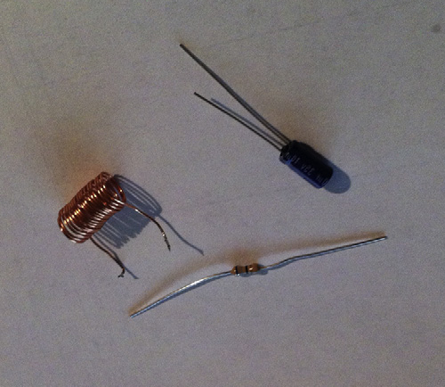
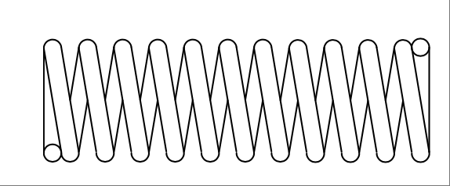
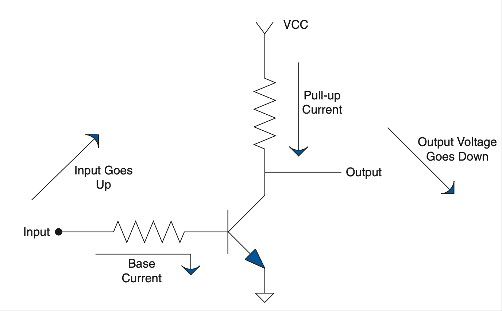

.. _c1:

CHAPTER 1 Three Things They Should Have Taught in Engineering 101
====================================================================================

Do you remember your engineering introductory course? At most, I’ll venture that you are not sure you even had a 101 course. It’s likely that you did and, like the course I had, it really didn’t amount to much. In fact, I don’t remember anything except that it was supposed to be an “introduction to engineering.”

Much later in my senior year and shortly after I graduated, I learned some very useful general engineering methodologies. They are so beneficial that I sincerely wish they had taught these three things from the beginning of my coursework. In fact, it is my belief that this is basic, basic knowledge that any aspiring engineer should be required to know. I promise that by using these in your day-to-day challenges you will be more successful and, besides that, everyone you work with will think you are a genius. If you are a student reading this, you will be amazed at how many problems you can solve with these skills. They are the fundamental building blocks for what is to come.

UNITS COUNT!
-----------------

This is a skill that one of my favorite teachers drilled into me during my senior year. Until I understood unit math, I forced myself to memorize hundreds of equations just to pass tests. After applying this skill I found that, with just a few equations and a little algebra, you can solve nearly any problem. This was defi- nitely an “a-ha” moment for me. Suddenly the world made sense. Remember those dreaded story problems that you had to do in physics? Using unit math, those problems become a breeze; you can do them without even breaking a sweat.

Unit Math
~~~~~~~~~~~~~~~

With this process the units that the quantities are in become very important. You don’t just toss them aside because you can’t put them in your calculator. In fact, you figure out the units you want in your answer and then work the problem backward to figure out what you need to solve it. You do all this before you do anything with the numbers at all. This basic concept was taught way back in algebra class, but no one told you to do it with units. Let’s look at a very simple example.

    You need to know how fast your car is moving in miles per hour (mph). You know it traveled one mile in one minute. The first thing you need to do is figure out the units of the answer. In this case it is mph, or miles per hour. Now write that down (remember per means “divided by”).

    .. math::

        \text{answer} = \text{something} \space . \space \frac{miles}{hour}

    Now arrange the data that you have in a format that will give you the units you want in the answer:

    .. math::

        1 \cdot mile \times  \frac{1}{1 \cdot min} \times  \frac{60 \cdot min}{1 \cdot hour} = \text{answer}

    Remember, whatever is above the dividing line cancels out whatever is the same below the line, something like this:

    .. math::

        1 \cdot \text{mile} \times \frac{1}{1 \cdot \cancel{min}}  \times \frac{60 \cdot \cancel{min}}{1 \cdot hour} = \text{answer}

When all the units that can be removed are gone, what you are left with is 60 mph, which is the correct answer. Now, you might be saying to yourself that was easy. You are right! That is the point after all—we want to make it easier. If you follow this basic format, most of the “story problems” you encounter every day will bow effortlessly to your machinations.

Another excellent place to use this technique is for solution verification. If the answer doesn’t come out in the right units, most likely something was wrong in your calculation. I always put units on the numbers and equations I use in MathCad (a tool no engineer should be without). That way when you see the correct units at the end of your work, it confirms that the equations are set up properly. (The nice thing is that MathCad automatically handles the conver- sions that are often needed.) So, whenever you come upon a question that seems to have a whole pile of data and you have no idea where to begin, first figure out which units you want the answer in. Then shape that pile of data until the units match the units needed for the answer.

**REMEMBER THIS**
    By letting the units mean something in the problem, the answer you get will actually mean something, too.

Sometimes Almost Is Good Enough
~~~~~~~~~~~~~~~~~~~~~~~~~~~~~~~~~~~

My father had a saying: “‘Almost’ only counts in horseshoes and hand grenades!”. He usually said this right after I “almost” put his tools away or I “almost” finished cleaning my room. Early in life I became somewhat of an expert in the field of “almost.” As my dad pointed out, there are many times when almost doesn’t count.

However, as this bit of wisdom states, it probably is good enough to almost hit your target with a hand grenade. There are a few other times when almost is good enough, too. One of them is when you are trying to estimate a result. A skill that goes hand in hand with the idea of unit math is that of estimation.

The skill or art of estimation involves two main points. The first is rounding to an easy number and the second is understanding ratios and percentages. The rounding part comes easy. Let’s say you are adding two numbers, 97 and 97. These are both nearly 100, so say they are 100 for a minute; add them together and you get 200, or nearly so. Now, this is a very simplified explanation of this idea, and you might think, “Why didn’t you just type 97 into your calculator a couple of times and press the equals sign?” The reason is, as the problems become more and more complex, it becomes easier to make a mistake that can cause you to be far off in your analysis. Let’s apply this idea to our previous example. If your calculator says 487 after you add 97 to 97, and you compare that with the estimate of 200 that you did in your head, you quickly realize that you must have hit a wrong button.

Ratios and percentages help you get an idea of how much one thing affects another. Say you have two systems that add their outputs together. In your design, one system outputs 100 times more than the other. The ratio of one to the other is 100:1. If the output of this product is way off, which of these two systems do you think is most likely at fault? It becomes obvious that one system has a bigger effect when you estimate the ratio of one to the other.

Developing the skill of estimation will help you eliminate hunting dead ends and chasing your tail when it comes to engineering analysis and troubleshooting. It will also keep you from making dumb mistakes on those pesky finals in school! Learn to estimate in your head as much as possible. It is okay to use calculators and other tools—just keep a running estimation in your head to check your work.

When you are estimating, you are trying to simplify the process of getting to the answer by allowing a margin of error to creep in. The estimated answer you get will be “almost” right, and close enough to help you figure out where else you may have screwed up.

In the game of horseshoes you get a few points for “almost” getting a ringer, but I doubt your boss will be happy with a circuit that “almost” works. How- ever, if your estimates are “almost” right, they can help you design a circuit that even my dad would think is good enough.

.. admonition:: Thumb Rules
    
    - Always consider units in your equations; they can help you make sure you are getting the right answer.
    - Use units to create the right equation to solve the problem. Do this by making a unit equation and canceling units until you have the result you want.
    - Use estimation to determine approximately what the answer should be as you are analyzing and troubleshooting; then compare that to the results to identify mistakes.

HOW TO VISUALIZE ELECTRICAL COMPONENTS
----------------------------------------

Mechanical engineers have it easy. They can see what they are working on most of the time. As an EE, you do not usually have that luxury. You have to imagine how those pesky electrons are flittering around in your circuit. We are going to cover some basic comparisons that use things you are familiar with to create an intuitive understanding of a circuit. As a side benefit, you will be able to hold your own in a mechanical discussion as well. There are several reasons to do this:

- The typical person understands the physical world more intuitively than he understands the electrical one. This is because we interact with the physical world using all our senses, whereas the electrical world is still very “magical,” even to an educated engineer—much of what happens inside a circuit cannot be seen, felt, or heard. Think about it. You flip on a light switch and the light goes on; you really don’t consider how the electricity caused it to happen. But, drag a heavy box across the floor, and you certainly understand the principle of friction.
- The rules for both disciplines are exactly the same. Once you understand one, you will understand the other. This is great, because you only have to learn the principles once. In the world of Darren we call EEs “sparkies” and MEs “wrenches.” If you grok [1]_ this lesson, a “sparky” can hold his own with the best “wrench” around, and vice versa.
- When you get a feel for what is happening inside a circuit, you can be an amazingly accurate troubleshooter. The human mind is an incredible instru- ment for simulation, and unlike a computer, it can make intuitive leaps to correct conclusions based on incomplete information. I believe that by learning these similarities you increase your mind’s ability to put together clues to the operation and results of a given system, resulting in correct ana- lysis. This will help your mind to “simulate” a circuit.

Physical Equivalents of Electrical Components
~~~~~~~~~~~~~~~~~~~~~~~~~~~~~~~~~~~~~~~~~~~~~~~~~

Before we move on to the physical equivalents, let’s understand voltage, current, and power. Voltage is the potential of the charges in the circuit. Current is the amount of charge flowing [2]_ in the circuit. Sometimes the best analogies are the old overused ones, and that is true in this case. Think of it in terms of water in a squirt gun. Voltage is the amount of pressure in the gun. Pressure determines how far the water squirts, but a little pea shooter with a 30-foot shot and a dinky little stream won’t get you soaked. Current is the size of the water stream from the gun, but a large stream that doesn’t shoot far is not much help in a water fight. What you need is a super-soaker 29 gazillion, with a half-inch water stream that shoots 30 feet. Now that would be a powerful water-drenching weapon. Voltage, current, and power in electrical terms are related the same way. It is in fact a simple relationship; here is the equation:

.. math::
   :label: equation 1.1

   \text{voltage} \times \text{current} = \text{power}

.. _Figure 1.1:

**FIGURE 1.1 Very basic symbol of an atom.**

.. [1] Grok means to understand at a deep and personal level. I highly recommend reading Robert Heinlein’s Stranger in a Strange Land for a deeper understanding of the word grok.
.. [2] Or moving as we learned in :ref:`Chapter 0 <c0>`.

To get power, you need both voltage and current. If either one of these is zero, you get zero power output. Remember, power is a combination of these two items: current and voltage.

Now let’s discuss three basic components and look at how they relate to voltage and current. There are three fundamental components in virtually every circuit, resistor, inductor, and capacitor. :ref:`Figure 1.1 <Figure 1.1>` shows what they look like. Getting a picture in your head of how they interact with electrical charges is fundamental to gaining insight about what is happening in an electronic circuit.

The Resistor Is Analogous to Friction
~~~~~~~~~~~~~~~~~~~~~~~~~~~~~~~~~~~~~~~~~~~~

Think about what happens when you drag a heavy box across the floor, as shown in :ref:`Figure 1.2 <Figure 1.2>`. A force called friction resists the movement of the box. This friction is related to the speed of the box. The faster you try to move the box, the more the friction resists the movement. It can be described by an equation:

.. math::
   :label: equation 1.2

   \text{friction} = \frac{\text{force}}{\text{speed}}

.. _Figure 1.2:

.. figure:: ./img/f1.2a.png
   :align: center
   :scale: 50%

(a)

.. figure:: ./img/24-0.png
   :align: center

(b)

**FIGURE 1.2 a) Friction resists smiley stick boy’s efforts. b) A resistor.**

Furthermore, the friction dissipates the energy loss in the system with heat. Let me rephrase that. Friction makes things get warm. Don’t believe me? Try rubbing your hands together right now. Did you feel the heat? That is caused by friction. The function of a resistor in an electrical circuit is equal to friction. The resistor resists the flow of electricity [3]_ just like friction resists the speed of the box. And, guess what? It heats up as it does so. An equation called Ohm’s Law describes this relationship:

.. math::
   :label: equation 1.3

   \text{resistance} = \frac{\text{voltage}}{\text{current}}

Do you see the similarity to the friction equation? They are exactly the same. The only real difference is the units you are working in.

.. [3] Resistance represents the amount of effort it takes to pop one of those pesky electrons we talked about in Chapter 0 and to move it to the atom next to it.

The Inductor Is Analogous to Mass
~~~~~~~~~~~~~~~~~~~~~~~~~~~~~~~~~~~~~~~~~~~~

Let’s stay with the box example for now. First, let’s eliminate friction, so as not to cloud our comprehension. The box shown in :ref:`Figure 1.3 <Figure 1.3>` is on a smooth track with virtually frictionless wheels. You notice that it takes some work to get the box going, but once it’s moving, it coasts along nicely. In fact, it takes work to get it to stop again. How much work depends on how heavy the box is. This is known as the law of inertia. Newton postulated this idea long before electricity was discovered, but it applies very well to inductance. Mass impedes a change in speed. Correspondingly, inductance impedes a change in current.

.. math::
   :label: equation 1.4

   \text{mass} = \frac{\text{force}  \times \text{time}}{\text{speed}}

.. math::
   :label: equation 1.5

   \text{inductance} = \frac{\text{voltage}  \times \text{time}}{\text{current}}

.. _Figure 1.3:

.. figure:: ./img/f1.3a.png
   :align: center
   :scale: 50%

(a)

.. figure:: ./img/25-0.png
   :align: center

(b)

**FIGURE 1.3 a) Wheels eliminate friction, but smiley has a hard time getting it up to speed and stopping it. b) An inductor.**

The Capacitor Is Analogous to a Spring
~~~~~~~~~~~~~~~~~~~~~~~~~~~~~~~~~~~~~~~~~~~~

So what does a spring do? Take hold of a spring in your mind’s eye. Stretch it out and hold it, and then let it go. What happens? It snaps back into position, as shown in :ref:`Figure 1.4 <Figure 1.4>`. A spring has the capacity to store energy. When a force is applied, it will hold that energy ‘til it is released. Capacitance is similar to the elasticity of the spring. (Note: The spring constant that you might remember from physics texts is the inverse of the elasticity.) I always thought it was nice that the word capacitor is used to represent a component that has the capacity to store energy. [4]_

.. _Figure 1.4:

.. figure:: ./img/25-1.png

**FIGURE 1.4 Energy/potential is stored when you stretch the spring, a capacitor stores potential.**

.. math::
   :label: equation 1.6

   \text{spring} = \frac{\text{speed}  \times \text{time}}{\text{force}}

.. math::
   :label: equation 1.7

   \text{capacitance} = \frac{\text{current}  \times \text{time}}{\text{voltage}}

.. [4] Technically, an inductor can store energy, too. In a capacitor the energy is stored in the electric field that is generated in and around the cap; in an inductor energy is stored in the magnetic field that is generated around the coils. This energy stored in an inductor can be tapped very efficiently at high currents. That is why most switching power supplies have an inductor in them as the primary passive component. Conversely, the cap impedes changes in voltage.

A Tank Circuit
~~~~~~~~~~~~~~~~~~~~~~~~~~~

Take the basic tank or LC circuit. What does it do? It oscillates. A perfect circuit would go on forever at the resonant frequency. How should this appear in our mechanical circuit? Take a look at :ref:`Figure 1.5 <Figure 1.5>`. Think about the equivalents: an inductor and a capacitor, a spring and mass. In a thought experiment, hook the spring up to the box from the previous drawing. Now give it a tug. What happens? It oscillates—bounces back and forth.

A Complex Circuit
~~~~~~~~~~~~~~~~~~~~~~~~~~~

Let’s follow this reasoning for an LCR circuit. All we need to do is add a little resistance, or friction, to the mass-spring of the tank circuit. Let’s tighten the wheels on our box a little too much so that they rub. What will happen after you give the box a tug? It will bounce back and forth a bit until it comes to a stop. The friction in the wheels slows it down. This friction component is called a *damper* because it dampens the oscillation. What is it that a resistor does to an
LC circuit? It dampens the oscillation.

.. _Figure 1.5:

.. figure:: ./img/f1.5.png
   :scale: 50%
   :align: center

**FIGURE 1.5 Energy/potential is stored when you stretch the spring, a capacitor stores potential.**

There you have it—the world of electricity reduced to everyday items. Since these components are so similar, all the math tricks you might have learned apply as well to one system as they do to the other. Remember Fourier’s theorems? They were discovered for mechanical systems long before anyone realized that they work for electrical circuits as well. Remember all that higher math you used to know or are just now learning about—Laplace transforms, integrals, derivatives, etc.? It all works the same in both worlds. You can solve a mechanical system using Laplace methods just the same as an electrical circuit.

Back in the 1950s and 1960s, the government spent mounds of dough using electrical circuits to model physical systems as described earlier. Why? You can get into all sorts of integrals, derivatives, and other ugly math when model- ing real-world systems. All that can get jumbled quickly after a couple of orders of complexity. Think about an artillery shell fired from a tank. How do you pre- dict where it will land? You have the friction of the air, the mass of the shell, the spring of the recoil. Instead of trying to calculate all that math by hand, you can build a circuit with all the various electrical components representing the mechanical ones, hook up an oscilloscope, and fire away. If you want to test 1000 different weights of artillery at different altitudes, electrons are much cheaper than gunpowder. [5]_

.. admonition:: Thumb Rules

    - It takes voltage and current to make power.
    - A resistor is like friction: It creates heat from current flow (resisting it), proportional to voltage measured across it.
    - An inductor is like a mass.
    - A capacitor is like a spring.
    - The inductor is the inverse of the capacitor.

.. [5] Of course, you still had to swap out the components for the various values you were looking for. I suppose that is one reason the reign of the analog computer was so short. Once reduced to equations and represented digitally, the simulations could be varied at the click of a mouse; we just needed the digital bandwidth to increase far enough to make it feasible.

LEARN AN INTUITIVE APPROACH
-----------------------------

Intuitive Signal Analysis
~~~~~~~~~~~~~~~~~~~~~~~~~~~

I’m not sure if intuitive signal analysis is actually taught in school; this is my name for it. It is something I learned on my own in college and the workplace. I didn’t call it an actual discipline until I had been working for a while and had explained my methods to fellow engineers to help them solve their own dilemmas. I do think, however, that a lot of so-called bright people out there use this skill without really knowing it or putting a name to it. They seem to be able to point to something you have been working on for hours and say, “Your problem is there.” They just seem to intuitively know what should happen. I believe that this is a skill that can and should be taught.

There are three underlying principles needed to apply intuitive signal analysis. (Let’s just call it ISA. After all, if I have any hope of this catching on in the engi- neering world, it has to have an acronym!)

1. You must drill the basics. For example, what happens to the impedance of a capacitor as frequency increases? It goes down. You should know that type of information off the top of your head. If you do, you can identify a high-pass or low-pass filter immediately. How about the impedance of an inductor—what does it do as frequency increases? What does negative feed- back do to an op-amp; how does its output change? You do not necessarily need to know every equation by heart, but you do need to know the direc- tion of the change. As far as the magnitude of the change is concerned, if you have a general idea of the strength of the signal, that is usually enough to zero in on the part of the circuit that is not doing what you want it to.
2. You need experience, and lots of it. You need to get a feel for how different components work. You need to spend a lot of time in the lab, and you need to understand the basics of each component. You need to know what a given signal will do as it passes through a given component. Remember the physical equivalents of the basic components? These are the building blocks of your ability to visualize the operation of a circuit. You must ima- gine what is happening inside the circuit as the input changes. If you can visualize that, you can predict what the outputs will do.
3. Break the problem down. “How do you eat an elephant?” the knowledge seeker asked the wise old man. “One bite at a time,” the old man replied. Pick a point to start and walk through it. Take the circuit and break it down into smaller chunks that can be handled easily. Step by step, draw arrows that show the changes of signals in the circuit, as shown in :ref:`Figure 1.6 <Figure 1.6>`. “Does current go up here?” “Voltage at such and such point should be going down.” These are the types of questions and answers you should be mumbling to yourself. [6]_ Again, one thing you do not need to know is what the output will be precisely. You do not need to memorize every equation in this book to intuitively know your circuit, but you do need to know what effect changing a value of a component will have. For example, given a low-pass RC filter and an AC signal input, if you increase the value of the capacitor, what should happen to the amplitude of the output? Will it get smaller or larger?

   You should know immediately with something this basic that the answer is “smaller.” You should also know that how much smaller depends on the frequency of the signal and the time constant of the filter. What happens as you increase current into the base of a transistor? Current through the collector increases. What happens to voltage across a resistor as current decreases? These are simple effects of components, but you would be sur- prised at how many engineers don’t know the answers to these types of questions off the top of their heads.

.. [6] Based on extensive research of talking to two or three people, I have concluded that all intelligent people talk to themselves. Whether or not they are considered socially acceptable depends on the audibility of this voice to others around them.

.. _Figure 1.6:

**FIGURE 1.6 Energy/potential is stored when you stretch the spring, a capacitor stores potential.**

Spending a lot of time in the lab will help immensely in developing this skill. If you look at the response of a lot of different circuits many, many times, you will learn how they should act. When this knowledge is integrated, a wonderful thing happens: Your head becomes a circuit simulator. You will be able to sum up the effects caused by the various components in the circuit and intuitively understand what is happening. Let me show you an example.

Now, at this time you might not have a clue as to what a transistor is, so you might need to file this example away until you get past the transistor chapter, but be sure to come back to it so that the “a-ha!” light bulb clicks on over your head. The analysis idea is what I am trying to get across; you need it early on, but it creates a type of chicken-and-egg dilemma when it comes to an example. So, for now, consider this example with the knowledge that the transistor is a device that moves current through the output that is proportional to the current through the base.

As voltage at the input increases, base current increases. This causes the pull-up current in the resistor to increase, resulting in a larger voltage drop across the pull-up resistor. This means the voltage at the output must go down as the vol- tage at the input goes up. That is an example of putting it all together to really understand how a circuit works.

One way to develop this intuitive understanding is by using computer simula- tors. It is easy to change a value and see what effect it has on the output, and you can try several different configurations in a short amount of time. However, you have to be careful with these tools. It is easy to fall into a common trap: trusting the simulator so much that you will think there is something wrong with the real world when it doesn’t work right in the lab. The real world is not at fault! It is the simulator that is missing something. I think it is best for the engineer to begin using simulators to model simple circuits. Don’t jump into a complex model until you grasp what the basic components do—for example, modeling a step input into an RC circuit. With a simple model like this, change the values of R and C to see what happens. This is one way an engineer can develop the correct intuitive understanding of these two components. One word of warning, though: Don’t spend all your time on the simulator. Make sure you get some good bench time, too.

You will find this signal analysis skill very useful in diagnosing problems as well as in your design efforts. As your intuitive understanding increases, you will be able to leap to correct conclusions without all the necessary facts. You will know when you are modeling something incorrectly, because the result just won’t look right. Intuition is a skill no computer has, so make sure you take advantage of it!

.. admonition:: Thumb Rules

   - Drill the basics; know the basic formulas by heart.
   - Get a lot of experience with basic circuits; the goal is to intuitively know how a signal will be affected by a component.
   - Break the problem down; draw arrows and notes on the schematic that indicate what the signal is doing.
   - Determine in which direction the signal is going; is it inversely related or directly related?
   - Develop estimation abilities.
   - Spend time on the bench with a scope and simple components.

“LEGO” ENGINEERING
-------------------

Building Blocks
~~~~~~~~~~~~~~~~~

Okay, so I came up with a fourth item. [7]_ One of my engineering instructors (we’ll call him Chuck [8]_) taught me a secret that I would like to pass on. Almost every discipline is easier to understand than you might think. The secret professors don’t want you to know is that there are usually about five or six basic principles or equations that lie at the bottom of the pile, so to speak. These fun- damentals, once they are grasped, will allow you to derive the rest of the principles or equations in that field. They are like the old simple Legos®; you had five or six shapes to make everything. If you truly understand these few basic fundamentals in a given discipline, you will excel in that discipline. One other thing Chuck often said was that all the great discoveries were only one or two levels above these fundamentals. This means that if you really know the basics well, you will excel at the rest. One thing you can be sure of is the human tendency to forget. All the higher-level stuff is often left unused and will quickly be forgotten, but even an engineer-turned-manager like me uses the basics nearly every day.

.. [7] For those of you who have been wondering if I can count.

.. [8] “Dr. Charles Tinney” was what he wrote on the chalkboard the first day of class. Then he turned around and said, “You can call me Chuck!” I have to credit Dr. Tinney; he was the best teacher I have ever had. For him nothing was impossible to understand or to teach you to understand.

Since this is a book on electrical engineering, let’s list the fundamental equa- tions for electrical circuits as I see them:

- Ohm’s Law
- Voltage divider rule
- Capacitors impede changes in voltage
- Inductors impede changes in current
- Series and parallel resistors
- Thevenin’s theorem

We will get into these concepts in more detail later in the chapters, but let me touch on a couple of examples. You might say, “You didn’t even list series and parallel capacitors. Isn’t that a basic rule?” Well, you are right, it is fairly basic, but it really isn’t at the bottom of the pile. Series and parallel resistors are even more fundamental because all that really happens when you add in the capaci- tors is that the frequency of the signal is taken into account; other than that, it is exactly the same equation! You would be better served to understand how a capacitor or inductor works and apply it to the basics than to try to memorize too many equations. “What about Norton’s theorem?” you might ask. Bottom line, it is just the flip side of Thevenin’s theorem, so why learn two when one will do? I prefer to think of it in terms of voltage, so I set this to memory. You could work in terms of current and use Norton’s theorem, but you would arrive at the same answer at the end of the day. So pick one and go with it.

You can always look up the more advanced stuff, but most of the time a solid application of the basics will force the problem at hand to submit to your engi- neering prowess. These six rules are things that you should memorize, under- stand, and be able to do approximations of in your head. These are the rules that will make the intuition you are developing a powerful tool. They will unleash the simulation capability that you have right in your own brain.

If you really take this advice to heart, years down the road when you’ve been given your “pointy hairs” [9]_ and you have forgotten all the advanced stuff you used to know, you will still be able to solve engineering problems to the amazement of your engineers.

This can be generalized to all disciplines. Look at what you are trying to learn, figure out the few basic points being made, from which you can derive the rest, and you will have discovered the basic “Legos” for that subject. Those are the things you should know forward and backward to succeed in that field. Besides, Legos are fun, aren’t they?

.. [9] In case you have lived under a rock for the last few years and missed a certain very successful engineering cartoon, this means “promoted to management.”

.. admonition:: Thumb Rules

   - There are a few rules in any discipline from which you can derive the rest.
   - Learn these rules by heart; gain an intuitive understanding of them.
   - Most significant discoveries are only a level or two above these basics.