.. _c2:

第2章 基本理论
==========================
CHAPTER 2 Basic Theory

每一门学科都有用于推导其他更复杂思想的基础。基础知识是你能掌握的最重要的内容。正是这些基础知识能帮助你正确地应用你脑子里的所有东西。你即使能在睡梦中处理二次方程和微积分，如果你不了解基础，就会发现自己不断地在问题的圈子里打转而无法解决。如果你从本书中收获任何东西，那就请务必真正理解这些基础！

.. toggle::

    Every discipline has fundamentals that are used to extrapolate all the other, more complex ideas. Basics are the most important thing you can know. It is knowledge of the basics that helps you apply all that stuff in your head correctly. It doesn’t matter if you can handle quadratic equations and calculus in your sleep. If you don’t grasp the basics, you will find yourself constantly chasing a problem in circles without resolution. If you get anything out of this text, make sure that you really understand the basics!

欧姆定律仍然有效：不断练习基础知识
----------------------------------------------------------
OHM’S LAW STILL WORKS: CONSTANTLY DRILL THE FUNDAMENTALS

欧姆定律
~~~~~~~~~~~
Ohm’s Law

我认为，对于初学的工程师或技术员来说，这是在学校里教授得最好的原理之一，而且理应如此。那么为什么还要再讲一遍？嗯，我能想到两个原因：第一，基础知识再多也不嫌多；第二，虽然每个工程师都能倒背如流欧姆定律，但我经常看到他们在应用中忽略它。

首先，我们来陈述一下欧姆定律：电压等于电流乘以电阻，如 :ref:`图 2.1 <Figure 2.1>` 所示。

这很简单，但你是否考虑过电路中的每个部分都有电阻？[1]_ 这很容易被忽略，尤其是许多仿真器都这么做。我认为最好的说明方式就是讲述它是如何让我铭记于心的。

.. note::

    当时我只是一名卑微的工程系学生。我在做技术员或助理工程师的工作（这取决于你问的是谁）。我正和我的老板争论，他拥有电气工程硕士学位，但他就是不相信我；带我的工程师也不信我（他是电气工程学士）。尽管他们“高深”的知识摆在面前，我还是无法违背欧姆定律。

.. [1] 好吧，你可以故作挑剔地指出超导体在定义上是没有电阻的。但如果你这么说，接下来我这段精彩的故事就不会产生需要的冲击力了，而这条原则适用于现实中 99.999999% 的电路！

   Okay, you could be all snitty here and point out that superconductors by definition don’t have resistance. But then my cool story coming up wouldn’t have the impact needed to drive home this point that applies to 99.999999% of all circuits out there!

.. _Figure 2.1:

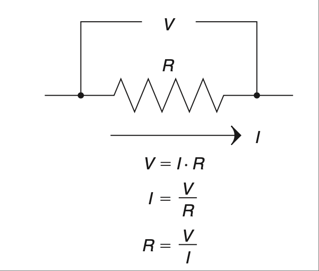

    **图 2.1 欧姆定律，一切电学之核心。**

.. note::

    问题是：我们部门需要测量一个直流电动机的电流，电流范围在 5 A 到 15 A 之间，但我们的万用表电流测量档的保险丝是 10 A。

    所以，我用刚从课上学的欧姆定律设计了一个分流器来测电流。我希望尽量准确地读取数据，同时又尽量少干扰电路，于是我选用了一个 0.1 Ω 的电阻。我做了一个盒子把它装起来，并安装了香蕉插接口，方便接入电压表。设计看起来如 :ref:`图 2.2 <Figure 2.2>` 所示。

    .. _Figure 2.2:

    .. figure:: ./img/f2.2.png
        :scale: 50%
        :align: center

        **图 2.2 简易电流测量电路的原始设计。**

    大家都觉得这是个好主意，于是我做了几个这样的盒子，我们马上开始使用它们。但过了一段时间后，我们发现这些盒子的读数不太准确，有时误差甚至高达 50% 到 60%。没人能搞明白为什么，于是我坐下来分析我做了什么。

    几分钟后，我对自己说：“哎呀！”我意识到，为了便于组装，我把电动机的线焊到了香蕉插头上，然后用几段短的 14 号导线把它们接到了分流电阻上。我的实际电路看起来更像 :ref:`图 2.3 <Figure 2.3>`。

    .. _Figure 2.3:

    .. figure:: ./img/f2.3.png
        :scale: 50%
        :align: center

        **图 2.3 实际组装的简易电流测量电路。**

    我的电压表测量的不是 0.1 欧姆的电阻，而是更大的电阻。导线也是有电阻的；哪怕是几英寸长的 14 号导线也有几百分之几欧姆的电阻。回忆欧姆定律：

    .. math::
        :label: equation 2.1

        V = I * R

    我意识到，如果 R 增大，在相同电流下，V 也会增大，这就导致了我们看到的误差。我犯了一个简单的错误，但幸好很容易修正。我重新在纸上设计了一个新的盒子，如 :ref:`图 2.4 <Figure 2.4>` 所示。

    .. _Figure 2.4:

    .. figure:: ./img/f2.4.png
        :scale: 50%
        :align: center

        **图 2.4 重新设计的电流测量电路。**

    我把这个带去给我的老板（那个拥有 MSEE 学位、可以在脑子里心算我只能用 MathCad 加冰饮料才能算出的数学题的人）。他的反应让我震惊。他找来了主导工程师一起看，他们得出的结论是我完全错了。他们谈论的是温度系数、电流的相位移、RMS 以及一堆我当时听不懂的东西。争论就此开始。我解释说，原理图上的两个点必须用导线连接，而导线是有电阻的。尽管通常可以忽略，但在这种情况下非常关键，因为分流电阻的值太小了。

    在他们犹豫不决的时候，我意识到，人们常常会忽略曾经学过的东西，转而使用那些他们“知道”的更高级理论。而且，如果应用不当，即使再多的知识也毫无用处。我继续坚持我的观点。我可能已经在白板上写了 50 次欧姆定律了。

    最终他们终于承认，香蕉插与分流电阻之间的那段额外导线是误差的来源。但争论并未就此结束。他们问，我的新设计只是重新布线，怎么就能解决问题？电阻还在电路里，不是吗？我又写了 100 次欧姆定律并解释说，通过电压表的电流非常小，使得导线中的电阻再次变得可以忽略。看到他们无视显而易见问题的能力，我感到无比震惊。相较之下，最初的争论都不算什么，真正的“烟花”这时才开始上演。

    故事的寓意是什么？Dilbert 的创作者 Scott Adams 曾说过，“每个人都有愚蠢的时候”，他说这话时正看到有人换个电池就修好了他“坏掉的”呼机。我非常赞同他。我大概每六个月就要重新“发现”一次欧姆定律。在你开始寻找更复杂解决方案之前，请务必、务必、务必检查基础！我父亲是个修车工，他有一次把整辆车的电线都重接了，最后发现只是一个保险丝坏了（看上去没问题，但他没用表测）。这就是他学会这课的方式。而我，则是经历了职业生涯中最愚蠢的四小时争论。

    这场争论的结局？我们从未达成一致，于是我直接用新设计修好了盒子（他们随后花了几周时间验证它确实是对的）。我一句话没再多说，尽快从那个组调走了。这个设计现在已经使用超过十年，文档中明确指出必须正确布线以避免测量误差。那不是我写的，是我以前的老板写的。有趣的是，从那以后我们再也没就欧姆定律争论过。

基础知识最重要；我再说一次，基础知识很重要！欧姆定律是你作为电气工程师会用到的最基本的原理。它是一切其他规则的基础。基本事实是，电阻会阻碍电流的流动。这种阻碍在电阻上产生一个与电流大小成正比的电压降。如果你愿意，也可以把电阻看作是电流到电压的转换器。[2]_

既然已经说明了这一点，我们来看看电路中另外两种阻抗类型。我们稍后会更详细地讨论，但现在请记住，电感器和电容器在特定频率下也可以像电阻一样工作。如果你考虑这一点，欧姆定律同样适用于这些元件。你甚至可以将公式改写为：

.. math::
   :label: equation 2.2

   V = I * Z

.. [2] 如果你不理解“电流到电压转换器”这个概念，再仔细想一想：电流流过一个电阻，会在其两端产生电压降——希望你深入思考后能迎来那个“脑袋上亮灯泡”的顿悟时刻，一切都豁然开朗。

    If you don’t get the idea of a current-to-voltage converter, think about it a bit harder, put current through a resistor, get a voltage drop across it out—hopefully deep thought on this will lead to one of those “light-bulb-over-the-head” moments when it all seems to make sense.

可以把阻抗 Z 看作某一特定频率下的电阻。[3]_ 随着我们继续学习其他基本公式，请牢记这一点。公式中凡是出现电阻的地方，如果你考虑信号的频率，就可以简单地替换为阻抗。

最后一点说明：你电路中的每一根导线、每一个走线、每一个元件或材料都包含这三种特性——电阻、电感和电容。所有东西都有电阻，所有东西都有电容，所有东西都有电感。你必须问自己最重要的问题是：“这个量是否足够大到会产生影响？” 事实上，根据我的经验，如果那个分流电阻的阻值大 100 倍，那误差也会小 100 倍。[4]_ 相较于我们的测量值，那误差就可以忽略不计了。你会发现，电容和电感的阻抗公式也能以类似方式帮助你。考虑你操作的频率，并问自己：“这个元件是否对我关注的部分产生了显著影响？” 通过评估这个显著性，你就能精准找到你在电路中要定位的部分。

我前面讲述的那个经历，是我职业生涯早期发生的，而我当时就说过，我每六个月就会重新“发现”一次欧姆定律。一次又一次，当我在解决问题或设计时，答案往往就在欧姆定律中。所以，在你掏出一大堆高级理论试图解决问题之前，请先记住：欧姆定律仍然有效！

接下来是我们的基本公式列表中的电压分压规则。下面是公式，:ref:`图 2.5 <Figure 2.5>` 显示了电路的原理图：

.. math::
   :label: equation 2.3

   Vo = Vi \frac{Rg}{Rg + Ri}

你最常看到的可能是用 R1 和 R2 表示的形式。我将它们改成了 Rg（接地电阻）和 Ri（输入电阻），以提醒自己哪个接地，哪个串联。如果你弄反了，你就会得到 Ri 上的压降而不是输出电压（即 Rg 上的电压）。如果你觉得这个电路的增益 [5]_ 不太对，可能是两个电阻值写反了。

.. _Figure 2.5:

.. figure:: ./img/f2.5.png
   :scale: 50%
   :align: center

   **图 2.5 输入电压在输出处被分压。**

你可能也注意到，这个电路的增益永远不会大于 1。当 Ri 趋近于 0 时它接近 1，当 Rg 趋近于无穷大时它也接近 1。（注意，Rg 越大，Ri 的值就越不重要。）因此，可以将分压器视为一个将电压按比例传递到输出的电路。观察这个电路时，试着用百分比的角度思考。例如，如果 Rg = Ri，那么输出端只有 50% 的电压。如果你想得到 10% 的信号，那么你需要一个 1/10 的增益。所以让 Rg = 1K，Ri = 9K，搞定，一个输出为输入信号 10% 的电压分压器就完成了。

你是否注意到，为了得到 1/10 的增益，两个电阻的比例是 1:9？这是因为分母是两个电阻之和。我敢打赌你也发现了，如果交换两个电阻的值，你会得到 9/10 的增益，也就是 90%。如果你理解了这一点就会觉得这很直观：在相同电流下，9K 电阻上的电压降将是 1K 电阻的 9 倍。换句话说，90% 的电压降在 Ri 上，10% 的电压降在 Rg 上，而 Vo 的电压就是测量 Rg 上的电压。电压分压器其实只是欧姆定律的延伸（好吧，想想看），但它太实用了，因此我把它列为你必须牢记的基本公式之一。

.. [3] 好吧，这说得有点过于简化了；它在某种意义上像电阻一样，但其实是通过引入信号的相位延迟来实现的。我发现多数情况下这样思考问题会帮助你理解正在发生什么。但请记住它不完全等同于频率依赖的电阻；它只是“表现得像”。

    Okay, this is a bit oversimplified; it acts like resistance in one sense, but it does so by causing a delay in the phase of the signal. I have found that in most cases thinking of it like this will give you a decent idea of what is going on. Just remember it isn’t exactly like a resistor dependent on frequency; it merely acts like one.

.. [4] 给你一个好玩的思考题：如果我用了一个大 100 倍的电阻，会产生什么后果？我会需要多大功率的电阻？这是否会影响被测设备的正常工作？如果会，那影响有多大？为什么？我发现最聪明的工程师会把这种问题写到白板上，然后深入探讨其细节，直到老板走过来说：“好了好了，玩够了，回去干活吧。”

    Here’s a fun question for you to figure out: If I had used a resistor 100 times larger, what would have been the ramifications of that? What wattage of resistor would I have needed? Would that have affected the operation of the device under measurement? If so, how much, and why? I have found that the brightest engineers will throw a problem like this up on the white board and dig into it, arguing the finer points until their boss comes along and says, “Okay, enough fun, time to get back to work.”

.. [5] 我喜欢的思考方式之一是 Vo=Vi*H，其中 H 是电路的增益，即 H=Rg/(Rg + Ri)：在你拆解电路组件时这很有用。我们在后面讲运放时会专门用到这个形式。

    One way I like to think of this is Vo=Vi*H, where H is the gain of the circuit, or H=Rg/ðRg + RiÞ: This is useful when you are breaking a circuit down to components. We will specifically use this when we discuss op-amps later on.

.. toggle::

    This, I believe, is one of the best-taught principles in school for the budding engineer or technician, and it should be. So why go over it? Well, two reasons come to mind: One, you can’t go over the basics too much, and two, though any engineer can quote Ohm’s Law by heart, I have often seen it ignored in application.

    First, let’s state Ohm’s Law: Voltage equals current multiplied by resistance; it is shown in :ref:`Figure 2.1 <Figure 2.1>`.

    It is simple, but do you consider that resistance exists in every part of a circuit? [1]_ It is easy to forget that, especially since many simulators do. I think the best way to drive this point home is to recount the way it was driven home to me.

    .. note::

        There I was—a lowly engineering student. I was working as a technician or associate engineer (depending on whom you asked). I was arguing with my boss, who had an MSEE degree, but he just wouldn’t believe me; neither would my lead engineer (who had a BSEE). I couldn’t bring myself to distrust Ohm’s Law, even in light of their “superior”

    .. figure:: ./img/f2.1.png
        :scale: 50%
        :align: center

        **FIGURE 2.1 Ohm’s Law, the heart of all things electrical.**

    .. note::

        knowledge. I’d had less heated debates with rabid dogs. This was the problem: Our department needed to measure the current of a DC motor that could range from 5 A to 15 A at any given time, but our multi-meters had a 10 A fuse in the current measuring circuit.

        So, using Ohm’s Law (which was fresh in my mind, being a student and all), I designed a shunt to measure current. I wanted to get a good reading but disturb the circuit as little as possible, so I chose a 0.1 Ω resistor. I built a box to house it and installed banana-jack plugs to provide an easy interface to a voltmeter. The design looked like the one shown in :ref:`Figure 2.2 <Figure 2.2>`.

        .. figure:: ./img/f2.2.png
            :scale: 50%
            :align: center

            **FIGURE 2.2 Original design of simple current-measuring circuit.**

        Everyone thought it was a great idea, so I built a couple of boxes and we started using them right away. After a while, however, we noticed that they were not very accurate. Sometimes they would be off by as much as 50 to 60%. No one could figure out why, so I sat down to analyze what I had created.

        After a few minutes, I said to myself, “Well, duh!” I realized that to make the assembly easy I had soldered the wires from the motor to the banana jacks and then soldered some short 14-gauge jumpers to the shunt resistor. My circuit really looked like the drawing shown in :ref:`Figure 2.3 <Figure 2.3>`.

        .. figure:: ./img/f2.3.png
            :scale: 50%
            :align: center

            **FIGURE 2.3 As-built simple current-measuring circuit.**

        My voltmeter was measuring across a larger resistance value than 0.1 ohms. Wire has resistance, too; even a couple of inches of 14-gauge wire has a few hundredths of an ohm. Remembering Ohm’s Law:

        .. math::
            :label: equation 2.1

            V = I * R

        I realized that this means if you increase R, you get more V for the same amount of current, leading to the errors we were seeing. I had made a simple mistake that fortunately was easy to correct. I redesigned the box on paper to look like the drawing in :ref:`Figure 2.4 <Figure 2.4>`.

        .. figure:: ./img/f2.4.png
            :scale: 50%
            :align: center

            **FIGURE 2.4 Redesigned current-measuring circuit.**

        I took this to my boss (the one with the MSEE who could do math in his head that I would only attempt with MathCad and a cold drink). His reaction floored me. He reviewed it with the lead engineer and they came to the conclusion that I was completely wrong. They were talking about things like temperature coefficients and phase shifts in current and RMS and a bunch of other topics that were over my head at the time. Thus began the argument. I explained that two points on a schematic had to be connected by a wire and a wire had resistance. Though it is often ignored, it was significant in this case because the shunt resistor was such a small value.

        As they hemmed and hawed over this, I learned that many times it is human nature to ignore what one learned long ago and try to apply more advanced theories just because you know them. Also, all the knowledge in the world isn’t worth jack if it is incorrectly applied. I continued to press my point. I must have written Ohm’s Law on the white board 50 times by then.

        They finally conceded and agreed that the extra wire between the banana jack and the shunt was the cause of the error. That was not the end of the disagreement, though. How in the world was my new design going to fix the problem by simply repositioning the wires? The resistance was still in the circuit, was it not? I wrote down Ohm’s Law another

        100 times and explained that the current through the meter was very small, making the resistance in the wire insignificant again. My astonishment reached new levels as I observed the human ability to overlook the obvious. The first argument was nothing compared to this one. The fireworks really started to fly then.

        What is the moral of this story? Well, Scott Adams, creator of Dilbert, said, “Everyone has moments of stupidity,” as he watched someone fix his “broken” pager by putting in a new battery. I have to agree with him. I rediscover Ohm’s Law about every 6 months. Always, always, always check the basics before you start looking for more complicated solutions! My father, a mechanic, tells a story of rewiring an entire car just to find a bad fuse. (It looked okay, but he didn’t check out with a meter.) That was how he learned this lesson. Me, I just participated in 4 hours of the dumbest argument of my career.

        How did the argument end? We never came to an agreement, so I went ahead and fixed boxes with the new design anyway (which they spent several weeks proving were working correctly). I didn’t say another word but transferred out of that group as soon as possible. The same design has been in use for more than 10 years now, and the documentation notes the need to wire it correctly to avoid inaccurate readings. I didn’t write that document, my old boss did. It’s kind of funny how we didn’t argue about Ohm’s Law after that.

    The basics are the most important; let me repeat that, the basics are important! Ohm’s Law is the most basic principle you will use as an electrical engineer. It is the foundation on which all other rules are based. The fundamental fact is that resistance impedes current flow. This impedance creates a voltage drop across the resistor that is proportional to the amount of current flowing through it. If it helps, you can think of a resistor as a current-to-voltage converter. [2]_

    With that important point made, let’s consider two other types of impedance that can be found in a circuit. We will get into this in more detail later, but for now consider that inductors and capacitors both can act like resistors, depending on the frequency of the signal. If you take this into account, Ohm’s Law still works when applied to these components as well. You could very well rewrite the equation to:

    .. math::

        V = I * Z

    Think of the impedance Z as resistance at a given frequency. [3]_ As we move on to the other basic equations, keep this in mind. Wherever you see resistance in an equation, you can simply replace it with impedance if you consider the frequency of the signal.

    One final note: Every wire, trace, component, or material in your circuit has these three components in it—resistance, inductance, and capacitance. Everything has resistance, everything has capacitance, and everything has inductance. The most important question you must ask is, “Is it enough to make a difference?” The fact is, in my own experience, if the shunt resistor had been 100 times larger, that would have made the errors we were seeing 100 times less. [4]_ They would have been insignificant in comparison to the measurement we were taking. The impedance equations for capacitors and inductors will help you in a similar way. Consider the frequencies you are operating at and ask yourself, “Is this component making a significant impact on what I am looking at?” By reviewing this significance, you will be able to pinpoint the part of the circuit you are looking for.

    The experience I related earlier happened years ago at the beginning of my career, and I said then that I still rediscover Ohm’s Law every six months. Time and time again, working through a problem or design, the answer can be found by application of Ohm’s Law. So, before you break out all those higher theories trying to solve a problem, first remember: Ohm’s Law still works!

    Next on our list of basic formulae is the voltage divider rule. Here is the equation and :ref:`Figure 2.5 <Figure 2.5>` shows a schematic of the circuit:

    .. math::

        Vo = Vi \frac{Rg}{Rg + Ri}

    The most common way you will see this is in terms of R1 and R2. I have changed these to Rg (for R ground) and Ri (for R input) to remind myself which one of these goes to ground and which one is in series. If you get them backward, you get the amount of voltage lost across Ri, not the amount at the output (which is the voltage across Rg). If the gain [5]_ of this circuit just doesn’t seem right, you might have the two values swapped.

    .. figure:: ./img/f2.5.png
        :scale: 50%
        :align: center

        **FIGURE 2.5 Input voltage is divided down at the output.**

    You might also notice that the gain of this circuit is never greater than 1. It approaches 1 as Ri goes to 0, and it approaches 1 as Rg gets very large. (Note that as Rg gets larger, the value of Ri becomes less significant.) Since this is the case, it is easy to think of the voltage divider as a circuit that passes a percentage of the voltage through to the output. When you look at this circuit, try to think of it in terms of percentage. For example, if Rg = Ri, only 50% of the voltage would be present on the output. If you want 10% of the signal, you will need a gain of 1/10. So put 1K in for Rg, and 9K in for Ri, and voilà, you have a voltage divider that leaves 10% of the signal at the output.

    Did you notice that the ratio of the resistors to each other was 1:9 for a gain of 1/10? This is because the denominator is the sum of the two resistor values. I’ll also bet you noticed that if you swap the two resistor values you will get a gain of 9/10, or 90%. This should make intuitive sense to you now if you recognize that, for the same amount of current, the voltage drop across a 9 K Ri will be 9 times larger than the voltage drop across a 1 K Rg. In other words, 90% of the voltage is across Ri, whereas 10% of the voltage is across Rg, where your meter measuring Vo is hooked up. The voltage divider is really just an extension of Ohm’s Law (go figure), but it is so useful that I’ve included it as one of the basic equations that you should commit to memory.

电容器阻碍电压的变化
~~~~~~~~~~~~~~~~~~~~~~~~~~~~~~~~~~~~~~~
Capacitors Impede Changes in Voltage

让我们思考一下，如果我们将前面电压分压电路中的 Rg 替换为一个电容器，会发生什么。这仍然是一个电压分压电路，不是吗？但有什么不同呢？此时你应该说：“嘿，电容器只是一个值随频率变化的电阻（更准确地说是阻抗）；这不就意味着这是一个依赖频率的电压分压器吗？”没错，就是这样，这种电路通常被称为 RC 电路。我们现在画出一个，如 :ref:`图 2.6 <Figure 2.6>` 所示。

.. _Figure 2.6:

.. figure:: ./img/f2.6.png
    :scale: 50%
    :align: center

    **图 2.6 向一个简单的 RC 电路施加阶跃输入。**

利用你对电阻器和电容器的直觉理解，我们来分析这个电路中将会发生什么。我们通过施加一个阶跃输入来完成分析。阶跃输入在定义上是电压的快速变化。电阻器对电压变化并不在意，但电容器在意。这个快速的电压变化可以看作是高频信号，[6]_ 那么电容器如何响应高频？没错，它表现出低阻抗。所以现在我们应用电压分压规则。如果 Rg 的阻抗较低（相较于 Ri），那么 Vo 上的电压也会较低。随着频率降低，电容的阻抗升高；随着阻抗升高，根据电压分压器规则，输出电压也升高。那么这一切最终会停止在哪儿？

稍微想一下。根据你对电容器的了解，它会抵抗电压的变化。最初发生的是一个快速的电压变化。之后，我们的阶跃输入保持在 5V，不再变化。那么电容器最终会充电至 5V 并保持不变，这不是很合理吗？这种现象被称为 RC 电路的暂态响应。这个电路的输出电压变化具有特征曲线。其由下列公式描述（其中 t 表示时间）：

.. math::
   :label: equation 2.4

    Vo = Vi \left ( 1 - e^{\frac{-t}{RC}}  \right )

这个输出图形如 :ref:`图 2.7 <Figure 2.7>` 所示。该公式中 R 乘以 C 的值也称为 τ（tau），即时间常数，常用希腊字母 τ 表示。

.. math::
   :label: equation 2.5

    RC = \tau

对于阶跃输入，这个 RC 电路的曲线始终相同。唯一改变的是达到最终值所需的时间。曲线的形状始终相同，但发生的时间取决于时间常数 τ 的值。[7]_ 你可以使用时间常数和最终电压值对这条曲线进行归一化。我们重新绘制横轴为 τ 倍数的曲线，如 :ref:`图 2.8 <Figure 2.8>` 所示。

在 1τ 时，电压达到 63.2%；在 2τ 时达到 86.6%；3τ 时是 95%；到 4τ 时是 98%；而到 5τ 时就已经足够接近 100%，可以视为已达到稳态。

.. [6] 这是一个名叫傅里叶的人很久以前提出的观点。你叠加的谐波频率越多，阶跃输入的上升沿就越快。

   This is something a man named Fourier thought of long ago. The more harmonic frequencies you sum together, the faster the rise time of said step input.

.. [7] 如果你停下来仔细思考一下，就会觉得把 RC 称作时间常数是很合理的，因为它决定了响应所需的时间。

   If you stop to think about it, it just makes sense that this value RC is called a time constant, since it affects the timing of the response.

.. _Figure 2.7:

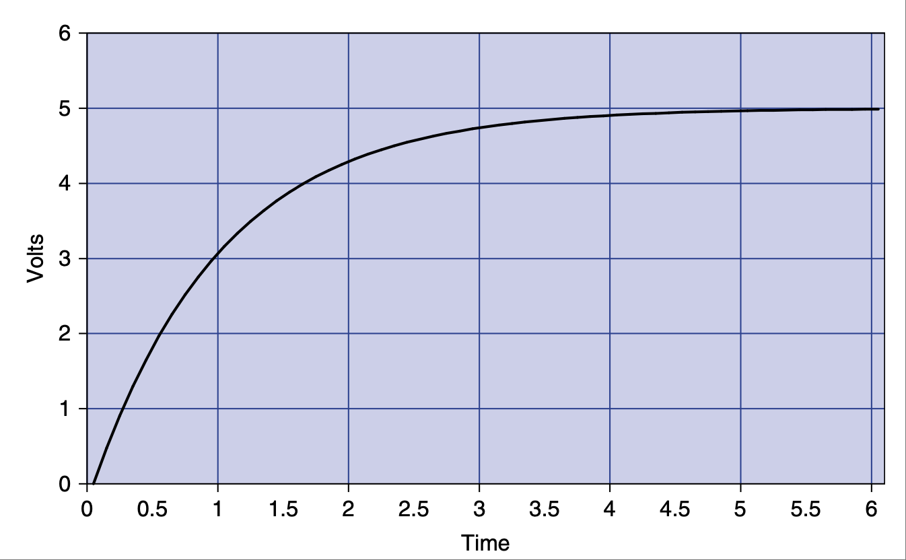

    **图 2.7 随时间变化的电压曲线。**

.. _Figure 2.8:

.. figure:: ./img/f2.8.png
    :scale: 50%
    :align: center

    **图 2.8 电压随时间（以 τ 为单位）变化的百分比曲线。**

这个响应曲线描述了电子学中一个基本且重要的原理。几年前，我开始要求潜在的求职者在我提供图 2.6 所示 RC 电路的基础上画出这条曲线。多年来，我对很多工程师（无论是刚毕业还是有多年经验者）都无法画出这条曲线感到失望。我询问过的申请者中，能画出这条曲线的不到 50%。这个事实是我决定写这本书的主要原因之一。（另一个原因是有人居然愿意付钱让我写！否则我估计根本不会写下去。）所以，我恳请你把它牢记在心；这样做我可以保证你会成为一名更优秀的工程师。而且，如果我以后面试你，你获得工作的几率将提升 50%！如果你理解了这个概念，你就能理解电感器，这将在下一节中看到。

在继续之前，我希望你思考一下这个电路中的电流发生了什么。还记得欧姆定律吗？将它应用于此示例，以理解电流的变化。我们知道：

.. math::
   :label: equation 2.6

    V = I * R

做一点代数变换可以得到：

.. math::
   :label: equation 2.7

    I = \frac{V}{R}

常识告诉我们，该电路中电阻上的电压等于输入电压减去输出电压。写成公式就是：

.. math::
   :label: equation 2.8

    Vr = Vi - Vo

.. _Figure 2.9:

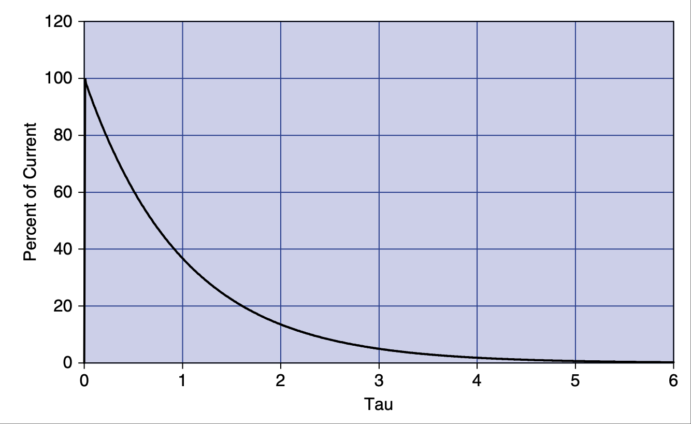

    **图 2.9 电流随时间（以 τ 为单位）变化的百分比曲线。**

我们知道，在任意时刻的电压值可以用 τ 表示。在 0τ 时，Vo 为 0。所以 5V 的电压全部加在电阻上，电流为最大值。在这一刻，电容几乎相当于把输出短接到地。在 1τ 时，Vo 为 Vi 的 63.2%。这意味着 Vr 是 Vi 的 36.8%。重复这个过程，将各点连接起来，你就得到一条与电压曲线方向相反的曲线，如 :ref:`图 2.9 <Figure 2.9>` 所示。

注意，当阶跃输入发生变化时，电流是可以立刻变化的。而电压则不会那么快地变化。正如这条规则所说，电容器会阻碍电压的变化。这也意味着，电流的变化 [8]_ 将不会受到影响。世间万物都有对立面，电容器也不例外，所以我们接着讲电感器。

.. [8] 另一种思考方式是，电流的快速变化正是电容器所擅长的。 
   
   Another way to think of it is that rapid changes in current are what capacitors are very good at.

.. toggle::

    Let’s consider for a moment what might happen to the previous voltage divider circuit if we replace Rg with a capacitor. It is still a voltage divider circuit, is it not? But what is the difference? At this point you should say, “Hey, a cap is just a resistor (or more correctly impedance) whose value changes depending on the frequency; wouldn’t that make this a voltage divider that depends on frequency?” Well, it does, and this is commonly known as an RC circuit. Let’s draw one now, as shown in :ref:`Figure 2.6 <Figure 2.6>`.

    .. figure:: ./img/f2.6.png
        :scale: 50%
        :align: center

        **FIGURE 2.6 Step input is applied to a simple RC circuit.**

    Using your intuitive understanding of resistors and capacitors, let’s analyze what is going to happen in this circuit. We’ll do this by applying a step input. A step input is by definition a fast change in voltage. The resistor doesn’t care about the change in voltage, but the cap does. This fast change in voltage can be thought of as high frequencies, [6]_ and how does the cap respond to high frequencies? That’s right, it has low impedance. So, now we apply the voltage divider rule. If the impedance of Rg is low (as compared to Ri), the voltage at Vo is low. As frequency drops, the impedance goes up; as the impedance goes up, based on the voltage divider, the output voltage goes up. Where does it all stop?

    Think about it a moment. Based on what you know about a cap, it resists a change in voltage. A quick change in voltage is what happened initially. After that our step input remained at 5 V, not changing anymore. Doesn’t it make sense that the cap will eventually charge to 5 V and stay there? This phenomenon is known as the transient response of an RC circuit. The change in voltage on the output of this circuit has a characteristic curve. It is described by this equation (note t = time):

    .. math::

        Vo = Vi \left ( 1 e^{\frac{t}{rc}}  \right )

    The graph of this output looks like :ref:`Figure 2.7 <Figure 2.7>`. The value of R times C in this equation is also known as tau, or the time constant, often referred to by the Greek letter τ.

    .. math::

        RC = \tau

    For a step input, this curve is always the same for an RC circuit. The only thing that changes is the amount of time it takes to get to the final value. The shape of the curve is always the same, but the time it takes to happen depends on the value of the time constant [7]_ τ. You can normalize this curve in terms of the time constant and the final value of the voltage. Let’s redraw the curve with multiples of τ along the time axis, as shown in :ref:`Figure 2.8 <Figure 2.8>`.

    At 1 τ the voltage reaches 63.2%, at 2 τ it is at 86.6%, 3 τ is 95%, by 4 τ it is at 98%, and when you reach 5 τ you are close enough to 100% to consider it so.

    .. figure:: ./img/f2.7.png
        :scale: 50%
        :align: center

        **FIGURE 2.7 Voltage change over time.**

    .. figure:: ./img/f2.8.png
        :scale: 50%
        :align: center

        **FIGURE 2.8 Voltage change in percentage over time in tau.**

    This response curve describes a basic and fundamental principle in electronics. Some years ago I started asking potential job candidates to draw this curve after I gave them the RC circuit shown in Figure 2.6. Over the years I have been dismayed at how many engineers, both fresh out of school and with years of experience, cannot draw this curve. Fewer than 50% of the applicants I have asked can do it. That fact is one of the main reasons I decided to write this book. (The other was that someone was actually willing to pay me to do it! I doubt it would have gotten far otherwise.) So, I implore you to put this to memory once and for all; by doing so I guarantee you will be a better engineer. Plus, if I ever interview you, you will have a 50% better chance of getting a job! If you understand this concept, you will understand inductors, as you will see in the next section.

    Before we move on, I would like you to consider what happens to the current in this circuit. Remember Ohm’s Law? Apply it to this example to understand what the current does. We know that:

    .. math::

        V = I * R

    A little algebra turns this equation into:

    .. math::

        I = \frac{V}{R}

    A little common sense reveals that the voltage across R in this circuit is equal to voltage at the output minus voltage at the input. As an equation, you get:

    .. math::

        Vr = Vi Vo

    .. figure:: ./img/f2.9.png
        :scale: 50%
        :align: center

        **FIGURE 2.9 Current change in percentage over time in tau.**

    We know the voltage at each point in time in terms of tau. At 0 τ, Vo is at 0. So the full 5 V is across the resistor and the maximum current is flowing. For all intents and purposes, the cap is shorting the output to ground at this point in time. At 1 τ, Vo is at 63.2% of Vi. That means Vr is at 36.8% of Vi. Repeat this process, connect the dots, and you get a curve that moves in the opposite direction of the voltage curve, something like what’s shown in :ref:`Figure 2.9 <Figure 2.9>`.

    Notice how current can change immediately when the step input changes. Also notice how the voltage just doesn’t change that fast. Capacitors impede a change in voltage, as the rule goes. What this also means is that changes in current [8]_ will not be affected at all. Everything has its opposite, and capacitors are no exception, so let’s move on to inductors.

电感器阻碍电流的变化
~~~~~~~~~~~~~~~~~~~~~~~~~~~~~~~~~~~~~~~
Inductors Impede Changes in Current

现在我们已经思考过 RC 电路，让我们来考虑 :ref:`图 2.10 <Figure 2.10>` 中所示的 RL 电路。记住，电感器会阻碍电流的变化，但不会阻碍电压的变化。最初，当施加相同的阶跃输入时，输出端的电压可以立即跳到 5 V。电感器中的电流最初为 0，但现在它两端出现了电压降，因此电流必须开始上升。在 RL 电路中，电流的响应方式与 RC 电路中电压的响应方式完全相同。

既然你已经将 RC 电路的响应记住了，那么 RL 电路的响应就很容易理解。从电流的角度来看，它与 RC 电路完全相同；[9]_ 电流曲线如 :ref:`图 2.11 <Figure 2.11>` 所示。

.. [9] 能够从“电压”或“电流”的角度来考虑电路是一项宝贵的技能。随着你在这个领域技能的提高，试着去理解这个概念。

    Being able to consider a circuit from either a “voltage” viewpoint or a “current” viewpoint is a valuable skill. Try to formulate an understanding of this concept as you develop your skills in this area.

我希望你此刻会问自己：“那么电压响应呢？”现在，请思考一下欧姆定律，并尝试画出电压将如何变化的图像。t=0 时刻电流是多少？稍后又是多少？记住欧姆定律——为了使电流很小，电阻必须很大。所以最初电感器表现得像一个开路。电感器两端的电压将与输入电压相同。随着时间推移，电感器的阻抗会下降，变成一个短路，因此电压也会下降。:ref:`图 2.12 <Figure 2.12>` 显示了该图像。

电感器正好与电容器互为补充。它对电流的作用，就如同电容器对电压的作用，反之亦然。

.. _Figure 2.10:

.. figure:: ./img/f2.10.png
    :scale: 50%
    :align: center

    **图 2.10 基本 RL 电路。**

.. _Figure 2.11:

.. figure:: ./img/f2.11.png
    :scale: 50%
    :align: center

    **图 2.11 电流随时间以 τ 为单位的变化百分比。**

.. _Figure 2.12:

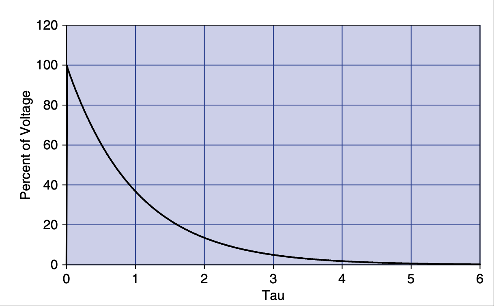

    **图 2.12 电压随时间以 τ 为单位的变化百分比。**

.. toggle::

    Now that we have thought through the RC circuit, let’s consider the RL circuit shown in :ref:`Figure 2.10 <Figure 2.10>`. Remember that the inductor resists a change in current but not in voltage. Initially, with the same step input, the voltage at the output can jump right to 5 V. Current through the inductor is initially at 0, but now there is a voltage drop across it, so current has to start climbing. The current responds in the RL circuit exactly the same way voltage responds in the RC circuit.

    Since you committed the RC response to memory, the RL response is easy. It is exactly the same from the viewpoint of current; [9]_ the current graph looks like :ref:`Figure 2.11 <Figure 2.11>`.

    I hope you are saying to yourself, “What about the voltage response?” At this time, consider Ohm’s Law for a moment and try to graph what the voltage will do. What is the current at time 0? How about a little later? Remember Ohm’s Law—for the current to be low, resistance must be high. So initially the inductor acts like an open circuit. Voltage across the inductor will be at the same value as the input. As time goes on, the impedance of the inductor drops off, becoming a short, so voltage drops as well. :ref:`Figure 2.12 <Figure 2.12>` shows the graph.

    The inductor is the exact complement of the capacitor. What it does to current, the cap does to voltage, and vice versa.

    .. figure:: ./img/f2.10.png
        :scale: 50%
        :align: center

        **FIGURE 2.10 The basic RL circuit.**

    .. figure:: ./img/f2.11.png
        :scale: 50%
        :align: center

        **FIGURE 2.11 Current change in percent over time in tau.**

    .. figure:: ./img/f2.12.png
        :scale: 50%
        :align: center

        **FIGURE 2.12 Voltage change in percent over time in tau.**

串联与并联元件
~~~~~~~~~~~~~~~~~~~~~~~~~~~~~~~
Series and Parallel Components

电路中有两种元件连接方式：串联和并联。串联元件一个接一个排列；并联元件彼此并排连接。让我们来回顾一下简化这些元件排列的公式。

如 :ref:`图 2.13 <Figure 2.13>` 所示的串联电阻很简单；你只需将它们相加，不需要乘法！

.. math::
   :label: equation 2.9

   Rt = R1 + R2 + R3

如 :ref:`图 2.14 <Figure 2.14>` 所示的串联电感器与电阻相似——你以同样方式对串联电感求和。

.. math::
   :label: equation 2.10

    Lt = L1 + L2 + L3

记住电容器与电感器相反。因此，要像对待串联电阻和电感那样求和，电容器必须是并联的；见 :ref:`图 2.15 <Figure 2.15>`。

.. math::
   :label: equation 2.11

    Ct = C1 + C2 + C3

记住 :ref:`图 2.16 <Figure 2.16>` 中显示的等效关系。

如 :ref:`图 2.17 <Figure 2.17>` 所示的并联电阻稍微麻烦一点。任意两个元件的等效电阻由它们值的乘积除以它们值的和确定。 [10]_

但请记住，这种方法对任意两个电阻都适用！对于三个或更多电阻的情况，先求出任意两个的等效电阻，再重复此过程直至完成。（``//`` 表示 **与……并联**。）

.. math::
   :label: equation 2.12

    R1 // R2 = \frac{R1 * R2}{R1 + R2}  \space\space\space\space Rt = \frac{R1 // R2 * R3}{R1 // R2 + R3}

.. math::
   :label: equation 2.13

    L1 // L2 = \frac{L1 * L2}{L1 + L2}  \space\space\space\space Lt = \frac{L1 // L2 * L3}{L1 // L2 + L3}

并联电感器与电阻相同；你可以以同样的方式进行化简——见 :ref:`图 2.18 <Figure 2.18>`。

.. [10] 记住这个方法的另一种方式是对所有倒数求和：``1/Rt = 1/R1 + 1/R2 + 1/R3`` 等等。如果这种方式对你更有效，那就很好，只需记住其中一种方法即可。

    Another way to remember this idea is to sum all the inverses: ``1/Rt = 1/R1 + 1/R2 + 1/R3``, and so on. If this works better for you, that is fine, just commit one or the other to memory.

.. _Figure 2.13:

.. figure:: ./img/f2.13.png
    :scale: 50%
    :align: center

    **图 2.13 串联电阻。**

.. _Figure 2.14:

.. figure:: ./img/f2.14.png
    :scale: 50%
    :align: center

    **图 2.14 串联电感器。**

.. _Figure 2.15:

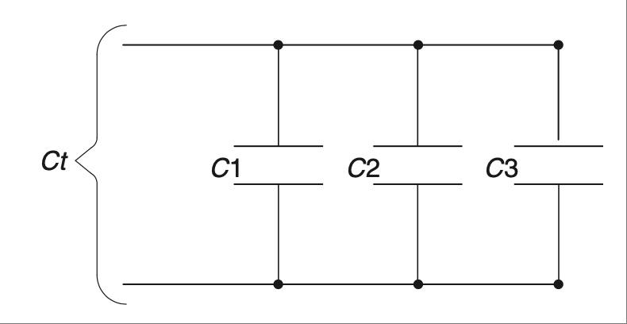

    **图 2.15 并联电容器。**

.. _Figure 2.16:

.. figure:: ./img/f2.16.png
    :scale: 50%
    :align: center

    **图 2.16 元件等效关系。**

.. _Figure 2.17:

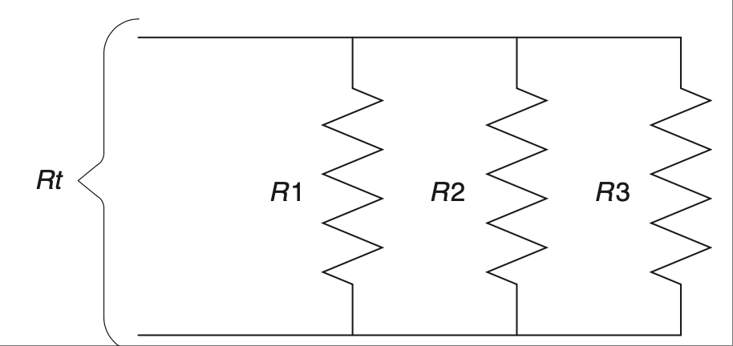

    **图 2.17 并联电阻。**

.. _Figure 2.18:

.. figure:: ./img/f2.18.png
    :scale: 50%
    :align: center

    **图 2.18 并联电感器。**

.. _Figure 2.19:

.. figure:: ./img/f2.19.png
    :scale: 50%
    :align: center

    **图 2.19 串联电容器。**

.. _Figure 2.20:

.. figure:: ./img/f2.20.png
    :scale: 50%
    :align: center

    **图 2.20 元件等效关系。**

对于电容器也适用相同的公式，但前提是它们为串联，如 :ref:`图 2.19 <Figure 2.19>` 所示。这些电路使用乘积除以和，或倒数求和规则；[11]_ 见 :ref:`图 2.20 <Figure 2.20>`。

.. math::
   :label: equation 2.14

    C1 // C2 = \frac{C1 * C2}{C1 + C2}  \space\space\space\space Ct = \frac{C1 // C2 * C3}{C1 // C2 + C3}

在处理串并联电路时，你可以看到只有两类公式。一类是简单的加法，另一类是乘积除以和（或倒数求和）。唯一的诀窍是知道在何时使用哪一种。记住，电阻和电感是“主流”成员，而电容器是与众不同的“边缘人”。我敢打赌，大多数工程师在聚会时都能体会到当“电容器”的感觉，所以这个比喻应该不难记住！

.. [11] 你可以像对电阻那样，对电容器或电感器的倒数求和。只需将阻抗代替电阻：``1/Zt = 1/Z1 + 1/Z2 + 1/Z3`` 等等。说实话，我在很多年前就把“乘积除以和”的规则记住了，这就是我喜欢它的原因。正如许多聪明的读者指出的那样，使用“倒数求和”规则同样有效。我希望你现在已经意识到，如果有两条等效的路径可以到达目的地，我并不在乎你选哪一条，只要你能到达正确的地方。我确实相信，找到适合自己的方法并专注于它是很重要的。除非换一条路能带来新的洞见或理解，否则不用担心走不同的路。哇，这也许是整本书最长的脚注了！也许我应该再多写几句以确认这一点。如果你真的读到了这里并坚持读完没有睡着，给我发封邮件 dashby@raddd.com 告诉我。我会回复我收到的每一封读者来信。如果我们的交流中你激发了某个深刻想法，我会把它发到网上看看是否能启发某位追随 sparkyguru 的人。:D 顺便说一句，我真的很喜欢听关于纵火的故事，所以如果你发给我一个非常精彩的，我会把它放到我 Facebook 上的“纵火狂 = 工程师”群组中。呼！好了，我是不是把一个人为了跟上时代需要触及的所有新媒体平台都提到了？哈哈！

    You can sum the inverses of the capacitors or inductors in the same way as the resistors. Just put impedance in place of resistance: ``1/Zt = 1/Z1 + 1/Z2 + 1/Z3``, and so on. Truth be told, I committed the product-over-the-sum rule to memory many years ago. That’s why I like it. You can be just as effective with the sum of the inverses rule, as so many astute readers have pointed out. I hope you have realized by now that if there are two equivalent routes to get to a destination, I don’t particularly care which one you use so long as you get to the right place. I do believe that it is important to find what works for you and focus on that. Don’t worry about going a different way unless it gives you new insight or understanding. Wow, this just might be the longest footnote in the whole book! Maybe I should add just a few more words to make sure. If you do read this and make it all the way to the end without nodding off, drop me a line at dashby@raddd.com and let me know. I answer every piece of fan mail I get, so I will surely reply. If you inspire a profound thought in our exchange I will tweet it out into the nether regions of the Internet and see if I can inspire anyone to follow sparkyguru. :D BTW, I really like to hear pyromanic stories so if you send me a really good one it will end up on my Facebook pyromanics = engineers group. Whew! There, did I hit all the new media outlets a guy has to these days just to be in the know? LOL!

.. toggle::

    There are two ways for components to be configured in a circuit: series and parallel. Series components line up one after another; parallel components are hooked up next to each other. Let’s go over the formulas to simplify these component arrangements.

    Series resistors, shown :ref:`Figure 2.13 <Figure 2.13>`, are easy; you simply add them up, no multiplication needed!

    .. math::

        Rt = R1 + R2 + R3

    The inductors shown in :ref:`Figure 2.14 <Figure 2.14>` are like resistors—you sum series inductors the same way.

    .. math::

        Lt = L1 + L2 + L3

    Remember that capacitors are the opposite of inductors. For this reason, capacitors must be in parallel to be summed up the way resistors and inductors are in series; see :ref:`Figure 2.15 <Figure 2.15>`.

    .. math::

        Ct = C1 + C2 + C3

    Remember the equivalences shown in :ref:`Figure 2.16 <Figure 2.16>`.

    Parallel resistors, shown in :ref:`Figure 2.17 <Figure 2.17>`, are a little trickier. The equivalent resistance of any two components is determined by the product of the values divided by the sum of the values. [10]_

    Keep in mind, however, that this works for any two resistors! In the case of three resistors or more, solve any two and repeat until done. (The ``//`` means **in parallel with**.)

    .. math::

        R1 // R2 = \frac{R1 * R2}{R1 + R2}  \space\space\space\space Rt = \frac{R1 // R2 * R3}{R1 // R2 + R3}

    .. math::

        L1 // L2 = \frac{L1 * L2}{L1 + L2}  \space\space\space\space Lt = \frac{L1 // L2 * L3}{L1 // L2 + L3}

    Parallel inductors are the same as resistors; you can reduce them in the same way—see :ref:`Figure 2.18 <Figure 2.18>`.

    .. figure:: ./img/f2.13.png
        :scale: 50%
        :align: center

        **FIGURE 2.13 Series resistors.**

    .. figure:: ./img/f2.14.png
        :scale: 50%
        :align: center

        **FIGURE 2.14 Series inductors.**

    .. figure:: ./img/f2.15.png
        :scale: 50%
        :align: center

        **FIGURE 2.15 Parallel capacitors.**

    .. figure:: ./img/f2.16.png
        :scale: 50%
        :align: center

        **FIGURE 2.16 Component equivalents.**

    .. figure:: ./img/f2.17.png
        :scale: 50%
        :align: center

        **FIGURE 2.17 Parallel resistors.**

    .. figure:: ./img/f2.18.png
        :scale: 50%
        :align: center

        **FIGURE 2.18 Parallel inductors.**

    .. figure:: ./img/f2.19.png
        :scale: 50%
        :align: center

        **FIGURE 2.19 Series capacitors.**

    .. figure:: ./img/f2.20.png
        :scale: 50%
        :align: center

        **FIGURE 2.20 Component equivalents.**

    For capacitors the same equation applies, but only if they are in series, as shown in :ref:`Figure 2.19 <Figure 2.19>`. These are the circuits that use the product-over-the-sum, or the sum-of-the-inverses, rule; [11]_ see :ref:`Figure 2.20 <Figure 2.20>`.

    .. math::
    :label: equation 2.14

        C1 // C2 = \frac{C1 * C2}{C1 + C2}  \space\space\space\space Ct = \frac{C1 // C2 * C3}{C1 // C2 + C3}

    In dealing with parallel and series circuits, you can see that there are only two types of equations. One is simple addition, and the other is the product over the sum (or the sum of inverses). The only trick is to know which to use when. Remember that the resistor and inductor are part of the “in” crowd and the cap is the outcast wallflower who is the opposite of those other guys. I’ll bet most engineers can relate to being the “capacitor” at a party, so this shouldn’t be too hard to remember!

戴维南定理
~~~~~~~~~~~~~~~~~~~
Thevenin’s Theorem

戴维南等效变换（Thevenizing）是基于叠加原理来分析电路的思想。当你面对一个受两个不同变量影响、难以分析的方程时，只要你处理的是线性方程（幸运的是，这些基本元件都是线性的；即便你看到 RC 时间响应的曲线时可能不这么想，其实它确实是线性方程） [12]_，你就可以使用叠加法来求解。

叠加原理的思想很简单：当你有多个输入共同作用于一个输出时，可以分别独立地分析每个输入的影响，最后将所有的结果加总起来，得出输出的表现。从叠加原理中衍生出了一个思想，即 *戴维南定理*。

.. _Figure 2.21:

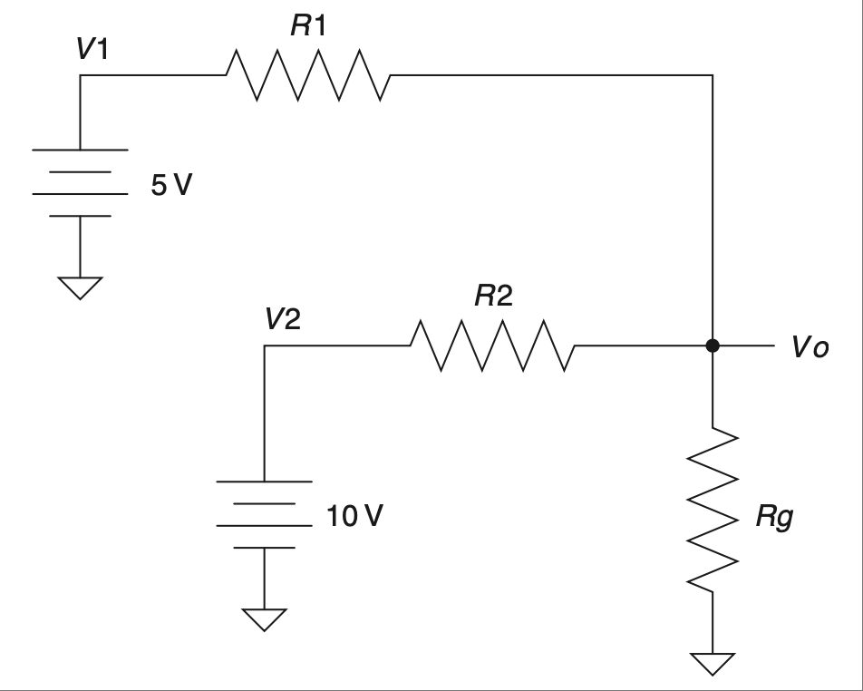

    **图 2.21 含有两个电压源的电路。**

使用戴维南定理，你几乎可以将任意电路简化为一个分压器。而我们已经知道如何解决分压器问题了，对吧！还有一个姊妹定理叫诺顿定理，它做的是相同的事情，但基于电流而非电压。因为你可以用任一方法来解决电路问题，我建议你专注于其中一个。因为我更习惯以电压的角度思考问题，所以我更喜欢将电路戴维南化，而不是用诺顿等效。为了遵循“只学好少数几个基础概念”的理念，我们将专注于戴维南等效。

戴维南化时最重要的规则是：电压源 [13]_ 要短路，电流源要开路。参考 :ref:`图 2.21 <Figure 2.21>` 所示电路。[14]_

一旦所有的电压源都短路、所有电流源都开路，所有元件就会变成串联或并联。这对那些只想记住几个公式的人来说非常方便！应用我们刚刚学到的串并联规则，voilà（瞧），你就得到了一个更容易理解的电路。当你将电阻、电感、电容的数目简化为可控范围后，你就可以逐个替换电源，查看每个电源对所关注元件的影响。

.. [12] 每当我看到“线性方程”这个词时，我会想到直线，因此 RC 曲线看起来似乎违反直觉，但线性方程是一类允许使用诸如叠加法等规则的公式。

    When I see the term linear equation, I think line, so an RC curve seems counterintuitive, but linear equations are a type of formula that allows certain rules such as superposition to be used.

.. [13] 注意这里使用的是“源”这个词；电压源是一种即使负载变化也能保持电压恒定的装置。电流源则是在负载变化时保持电流恒定。

    Note the use of the word source; a voltage source is a device that keeps the voltage constant as a load varies. A current source keeps the current constant in the face of a changing load.

.. [14] 上一版教材中这个电路引发了一场竞赛（因为我懒得给出答案）。这次我不会试图通过附上解答来炫耀我的聪明，而是改变一些数值（或者不变），邀请你来解这个电路。欢迎把你的解答发给我；我保证你会收到一封我为你的工程才能而送上的——全费用已付——电子邮件祝贺信！

    This circuit sparked a competition in the last edition of this book (since I didn’t bother to include a solution). Rather than try to show you how smart I am by including a solution in this edition, I am going to change a few values (or maybe not) and invite you as readers to solve this circuit. Drop me a note with your solution; I promise you will win an all-expense-paid email back from me congratulating you on your engineering prowess!

.. _Figure 2.22:

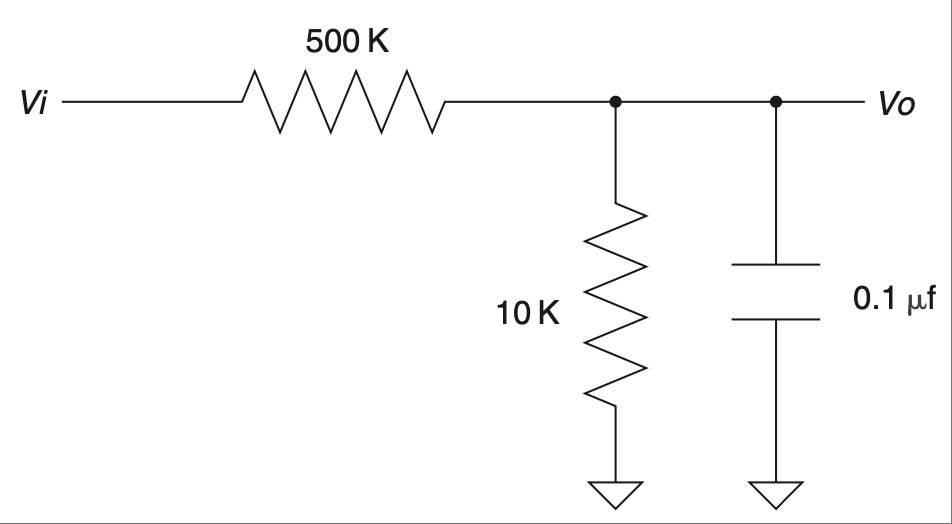

    **图 2.22 含有两个电压源的电路。**

我发现在戴维南化电路时，如果能想象自己是从输出端“回看”电路，会很有帮助。这意味着你要从输出端的角度来看电路。我们通常会从输入角度思考：某物输入，某些事情发生，接着某物输出。现在尝试将这个概念颠倒过来。思考，“这是输出端，它到底接到了什么？这个电容‘看到’了哪些阻抗？”一旦你能够调整你的思维视角，戴维南化将成为一个更强大的工具。参考 :ref:`图 2.22 <Figure 2.22>` 所示电路。

这个电路来源于一个真实的实际应用。我本可以告诉你它是什么，但这是机密。[15]_ 所以我们只说这是一个带电容滤波的分压器。（为了保护无辜者，某些数值可能已被修改。）

这个电路的任务是将输入端 0 到 100 V 的电压降低到 0 到 5 V 的范围。输入电压中还包含一个交流分量，该分量通过电容器被滤除。问题是，这个 RC 滤波器的时间常数是多少？

是 500 K*0.1 μF 吗？在理解戴维南定理之前我也是这么想的。此处的输出是电容两端的电压，所以我们回看电路，弄清这个电容到底接到了什么。请记住，我之前说这个电路的输入是一个电压源。我们在图中将其短路并戴维南化。看看 :ref:`图 2.23 <Figure 2.23>` 中的戴维南化电路。

希望此时你会突然意识到一些问题。对于电容来说，10 K 和 500 K 电阻是并联的。应用并联电阻的规则，我们发现连接到电容上的等效电阻是 9.8 K。哇，这比 500 K 小很多，不是吗！戴维南化告诉我们，之前的假设是错误的。实际上，这个电路的时间常数 [16]_ 要比没有 10 K 电阻时小得多。

.. [15] 如果你还没遇到，你很快就会发现，几乎每家公司都希望你将你所拥有的或曾经拥有的所有创意都签署为它们的知识产权。有一天，那些拥有好主意的人们必须站出来说：“够了！”然后我们很可能都变成顾问。

    If you haven’t already, you will soon find out that every corporation wants you to sign away every idea you have or ever had as their intellectual property. Some day, those individuals who have all the good ideas must rise up and say, “Enough is enough!” After which we will all likely end up being consultants.

.. [16] 如果你想更深入学习时间常数，可以跳到后面几章。但目前，理解戴维南定理的基本概念已经足够。

    If you want a more in-depth lesson on time constants, you will need to jump ahead a few chapters. For now, though, it is sufficient to understand the basic idea behind good ol’ Thevenin’s proposition.

.. _Figure 2.23:

.. figure:: ./img/f2.23.png
    :scale: 50%
    :align: center

    **图 2.23 戴维南化的真实秘密电路。**

这个定理还有其他有用之处。例如，如 :ref:`图 2.24 <Figure 2.24>` 所示的电路。

.. _Figure 2.24:

.. figure:: ./img/f2.24.png
    :scale: 50%
    :align: center

    **图 2.24 给电感器提供交流开关电源。**

.. _Figure 2.25:

.. figure:: ./img/f2.25.png
    :scale: 50%
    :align: center

    **图 2.25 加装吸收器的交流开关电感器电源。**

你需要通过这个电感器（实际是交流电机的一组绕组）切换交流电源。问题是，当你松开开关时，会产生大量电气噪声。（本书后面讨论磁场时我们会解释原因。）一个标准的应对方式是使用一个 RC 电路，也叫吸收器（snubber）。吸收器的目的是吸收这个电压尖峰并将其在电阻器上转化为热量消耗掉。如 :ref:`图 2.25 <Figure 2.25>` 所示，将其并联在电感器上最为合理。

.. _Figure 2.26:

.. figure:: ./img/f2.26.png
    :scale: 50%
    :align: center

    **图 2.26 戴维南化后等效的电路。**

现在我们来用戴维南定理以不同的角度来看这个电路，如 :ref:`图 2.26 <Figure 2.26>` 所示。通过短路交流电压源，我们可以快速看出，将吸收器接在开关另一端，即交流火线，会与将其并联在电感器上产生完全相同的效果。这个发现曾经为我所在的一家公司节省了数万美元 [17]_，仅仅是通过改变吸收器电路的位置。我想你会同意，戴维南化确实是个很强大的工具，不是吗？

.. [17] 不，我没有因为这个发现和工作获得任何奖金。唉，这正是我们今天所处的企业世界的一个悲哀现实。换个角度看，这个企业世界也让像《呆伯特》这样的漫画大获成功。有朝一日，我预测企业会意识到，让人们在努力工作的同时保持快乐的最好方式就是悄悄地多发点钱。

    No, I didn’t get any bonus for my discovery and work in this case. Alas, that too is a sad fact of the corporate world we live and work in these days. On the flip side, the corporate world has made cartoons like Dilbert quite successful. Someday I predict corporations will come to realize that the best way to keep people happy while working hard is simply slipping them a few extra dollars.

.. admonition:: 拇指规则

    - 基础最重要！
    - 为了基本理解，可将阻抗视为在某一频率下的电阻。
    - ``V = I * Z``。
    - 电压分压规则，``Vo = Vi(Rg /(Rg + Rs))``。
    - 电容器阻碍电压的变化，但电流可以立即变化（电感器的反义）。
    - 电感器阻碍电流的变化，但电压可以立即变化（电容器的反义）。
    - 电容之于电压，如电感之于电流。
    - 串联电阻、串联电感器和并联电容器可以直接相加。
    - 并联电阻、并联电感器和串联电容器使用乘积除以和或求倒数再求和的规则。
    - 戴维南化时：电压源短路，电流源开路。
    - 从输出端角度考虑电路。
    - 戴维南化可以带来洞察力。

.. toggle::

    Thevenizing is based on the idea of using superposition to analyze a circuit. When you have two different variables affecting an equation, making it difficult to analyze, you can use the technique of superposition to solve the equation, provided that you are dealing with linear equations (by luck all these basic components are linear; even if you might not think it when looking at the curve of an RC time response, it actually is a linear equation). [12]_

    The idea of superposition is simple: When you have multiple inputs affecting an output, you can analyze the effects of each input independently and add them together when you are all done to see what the output does. One idea that comes from superposition is *Thevenin’s theorem*.

    .. figure:: ./img/f2.21.png
        :scale: 50%
        :align: center

        **FIGURE 2.21 Circuit with two voltage sources.**

    Using Thevenin’s theorem allows you to reduce basically any circuit into a voltage divider. And we know how to solve a voltage divider, don’t we! There is a sister theorem called Norton’s, which does the same thing but is based on current rather than voltage. Since you can solve any electrical problem with either equation, I suggest you focus on one or the other. Since I like to think in terms of voltage, I prefer Thevenizing a circuit to the Norton equivalent. So to be true to the idea that you should only learn a few fundamentals and learn those well, we will focus on Thevenin equivalents.

    The most important rule when Thevenizing is this: Voltage sources [13]_ are shorted, current sources are opened. Consider the circuit shown in :ref:`Figure 2.21 <Figure 2.21>`. [14]_

    Once all the voltage sources are shorted and all the current sources are opened, all the components will be in series or parallel. That makes it very convenient for those of us who only want to memorize a few equations! Apply those basic parallel and series rules we just learned and voilà, you have a circuit that is much easier to understand. Once you have reduced the resistors, inductors, and caps to a more controllable number, you replace each source one at a time to see the effects of each source on the component in question.

    .. figure:: ./img/f2.22.png
        :scale: 50%
        :align: center

        **FIGURE 2.22 Circuit with two voltage sources.**

    I find it helps when Thevenizing a circuit to try to imagine that you are looking back into the circuit from the output. This means that you imagine what the circuit looks like in terms of the output. We often think in terms of stuff that goes in the input. Something goes in, something happens, and then it comes out the output. Try flipping that notion on its head. Think, “Here is the output, what exactly is it hooked up to? What are the impedances that the cap in this case ’sees’ connected to it?” Once you are able to adjust your point of view, Thevenizing will become an even more powerful tool. Consider the circuit shown in :ref:`Figure 2.22 <Figure 2.22>`.

    This circuit comes from a real, live application. I would tell you what, but it is secret. [15]_ So we won’t say this is anything more than a voltage divider with a capacitive filter on it. (Values might have been changed to protect the innocent.)

    This circuit’s job is to lower a voltage at the input terminals varying from 0 to 100 V to something with a range of 0 to 5 V. The input voltage also has an AC component that is filtered out by the capacitor. The question is, what is the time constant of the RC filter in this circuit?

    Is it 500 K*0.1 μf? That’s what I would have thought before I understood Thevenin’s theorem. The output in this case is the voltage across the cap, so let’s look back into the circuit to figure out what is hooked up to this cap. Now remember, I said there was a voltage source on the input of this circuit. Let’s short that on our drawing and Thevenize it. Take a look at the Thevenized circuit shown in :ref:`Figure 2.23 <Figure 2.23>`.

    Hopefully at this point something really jumped out at you. The 10 K and the 500 K resistors are in parallel as far as the cap is concerned. Applying the rule of parallel resistors we find that the resistance hooked up to this cap is 9.8 K. Wow, that is a lot less than 500 K, isn’t it! Thevenizing showed us that our first assumption was incorrect. In fact, the time constant [16]_ of this circuit is much, much lower than it would be without the 10 K resistor.

    .. figure:: ./img/f2.23.png
        :scale: 50%
        :align: center

        **FIGURE 2.23 Thevenized real, live secret circuit.**

    There are other ways this theorem can be useful. Here is a case in point. You might have a circuit like the one shown in :ref:`Figure 2.24 <Figure 2.24>`.

    .. figure:: ./img/f2.24.png
        :scale: 50%
        :align: center

        **FIGURE 2.24 AC switched power to an inductor.**

    .. figure:: ./img/f2.25.png
        :scale: 50%
        :align: center

        **FIGURE 2.25 AC switched power to an inductor with snubber.**

    You need to switch AC power through this inductor (which was actually one winding of an AC motor in this case). Trouble is, when you let off the switch, a whole bunch of electrical noise is generated when this switch is opened. (We will discuss why when we cover magnetic fields later in the book.) A standard way to deal with this situation is with an RC circuit commonly known as a snubber. The point of a snubber is to snub this voltage spike and dissipate it as heat on the resistor. This makes the most sense if it is across the inductor, as shown in :ref:`Figure 2.25 <Figure 2.25>`.

    .. figure:: ./img/f2.26.png
        :scale: 50%
        :align: center

        **FIGURE 2.26 These are equivalent circuits when Thevenized.**

    Now let’s apply Thevenin’s theorem to take a different look at this circuit, as shown in :ref:`Figure 2.26 <Figure 2.26>`. By shorting the AC voltage source, we quickly see that hooking the snubber up to the other side of the switch, to the AC hot line, would have exactly the same effect as hooking across the inductor. This fact once saved a company I worked for tens of thousands of dollars [17]_ using the alternate location of the snubber circuit. I would say that makes Thevenizing a pretty powerful tool, wouldn’t you?

    .. admonition:: Thumb Rules

        - The basics are the most important!
        - For a basic understanding, think of impedance as similar to resistance at a given frequency.
        - ``V = I * Z``.
        - Voltage divider rule, ``Vo = Vi(Rg /(Rg + Rs))``.
        - A capacitor resists a change in voltage, but current can change immediately (the inverse of the inductor).
        - An inductor resists a change in current, but voltage can change immediately (the inverse of the capacitor).
        - A capacitor is to voltage as an inductor is to current.
        - Series resistors, series inductors, and parallel caps add up.
        - Parallel resistors, parallel inductors, and series caps use the product-over-the-sums, or the sum-of-the-inverse, rule.
        - When Thevenizing: short voltage sources, open current sources.
        - Consider the circuit from the output point of view.
        - Insight can be gained by Thevenizing a circuit.

关于时间
------------------
IT’S ABOUT TIME

交流/直流和一个肮脏的小秘密
~~~~~~~~~~~~~~~~~~~~~~~~~~~~~~~~~~~
AC/DC and a Dirty Little Secret

AC/DC——它不是一支摇滚乐队，而是一个令人喜爱的工程术语缩写。它代表交流电（Alternating Current）和直流电（Direct Current）。这些术语的产生是为了描述电的两种不同模式。牢固理解这两种模式将在工程的各个方面对你有所帮助。在继续讨论这两种模式之前，我们需要先了解一个概念，叫做 *常规电流方向和电子流方向*。

早在我们还不知道电子存在的时候，电被认为是一种“东西”的流动。本杰明·富兰克林为这种流动选择了一个方向，将一边标记为正，另一边为负。（其背后的故事涉及蜡、羊毛和大量摩擦。[18]_）这些假设当时看起来很合理，但后来我们逐渐明白电子的本质后发现，电其实并不是一种持续流动的“汁液”，电子实际上是向相反的方向运动的。

事实上，那些产生我们所称之为“电”的小电子，并不是真正地连续流动；它们更像是在这些小包中碰撞（我们在 :ref:`第 0 章 <c0>` 中学会称它们为“电荷”）。不过从整体上看，这些量子包 [19]_ 表现得像是一种流动。而且结果表明，这些电荷的运动方向与我们之前所假定的是相反的。

.. [18] 如果某天晚上你闲得无聊，我建议你搜索一下这个话题；非常有趣。

   When you have an evening with nothing better to do, I suggest you Google this topic; it is very interesting.

.. [19] 啊，量子力学，一个有趣的、完全不同的话题，我们得留到另一本书再讨论。

   Ahh, quantum mechanics, an interesting and entirely other topic that we will have to reserve for another book at another time.

当这些都被搞清楚的时候，常规的正到负的电流流向命名法已经深入人心了。因为所有基本公式在任意流向下都有效，所以没人费劲去改变这个观念。相反，我们使用另一个术语，**电子流方向**，来描述电子在电路中的实际运动方式。

我第一次发现这一点时感觉像是揭示了一个肮脏的小秘密，我经常在想，我们是否因为以这种方式看待电而错过了一些重要的发现。就像把地球当作平面一样，在搞几何时没啥问题，但当你试图飞到中国才发现所谓的“直线”其实是曲线。所以，只要我们能保持视角正确，这种公认的术语是没问题的。[20]_ 在我们的讨论中，我们将使用常规电流流向的术语，并从整体角度考虑其效果，保持流动的概念。

既然你已经了解了电子流动这个小秘密，现在我们来谈谈电流、电压以及它们的来源。

.. toggle::

    AC/DC—it isn’t a rock band; it’s one of those lovable engineering acronyms. It means alternating current and direct current. These terms came into being to describe a couple of different modes of electricity. A firm understanding of these two modes will help you in all aspects of engineering. Before we move on to these two modes, we need to establish an understanding of something called *conventional flow and electron flow*.

    Way back before we even knew that electrons existed, electricity was thought of as a flow of something. Benjamin Franklin picked a direction for that flow, labeling one side positive and the other negative. (The reason is a whole other story involving wax, wool, and a lot of rubbing. [18]_) The presumptions made sense, but it turned out later, as we came to understand what electrons are, that electricity wasn’t really a flow and that the electrons actually move in the other direction.

    The truth is that the little electrons that produce what we call electricity aren’t really a continuous flow of juice; they sort of bump around in these little packets (we learned to call them charges in :ref:`Chapter 0 <c0>`). From an aggregate level, though, these packets of quanta [19]_ act like a flow. It also turned out that these charges moved in the opposite direction of what was previously assumed.

    By the time all this was figured out, the conventional flow positive-to-negative nomenclature was pretty well established. Since all the basic equations work either way, no one has bothered to change this idea. Instead, another term, **electron flow**, is used to describe the way electrons actually move in a circuit.

    This seemed like a dirty little secret to me when I first found it out, and I’ve often wondered whether we haven’t missed an important discovery along the way due to thinking of electricity in the manner that we do. Considering the world to be flat doesn’t cause significant errors with geometry till you are trying to fly a plane to China and discover that what you thought was a straight line is really a curve. So, as long as we keep things in perspective, the accepted jargon will do fine. [20]_ For our discussion, we will use conventional flow terminology. We will also consider the effects from an aggregate level, preserving the idea of flow.

    Now that you know the dirty little secret of electron flow, let’s talk about current and voltage and where they come from.

恒压源 vs 恒流源
~~~~~~~~~~~~~~~~~~~~~~~~~~~~~~~~~~~~~~~~~~~~~~~~~~~~~~
Constant Voltage Sources vs. Constant Current Sources

促使电子移动的装置被称为“源”，因为它们是电子或电荷流的来源。源通常分为电压源和电流源两种类型。在处理它们时记住两件重要的事：

.. important::

    **重点一**
        当你使用电压源时，输出会试图维持负载两端的电压恒定。也就是说，源端的电压是恒定的。根据欧姆定律，这意味着 V 是固定的，I 和 R 可以变化，但结果必须始终满足欧姆定律 ``V = IR``。

    **重点二**
        当你使用电流源时，输出会试图维持流过负载的电流恒定。也就是说，源端的电流是恒定的。虽然这些较为少见，但确实存在，并可用于许多场景。源端电流保持不变，允许 V 随 R 变化，同时仍然忠实地遵循欧姆定律 ``I = V/R``。

电子世界非常以电压为中心，因此你会更常见到电压源而不是电流源。鉴于此，我将更侧重讲解电压源。

源又可以分为两种类型：AC 或 DC。我们来仔细看看。

.. [20] 不过不要因此停止思考；或许你会发现点什么新东西！

   Don’t let that stop you from wondering, though; maybe you will discover something new!

.. _Figure 2.27:

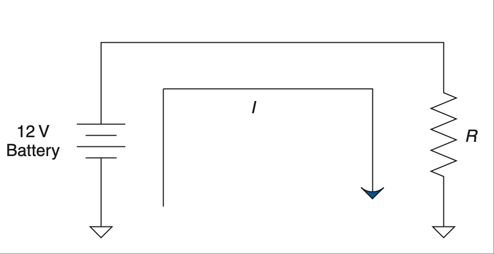

    **图 2.27 电池提供的直流电流和电压。**

.. toggle::

    Devices that cause electrons to move are called sources since they are the source of electron or charge flow. The two typical types of sources are voltage and current sources. Remember two important things when dealing with them.

    .. important::

        **Important Thing 1**
            When you’re dealing with a voltage source, the output will try to maintain the voltage across the load. That is, the voltage at the source will be constant. This means in terms of Ohm’s Law that V remains the same at the source. I and R can change, but in the end it must always equal V in terms of Ohm’s Law. ``V = IR``.

        **Important Thing 2**
            When you’re dealing with a current source, the output will try to maintain the current through the load. That is, the current from the source will be constant. These are less common, but they do exist and can be used in many situations. Current from the source will remain constant, allowing V to change as R varies, still following Ohm’s Law as obediently as any other circuit,  ``I = V/R``.

    The world of electronics is very voltage-centric, so you will see voltage sources much more often than current sources. This being the case, I will concentrate more on these types of sources.

    Sources can come in two different types: AC or DC. Let’s take a closer look.

    .. figure:: ./img/f2.27.png
        :scale: 50%
        :align: center

        **FIGURE 2.27 DC current and voltage from a battery.**

直流电
~~~~~~~~~~~~~~~~~
Direct Current

术语 *直流电* 用于描述只朝一个方向流动的电流。我认为直流电是最容易理解的，所以我们先从这里开始。

直流电只朝一个方向流动，从正极到负极。[21]_ 电池是一种常见的直流电设备。连接到如电阻这样的负载时，电流的表现如 :ref:`图 2.27 <Figure 2.27>` 所示。

电池 [22]_ 也是一种恒压设备，所以它会提供维持其输出电压所需的电流。因此，如果我们用 12 V 电压连接到 1 Ω 电阻——嘿，我们刚学过如何在这种电路中计算电流！（又在餐巾纸上写写画画……）那将是 12 安培电流。

直流电源总是试图让电流保持同一方向流动。需要注意的是，从电源流出的电流最终必须回到电源。原理图中的地线连接应被看作是一个标签，它将信号连接回源。如果信号无法回到源，那就不会有电流流动。[23]_

.. [21] 此处采用常规电流方向。

   [21] Conventional flow considered here.

.. [22] 你可以把电池想成是一种化学驱动版本的“电子泵”，详见前言中讨论。
    
   You can think of a battery as a chemically powered version of the “electron pump” discussed in the Introduction.

.. [23] 有人会对此提出异议。如果你想了解更多，可以在网上搜索“自由能源”，但要小心——很多都是胡说八道。不过阅读这些内容也不是坏事；有时候它们很有趣，还能引发一些思考。
    
   There are those that would argue this point. If you want to know more, do a search for free energy on the Internet, but beware—much of it is complete bunk. That doesn’t make it a bad read, though; it can be humorous and quite thought provoking.

.. toggle::

    The term *direct current* is used to describe current that flows in only one direction. I think this makes direct current the simplest to understand, so we should start there.

    Direct current moves only one way, from positive to negative. [21]_ A battery is a common direct-current device. Hooked up to a load such as a resistor, the current will go something like what’s shown in :ref:`Figure 2.27 <Figure 2.27>`.

    A battery [22]_ is also a constant-voltage device, so it will apply whatever current is needed to maintain its output voltage. So, we have 12 V hooked up to 1 Ω of resistance—hey, we just learned how to figure out current on a circuit like that! (More scribbling on a napkin ... .) That would be 12 amps of current.

    A DC source will always try to move current in the same direction. One thing to note is that the current coming out of the source always needs to get back to the source somehow. The ground connection on the schematic should be thought of as a label that connects the signal back to the source. If the signal does not get back to the source, then there is no current flow. [23]_

交流电
~~~~~~~~~~~~~~~~~~~~~
Alternating Current

AC 或交流电，是在发现磁与电之间的相互作用之后产生的。在交流电路中，电流会周期性地改变方向。这意味着电流会增加到峰值，然后降到零，再反方向增加到另一个峰值，然后再回到零，整个过程不断重复。电流以正弦形式交替变化方向，因此称之为 *交流电*。这种电流通常来自你所在地区水电站的大型交流发电机。

交流电之所以被采用，是因为它容易产生——见 :ref:`图 2.28 <Figure 2.28>`。当你将一圈导线线圈在磁体前移动时，随着磁场强度增加，电流上升；然后随着磁场减弱并极性反转，电流也相应减弱并反转。当线圈经过磁铁时，电压和电流自然以正弦形式变化。

.. _Figure 2.28:

.. figure:: ./img/f2.28.png
    :scale: 50%
    :align: center

    **图 2.28 简单的交流发电机。**

只要你持续移动线圈，就会持续生成交流电。你会在原理图上看到交流源的表示，是类似于 :ref:`图 2.29 <Figure 2.29>` 中那样的正弦波线条。

一个有趣的附带故事是，当美国准备铺设全国电力网络时，曾爆发了一场争论。爱迪生（是的，就是那个灯泡的家伙）希望在每家每户安装小型直流发电机。而另一个不太知名的天才特斯拉，则主张通过电线从集中地点分发交流电。交流电很有优势，因为电压可以很容易地变换（是的，靠变压器）。这使得我们可以把电压升得很高，从而在长距离传输中减少线缆电阻造成的损耗。当时对此方案有很多争论。

.. _Figure 2.29:

.. figure:: ./img/f2.29.png
    :scale: 50%
    :align: center

    **图 2.29 交流电压和电流源。**

决定性因素之一是特斯拉发明了交流电动机。在那之前只有直流电动机，因为那时候还没有二极管，所以将交流转换为直流并不容易。而能驱动电动机是件大事。虽然特斯拉 [24]_ 没有爱迪生那么出名，但他在交流配电和交流电机方面留下了巨大的遗产。看看你家里就知道了，有多少交流电机正在工作。（当然，还有一些灯泡在发光。）

.. [24] 尼古拉·特斯拉（Nikola Tesla，1856–1943）实际上转让了交流电力分配的专利，而这些专利在多年后价值数万亿美元。如果他没有这样做，我们今天的电力系统可能会与现在大不相同。想要了解这位天才颇为悲伤的故事，我建议阅读玛格丽特·切尼（Margaret Cheney）所著的《特斯拉：超越时代的人》（Tesla: Man Out of Time）。

    Nikola Tesla (1856–1943) actually signed over patents for AC power distribution that years later were worth trillions of dollars. If he hadn’t done so, our power systems might have been very different than they are today. To learn more about the somewhat sad story of this genius, I suggest reading Tesla: Man Out of Time, by Margaret Cheney.

.. toggle::

    AC or alternating current came about as the interaction of magnets and electricity were discovered. In an AC circuit, the current repetitively changes direction every so often. That means current increases in flow to a peak, then decreases to zero current flow, then increases in flow in the opposite direction to a peak, then back to zero, and the whole process repeats. The current alternates the direction of flow in a sinusoidal fashion, so of course it is called *alternating current*. This type of current most commonly comes from big AC generators at your local hydroelectric dam.

    AC power came into being due to this ease of generation—see :ref:`Figure 2.28 <Figure 2.28>`. When you move a coil of wire past a magnet, the current first climbs as the strength of the field increases, then as the field decreases and switches polarity, the current also decreases and switches polarity. The voltage and current change in a sinusoidal fashion naturally as the coil passes by the magnets.

    .. figure:: ./img/f2.28.png
        :scale: 50%
        :align: center

        **FIGURE 2.28 Simple AC generator.**

    As long as you keep moving the coil, AC power will continue to be generated. You will see an AC source on a schematic represented by a sine wave squiggle like the one shown in :ref:`Figure 2.29 <Figure 2.29>`.

    An interesting side note is that there was some argument when plans were being drawn up to distribute electricity across the United States. Edison (yeah, the famous light bulb guy) wanted to put small DC generators in everybody’s home. Another lesser-known genius by the name of Tesla was pitching for AC distribution by wires from a central location. AC made some sense because the voltage could be easily transformed (yeah, you guessed it, with a transformer) from one level to another. That made it possible to jack up the voltage so high that the resistance of the distribution wires had little loss over long distances. There was much debate over the best setup.

    .. figure:: ./img/f2.29.png
        :scale: 50%
        :align: center

        **FIGURE 2.29 AC voltage and current source.**

    One thing that tipped the scales in the direction we have today was the invention of the AC motor by Tesla. Until then only DC motors had been developed, and since this was before the diode, it wasn’t so easy to make AC into DC. So being able to run a motor was a big deal. Although not as famous as Edison, Tesla [24]_ left a huge legacy in terms of AC power distributions and AC motors. Just look around your house and count up the AC motors in use. (Of course, there are a few light bulbs around, too.)

回到电容器和电感器
~~~~~~~~~~~~~~~~~~~~~~~~~~~~~~~~~~~~~~~~~~~~~~~~
Back to Capacitors and Inductors Again

电容器的经验法则是什么？电容器会阻碍电压的变化。你还记得电感器的规则吗？电感器会阻碍电流的变化。这些规则的反面是：电容器会允许电流随意变化，而电感器会允许电压随意变化。在涉及交流电源（AC）时有一个无法忽视的事实，那就是电流和电压总是在变化。它们变化的快慢取决于一个叫做频率的术语。频率是每秒钟变化周期的数量，其单位为赫兹。频率越高，电压和电流的变化就越快。现在尝试推测一下电容器在交流电路中可能会发生什么。由此可以推断，电容器会阻止零频率的电流（比如直流电池），而会通过变化的电流。对于电感器而言，情况则正好相反。

我喜欢这样思考：电容器在直流或零频率下是一个无限大的电阻。随着频率的增加，电容器的“电阻”（技术上称为电抗）越来越低，趋近于零。这种电容电抗被称为 XC，其定义如下所示的 :eq:`equation 2.15`。单位仍为欧姆，就像电阻器一样。

.. math::
   :label: equation 2.15

   X_c = \frac{1}{2\pi * f * c}

而电感器则正好相反。它在零频率时电阻为 0 Ω，随后随着频率升高其电阻也升高，趋向无穷大。电感电抗称为 XL，并遵循下列公式：

.. math::
   :label: equation 2.16

   X_L = 2\pi * f * L

现在我们将它们连接到一个交流电源上，并改变频率，以观察电流流动的变化情况。这在电子表格中很容易实现。只需将电抗公式代入欧姆定律即可。原理图如 :ref:`Figure 2.30 <Figure 2.30>` 所示。

:ref:`Figure 2.31 <Figure 2.31>` 显示了当频率从零（直流）变为很高（交流）时，连接到电压源时电流的变化情况。

.. _Figure 2.30:

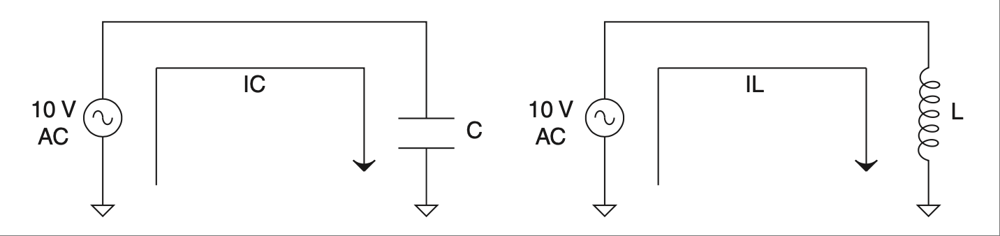

    **图 2.30 连接至电容器和电感器的交流电源。**

.. _Figure 2.31:

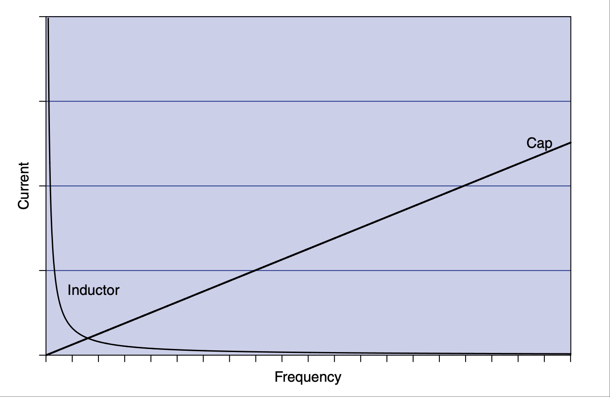

    **图 2.31 电容器与电感器中电流随频率变化的图表。**

所以重申一下，频率越高，电流越容易通过电容器，而通过电感器则越困难。

你可能会想：“我们之前在 RC 电路中输入的阶跃信号又如何？它算交流吗？”实际上，尽管听起来有些奇怪，它确实是交流信号。一位名叫傅里叶的聪明人早在很久以前就发现，在快速变化的信号中隐藏着各种高频。他证明，信号变化越突然，其中所含的高频就越多。这个主题的深入研究超出了本书的范围，但你只需要知道，前面讨论的阶跃输入有一个非常陡峭的方角，在这个角落里隐藏着大量的高频。这些高频无法通过电容器，因此这个角落会被“削掉”，这就形成了我们在 RC 电路瞬态响应中看到的特征曲线。

在继续之前，我们应当触及一下 *相位移* 的主题。当电压和电流同步时，我们称它们是同相的。如我们多次讨论的，电感器阻碍电流变化，但电压不受影响，因此如果你将电压和电流的关系绘图，会看到电流的变化略滞后于电压的变化。这就是所谓的“滞后”。而电容器的效果正好相反（一如既往），所以电压相对于电流是延迟的。在这种情况下，电流的变化“领先” [25]_ 于电压的变化。并不是电流神奇地提前发生了，而是电压滞后了；从电压的角度看，电流好像先变化了。

电容器和电感器是会阻碍 [26]_ 信号的元件，其阻碍程度取决于信号的频率。电容器延迟电压变化，电感器延迟电流变化。它们在对信号频率的响应方式上是相反的。电容器阻挡低频而允许高频通过，而电感器则是通过低频而阻挡高频。现在让我们看看将它们与电阻器连接会发生什么。

.. [25] 我可能只是学得慢，但我花了很长时间才真正理解“领先”与“滞后”的术语含义。电容器里并没有一个神奇的时间机器让电流变化早于电压；它只是延迟了电压的变化。当然，如果里面真的有时间机器，那我们就得称它为“通量电容器”了！

   I may just be a slow learner, but it took me a while to understand this leading vs. lagging terminology and what it really means. There isn’t a magical time machine in a cap that makes the current change before the voltage; it is merely delaying the current change. Of course, if there were a time machine in there, we’d have to call it a “flux” capacitor!

.. [26] 类似于电阻，但并不完全相同；请记住这只是一个类比，非常接近但仍是类比。这种行为是我们之前讨论的相位延迟造成的。想想 :ref:`第 1 章 <c1>` ：质量没有摩擦力，但在你试图移动它时却感觉像是有摩擦。如果你以正确的速率来回移动它，它的感觉就会像是摩擦力。在处理电容和电感时，电压和电流的相位变化会产生相似的电阻效应。

   Like resistance, but not exactly; keep in mind that it is an analogy, a very close one, but an analogy nonetheless. This behavior is the result of the phase delay we discussed earlier. Think way back to Chapter 1: The mass doesn’t have friction, but it feels the same as friction when you start to move it. If you were to move it back and forth at the right rate, you could get it to feel exactly like friction. The shifting phases in voltage and current create the same resistance effect when dealing with caps and inductors.

.. toggle::

    What was the rule of thumb for a capacitor? Capacitors impede a change in voltage. Do you remember the rule for inductors? Inductors impede a change in current. The flip side of these rules is that the cap will let current change all it wants and the inductor will let voltage change all it wants. One fact you can’t ignore when it comes to AC sources is that current and voltage are always changing. How fast they change is a function of a term known as frequency. Frequency is the number of cycles of change per second; it has a unit called hertz. The higher the frequency, the faster the change in voltage and current. Now extrapolate for a moment what might happen to a capacitor in an AC circuit. It follows that a cap will block currents that have zero frequency (like a DC battery) and pass currents that change. The opposite applies to an inductor.

    I like to think of it this way: The cap is an infinite resistor at DC or zero frequency. As frequency increases, the “resistance” (technically known as reactance) of the cap gets lower and lower, approaching zero. This capacitive reactance is known as XC and is described by :eq:`equation 2.15`. The unit is ohms, just as for a resistor.

    .. math::

        X_c = \frac{1}{2\pi * f * c}

    The inductor is just the opposite. It starts with 0 Ω of resistance at a zero frequency and then increases to infinity along with the frequency. Inductive reactance is called XL and follows this equation:

    .. math::

        X_L = 2\pi * f * L

    Let’s hook them up to an AC source and vary the frequency to see how current flow is affected. This is easy enough to do in a spreadsheet. Simply plug the reactance equation into Ohm’s Law. The schematic is shown in :ref:`Figure 2.30 <Figure 2.30>`.

    :ref:`Figure 2.31 <Figure 2.31>` shows what happens to current as frequency varies from zero (DC) to really fast (AC) when hooked up to a voltage source.

    .. figure:: ./img/f2.30.png
        :scale: 50%
        :align: center

        **FIGURE 2.30 AC source hooked up to cap and inductor.**

    .. figure:: ./img/f2.31.png
        :scale: 50%
        :align: center

        **FIGURE 2.31 Graph of current over frequency for a cap and an inductor.**

    So to repeat, the higher the frequency, the easier the current will pass through a capacitor and the harder it becomes for it to get through an inductor.

    You might be thinking, “What about that step input we put into the RC circuit before? How is it AC?” Actually, as weird as it might sound, it is AC. A really smart guy by the name of Fourier figured out some time ago that hidden in fast-changing signals are all sorts of high frequencies. He proved that the more abrupt the change in the signal, the more high frequencies that are present. An in-depth study of this topic is somewhat beyond the scope of this book, so let it suffice to say that the step input in the previous discussion has a sharp square corner, hidden in which are a whole bunch of high frequencies. These can’t get through the cap, so the corner is knocked off, so to speak, leaving the characteristic curve that we saw as the transient response of the RC circuit.

    Before we move on, we should touch on the topic of *phase shifts*. When both voltage and current are in sync, they are in phase. As we have discussed numerous times, inductors impede a change in current, but voltage is not affected, so if you graph the relationship between voltage and current, you will see that the change in current is a little out of sync with the change in voltage. It is said to be lagging behind. The capacitor has the opposite effect (as always), so the voltage is delayed relative to the current. In this case the change in current leads [25]_ the change in voltage. The current isn’t magically jumping ahead of the voltage; the voltage is getting behind, but from the voltage point of view it looks like the current is changing first.

    Capacitors and inductors are components that impede [26]_ a signal, the amount of which depends on the frequency of the signal. The cap delays voltage changes, and the inductor delays current changes. They are opposite in the way they react to the frequency of a signal. Capacitors block lower frequencies while letting higher ones through, whereas inductors pass lower frequencies while blocking higher ones. Let’s see what happens when we hook them up to a resistor.

低通滤波器
~~~~~~~~~~~~~~~~~~~~
Low-Pass Filters

请看 :ref:`Figure 2.32 <Figure 2.32>` 所示电路。注意它与我们用来理解电容器作用的 RC 电路之间的相似之处。不同的是，现在我们将对输入施加一个交流信号，而不是之前的阶跃输入。

.. _Figure 2.32:

.. figure:: ./img/f2.32.png
    :scale: 50%
    :align: center

    **图 2.32 基于电容器的低通滤波器。**

这个电路被称为 *低通滤波器*，而你要理解它只需要了解电压分压器规则和电容器对频率的反应。如果这是一个简单的电压分压器，你可以根据电阻的比值来确定输出端的电压有多少。记住，电容器就像一个取决于频率的电阻器，然后推断当频率从零扫到无穷大时会发生什么。

在低频时，电容器不会通过太多电流，因此信号几乎不受影响。随着频率升高，电容器会通过越来越多的电流，将电阻器的输出短接到地，从而将输出电压分得越来越小。有一个“魔法点”会使得输出为输入的一半。 [27]_ 那就是频率等于 ``1/(2π RC)`` 的时候。你可能注意到这与我们之前讨论电容时用到的时间常数是一样的。当一切连贯起来时，感觉是不是挺酷的？

.. [27] 这也被称为 -3 分贝点。我暂时避开分贝的概念，是为了减少你需要吸收的知识量。

    This is also known as the –3 db down point. I am avoiding decibels for now to limit the amount of knowledge that you need to assimilate.

它之所以叫做 *低通滤波器*，是因为它允许低频通过，而降低或衰减高频。你也可以用电感器和电阻器做一个低通滤波器。考虑到电感器的行为与电容器相反，你能想象那会是什么样子吗？请看 :ref:`Figure 2.33 <Figure 2.33>`。

没错；你需要交换元件的位置。这是因为电感器（作为电容器的反面）允许低频通过，而阻挡高频。它实现了与低通 RC 电路相同的功能，只是方式略有不同。你依然是一个电压分压器电路，只不过现在输入端的“电阻”在变化。低频时，电感器是短路，接地电阻几乎不起作用。随着频率升高，电感器开始“阻塞” [28]_ 电流，其反应使得电压分压器的输入端看起来像一个越来越大的电阻。这使得接地电阻在电压分压器比值中的作用变得越来越大。

总结一下，在低通滤波器电路中，随着频率从低到高的扫描，电容器从开路变为短路，而电感器从短路变为开路。通过将这些元件放置在电压分压器电路中的相对位置，你可以实现相同的滤波效果。两种类型的滤波器中，电压分压器的比值都会随着频率升高而降低输出电压。这一切都让低频通过，而阻挡高频。现在，你猜如果我们在这些电路中交换元件的位置会发生什么？

.. _Figure 2.33:

.. figure:: ./img/f2.33.png
    :scale: 50%
    :align: center

    **图 2.32 基于电感器的低通滤波器。**

.. [28] 虽然没有任何证据支持，但我断言电感器有时候被称为“扼流圈”，是因为它能“扼杀”高频信号。

   Without any proof whatsoever, I assert that inductors are sometimes called chokes because they choke off high frequencies.

.. toggle::

    Consider the circuit shown in :ref:`Figure 2.32 <Figure 2.32>`. Note similarities to the RC circuit that we used to first understand the effects of a capacitor. The difference is that now we are going to apply an AC signal to the input rather than the step input we applied before.

    .. figure:: ./img/f2.32.png
        :scale: 50%
        :align: center

        **FIGURE 2.32 Cap-based low-pass filter.**

    This circuit is known as a *low-pass filter*, and all you really need to know to understand it is the voltage-divider rule and how a capacitor reacts to frequency. If this were a simple voltage divider, you could figure out, based on the ratio of the resistors, how much voltage would appear at the output. Remember that the cap is like a resistor that depends on frequency and try to extrapolate what will happen as frequency sweeps from zero to infinity.

    At low frequencies the cap doesn’t pass much current, so the signal isn’t affected much. As frequency increases, the cap will pass more and more current, shorting the output of the resistor to ground and dividing the output voltage to smaller and smaller levels. There is a magic point at which the output is half the input. [27]_ It is when the frequency equals ``1/(2π RC)``. You might have noticed that this is the same time constant that we used earlier when we first looked at caps. Kind of cool when it all comes together, isn’t it?

    This is known as a *low-pass filter* because it passes low frequencies while reducing or attenuating high frequencies. You can make a low-pass filter with an inductor and resistor, too. Given that the inductor behaves in a way that is opposite of a capacitor, can you imagine what that might look like? Have a look at :ref:`Figure 2.33 <Figure 2.33>`.

    That’s right; you swap the position of the components. That’s because the inductor (being the opposite of a cap) passes the lower frequencies and blocks the higher frequencies. It performs the same function as the low-pass RC circuit but in a slightly different manner. You still have a voltage-divider circuit, but instead of the resistor-to-ground changing, the input resistor is changing. At low frequencies the inductor is a short, making the ground resistor of little effect. As frequencies increase, the inductor chokes [28]_ off the current, reacting in a way that makes the input element of the voltage divider seem like an increasingly large resistance. This in turn makes the resistor to ground have a much bigger say in the ratio of the voltage-divider circuit.

    To summarize, in the low-pass filter circuits, as the frequencies sweep from low to high, the cap starts out as an open and moves to a short while the inductor starts out as a short and becomes an open. By positioning these components in opposite locations in the voltage-divider circuit, you create the same filtering effect. The ratio of the voltage divider in both types of filters decreases the output voltage as frequencies increase. All this lets the low frequencies pass and blocks the high frequencies. Now, what do you suspect might happen if we swap the position of the components in these circuits?

    .. figure:: ./img/f2.33.png
        :scale: 50%
        :align: center

        **FIGURE 2.32 Inductor-based low-pass filter.**

高通滤波器
~~~~~~~~~~~~~~~~~~~~~
High-Pass Filters

在低通电路中交换电容器和电阻器的位置会生成另一种电路，称为高通滤波器。凭借你现在卓越的推理与直觉能力，你可能会想到：“我敢打赌这个电路允许高频通过而阻挡低频。”你猜对了，该电路如 :ref:`Figure 2.34 <Figure 2.34>` 所示。

希望在我们讨论完低通电路之后，这个电路的工作原理已经很清楚了。电容器在低频时表现为较大的电阻，使电压分压器降低输出电压。在高频时，电容器变成短路，允许更多电流通过，从而在输出端产生更高的电压。这个电路的电感器版本如 :ref:`Figure 2.35 <Figure 2.35>` 所示。

.. _Figure 2.34:

.. figure:: ./img/f2.34.png
    :scale: 50%
    :align: center

    **图 2.34 基于电容器的高通滤波器。**

.. _Figure 2.35:

.. figure:: ./img/f2.35.png
    :scale: 50%
    :align: center

    **图 2.35 基于电感器的高通滤波器。**

正如你所料，从电路结构上看，这种滤波器正好是 RC 高通滤波器的反转版本。另一个小小的巧合是，这种滤波器的半电压输出点 [29]_ 也出现在 ``1/2π * τ`` 处（*tau* 表示时间常数，无论是 RC 还是 RL 电路），就像低通滤波器一样。

总结一下，高通和低通滤波器利用了电容器或电感器的频率响应特性。这是通过将它们与电阻器组合，创建一个电压分压器电路，来衰减不需要的频率同时让需要的频率通过。当我们将这两个有反应特性的元件结合在一起时，一些很酷的事情会发生。你可以创建陷波器和带通滤波器，在这些电路中，特定频段的频率被滤除，或仅允许一个频带通过而阻挡其他所有频率。共振现象也会出现在所谓的谐振电路中，在这种电路中电容器与电感器组合在一起。就像第 1 章中的弹簧-质量例子那样，谐振电路中的电流与电压会在两个元件之间来回振荡。

.. [29] 这个点也被称为滚降点或 3 dB 降点。

   This point is also known as the rolloff or 3 db down point.

.. toggle::

    Swapping the cap and the resistor in the low-pass circuit creates another type of circuit called a high-pass filter. Using your now supreme powers of deduction and intuition, you are thinking to yourself, “I’ll bet that means the circuit passes high frequencies while blocking low ones.” You are correct, and the circuit looks like the one in :ref:`Figure 2.34 <Figure 2.34>`.

    Hopefully, after our discussion of the low-pass circuit, the operation of this one is clear. The cap acts like a larger resistor at low frequencies, making the voltage divider knock down the output. At higher frequencies the cap passes more cur- rent as it becomes a short, causing a higher voltage at the output. The inductor version of this circuit looks like :ref:`Figure 2.35 <Figure 2.35>`.

    .. figure:: ./img/f2.34.png
        :scale: 50%
        :align: center

        **FIGURE 2.34 Cap-based high-pass filter.**

    .. figure:: ./img/f2.35.png
        :scale: 50%
        :align: center

        **FIGURE 2.35 Inductor-based high-pass filter.**

    As you might have suspected, this filter is the inverse, circuit-wise, of the RC high-pass filter. Another little bit of serendipity is the fact that the half-voltage output point [29]_ is also at ``1/2π * τ`` (*tau* means time constant generically, whether referring to an RC or an RL circuit), just like the low-pass filters.

    To sum up, the high-pass and low-pass filters take advantage of the frequency response of either a capacitor or an inductor. This is done by combining them with a resistor to create a voltage divider that attenuates the unwanted frequen- cies while allowing the desired ones to pass. Some cool things happen when we put the two reactive elements together. You can create notch- and band-pass fil- ters where a specific band of frequencies is knocked out, or a specific band is passed while all others are blocked. The phenomenon of resonance also occurs in what is called a tank circuit, where you have a capacitor combined with an inductor. Just like the spring-mass example in Chapter 1 current and voltage in the tank circuit will oscillate current back and forth from one component to the other.

有源滤波器
~~~~~~~~~~~~~~~~
Active Filters

到目前为止，我们一直在研究无源滤波器。无源元件是指不需外部供电的元件。由于其无源性，这些元件受到一个称为负载效应的影响。也就是说，任何连接到输出的东西都可能影响滤波器的性能。例如，考虑一个低通 RC 滤波器，并连接一个电阻作为负载，如 :ref:`Figure 2.36 <Figure 2.36>` 所示。

.. _Figure 2.36:

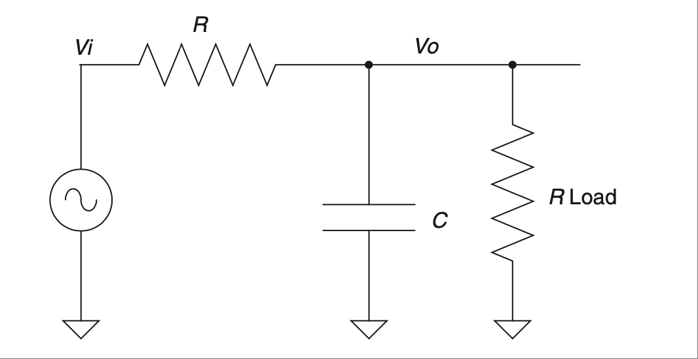

    **图 2.36 带负载的滤波器。**

这个连接在输出端的电阻就是负载。它可能是电路的其他部分，也可能是其他东西，但重点在于它表现为一个接地电阻。这会如何影响 RC 滤波器的性能？为了理解这一点，我们用戴维南等效电路来“观察”负载对输出的影响。首先，我们将电压源短接至地。对于交流电源与直流相同处理，因此电路将如 :ref:`Figure 2.37 <Figure 2.37>` 所示。

.. _Figure 2.37:

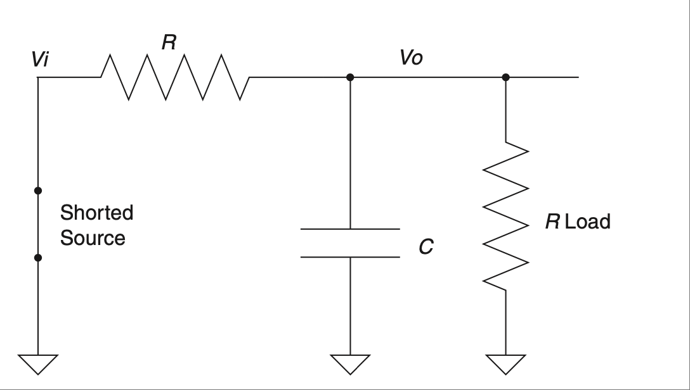

    **图 2.37 戴维南等效电路展示负载效应。**

因为我喜欢使用真实数值的例子 [30]_，我们假设 ``R=10K``，``Rload=10K``，``C=0.1μf``。

当你对电路进行戴维南等效化时，会尽可能将所有部分简化为一个元件。在这个例子中，两个电阻并联，因此我们应用并联公式，得到一个 ``5 KΩ`` 的等效值。你有没有注意到，由于负载的存在，R 值发生了显著变化？乍看之下可能违反直觉的一个事实是，该电路的时间常数实际上是由我们刚才推导出的戴维南电路决定的。所以在没有负载的情况下，τ 应该是 10K*0.1μs，即 1ms。

而有了负载后，它变为 0.5ms，是原来的一半！由于该滤波器的输出依赖于 τ，我们可以看到负载对其产生了显著影响。解决这个问题的一种方法是向设计中加入有源元件，从而构成一个“有源”滤波器。添加这种元件的基本思想是最小化负载效应，以获得良好且可预测的响应。有源滤波器的输出具有这样的特点：无论你在其输出端连接什么负载，它都不会影响滤波器的响应——参见 :ref:`Figure 2.38 <Figure 2.38>`。

这种有源器件（称为运算放大器）的输入端具有非常高的阻抗。在这个例子中，它相当于一个 10 兆欧电阻。将其连接到 RC 滤波器时，只要它显著大于电路中的 R 值 [31]_，就不会对电路的时间常数产生太大影响。该电路中的缓冲器会输出一个与输入电压一致的电压。它会对信号进行 *缓冲*；无论你在输出端连接什么，有源滤波器都不会受到影响。这是最简单的有源滤波器之一，但所有有源滤波器的原理都相同——引入有源元件以保持或增强滤波器的完整性。

.. _Figure 2.38:

.. figure:: ./img/f2.38.png
    :scale: 50%
    :align: center

    **图 2.38 有源缓冲器消除了负载效应。**

.. admonition:: 经验法则

   - 电子从负极流向正极。
   - 直流电只朝一个方向流动；它具有零频率分量。
   - 交流电会重复改变流动方向。
   - 直流电的频率分量为零。
   - 电感器和电容器结合电阻器可构成低通或高通滤波器。
   - 在同一电路中，电感器和电容器会发生振荡。
   - 有源滤波器通过添加元件来保持或增强滤波器的完整性。

.. [30] 为了理解某样东西如何工作，我建议代入真实数值。即使你的最终目标是得到代数方程，通过一些真实数值运行，会帮助你真正理解其工作原理。

   To understand how something works, I suggest plugging in real numbers. Even when your final goal is an algebraic equation, running some real numbers through will help you get a genuine understanding of how the thing is really working.

.. [31] 这里是运用我们在第 1 章中讨论过的估算技巧的好地方。特别是比率，如果电路负载比滤波器中的电阻大 100 倍（或 100:1 的比率），你就可以知道这个器件对所连接电路的影响是非常小的。
   
   Here is a good place to use those estimation skills that we discussed back in Chapter 1. Particularly ratios, if the load on the circuit is 100 times larger (or a 100:1 ratio) than the resistance used in the filter, you can see that the effect of this device won’t do much to the circuit it is hooked up to.

.. toggle::

    So far we have been studying passive filters. A passive component is one that is not powered externally. Being passive, these components are subject to an effect known as loading. This means that anything you hook up to the output can affect the performance of the filter. Take a low-pass RC filter, for example, and hook a resistor up to it, as shown in :ref:`Figure 2.36 <Figure 2.36>`.

    .. figure:: ./img/f2.36.png
        :scale: 50%
        :align: center

        **FIGURE 2.36 Filter with load.**

    This resistor on the output is a load. It could be another part of the circuit or any number of things, but the point is that it acts like a resistor to ground. How does this affect the RC filter performance? To understand, let’s Thevenize it to “see” how the load affects the output. We start by shorting the voltage source to ground. This is done with AC sources the same as DC, so the circuit would look like :ref:`Figure 2.37 <Figure 2.37>`.

    .. figure:: ./img/f2.37.png
        :scale: 50%
        :align: center

        **FIGURE 2.37 Thevenized circuit shows effect of load.**

    Because I like my examples to use real numbers, [30]_ let’s make up some values. Let ``R=10K`` and let ``Rload=10K`` and ``C=0.1μf``.

    When you Thevenize a circuit, you reduce all the parts into one, where possible. In this case the resistors are in parallel, so apply the parallel rule to the resistors and you get a value of ``5 KΩ``. Did you notice that the R value has changed con- siderably due to the load on the circuit? What might seem counterintuitive at first is the fact that the time constant of this circuit is a function of the Theve- nized version that we just derived. So, without the load, tau would have been 10K*0.1μs, or 1ms.

    With the load, it is 0.5 ms, half of what it was before! Since the output of this filter depends on τ, we can see that the load has affected it significantly. A way to avoid this problem is to add an active component to the design, making it into an “active” filter. In adding such a component, the basic idea is to mini- mize this loading effect to a point that you get a nice, predictable response. The output of the active filter is such that no matter what load you put on it, it does not affect the response of the filter—see :ref:`Figure 2.38 <Figure 2.38>`.

    The input of this active device (known as an op-amp) has a very high impedance. In this case it is comparable to a 10-meg resistor. Hooking that up to the RC filter will have little effect on the time constant of this circuit as long is it is significantly larger [31]_ than the R value in the circuit. The buffer in this circuit will output a voltage that matches the voltage on the input. It will *buffer* the signal; no matter what you hook up to the output, the filter will not be affected. This is one of the simplest active filters, but the principle with all of them is the same—include an active element to preserve or enhance the integrity of the filter.

    .. figure:: ./img/f2.38.png
        :scale: 50%
        :align: center

        **FIGURE 2.38 Active buffer eliminates the effect of the load.**

    .. admonition:: Thumb Rules

    - Electrons move from negative to positive.
    - Direct current flows in one direction; it has a zero frequency component.
    - Alternating current changes direction of flow repetitively.
    - Direct current has a frequency component of zero.
    - Inductors and capacitors can make both low-pass and high-pass filters when combined with a resistor.
    - Inductors and caps in the same circuit will oscillate.
    - Active filters add components to preserve or enhance the integrity of the filter.

"带我出去?"
-------------
BEAM ME UP?

电子无处不在，或者说，电子的效应无处不在。我们周围充满了由这些顽皮小东西引起的无形力场。这些力场值得我们加以讨论，因为它们在我们处理电的方式中扮演着重要角色。它们可以储存能量，并以各种方式影响周围的世界，因此了解这些力场及其相互作用非常重要。我们在本书第 0 章中也曾提到过这些力场。如果你在开始阅读时跳过了这一章，现在感到有些迷惑，我建议你回去读一下。

现在，我们无法像《星际迷航》那样将人 [32]_ 传送进出地球，但确实有几种无形的力场制造出了我们在电路中看到的所有效应。正是这些力场，使得水流、乒乓球等许多类比方式无法完全贴合电路中的真实情况。所以，理解这些力场，绝对有助于我们培养正在努力建立的直觉能力。

.. [32] 注意我说的是“人”；物理学家已经把一个量子比特“传送”到了另一个点。有些人说，几乎很快就能传送原子了。最新的消息是，光子已经被传送了超过 600 米——是不是很酷？！！

    Note I said people; physicists have “beamed” a quantum bit from one point to another. Some say teleporting an atom could happen in just a few years. Update to this, photons have been teleported over 600 meters, is it just me or is that just dang cool?!!

.. toggle::

    Electrons are everywhere, or maybe it is better said that the effects of electrons are everywhere. There are invisible fields of force all around us that are caused by those pesky little devils. These fields warrant discussion because they are a factor in the way we deal with electricity. They can store energy and affect the world around them in various ways, so it is good to build an intimate knowl- edge of these fields and how they interact. These are the same fields that we talked about in Chapter 0 of this edition. If you elected to skip it when you started reading and you feel a little lost here, I suggest going back to read it.

    Now, we can’t beam people [32]_ on and off the planet like they do on Star Trek, but there are couple of invisible fields that are what actually create all the effects that we see in electric circuits. It is these fields that make the water, ping-pong ball, and many other analogies not quite match what is really going on in a cir- cuit. So understanding these fields will definitely help develop the intuitive skills we are working on.

磁场
~~~~~~~~~~~~~~~~~~~~~~~
The Magnetic Field

这是我们将要讨论的两个力场中最为人熟知的一个。谁没有体验过用磁铁把便条贴在冰箱上的力量，或是感受两个磁铁互相排斥的作用？早在 1820 年代，一个叫汉斯·奥斯特的男人注意到，每次他打开导线中的电流时，他的指南针读数就变得异常。最终人们发现，运动的电子（比如导线中的电流）会在电子运动方向的垂直方向上产生一个磁场，如 :ref:`Figure 2.39 <Figure 2.39>` 所示。

.. _Figure 2.39:

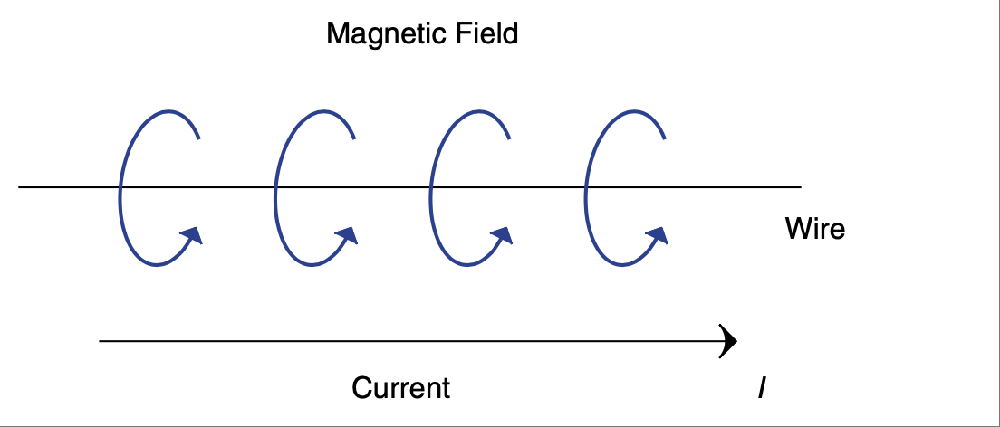

    **图 2.39 导线中电流产生的磁场。**

这个磁场与永久磁铁周围的磁场相同。实际上，如果你将导线缠绕成线圈，如 :ref:`Figure 2.40 <Figure 2.40>` 所示，磁场线就会对齐并相互增强，使其更像一个永久磁铁。 [33]_

.. [33] 如第 0 章中提到的，在一个永久磁铁中，有大量电子朝同一方向旋转。这有点类似于电流在导线中流动，通过线圈增强磁场的方式。

    As mentioned earlier in Chapter 0, in a permanent magnet you have a whole bunch of electrons spinning around in the same direction. This is kind of like the way the flow in the wires reinforces the field using a coil of wire.

.. _Figure 2.40:

.. figure:: ./img/f2.40.png
    :scale: 50%
    :align: center

    **图 2.40 线圈改变磁场方向并增强磁场。**

所谓电磁铁，就是这种可以开关控制的磁铁，它非常酷，因为它不像永久磁铁那样是持续性的。另一个重要的事实是，不仅导线中的电流会产生磁场，反过来也是成立的。变化的磁场可以在导线中产生或感应电流。正因为如此，线圈被称为电感器。电感器中的能量是以磁场形式储存的。它就像一根橡皮筋，当你对其施加电流时，它会被拉伸。当电流关闭时，它会回弹，随着磁场的消失释放出能量（也就是说磁场在变化）。这种坍塌会在导线中感应出电流。考虑如 :ref:`Figure 2.41 <Figure 2.41>` 所示的电路。

.. _Figure 2.41:

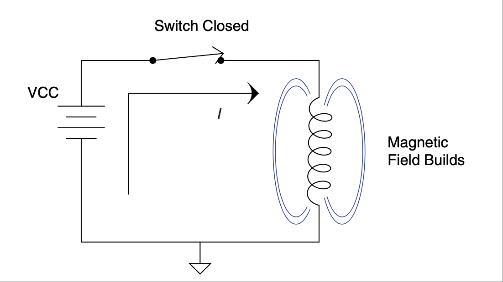

    **图 2.41 建立磁场时会抵抗电流变化。**

当开关闭合时，电流流动，磁场被建立。正是磁场的建立（也可以说是拉伸橡皮筋）导致电感器“抵抗”电流变化，正如我们之前所学。而反过来也是成立的。如果我们打开开关，磁场坍塌时的变化将试图维持电感器中的电流流动——见 :ref:`Figure 2.42 <Figure 2.42>`。

如果这个电流没有出路，电感器两端的电压将瞬间升高，随后随着感应电流随磁场消失而减弱而逐渐衰减。看看 :ref:`Figure 2.43 <Figure 2.43>` 所示的图表，它展示了在开关闭合与断开过程中，该电感电路中电流和电压的变化。

.. [34] 这就是为什么有源元件（电容和电感）并不完全像频率相关的电阻器。建立这些力场需要能量，而这些力场的消散会释放储存的能量。在电阻器中，这些能量被转化为热量；但在电容器或电感器中（假设是理想元件）则不是。正是能量的储存与释放，使它们在“阻碍”电路中的电流或电压变化时看起来像电阻。

    Here is where the reactive components (caps and inductors) aren’t exactly like a frequency-dependent resistor. The creation of these fields takes energy, and the dissipation of these fields releases this stored energy. In a resistor this energy is converted to heat; not so in a cap or inductor (albeit a perfect one). In these components the storing and releasing of energy is what causes them to seem like a resistor as they “impede” current or voltage changes in a circuit.

.. _Figure 2.42:

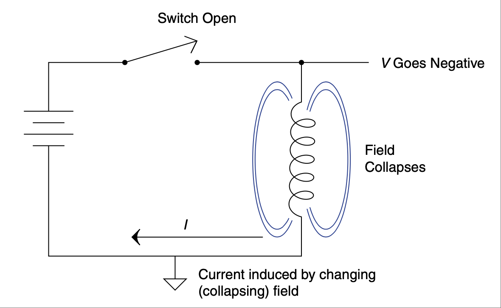

    **图 2.42 磁场坍塌会产生电流。**

.. _Figure 2.43:

.. figure:: ./img/f2.43.png
    :scale: 50%
    :align: center

    **图 2.43 电感器切入或切出电路时电压和电流的变化。**

感应原理也是变压器工作的基本原理。如 :ref:`Figure 2.44 <Figure 2.44>` 所示，变压器一侧的磁场建立，会在变压器的另一侧感应出电流。当该磁场减弱并反向变化时，输出端也会感应出相应的电流。

变压器两侧线圈匝数的比例决定了输入与输出电压的比例。例如一个 10:1 的比率会将一侧的 120V 变为另一侧的 12V。还要注意，虽然电压降低了，但电流增加了，使变压器在机械世界中有点类似于齿轮或杠杆。进入变压器的功率等于其输出功率（当然要减去损耗）。输入端的电压乘以电流 = 输出端的电压乘以电流。这就类似于杠杆中一侧的力乘以距离等于另一侧的力乘以距离这一规则。

.. _Figure 2.44:

.. figure:: ./img/f2.44.png
    :scale: 50%
    :align: center

    **图 2.44 变压器利用输入端变化的电流在输出端感应电流。**

变压器的基本元件是电感器。正如我们之前所学，电感器就是一个线圈。线圈匝数的多少控制了磁场的强度。电感器的铁芯也能增强磁场集中。铁芯中的材料可能会饱和 [35]_，也就是说它不能再进一步增强磁场的集中。

需要记住的重要事实是：电流会产生磁场，而变化的磁场会产生电流。这个变化的磁场可以由运动中的磁铁提供，或由变压器输入侧提供，也可以是由电流刚刚产生的磁场坍塌所引起。电流与磁场密切相关。

.. [35] 饱和的主题超出了本书的范围，但确实存在这种现象。你可以将其类比为海绵：正如海绵只能吸收一定量的水，电感器的铁芯也只能聚焦有限的磁场。

    The topic of saturation is beyond the scope of this text, but it does occur and you can think of it like a sponge; in the same way that a sponge can soak up only so much water, the core of an inductor can help focus only so much magnetic field.

.. toggle::

    This is the most well-known of the two fields that we are going to discuss. Who hasn’t experienced the force of a magnet sticking a note to the fridge or felt the power of two repelling magnets? Back in the 1820s, a man by the name of Hans Oersted noticed his compass read strangely every time he switched on a current in a wire. Eventually it was discovered that a moving electron (such as the cur- rent in a wire) creates a magnetic field perpendicular to the direction of electron movement, as shown in :ref:`Figure 2.39 <Figure 2.39>`.

    .. figure:: ./img/f2.39.png
        :scale: 50%
        :align: center

        **FIGURE 2.39 Magnetic field caused by current in a wire.**

    This field is identical to the field surrounding a permanent magnet. In fact, if you coil the wire like what’s shown in :ref:`Figure 2.40 <Figure 2.40>`, the magnetic field lines align and reinforce each other, making it even more like a permanent magnet. [33]_

    .. figure:: ./img/f2.40.png
        :scale: 50%
        :align: center

        **FIGURE 2.40 Coils change direction of field and reinforce.**

    Electromagnets, as they are called, are pretty cool since they can be switched on and off, unlike permanent magnets. Another important fact is that not only does a current moving through a wire create a magnetic field, but the oppo- site is also true. A changing magnetic field can create or induce a current in a wire. A coil of wire is known as an inductor for this reason. Energy is stored in an inductor as a magnetic field. It is like a rubber band that is stretched as you apply current. When the current is shut off it snaps back, and energy is given up as the magnetic field collapses (it is changing as it goes away). This collapse induces a current in the wire. Consider the circuit shown in :ref:`Figure 2.41 <Figure 2.41>`.

    .. figure:: ./img/f2.41.png
        :scale: 50%
        :align: center

        **FIGURE 2.41 Building a magnetic field resists current change.**

    When the switch is closed, current flows and a magnetic field is created. It is the creation of the magnetic field (stretching the rubber band, so to speak) that causes the inductor to “resist” [34]_ the change in current, as we learned it does earlier. The flip side of that also happens. If we open the switch, the change in the field as it collapses would like to keep the current flowing in the inductor—see :ref:`Figure 2.42 <Figure 2.42>`.

    If there is no place for this current to go, the voltage across the inductor will increase instantaneously and then dissipate as the induced current drops off with the drop of the magnetic field. Take a look at the graph shown in :ref:`Figure 2.43 <Figure 2.43>` of the current and voltage changing in this inductor circuit as the switch opens and closes.

    .. figure:: ./img/f2.42.png
        :scale: 50%
        :align: center

        **FIGURE 2.42 Collapsing magnetic field generates a current.**

    .. figure:: ./img/f2.43.png
        :scale: 50%
        :align: center

        **FIGURE 2.43 Voltage and current changes as an inductor is switched in and out of circuit.**

    Induction is also the fundamental principle that a transformer uses. The magnetic field—as it is created on one side of the transformer as is shown in :ref:`Figure 2.44 <Figure 2.44>`— induces a current on the other side of the transformer. When the field reduces, and it switches direction, a corresponding current is induced at the output.

    The ratio of turns on each side of the transformer controls the ratio of voltage from input to output. A 10:1 ratio will take 120 V on one side and create 12 V on the other. Note also that though voltage goes down, current goes up, making a transformer kind of like a gear train or lever in the mechanical world. Power into it is the same as power out of it (minus losses, of course). Voltage times current in equals voltage times current out. This is akin to the rule that force times distance on one side of a lever equals force times distance on the other side.

    .. figure:: ./img/f2.44.png
        :scale: 50%
        :align: center

        **FIGURE 2.44 A transformer uses changing current on the input to induce current on the output.**

    The fundamental component of a transformer is an inductor. An inductor is simply a coil of wire, as we learned earlier. The number of turns of wire controls the concentration of the magnetic field. The core of the inductor also has the effect of concentrating the field. The material in the core can become saturated, [35]_ meaning that it cannot concentrate the field any more tightly than it has.

    The important things to remember are that current creates a magnetic field, and a changing magnetic field creates a current. The changing field can be externally applied from a moving magnet, the input side of a transformer, or from the collapse of the field just created by the current. Current and magnetic fields are closely connected.

电场
~~~~~~~~~~~~~~~~~~~
The Electric Field

电场（也称为 *静电场*） [36]_ 并不像磁场那样广为人知。正如电流与磁场相关联一样，电压与电场相关联。这就引出了一个值得记住的经验法则：*电流产生磁场*，*电压产生电场*。

电场来自电荷，包括正电荷和负电荷。类似于磁铁中同性相斥、异性相吸的规律，同种电荷相互排斥，异种电荷相互吸引。任何分子或原子都可以是中性的（无净电荷）、带正电或带负电。这些电荷的累积就是我们所说的电压。可以这样理解：电荷就是产生电场的电压，而电荷的移动称为电流，进而产生磁场。

.. [36] 我之所以先讨论磁场，是因为它对普通人来说更为熟悉。然而，有人认为（正如第 0 章指出的那样）电场更加基础。电场是因为电荷的存在而出现，而磁场则是在你“移动”电荷时才会产生。

    I discuss the magnetic field first because it is better known to the average person. However, one can argue (as is pointed out in Chapter 0) that the electric field is more fundamental. The electric field happens because charge is there, whereas you get the magnetic field when you “move” the charge.

.. _Figure 2.45:

.. figure:: ./img/f2.45.png
    :scale: 50%
    :align: right

    **图 2.45 电容器符号。**

就像电感器是聚焦磁场的一种方式，电容器则是聚焦电场的一种方式。电容器由两个收集器或极板构成，中间隔着一种不会导电的材料，也称为介电质。电容器的符号模仿了其构造，如 :ref:`Figure 2.45 <Figure 2.45>` 所示。

由于存在介电质，电流或实际电荷无法穿越电容器流动，所有电荷会积聚在电容器的一侧，就像高速公路上发生的 50 辆车连环相撞一样，如 :ref:`Figure 2.46 <Figure 2.46>` 所示。

当电荷在一侧堆积时，静电场逐渐建立，导致电容器另一侧的同种电荷迅速离开（记住同种电荷相斥）。一旦系统达到稳定状态，电容器另一侧就会出现数量相等的异种电荷。通过这种方式，电容器在其极板上存储电压电荷。

一个电容器能够在电场中存储多少电荷，取决于极板的面积。它能承受多大电压，取决于介电质的强度。如果超过绝缘材料的能力，介电质会被击穿，电荷就会穿越间隙。这与雷雨天的情形类似。在雷雨中，云层和地面之间会像电容器两端一样积聚电荷。闪电就是电容器绝缘或介电质击穿时所发生的宏观版本。

.. _Figure 2.46:

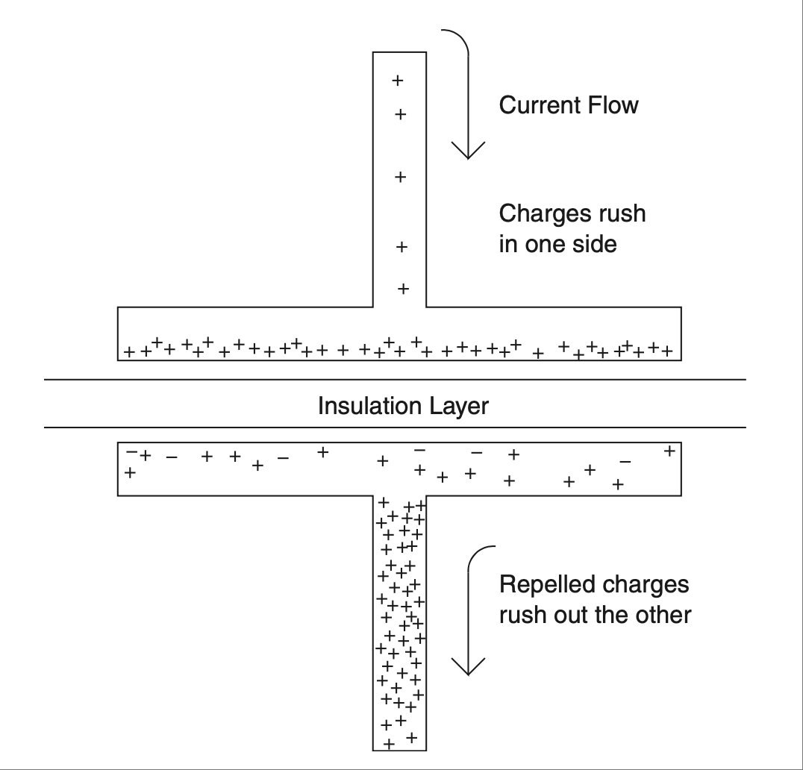

    **图 2.46 电容器中电荷的行为。**

就像电流会产生磁场一样，电压会产生电场。正如磁场可以储存能量，电场也可以储存能量。当磁场消散时，它会试图维持电流；当电场消散时，它会试图维持电压。电压与电场密切相关。

.. toggle::

    Also called the *electrostatic field*, the electric field [36]_ is not as commonly known per se as the magnetic field. In the same way that current is connected to the magnetic field, voltage is connected to the electric field. That leads to a good rule of thumb to remember: *Current is magnetic* and *voltage is electric*.

    The electric field comes from electric charges, both positive and negative. In a way that is analogous to the way like poles on magnets repel and opposite poles attract, like charges repel and opposite charges attract. Any molecule or atom can be neutral (no net charge), positively charged, or negatively charged. The accumulation of these charges is what is known as voltage. One way to think of it is that the charges are the voltage making the electric field, and move- ment of those charges is called current and creates the magnetic field.

    .. figure:: ./img/f2.45.png
        :scale: 50%
        :align: right

        **FIGURE 2.45 Capacitor symbol.**

    Similar to the way an inductor is a way of concentrating a magnetic field, a capacitor is a way of concentrating an electric field. Capacitors are made by two collectors or plates separated by a material that will not conduct electricity, also known as a dielectric. The symbol of a capacitor mimics the construction, as shown in :ref:`Figure 2.45 <Figure 2.45>`.

    Because of the dielectric, current or actual charges cannot flow or move across the capacitor, and all the charges build up on one side of the cap, kind of like a 50-car pileup on the freeway, as shown in :ref:`Figure 2.46 <Figure 2.46>`.

    As the charges pile up on one side, the electrostatic field builds up, causing all the like charges on the other side of the cap to go rushing away (remember how like charges repel). Once it all comes to rest, there is an equal number of oppo- site charges on the other side of the cap. In this way the capacitor stores a charge of voltage on the plates of the capacitor.

    How much charge a cap can store in an electric field is a function of the area of the plates. The amount of voltage it can store is dependent on the strength of the dielectric. If you exceed the capability of the insulation, the dielectric will break down and a charge will cross the gap. The same thing happens on a stormy day. During a thunderstorm charges build up in the clouds and the ground in the same way they do on either side of a capacitor. A lightning strike is a large-scale version of what happens when the insulation or dielectric in a capacitor breaks down.

    .. figure:: ./img/f2.46.png
        :scale: 50%
        :align: center

        **FIGURE 2.46 Behavior of charges in a capacitor.**

    In the same way current creates a magnetic field, voltage creates an electric field. Just as the magnetic field can store energy, the electric field can also store energy. As the magnetic field dissipates, it tries to maintain current. As the elec- tric field dissipates, it tries to maintain voltage. Voltage and electric fields are closely connected.

.. admonition:: 经验法则(Thumb Rules)

   - 电感器在磁场中储存能量。
   - 电容器在电场中储存能量。
   - 电流是磁性的。
   - 电压是电性的。
 
   .. toggle::

      - An inductor stores energy in a magnetic field.
      - A capacitor stores energy in an electric field.
      - Current is magnetic.
      - Voltage is electric.

保持控制
----------------------
KEEP IT UNDER CONTROL

控制理论通常在大多数教育项目中被安排在后期讲授，因为它被认为是一个更高级的主题。然而，控制系统在电子领域中是一种非常常见的应用。想想看；大多数时候你设计一个设备，是为了控制一些你不想思考的事情，让它自动完成任务而无需干预。此外，控制理论不仅对明确的控制应用有用，在理解运算放大器和设计电源等方面也同样有帮助。既然对这一概念的基本了解将对你职业生涯的许多方面都有帮助，那么花几页篇幅来讲解它是值得的。

.. toggle::

    The topic of control theory is typically left until later in most education programs because it is considered a more advanced topic. Control systems, however, are a very common application in the electronic realm. Think about it; I’ll bet most of the time you design a device to control something you don’t want to think about, something that automatically does what it should without intervention. On top of that, control theory turns out to be useful in more than just clear-cut control applications—understanding op-amps and designing power supplies, for exam- ple. Since a basic knowledge of this concept will help you in many aspects of your career, it seems prudent to dedicate a few pages to it.

系统概念
~~~~~~~~~~~~~~~~~~~~~
The System Concept

一个系统就是任何具有输入和输出的东西。其基本思路很简单——输入进来，摇一摇、挤一挤、做点什么处理，然后送到输出。可以用框图来表示，如 :ref:`Figure 2.47 <Figure 2.47>` 所示。

所有的魔法都发生在这个方框内部。这个魔法称为传递函数。传递函数等于输出除以输入。它是你将输入进行处理以得到输出的等式，因此如下关系成立：

.. math::
   :label: equation 2.17

    Output = Magic * Input 

简单的代数变换得到：

.. math::
   :label: equation 2.18

    \frac{Output}{Input} = Magic 

.. _Figure 2.47:

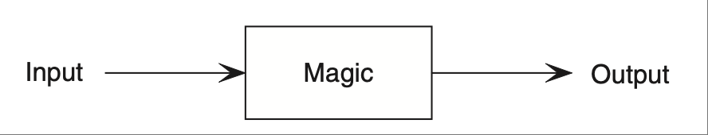

    **图 2.47 系统中的魔法盒子。**

.. _Figure 2.48:

.. figure:: ./img/f2.48.png
    :scale: 50%
    :align: center

    **图 2.48 魔法揭秘。**

现在你知道如何找出盒子中的魔法了，有时候它确实就是这么简单。我们尝试一个简单的例子来看看效果。你输入 12 英里，等待——咔哒、咔哒，叮！——输出为 19.32 千米。你可能已经猜到，这个盒子的魔法是一个公制单位转换器，但它的传递函数是什么？根据前面的公式，我们只需将输出除以输入即可。也就是：

.. math::
   :label: equation 2.19

    \frac{19.32 km }{ 12 miles} = 1.61 \frac{km}{mile} 

我们的转换器盒子的魔法如 :ref:`Figure 2.48 <Figure 2.48>` 所示。

注意，单位也进入了盒子。这有助于明确输入需要什么单位，输出将会得到什么单位。希望你脑海中有个小声音在说：“这不是单位数学那章的内容吗？”确实是，但这是一个更正式的概念，并且加入了一些很酷的小技巧，比如你画的那些小盒子 [37]_，它们可以帮助你理解系统。你接下来应该问的问题是：“这如何应用到电子学中？”其实从最基本的到最复杂的电路，你都可以用这些魔法（有些教材称之为黑）盒子来表示。

我们最好再看一个例子。以电阻为例。电阻可以被看作是电流到电压的转换器。将电流输入，施加魔法，输出电压。那它的传递函数是什么？如果你喃喃自语时提到了“欧姆定律”，那你可能是对的。

.. math::
   :label: equation 2.20

    R = \frac{V}{I}

那么电阻的框图将如 :ref:`Figure 2.49 <Figure 2.49>` 所示。

.. _Figure 2.49:

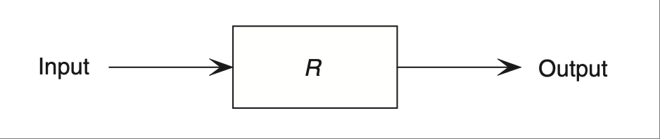

    **图 2.49 电阻的系统图。**

.. [37] 画这些酷酷的小方框很有趣！我们为什么用原理图、流程图来表达我们的想法？我建议你回想一下，很久以前我们还在篝火边当猴子的时候，在地上画线可能就给了我们生存优势。它一定对人类物种的生存至关重要，因为我要说：小时候我喜欢拿蜡笔涂鸦，现在在白板上画图仍然非常令人满足！

    Drawing cool little boxes is fun! Why else do we represent what we think with schematics and flow charts and the like? I suggest that way back when we were all apes around a campfire, somehow drawing lines in the dirt gave us an evolutionary advantage. It must be important to the survival of the species, because I will say this: I loved to get out the crayons as a kid, and a good time sketching on the white board is still pretty darn satisfying!

在这个传递函数中，R 是电阻的值，单位是欧姆（以防你没猜到）。注意，1 欧姆等于 1 伏除以 1 安培，就像我们熟悉的欧姆定律所说的那样。

让我们将这个概念推进一步，看看稍微复杂一点的电压分压器。我们已经知道它的公式：

.. math::
   :label: equation 2.21

    Vo = Vi \frac{Rg}{Rg + Ri}

你还记得 Vo 是什么吗？Vi 又是什么？它们分别是输出电压和输入电压。那么我们只需进行一点代数运算来搞清楚传递函数。传递函数等于输出除以输入，如下所示：

.. math::
   :label: equation 2.22

    \frac{Vo}{Vi} = \frac{Rg}{Rg + Ri}

这个电路的框图如 :ref:`Figure 2.50 <Figure 2.50>` 所示。

.. _Figure 2.50:

.. figure:: ./img/f2.50.png
    :scale: 50%
    :align: center

    **图 2.50 电压分压器的系统图。**

这个相同的概念可以用来描述我们迄今为止看到的所有电路。你可能会看到这种类型的框图中，C 或 L 旁边有一个小写的 s。这是一个叫做拉普拉斯变换的数学技巧。它用于简化问题的求解过程。如果你将所有的时间常数和频率特性使用拉普拉斯对转换，那么你就可以用简单代数处理这些变换后的公式，等到完成后再把它们转换回来。拉普拉斯变换超出了本书的范围，但请注意，s 表示了电容器和电感器的所有频率响应，便于在公式复杂时处理。

我们可以将任何系统描述为一个带有输入和输出的魔法盒子。确定魔法盒子中内容的一种方式是向输入端施加一个已知信号。现在我们来看看可能是你能施加给魔法盒子输入端的最重要的激励信号。

.. toggle::

    A system is anything with an input and an output. The idea is simple—take the input, shake it, squeeze it, do whatever, and then send it to the output. It can be represented with a block diagram, something like the one shown in :ref:`Figure 2.47 <Figure 2.47>`.

    All the magic happens inside the box. This magic is called the transfer function. The transfer function is equal to the output over the input. It is the equation that you process the input through to get the output, so the following is true:

    .. math::

        Output = Magic * Input 

    A little algebra yields:

    .. math::

        \frac{Output}{Input} = Magic 

    .. figure:: ./img/f2.47.png
        :scale: 50%
        :align: center

        **FIGURE 2.47 The magic box inside a system.**

    .. figure:: ./img/f2.48.png
        :scale: 50%
        :align: center

        **FIGURE 2.48 The magic revealed.**

    Now you know how to find what the magic inside the box is, and sometimes it is just that easy. Let’s try a simple example to see how. You put 12 miles into the input, wait—chugga, chugga, ding!—and out pops 19.32 km. As you might have guessed, the magic in this box is a metric converter, but what is the transfer function? According to the preceding equation, we simply divide the output by the input. That would be:

    .. math::
    :label: equation 2.19

        \frac{19.32 km }{ 12 miles} = 1.61 \frac{km}{mile} 

    The magic in our converter box looks like the one in :ref:`Figure 2.48 <Figure 2.48>`.

    Note that the units made it into the box. This helps identify the type of units that will work at the input and what you will get at the output. Hopefully a little voice in your head is saying, “Isn’t this a rehash of the unit math chapter?” It is, but this is a more formalized concept with some neat touches such as the cool little boxes [37]_ you draw to help you understand the system. The next question you should ask is, “How does this apply to electronics?” Well, from the most basic to the most complex, you can represent any circuit with one of these magic (okay, some texts call them black) boxes.

    We’d better do another example. Take a resistor. A resistor can be thought of as a current-to-voltage converter. Put current into the input, apply magic, and get voltage at the output. What would be the transfer function of that? If you mumbled a phrase with the words “Ohm’s Law” anywhere in it, you are probably right.

    .. math::

        R = \frac{V}{I}

    That would make the block diagram of the resistor look something what :ref:`Figure 2.49 <Figure 2.49>` shows.

    .. figure:: ./img/f2.49.png
        :scale: 50%
        :align: center

        **FIGURE 2.49 System diagram of a resistor.**

    In this transfer function, R is the value of the resistor in ohms, just in case you didn’t guess. (Note that 1 unit of ohms equals 1 unit of volts divided by 1 unit of amps, like good old Ohm’s Law says it does.)

    Let’s step up the idea to something a little more complex, like a voltage divider. We already know the equation for this. It is:

    .. math::

        Vo = Vi \frac{Rg}{Rg + Ri}

    Do you remember what Vo stands for? How about Vi? They are voltage output and voltage input. So let’s just use a little algebra to figure this out. The transfer function is equal to the output over the input, like this:

    .. math::

        \frac{Vo}{Vi} = \frac{Rg}{Rg + Ri}

    The block diagram would look like :ref:`Figure 2.50 <Figure 2.50>`.

    .. figure:: ./img/f2.50.png
        :scale: 50%
        :align: center

        **FIGURE 2.50 System diagram of a voltage divider.**

    This same concept can be used to describe all the circuits that we have seen so far. You might see block diagrams of this type where C or L has a little s by it. This is a mathematical trick known as a Laplace transform. It is used to sim- plify problem solving. If you transform all that time constant and frequency stuff using Laplace pairs, you can treat the transformed equations with simple algebra and then transform it all back when you are done. Laplace transforms are beyond the scope of this text, but do take note that the s rolls up all the frequency response of capacitors and inductors into a domain that can be handled easily when the equations get complex.

    We can describe any system as a magic box with an input and an output. One way to determine what is in the magic box is to put a known signal into the input. Let’s take a look at what is probably the most important stimulus you can apply to the input of the magic box.

阶跃输入
~~~~~~~~~~~~~~~~~~
The Step Input

阶跃输入的理念是通过系统对特定输入的响应来理解其输出。阶跃输入是从零值到另一个预定值的瞬时状态变化。它看起来如 :ref:`Figure 2.51 <Figure 2.51>` 所示。

.. _Figure 2.51:

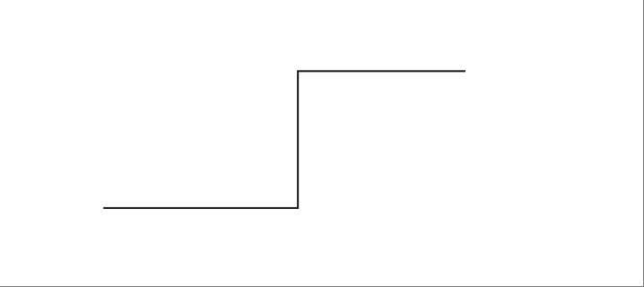

    **图 2.51 阶跃输入。**

输出会以某种方式发生变化，希望是由一个公式所预测的方式。这被称为响应。你对各种元件对该阶跃输入的响应了解得越多，就越能运用直觉进行信号分析。我们再来回顾一下 RC 电路。我们之前学到的公式是：

.. math::
   :label: equation 2.23

    Vo = Vi \left ( 1 - e^{-\frac{t}{rc}} \right )

要将其变为魔法盒的传递函数，我们只需将 Vi 移到等式右侧，如下所示：

.. math::
   :label: equation 2.24

    \frac{Vo}{Vi} = \left ( 1 - e^{-\frac{t}{rc}} \right )

现在我们将其放入盒中。当我们将阶跃输入输入到一侧时，在输出端会得到熟悉的 RC 曲线，如 :ref:`Figure 2.52 <Figure 2.52>` 所示。

.. _Figure 2.52:

.. figure:: ./img/f2.52.png
    :scale: 50%
    :align: center

    **图 2.52 将阶跃输入送入含有 RC 电路的魔法盒中。**

虽然从不同的方法得出相同的结论很不错，但系统概念真正体现其优势的地方在于我们创建反馈回路时。

.. toggle::

    The idea behind the step input is to understand the output of a system by its response to a given input. The step input is an instantaneous change of state from a value of zero to another predetermined value. It looks like the one shown in :ref:`Figure 2.51 <Figure 2.51>`.

    .. figure:: ./img/f2.51.png
        :scale: 50%
        :align: center

        **FIGURE 2.51 The step input.**

    The output will change in some manner predictable (one hopes!) by an equation. This is known as the response. The better you know the response of various com- ponents to this step input, the better you will be able to apply intuitive signal ana- lysis. Let’s go over the RC circuit again. The equation we learned earlier is:

    .. math::

        Vo = Vi \left ( 1 - e^{-\frac{t}{rc}} \right )

    To turn that into the transfer function for the magic box, all we have to do is move Vi to the other side of the equal sign, like this:

    .. math::

        \frac{Vo}{Vi} = \left ( 1 - e^{-\frac{t}{rc}} \right )

    We now plug that into the box. When we put the step input into one side, we get the familiar RC curve on the output, as shown in :ref:`Figure 2.52 <Figure 2.52>`.

    .. figure:: ./img/f2.52.png
        :scale: 50%
        :align: center

        **FIGURE 2.52 Step input into magic box with RC circuit inside.**

    Though it is nice to see the same conclusion from a different approach, where the system concept really comes into its own is when we create a feedback loop.

反馈
~~~~~~~~~~~~~
Feedback

控制理论中最巧妙的应用之一是实现反馈。反馈是指将“魔法盒”输出的一部分作为输入的一种过程。反馈有两种类型：正反馈和负反馈。它们可以从交互的角度来理解。

.. toggle::

    One of the neatest applications of control theory occurs when we implement feedback. Feedback is the process of using the output of the “magic box” as some portion of the input. Feedback comes in two flavors: positive and negative. They can be thought of in terms of interaction.

正反馈
''''''''''''''''''''
POSITIVE FEEDBACK

正反馈鼓励或强化某种行为；负反馈则是纠正或控制某种行为。例如，如果你的儿子在足球比赛中表现出色，你为他加油鼓劲，从而鼓励他更加努力，这就是正反馈。正反馈强化你期望的行为。在上述情况下，它会鼓励他尽最大努力去表现。事实上，在一个完美的世界里，他会不断努力，直到全力以赴。在控制理论中，正反馈也是如此。输出反馈到正输入端，这会使输出增加，从而反馈回输入，进而进一步增加输出，如此循环（强化该行为），直到输出达到最大值。

由于正反馈会强化信号，输出常常会“锁定”在电源轨上。 [38]_ 因此，正反馈的使用通常受到严格限制，只允许对输入进行微小的更改。这些小变化可以引入一个称为迟滞的特性。

另一个由于这种强化行为而可能发生的有趣现象是，在正反馈回路中引入延迟。想象一下：如果这个信号有一点延迟会发生什么？如果时机把握得好，改变输出的信号可以在输出已经朝相反方向运动时出现在输入端。当这种情况发生时，你就创建了一个振荡器。

虽然正反馈对控制小孩非常有用，但在电路中，如果你想控制某种行为，你需要使用负反馈。

.. toggle::

    Positive feedback encourages or reinforces a behavior; negative feedback corrects or controls a behavior. For example, if your son is doing a good job in a soccer game and you cheer him on, which encourages him to try even harder, this is positive feedback. Positive feedback reinforces the behavior you desire. In the preceding case, it will encourage him to try as hard as possible. In fact, in a perfect world he will keep trying until he is giving it all he can. The same thing happens with positive feedback in control theory. Output is fed back to the positive input. This has the effect of increasing the output, which is fed back to the input, which will increase the output and so on (reinforcing the behavior) until the output is as high as it can go.

    Since positive feedback reinforces the signal, the output can often “stick” at the rail. [38]_ For this reason the amount of positive feedback allowed is typically very limited, allowing only small changes to the input. These small changes can create a feature called hysteresis.

    Another interesting thing that can happen due to this reinforcing behavior occurs when delays are created in the positive feedback loop. Think about it for a moment: What will happen if this signal is delayed a bit? If you time it right, the signal to change the output can be made to occur at the input when the output is already moving in the opposite direction. When this happens you have created an oscillator.

    Now, though positive feedback is great for controlling toddlers, when it comes to circuits, if you want to control something you need negative feedback.

负反馈
''''''''''''''''''''
NEGATIVE FEEDBACK

负反馈是一种控制机制。我们再次回到足球的类比。这一次，你的儿子把球传得太远，超过了接球球员。你告诉他要缩短传球距离。如果他传得不够远，你告诉他要传远一些。根据实际结果与期望结果的接近程度，一个纠正信号会反馈回输入端。这个纠正信号对输出有负面影响，因此称为负反馈。

人类天生就能处理负反馈。 [39]_ 你今天早上开车去上班时可能就经历过它。如果你在高速公路上偏离车道边缘，你会处理一个小小的负反馈信号，从而发出纠正信号将车开回车道中央。如果你没有这样做，那你现在可能正坐在拖车的副驾驶上，眼睁睁看着你的破车被拖回家！

负反馈常用于创建受控放大器和滤波器。我们将在本书后面详细介绍如何使用运算放大器实现正负反馈及其工作原理。

.. toggle::

    Negative feedback is a control situation. Let’s go back to the soccer analogy for a moment. In this case, your son kicks the ball too far ahead of the player he is passing it to. You tell him to shorten up his pass. If he is not passing far enough, you tell him to lengthen it out. Based on how close the actual result is to the desired result, a corrective signal is fed back to the input. This corrective signal has a negative impact on the output, hence the term negative feedback.

    Humans have an innate ability to handle negative feedback. [39]_ You probably experienced it this morning as you drove your car to work. If you drifted too close to the edge of the lane on the freeway, you processed a little negative feedback, resulting in a corrective signal to bring the car back to the center of the road. If you didn’t, you are probably reading this in the passenger seat of the tow truck as your mangled car is hauled home!

    Negative feedback is often used to create controlled amplifiers and filters. We will get into some details of negative and positive feedback and how they work using op-amps a bit later in the book.

开环增益与闭环增益
---------------------------------------
Open-Loop Gain vs. Closed-Loop Gain

当你将反馈信号从“回路”中切断时，系统的增益称为开环增益。这样做是为了与闭环增益（即当反馈接入时系统的增益）区分开。高开环增益配合负反馈可最大限度减少放大器和滤波器电路中的误差。

.. [38] 如果你不理解这个术语，请参考术语表。我保证如果你通读一遍，你至少会笑几次（前提是我的编辑这次没有把所有笑话都删掉）。

    If you don’t understand this term, I refer you to the glossary, where I promise if you read the whole thing you will get at least a few chuckles (so long as my editor doesn’t take out all the jokes this time). 

.. [39] 除非，这种反馈来自你的另一半；那我们往往会产生严重的系统性异常行为。

    Unless, of course, it is coming from your significant other; then we tend to have serious system-wide erratic behavior.

.. admonition:: 经验法则

   - 将所有内容归入一个魔法盒中。
   - 增益或魔法等于输出除以输入。
   - 可以为这些系统添加反馈回路以产生不同结果。
   - 正反馈趋于锁定或使输出达到电源轨。
   - 正反馈延迟可能会引发振荡。
   - 负反馈信号具有纠正性质。
   - 负反馈可创建受控输出。
   - 当反馈断开时，输入到输出的系统增益称为开环增益。
   - 当反馈接入时，系统的增益称为闭环增益。

.. toggle::

    When you cut the feedback signals out of the “loop,” the gain of the system is known as the open-loop gain. This is to distinguish it from the closed-loop gain, or the gain of the system when the feedback is in place. High open-loop gains in conjunction with negative feedback will minimize errors in amplifier and filter circuits.

    .. admonition:: Thumb Rules

        - Lump everything into one magic box.
        - The gain or magic equals the output over the input.
        - Feedback loops can be added to these systems to create different results.
        - Positive feedback tends to latch up or go to an output rail.
        - Positive feedback delays can create oscillations.
        - Negative feedback signals are corrective in nature.
        - Negative feedback creates a controlled output.
        - The gain of the system from input to output when the feedback is disconnected is known as the open-loop gain.
        - The gain of the system when feedback is in place is known as the closed-loop gain.

