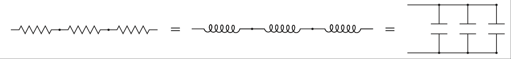

CHAPTER 2 Basic Theory
==========================

Every discipline has fundamentals that are used to extrapolate all the other, more complex ideas. Basics are the most important thing you can know. It is knowledge of the basics that helps you apply all that stuff in your head correctly. It doesn’t matter if you can handle quadratic equations and calculus in your sleep. If you don’t grasp the basics, you will find yourself constantly chasing a problem in circles without resolution. If you get anything out of this text, make sure that you really understand the basics!

OHM’S LAW STILL WORKS: CONSTANTLY DRILL THE FUNDAMENTALS
----------------------------------------------------------

Ohm’s Law
~~~~~~~~~~~

This, I believe, is one of the best-taught principles in school for the budding engineer or technician, and it should be. So why go over it? Well, two reasons come to mind: One, you can’t go over the basics too much, and two, though any engineer can quote Ohm’s Law by heart, I have often seen it ignored in application.

First, let’s state Ohm’s Law: Voltage equals current multiplied by resistance; it is shown in :ref:`Figure 2.1 <Figure 2.1>`.

It is simple, but do you consider that resistance exists in every part of a circuit? [1]_ It is easy to forget that, especially since many simulators do. I think the best way to drive this point home is to recount the way it was driven home to me.

.. note::

    There I was—a lowly engineering student. I was working as a technician or associate engineer (depending on whom you asked). I was arguing with my boss, who had an MSEE degree, but he just wouldn’t believe me; neither would my lead engineer (who had a BSEE). I couldn’t bring myself to distrust Ohm’s Law, even in light of their “superior”

.. [1] Okay, you could be all snitty here and point out that superconductors by definition don’t have resistance. But then my cool story coming up wouldn’t have the impact needed to drive home this point that applies to 99.999999% of all circuits out there!

.. _Figure 2.1:

.. figure:: ./img/f2.1.png
    :scale: 50%
    :align: center

    **FIGURE 2.1 Ohm’s Law, the heart of all things electrical.**

.. note::

    knowledge. I’d had less heated debates with rabid dogs. This was the problem: Our department needed to measure the current of a DC motor that could range from 5 A to 15 A at any given time, but our multi-meters had a 10 A fuse in the current measuring circuit.

    So, using Ohm’s Law (which was fresh in my mind, being a student and all), I designed a shunt to measure current. I wanted to get a good reading but disturb the circuit as little as possible, so I chose a 0.1 Ω resistor. I built a box to house it and installed banana-jack plugs to provide an easy interface to a voltmeter. The design looked like the one shown in :ref:`Figure 2.2 <Figure 2.2>`.

    .. _Figure 2.2:

    .. figure:: ./img/f2.2.png
        :scale: 50%
        :align: center

        **FIGURE 2.2 Original design of simple current-measuring circuit.**

    Everyone thought it was a great idea, so I built a couple of boxes and we started using them right away. After a while, however, we noticed that they were not very accurate. Sometimes they would be off by as much as 50 to 60%. No one could figure out why, so I sat down to analyze what I had created.

    After a few minutes, I said to myself, “Well, duh!” I realized that to make the assembly easy I had soldered the wires from the motor to the banana jacks and then soldered some short 14-gauge jumpers to the shunt resistor. My circuit really looked like the drawing shown in :ref:`Figure 2.3 <Figure 2.3>`.

    .. _Figure 2.3:

    .. figure:: ./img/f2.3.png
        :scale: 50%
        :align: center

        **FIGURE 2.3 As-built simple current-measuring circuit.**

    My voltmeter was measuring across a larger resistance value than 0.1 ohms. Wire has resistance, too; even a couple of inches of 14-gauge wire has a few hundredths of an ohm. Remembering Ohm’s Law:

    .. math::
        :label: equation 2.1

        V = I * R

    I realized that this means if you increase R, you get more V for the same amount of current, leading to the errors we were seeing. I had made a simple mistake that fortunately was easy to correct. I redesigned the box on paper to look like the drawing in :ref:`Figure 2.4 <Figure 2.4>`.

    .. _Figure 2.4:

    .. figure:: ./img/f2.4.png
        :scale: 50%
        :align: center

        **FIGURE 2.4 Redesigned current-measuring circuit.**

    I took this to my boss (the one with the MSEE who could do math in his head that I would only attempt with MathCad and a cold drink). His reaction floored me. He reviewed it with the lead engineer and they came to the conclusion that I was completely wrong. They were talking about things like temperature coefficients and phase shifts in current and RMS and a bunch of other topics that were over my head at the time. Thus began the argument. I explained that two points on a schematic had to be connected by a wire and a wire had resistance. Though it is often ignored, it was significant in this case because the shunt resistor was such a small value.

    As they hemmed and hawed over this, I learned that many times it is human nature to ignore what one learned long ago and try to apply more advanced theories just because you know them. Also, all the knowledge in the world isn’t worth jack if it is incorrectly applied. I continued to press my point. I must have written Ohm’s Law on the white board 50 times by then.

    They finally conceded and agreed that the extra wire between the banana jack and the shunt was the cause of the error. That was not the end of the disagreement, though. How in the world was my new design going to fix the problem by simply repositioning the wires? The resistance was still in the circuit, was it not? I wrote down Ohm’s Law another

    100 times and explained that the current through the meter was very small, making the resistance in the wire insignificant again. My astonishment reached new levels as I observed the human ability to overlook the obvious. The first argument was nothing compared to this one. The fireworks really started to fly then.

    What is the moral of this story? Well, Scott Adams, creator of Dilbert, said, “Everyone has moments of stupidity,” as he watched someone fix his “broken” pager by putting in a new battery. I have to agree with him. I rediscover Ohm’s Law about every 6 months. Always, always, always check the basics before you start looking for more complicated solutions! My father, a mechanic, tells a story of rewiring an entire car just to find a bad fuse. (It looked okay, but he didn’t check out with a meter.) That was how he learned this lesson. Me, I just participated in 4 hours of the dumbest argument of my career.

    How did the argument end? We never came to an agreement, so I went ahead and fixed boxes with the new design anyway (which they spent several weeks proving were working correctly). I didn’t say another word but transferred out of that group as soon as possible. The same design has been in use for more than 10 years now, and the documentation notes the need to wire it correctly to avoid inaccurate readings. I didn’t write that document, my old boss did. It’s kind of funny how we didn’t argue about Ohm’s Law after that.

The basics are the most important; let me repeat that, the basics are important! Ohm’s Law is the most basic principle you will use as an electrical engineer. It is the foundation on which all other rules are based. The fundamental fact is that resistance impedes current flow. This impedance creates a voltage drop across the resistor that is proportional to the amount of current flowing through it. If it helps, you can think of a resistor as a current-to-voltage converter. [2]_

With that important point made, let’s consider two other types of impedance that can be found in a circuit. We will get into this in more detail later, but for now consider that inductors and capacitors both can act like resistors, depending on the frequency of the signal. If you take this into account, Ohm’s Law still works when applied to these components as well. You could very well rewrite the equation to:

.. math::
   :label: equation 2.2

    V = I * Z

.. [2] If you don’t get the idea of a current-to-voltage converter, think about it a bit harder, put current through a resistor, get a voltage drop across it out—hopefully deep thought on this will lead to one of those “light-bulb-over-the-head” moments when it all seems to make sense.

Think of the impedance Z as resistance at a given frequency. [3]_ As we move on to the other basic equations, keep this in mind. Wherever you see resistance in an equation, you can simply replace it with impedance if you consider the frequency of the signal.

One final note: Every wire, trace, component, or material in your circuit has these three components in it—resistance, inductance, and capacitance. Everything has resistance, everything has capacitance, and everything has inductance. The most important question you must ask is, “Is it enough to make a difference?” The fact is, in my own experience, if the shunt resistor had been 100 times larger, that would have made the errors we were seeing 100 times less. [4]_ They would have been insignificant in comparison to the measurement we were taking. The impedance equations for capacitors and inductors will help you in a similar way. Consider the frequencies you are operating at and ask yourself, “Is this component making a significant impact on what I am looking at?” By reviewing this significance, you will be able to pinpoint the part of the circuit you are looking for.

The experience I related earlier happened years ago at the beginning of my career, and I said then that I still rediscover Ohm’s Law every six months. Time and time again, working through a problem or design, the answer can be found by application of Ohm’s Law. So, before you break out all those higher theories trying to solve a problem, first remember: Ohm’s Law still works!

Next on our list of basic formulae is the voltage divider rule. Here is the equation and :ref:`Figure 2.5 <Figure 2.5>` shows a schematic of the circuit:

.. math::
   :label: equation 2.3

    Vo = Vi \frac{Rg}{Rg + Ri}

The most common way you will see this is in terms of R1 and R2. I have changed these to Rg (for R ground) and Ri (for R input) to remind myself which one of these goes to ground and which one is in series. If you get them backward, you get the amount of voltage lost across Ri, not the amount at the output (which is the voltage across Rg). If the gain [5]_ of this circuit just doesn’t seem right, you might have the two values swapped.

.. [3] Okay, this is a bit oversimplified; it acts like resistance in one sense, but it does so by causing a delay in the phase of the signal. I have found that in most cases thinking of it like this will give you a decent idea of what is going on. Just remember it isn’t exactly like a resistor dependent on frequency; it merely acts like one.
.. [4] Here’s a fun question for you to figure out: If I had used a resistor 100 times larger, what would have been the ramifications of that? What wattage of resistor would I have needed? Would that have affected the operation of the device under measurement? If so, how much, and why? I have found that the brightest engineers will throw a problem like this up on the white board and dig into it, arguing the finer points until their boss comes along and says, “Okay, enough fun, time to get back to work.”
.. [5] One way I like to think of this is Vo=Vi*H, where H is the gain of the circuit, or H=Rg/ðRg + RiÞ: This is useful when you are breaking a circuit down to components. We will specifically use this when we discuss op-amps later on.

.. _Figure 2.5:

.. figure:: ./img/f2.5.png
    :scale: 50%
    :align: center

    **FIGURE 2.5 Input voltage is divided down at the output.**

You might also notice that the gain of this circuit is never greater than 1. It approaches 1 as Ri goes to 0, and it approaches 1 as Rg gets very large. (Note that as Rg gets larger, the value of Ri becomes less significant.) Since this is the case, it is easy to think of the voltage divider as a circuit that passes a percentage of the voltage through to the output. When you look at this circuit, try to think of it in terms of percentage. For example, if Rg = Ri, only 50% of the voltage would be present on the output. If you want 10% of the signal, you will need a gain of 1/10. So put 1K in for Rg, and 9K in for Ri, and voilà, you have a voltage divider that leaves 10% of the signal at the output.

Did you notice that the ratio of the resistors to each other was 1:9 for a gain of 1/10? This is because the denominator is the sum of the two resistor values. I’ll also bet you noticed that if you swap the two resistor values you will get a gain of 9/10, or 90%. This should make intuitive sense to you now if you recognize that, for the same amount of current, the voltage drop across a 9 K Ri will be 9 times larger than the voltage drop across a 1 K Rg. In other words, 90% of the voltage is across Ri, whereas 10% of the voltage is across Rg, where your meter measuring Vo is hooked up. The voltage divider is really just an extension of Ohm’s Law (go figure), but it is so useful that I’ve included it as one of the basic equations that you should commit to memory.

Capacitors Impede Changes in Voltage
~~~~~~~~~~~~~~~~~~~~~~~~~~~~~~~~~~~~~~~

Let’s consider for a moment what might happen to the previous voltage divider circuit if we replace Rg with a capacitor. It is still a voltage divider circuit, is it not? But what is the difference? At this point you should say, “Hey, a cap is just a resistor (or more correctly impedance) whose value changes depending on the frequency; wouldn’t that make this a voltage divider that depends on frequency?” Well, it does, and this is commonly known as an RC circuit. Let’s draw one now, as shown in :ref:`Figure 2.6 <Figure 2.6>`.

.. _Figure 2.6:

.. figure:: ./img/f2.6.png
    :scale: 50%
    :align: center

    **FIGURE 2.6 Step input is applied to a simple RC circuit.**

Using your intuitive understanding of resistors and capacitors, let’s analyze what is going to happen in this circuit. We’ll do this by applying a step input. A step input is by definition a fast change in voltage. The resistor doesn’t care about the change in voltage, but the cap does. This fast change in voltage can be thought of as high frequencies, [6]_ and how does the cap respond to high frequencies? That’s right, it has low impedance. So, now we apply the voltage divider rule. If the impedance of Rg is low (as compared to Ri), the voltage at Vo is low. As frequency drops, the impedance goes up; as the impedance goes up, based on the voltage divider, the output voltage goes up. Where does it all stop?

Think about it a moment. Based on what you know about a cap, it resists a change in voltage. A quick change in voltage is what happened initially. After that our step input remained at 5 V, not changing anymore. Doesn’t it make sense that the cap will eventually charge to 5 V and stay there? This phenomenon is known as the transient response of an RC circuit. The change in voltage on the output of this circuit has a characteristic curve. It is described by this equation (note t = time):

.. math::
   :label: equation 2.4

    Vo = Vi \left ( 1 e^{\frac{t}{rc}}  \right )

The graph of this output looks like :ref:`Figure 2.7 <Figure 2.7>`. The value of R times C in this equation is also known as tau, or the time constant, often referred to by the Greek letter τ.

.. math::
   :label: equation 2.5

    RC = \tau

For a step input, this curve is always the same for an RC circuit. The only thing that changes is the amount of time it takes to get to the final value. The shape of the curve is always the same, but the time it takes to happen depends on the value of the time constant [7]_ τ. You can normalize this curve in terms of the time constant and the final value of the voltage. Let’s redraw the curve with multiples of τ along the time axis, as shown in :ref:`Figure 2.8 <Figure 2.8>`.

At 1 τ the voltage reaches 63.2%, at 2 τ it is at 86.6%, 3 τ is 95%, by 4 τ it is at 98%, and when you reach 5 τ you are close enough to 100% to consider it so.

.. [6] This is something a man named Fourier thought of long ago. The more harmonic frequencies you sum together, the faster the rise time of said step input.

.. [7] If you stop to think about it, it just makes sense that this value RC is called a time constant, since it affects the timing of the response.

.. _Figure 2.7:

    **FIGURE 2.7 Voltage change over time.**

.. _Figure 2.8:

.. figure:: ./img/f2.8.png
    :scale: 50%
    :align: center

    **FIGURE 2.8 Voltage change in percentage over time in tau.**

This response curve describes a basic and fundamental principle in electronics. Some years ago I started asking potential job candidates to draw this curve after I gave them the RC circuit shown in Figure 2.6. Over the years I have been dismayed at how many engineers, both fresh out of school and with years of experience, cannot draw this curve. Fewer than 50% of the applicants I have asked can do it. That fact is one of the main reasons I decided to write this book. (The other was that someone was actually willing to pay me to do it! I doubt it would have gotten far otherwise.) So, I implore you to put this to memory once and for all; by doing so I guarantee you will be a better engineer. Plus, if I ever interview you, you will have a 50% better chance of getting a job! If you understand this concept, you will understand inductors, as you will see in the next section.

Before we move on, I would like you to consider what happens to the current in this circuit. Remember Ohm’s Law? Apply it to this example to understand what the current does. We know that:

.. math::
   :label: equation 2.6

    V = I * R

A little algebra turns this equation into:

.. math::
   :label: equation 2.7

    I = \frac{V}{R}

A little common sense reveals that the voltage across R in this circuit is equal to voltage at the output minus voltage at the input. As an equation, you get:

.. math::
   :label: equation 2.8

    Vr = Vi Vo

.. _Figure 2.9:

.. figure:: ./img/f2.9.png
    :scale: 50%
    :align: center

    **FIGURE 2.9 Current change in percentage over time in tau.**

We know the voltage at each point in time in terms of tau. At 0 τ, Vo is at 0. So the full 5 V is across the resistor and the maximum current is flowing. For all intents and purposes, the cap is shorting the output to ground at this point in time. At 1 τ, Vo is at 63.2% of Vi. That means Vr is at 36.8% of Vi. Repeat this process, connect the dots, and you get a curve that moves in the opposite direction of the voltage curve, something like what’s shown in :ref:`Figure 2.9 <Figure 2.9>`.

Notice how current can change immediately when the step input changes. Also notice how the voltage just doesn’t change that fast. Capacitors impede a change in voltage, as the rule goes. What this also means is that changes in current [8]_ will not be affected at all. Everything has its opposite, and capacitors are no exception, so let’s move on to inductors.

Inductors Impede Changes in Current
~~~~~~~~~~~~~~~~~~~~~~~~~~~~~~~~~~~~~~~

Now that we have thought through the RC circuit, let’s consider the RL circuit shown in :ref:`Figure 2.10 <Figure 2.10>`. Remember that the inductor resists a change in current but not in voltage. Initially, with the same step input, the voltage at the output can jump right to 5 V. Current through the inductor is initially at 0, but now there is a voltage drop across it, so current has to start climbing. The current responds in the RL circuit exactly the same way voltage responds in the RC circuit.

Since you committed the RC response to memory, the RL response is easy. It is exactly the same from the viewpoint of current; [9]_ the current graph looks like :ref:`Figure 2.11 <Figure 2.11>`.

.. [8] Another way to think of it is that rapid changes in current are what capacitors are very good at.
.. [9] Being able to consider a circuit from either a “voltage” viewpoint or a “current” viewpoint is a valuable skill. Try to formulate an understanding of this concept as you develop your skills in this area.

I hope you are saying to yourself, “What about the voltage response?” At this time, consider Ohm’s Law for a moment and try to graph what the voltage will do. What is the current at time 0? How about a little later? Remember Ohm’s Law—for the current to be low, resistance must be high. So initially the inductor acts like an open circuit. Voltage across the inductor will be at the same value as the input. As time goes on, the impedance of the inductor drops off, becoming a short, so voltage drops as well. :ref:`Figure 2.12 <Figure 2.12>` shows the graph.

The inductor is the exact complement of the capacitor. What it does to current, the cap does to voltage, and vice versa.

.. _Figure 2.10:

.. figure:: ./img/f2.10.png
    :scale: 50%
    :align: center

    **FIGURE 2.10 The basic RL circuit.**

.. _Figure 2.11:

.. figure:: ./img/f2.11.png
    :scale: 50%
    :align: center

    **FIGURE 2.11 Current change in percent over time in tau.**

.. _Figure 2.12:

.. figure:: ./img/f2.12.png
    :scale: 50%
    :align: center

    **FIGURE 2.12 Voltage change in percent over time in tau.**

Series and Parallel Components
~~~~~~~~~~~~~~~~~~~~~~~~~~~~~~~

There are two ways for components to be configured in a circuit: series and parallel. Series components line up one after another; parallel components are hooked up next to each other. Let’s go over the formulas to simplify these component arrangements.

Series resistors, shown :ref:`Figure 2.13 <Figure 2.13>`, are easy; you simply add them up, no multiplication needed!

.. math::
   :label: equation 2.9

   Rt = R1 + R2 + R3

The inductors shown in :ref:`Figure 2.14 <Figure 2.14>` are like resistors—you sum series inductors the same way.

.. math::
   :label: equation 2.10

    Lt = L1 + L2 + L3

Remember that capacitors are the opposite of inductors. For this reason, capacitors must be in parallel to be summed up the way resistors and inductors are in series; see :ref:`Figure 2.15 <Figure 2.15>`.

.. math::
   :label: equation 2.11

    Ct = C1 + C2 + C3

Remember the equivalences shown in :ref:`Figure 2.16 <Figure 2.16>`.

Parallel resistors, shown in :ref:`Figure 2.17 <Figure 2.17>`, are a little trickier. The equivalent resistance of any two components is determined by the product of the values divided by the sum of the values. [10]_

Keep in mind, however, that this works for any two resistors! In the case of three resistors or more, solve any two and repeat until done. (The ``//`` means **in parallel with**.)

.. math::
   :label: equation 2.12

    R1 // R2 = \frac{R1 * R2}{R1 + R2}  \space\space\space\space Rt = \frac{R1 // R2 * R3}{R1 // R2 + R3}

.. math::
   :label: equation 2.13

    L1 // L2 = \frac{L1 * L2}{L1 + L2}  \space\space\space\space Lt = \frac{L1 // L2 * L3}{L1 // L2 + L3}

Parallel inductors are the same as resistors; you can reduce them in the same way—see :ref:`Figure 2.18 <Figure 2.18>`.

.. [10] Another way to remember this idea is to sum all the inverses: ``1/Rt = 1/R1 + 1/R2 + 1/R3``, and so on. If this works better for you, that is fine, just commit one or the other to memory.

.. _Figure 2.13:

.. figure:: ./img/f2.13.png
    :scale: 50%
    :align: center

    **FIGURE 2.13 Series resistors.**

.. _Figure 2.14:

    **FIGURE 2.14 Series inductors.**

.. _Figure 2.15:

.. figure:: ./img/f2.15.png
    :scale: 50%
    :align: center

    **FIGURE 2.15 Parallel capacitors.**

.. _Figure 2.16:

    **FIGURE 2.16 Component equivalents.**

.. _Figure 2.17:

.. figure:: ./img/f2.17.png
    :scale: 50%
    :align: center

    **FIGURE 2.17 Parallel resistors.**

.. _Figure 2.18:

.. figure:: ./img/f2.18.png
    :scale: 50%
    :align: center

    **FIGURE 2.18 Parallel inductors.**

.. _Figure 2.19:

.. figure:: ./img/f2.19.png
    :scale: 50%
    :align: center

    **FIGURE 2.19 Series capacitors.**

.. _Figure 2.20:

.. figure:: ./img/f2.20.png
    :scale: 50%
    :align: center

    **FIGURE 2.20 Component equivalents.**

For capacitors the same equation applies, but only if they are in series, as shown in :ref:`Figure 2.19 <Figure 2.19>`. These are the circuits that use the product-over-the-sum, or the sum-of-the-inverses, rule; [11]_ see :ref:`Figure 2.20 <Figure 2.20>`.

.. math::
   :label: equation 2.14

    C1 // C2 = \frac{C1 * C2}{C1 + C2}  \space\space\space\space Ct = \frac{C1 // C2 * C3}{C1 // C2 + C3}

In dealing with parallel and series circuits, you can see that there are only two types of equations. One is simple addition, and the other is the product over the sum (or the sum of inverses). The only trick is to know which to use when. Remember that the resistor and inductor are part of the “in” crowd and the cap is the outcast wallflower who is the opposite of those other guys. I’ll bet most engineers can relate to being the “capacitor” at a party, so this shouldn’t be too hard to remember!

.. [11] You can sum the inverses of the capacitors or inductors in the same way as the resistors. Just put impedance in place of resistance: ``1/Zt = 1/Z1 + 1/Z2 + 1/Z3``, and so on. Truth be told, I committed the product-over-the-sum rule to memory many years ago. That’s why I like it. You can be just as effective with the sum of the inverses rule, as so many astute readers have pointed out. I hope you have realized by now that if there are two equivalent routes to get to a destination, I don’t particularly care which one you use so long as you get to the right place. I do believe that it is important to find what works for you and focus on that. Don’t worry about going a different way unless it gives you new insight or understanding. Wow, this just might be the longest footnote in the whole book! Maybe I should add just a few more words to make sure. If you do read this and make it all the way to the end without nodding off, drop me a line at dashby@raddd.com and let me know. I answer every piece of fan mail I get, so I will surely reply. If you inspire a profound thought in our exchange I will tweet it out into the nether regions of the Internet and see if I can inspire anyone to follow sparkyguru. :D BTW, I really like to hear pyromanic stories so if you send me a really good one it will end up on my Facebook pyromanics = engineers group. Whew! There, did I hit all the new media outlets a guy has to these days just to be in the know? LOL!

Thevenin’s Theorem
~~~~~~~~~~~~~~~~~~~

Thevenizing is based on the idea of using superposition to analyze a circuit. When you have two different variables affecting an equation, making it difficult to analyze, you can use the technique of superposition to solve the equation, provided that you are dealing with linear equations (by luck all these basic components are linear; even if you might not think it when looking at the curve of an RC time response, it actually is a linear equation). [12]_

The idea of superposition is simple: When you have multiple inputs affecting an output, you can analyze the effects of each input independently and add them together when you are all done to see what the output does. One idea that comes from superposition is *Thevenin’s theorem*.

.. _Figure 2.21:

.. figure:: ./img/f2.21.png
    :scale: 50%
    :align: center

    **FIGURE 2.21 Circuit with two voltage sources.**

Using Thevenin’s theorem allows you to reduce basically any circuit into a voltage divider. And we know how to solve a voltage divider, don’t we! There is a sister theorem called Norton’s, which does the same thing but is based on current rather than voltage. Since you can solve any electrical problem with either equation, I suggest you focus on one or the other. Since I like to think in terms of voltage, I prefer Thevenizing a circuit to the Norton equivalent. So to be true to the idea that you should only learn a few fundamentals and learn those well, we will focus on Thevenin equivalents.

The most important rule when Thevenizing is this: Voltage sources [13]_ are shorted, current sources are opened. Consider the circuit shown in :ref:`Figure 2.21 <Figure 2.21>`. [14]_

Once all the voltage sources are shorted and all the current sources are opened, all the components will be in series or parallel. That makes it very convenient for those of us who only want to memorize a few equations! Apply those basic parallel and series rules we just learned and voilà, you have a circuit that is much easier to understand. Once you have reduced the resistors, inductors, and caps to a more controllable number, you replace each source one at a time to see the effects of each source on the component in question.

.. [12] When I see the term linear equation, I think line, so an RC curve seems counterintuitive, but linear equations are a type of formula that allows certain rules such as superposition to be used.
.. [13] Note the use of the word source; a voltage source is a device that keeps the voltage constant as a load varies. A current source keeps the current constant in the face of a changing load.
.. [14] This circuit sparked a competition in the last edition of this book (since I didn’t bother to include a solution). Rather than try to show you how smart I am by including a solution in this edition, I am going to change a few values (or maybe not) and invite you as readers to solve this circuit. Drop me a note with your solution; I promise you will win an all-expense-paid email back from me congratulating you on your engineering prowess!

.. _Figure 2.22:

    **FIGURE 2.22 Circuit with two voltage sources.**

I find it helps when Thevenizing a circuit to try to imagine that you are looking back into the circuit from the output. This means that you imagine what the circuit looks like in terms of the output. We often think in terms of stuff that goes in the input. Something goes in, something happens, and then it comes out the output. Try flipping that notion on its head. Think, “Here is the output, what exactly is it hooked up to? What are the impedances that the cap in this case ’sees’ connected to it?” Once you are able to adjust your point of view, Thevenizing will become an even more powerful tool. Consider the circuit shown in :ref:`Figure 2.22 <Figure 2.22>`.

This circuit comes from a real, live application. I would tell you what, but it is secret. [15]_ So we won’t say this is anything more than a voltage divider with a capacitive filter on it. (Values might have been changed to protect the innocent.)

This circuit’s job is to lower a voltage at the input terminals varying from 0 to 100 V to something with a range of 0 to 5 V. The input voltage also has an AC component that is filtered out by the capacitor. The question is, what is the time constant of the RC filter in this circuit?

Is it 500 K*0.1 μf? That’s what I would have thought before I understood Thevenin’s theorem. The output in this case is the voltage across the cap, so let’s look back into the circuit to figure out what is hooked up to this cap. Now remember, I said there was a voltage source on the input of this circuit. Let’s short that on our drawing and Thevenize it. Take a look at the Thevenized circuit shown in :ref:`Figure 2.23 <Figure 2.23>`.

Hopefully at this point something really jumped out at you. The 10 K and the 500 K resistors are in parallel as far as the cap is concerned. Applying the rule of parallel resistors we find that the resistance hooked up to this cap is 9.8 K. Wow, that is a lot less than 500 K, isn’t it! Thevenizing showed us that our first assumption was incorrect. In fact, the time constant [16]_ of this circuit is much, much lower than it would be without the 10 K resistor.

.. [15] If you haven’t already, you will soon find out that every corporation wants you to sign away every idea you have or ever had as their intellectual property. Some day, those individuals who have all the good ideas must rise up and say, “Enough is enough!” After which we will all likely end up being consultants.

.. [16] If you want a more in-depth lesson on time constants, you will need to jump ahead a few chapters. For now, though, it is sufficient to understand the basic idea behind good ol’ Thevenin’s proposition.

.. _Figure 2.23:

.. figure:: ./img/f2.23.png
    :scale: 50%
    :align: center

    **FIGURE 2.23 Thevenized real, live secret circuit.**

There are other ways this theorem can be useful. Here is a case in point. You might have a circuit like the one shown in :ref:`Figure 2.24 <Figure 2.24>`.

.. _Figure 2.24:

.. figure:: ./img/f2.24.png
    :scale: 50%
    :align: center

    **FIGURE 2.24 AC switched power to an inductor.**

.. _Figure 2.25:

    **FIGURE 2.25 AC switched power to an inductor with snubber.**

You need to switch AC power through this inductor (which was actually one winding of an AC motor in this case). Trouble is, when you let off the switch, a whole bunch of electrical noise is generated when this switch is opened. (We will discuss why when we cover magnetic fields later in the book.) A standard way to deal with this situation is with an RC circuit commonly known as a snubber. The point of a snubber is to snub this voltage spike and dissipate it as heat on the resistor. This makes the most sense if it is across the inductor, as shown in :ref:`Figure 2.25 <Figure 2.25>`.

.. _Figure 2.26:

    **FIGURE 2.26 These are equivalent circuits when Thevenized.**

Now let’s apply Thevenin’s theorem to take a different look at this circuit, as shown in :ref:`Figure 2.26 <Figure 2.26>`. By shorting the AC voltage source, we quickly see that hooking the snubber up to the other side of the switch, to the AC hot line, would have exactly the same effect as hooking across the inductor. This fact once saved a company I worked for tens of thousands of dollars [17]_ using the alternate location of the snubber circuit. I would say that makes Thevenizing a pretty powerful tool, wouldn’t you?

.. [17] No, I didn’t get any bonus for my discovery and work in this case. Alas, that too is a sad fact of the corporate world we live and work in these days. On the flip side, the corporate world has made cartoons like Dilbert quite successful. Someday I predict corporations will come to realize that the best way to keep people happy while working hard is simply slipping them a few extra dollars.

.. admonition:: Thumb Rules

    - The basics are the most important!
    - For a basic understanding, think of impedance as similar to resistance at a given frequency.
    - ``V = I * Z``.
    - Voltage divider rule, ``Vo = Vi(Rg /(Rg + Rs))``.
    - A capacitor resists a change in voltage, but current can change immediately (the inverse of the inductor).
    - An inductor resists a change in current, but voltage can change immediately (the inverse of the capacitor).
    - A capacitor is to voltage as an inductor is to current.
    - Series resistors, series inductors, and parallel caps add up.
    - Parallel resistors, parallel inductors, and series caps use the product-over-the-sums, or the sum-of-the-inverse, rule.
    - When Thevenizing: short voltage sources, open current sources.
    - Consider the circuit from the output point of view.
    - Insight can be gained by Thevenizing a circuit.

IT’S ABOUT TIME
------------------

AC/DC and a Dirty Little Secret
~~~~~~~~~~~~~~~~~~~~~~~~~~~~~~~~~~~

AC/DC—it isn’t a rock band; it’s one of those lovable engineering acronyms. It means alternating current and direct current. These terms came into being to describe a couple of different modes of electricity. A firm understanding of these two modes will help you in all aspects of engineering. Before we move on to these two modes, we need to establish an understanding of something called *conventional flow and electron flow*.

Way back before we even knew that electrons existed, electricity was thought of as a flow of something. Benjamin Franklin picked a direction for that flow, labeling one side positive and the other negative. (The reason is a whole other story involving wax, wool, and a lot of rubbing. [18]_) The presumptions made sense, but it turned out later, as we came to understand what electrons are, that electricity wasn’t really a flow and that the electrons actually move in the other direction.

The truth is that the little electrons that produce what we call electricity aren’t really a continuous flow of juice; they sort of bump around in these little packets (we learned to call them charges in :ref:`Chapter 0 <c0>`). From an aggregate level, though, these packets of quanta [19]_ act like a flow. It also turned out that these charges moved in the opposite direction of what was previously assumed.

.. [18] When you have an evening with nothing better to do, I suggest you Google this topic; it is very interesting.
.. [19] Ahh, quantum mechanics, an interesting and entirely other topic that we will have to reserve for another book at another time.

By the time all this was figured out, the conventional flow positive-to-negative nomenclature was pretty well established. Since all the basic equations work either way, no one has bothered to change this idea. Instead, another term, **electron flow**, is used to describe the way electrons actually move in a circuit.

This seemed like a dirty little secret to me when I first found it out, and I’ve often wondered whether we haven’t missed an important discovery along the way due to thinking of electricity in the manner that we do. Considering the world to be flat doesn’t cause significant errors with geometry till you are trying to fly a plane to China and discover that what you thought was a straight line is really a curve. So, as long as we keep things in perspective, the accepted jargon will do fine. [20]_ For our discussion, we will use conventional flow terminology. We will also consider the effects from an aggregate level, preserving the idea of flow.

Now that you know the dirty little secret of electron flow, let’s talk about current and voltage and where they come from.

Constant Voltage Sources vs. Constant Current Sources
~~~~~~~~~~~~~~~~~~~~~~~~~~~~~~~~~~~~~~~~~~~~~~~~~~~~~~

Devices that cause electrons to move are called sources since they are the source of electron or charge flow. The two typical types of sources are voltage and current sources. Remember two important things when dealing with them.

.. important::

    **Important Thing 1**
        When you’re dealing with a voltage source, the output will try to maintain the voltage across the load. That is, the voltage at the source will be constant. This means in terms of Ohm’s Law that V remains the same at the source. I and R can change, but in the end it must always equal V in terms of Ohm’s Law. ``V = IR``.

    **Important Thing 2**
        When you’re dealing with a current source, the output will try to maintain the current through the load. That is, the current from the source will be constant. These are less common, but they do exist and can be used in many situations. Current from the source will remain constant, allowing V to change as R varies, still following Ohm’s Law as obediently as any other circuit,  ``I = V/R``.

The world of electronics is very voltage-centric, so you will see voltage sources much more often than current sources. This being the case, I will concentrate more on these types of sources.

Sources can come in two different types: AC or DC. Let’s take a closer look.

.. [20] Don’t let that stop you from wondering, though; maybe you will discover something new!

.. _Figure 2.27:

    **FIGURE 2.27 DC current and voltage from a battery.**

Direct Current
~~~~~~~~~~~~~~~~~

The term *direct current* is used to describe current that flows in only one direction. I think this makes direct current the simplest to understand, so we should start there.

Direct current moves only one way, from positive to negative. [21]_ A battery is a common direct-current device. Hooked up to a load such as a resistor, the current will go something like what’s shown in :ref:`Figure 2.27 <Figure 2.27>`.

A battery [22]_ is also a constant-voltage device, so it will apply whatever current is needed to maintain its output voltage. So, we have 12 V hooked up to 1 Ω of resistance—hey, we just learned how to figure out current on a circuit like that! (More scribbling on a napkin ... .) That would be 12 amps of current.

A DC source will always try to move current in the same direction. One thing to note is that the current coming out of the source always needs to get back to the source somehow. The ground connection on the schematic should be thought of as a label that connects the signal back to the source. If the signal does not get back to the source, then there is no current flow. [23]_

.. [21] Conventional flow considered here.
.. [22] You can think of a battery as a chemically powered version of the “electron pump” discussed in the Introduction.
.. [23] There are those that would argue this point. If you want to know more, do a search for free energy on the Internet, but beware—much of it is complete bunk. That doesn’t make it a bad read, though; it can be humorous and quite thought provoking.

Alternating Current
~~~~~~~~~~~~~~~~~~~~~

AC or alternating current came about as the interaction of magnets and electricity were discovered. In an AC circuit, the current repetitively changes direction every so often. That means current increases in flow to a peak, then decreases to zero current flow, then increases in flow in the opposite direction to a peak, then back to zero, and the whole process repeats. The current alternates the direction of flow in a sinusoidal fashion, so of course it is called *alternating current*. This type of current most commonly comes from big AC generators at your local hydroelectric dam.

AC power came into being due to this ease of generation—see :ref:`Figure 2.28 <Figure 2.28>`. When you move a coil of wire past a magnet, the current first climbs as the strength of the field increases, then as the field decreases and switches polarity, the current also decreases and switches polarity. The voltage and current change in a sinusoidal fashion naturally as the coil passes by the magnets.

.. _Figure 2.28:

    **FIGURE 2.28 Simple AC generator.**

As long as you keep moving the coil, AC power will continue to be generated. You will see an AC source on a schematic represented by a sine wave squiggle like the one shown in :ref:`Figure 2.29 <Figure 2.29>`.

An interesting side note is that there was some argument when plans were being drawn up to distribute electricity across the United States. Edison (yeah, the famous light bulb guy) wanted to put small DC generators in everybody’s home. Another lesser-known genius by the name of Tesla was pitching for AC distribution by wires from a central location. AC made some sense because the voltage could be easily transformed (yeah, you guessed it, with a transformer) from one level to another. That made it possible to jack up the voltage so high that the resistance of the distribution wires had little loss over long distances. There was much debate over the best setup.

.. _Figure 2.29:

    **FIGURE 2.29 AC voltage and current source.**

One thing that tipped the scales in the direction we have today was the invention of the AC motor by Tesla. Until then only DC motors had been developed, and since this was before the diode, it wasn’t so easy to make AC into DC. So being able to run a motor was a big deal. Although not as famous as Edison, Tesla [24]_ left a huge legacy in terms of AC power distributions and AC motors. Just look around your house and count up the AC motors in use. (Of course, there are a few light bulbs around, too.)

Back to Capacitors and Inductors Again
~~~~~~~~~~~~~~~~~~~~~~~~~~~~~~~~~~~~~~~~~~~~~~~~

What was the rule of thumb for a capacitor? Capacitors impede a change in voltage. Do you remember the rule for inductors? Inductors impede a change in current. The flip side of these rules is that the cap will let current change all it wants and the inductor will let voltage change all it wants. One fact you can’t ignore when it comes to AC sources is that current and voltage are always changing. How fast they change is a function of a term known as frequency. Frequency is the number of cycles of change per second; it has a unit called hertz. The higher the frequency, the faster the change in voltage and current. Now extrapolate for a moment what might happen to a capacitor in an AC circuit. It follows that a cap will block currents that have zero frequency (like a DC battery) and pass currents that change. The opposite applies to an inductor.

I like to think of it this way: The cap is an infinite resistor at DC or zero frequency. As frequency increases, the “resistance” (technically known as reactance) of the cap gets lower and lower, approaching zero. This capacitive reactance is known as XC and is described by :eq:`equation 2.15`. The unit is ohms, just as for a resistor.

.. math::
   :label: equation 2.15

   X_c = \frac{1}{2\pi * f * c}

The inductor is just the opposite. It starts with 0 Ω of resistance at a zero frequency and then increases to infinity along with the frequency. Inductive reactance is called XL and follows this equation:

.. math::
   :label: equation 2.16

   X_L = 2\pi * f * L

Let’s hook them up to an AC source and vary the frequency to see how current flow is affected. This is easy enough to do in a spreadsheet. Simply plug the reactance equation into Ohm’s Law. The schematic is shown in :ref:`Figure 2.30 <Figure 2.30>`.

:ref:`Figure 2.31 <Figure 2.31>` shows what happens to current as frequency varies from zero (DC) to really fast (AC) when hooked up to a voltage source.

.. [24] Nikola Tesla (1856–1943) actually signed over patents for AC power distribution that years later were worth trillions of dollars. If he hadn’t done so, our power systems might have been very different than they are today. To learn more about the somewhat sad story of this genius, I suggest reading Tesla: Man Out of Time, by Margaret Cheney.

.. _Figure 2.30:

.. figure:: ./img/f2.30.png
    :scale: 50%
    :align: center

    **FIGURE 2.30 AC source hooked up to cap and inductor.**

.. _Figure 2.31:

.. figure:: ./img/f2.31.png
    :scale: 50%
    :align: center

    **FIGURE 2.31 Graph of current over frequency for a cap and an inductor.**

So to repeat, the higher the frequency, the easier the current will pass through a capacitor and the harder it becomes for it to get through an inductor.

You might be thinking, “What about that step input we put into the RC circuit before? How is it AC?” Actually, as weird as it might sound, it is AC. A really smart guy by the name of Fourier figured out some time ago that hidden in fast-changing signals are all sorts of high frequencies. He proved that the more abrupt the change in the signal, the more high frequencies that are present. An in-depth study of this topic is somewhat beyond the scope of this book, so let it suffice to say that the step input in the previous discussion has a sharp square corner, hidden in which are a whole bunch of high frequencies. These can’t get through the cap, so the corner is knocked off, so to speak, leaving the characteristic curve that we saw as the transient response of the RC circuit.

Before we move on, we should touch on the topic of *phase shifts*. When both voltage and current are in sync, they are in phase. As we have discussed numerous times, inductors impede a change in current, but voltage is not affected, so if you graph the relationship between voltage and current, you will see that the change in current is a little out of sync with the change in voltage. It is said to be lagging behind. The capacitor has the opposite effect (as always), so the voltage is delayed relative to the current. In this case the change in current leads [25]_ the change in voltage. The current isn’t magically jumping ahead of the voltage; the voltage is getting behind, but from the voltage point of view it looks like the current is changing first.

Capacitors and inductors are components that impede [26]_ a signal, the amount of which depends on the frequency of the signal. The cap delays voltage changes, and the inductor delays current changes. They are opposite in the way they react to the frequency of a signal. Capacitors block lower frequencies while letting higher ones through, whereas inductors pass lower frequencies while blocking higher ones. Let’s see what happens when we hook them up to a resistor.

.. [25] I may just be a slow learner, but it took me a while to understand this leading vs. lagging terminology and what it really means. There isn’t a magical time machine in a cap that makes the current change before the voltage; it is merely delaying the current change. Of course, if there were a time machine in there, we’d have to call it a “flux” capacitor!
.. [26] Like resistance, but not exactly; keep in mind that it is an analogy, a very close one, but an analogy nonetheless. This behavior is the result of the phase delay we discussed earlier. Think way back to Chapter 1: The mass doesn’t have friction, but it feels the same as friction when you start to move it. If you were to move it back and forth at the right rate, you could get it to feel exactly like friction. The shifting phases in voltage and current create the same resistance effect when dealing with caps and inductors.

Low-Pass Filters
~~~~~~~~~~~~~~~~~~~~

Consider the circuit shown in :ref:`Figure 2.32 <Figure 2.32>`. Note similarities to the RC circuit that we used to first understand the effects of a capacitor. The difference is that now we are going to apply an AC signal to the input rather than the step input we applied before.

.. _Figure 2.32:

    **FIGURE 2.32 Cap-based low-pass filter.**

This circuit is known as a *low-pass filter*, and all you really need to know to understand it is the voltage-divider rule and how a capacitor reacts to frequency. If this were a simple voltage divider, you could figure out, based on the ratio of the resistors, how much voltage would appear at the output. Remember that the cap is like a resistor that depends on frequency and try to extrapolate what will happen as frequency sweeps from zero to infinity.

At low frequencies the cap doesn’t pass much current, so the signal isn’t affected much. As frequency increases, the cap will pass more and more current, shorting the output of the resistor to ground and dividing the output voltage to smaller and smaller levels. There is a magic point at which the output is half the input. [27]_ It is when the frequency equals ``1/(2π RC)``. You might have noticed that this is the same time constant that we used earlier when we first looked at caps. Kind of cool when it all comes together, isn’t it?

This is known as a *low-pass filter* because it passes low frequencies while reducing or attenuating high frequencies. You can make a low-pass filter with an inductor and resistor, too. Given that the inductor behaves in a way that is opposite of a capacitor, can you imagine what that might look like? Have a look at :ref:`Figure 2.33 <Figure 2.33>`.

That’s right; you swap the position of the components. That’s because the inductor (being the opposite of a cap) passes the lower frequencies and blocks the higher frequencies. It performs the same function as the low-pass RC circuit but in a slightly different manner. You still have a voltage-divider circuit, but instead of the resistor-to-ground changing, the input resistor is changing. At low frequencies the inductor is a short, making the ground resistor of little effect. As frequencies increase, the inductor chokes [28]_ off the current, reacting in a way that makes the input element of the voltage divider seem like an increasingly large resistance. This in turn makes the resistor to ground have a much bigger say in the ratio of the voltage-divider circuit.

To summarize, in the low-pass filter circuits, as the frequencies sweep from low to high, the cap starts out as an open and moves to a short while the inductor starts out as a short and becomes an open. By positioning these components in opposite locations in the voltage-divider circuit, you create the same filtering effect. The ratio of the voltage divider in both types of filters decreases the output voltage as frequencies increase. All this lets the low frequencies pass and blocks the high frequencies. Now, what do you suspect might happen if we swap the position of the components in these circuits?

.. _Figure 2.33:

    **FIGURE 2.32 Inductor-based low-pass filter.**

.. [28] Without any proof whatsoever, I assert that inductors are sometimes called chokes because they choke off high frequencies.

High-Pass Filters
~~~~~~~~~~~~~~~~~~~~~

Swapping the cap and the resistor in the low-pass circuit creates another type of circuit called a high-pass filter. Using your now supreme powers of deduction and intuition, you are thinking to yourself, “I’ll bet that means the circuit passes high frequencies while blocking low ones.” You are correct, and the circuit looks like the one in :ref:`Figure 2.34 <Figure 2.34>`.

Hopefully, after our discussion of the low-pass circuit, the operation of this one is clear. The cap acts like a larger resistor at low frequencies, making the voltage divider knock down the output. At higher frequencies the cap passes more cur- rent as it becomes a short, causing a higher voltage at the output. The inductor version of this circuit looks like :ref:`Figure 2.35 <Figure 2.35>`.

.. _Figure 2.34:

.. figure:: ./img/f2.34.png
    :scale: 50%
    :align: center

    **FIGURE 2.34 Cap-based high-pass filter.**

.. _Figure 2.35:

    **FIGURE 2.35 Inductor-based high-pass filter.**

As you might have suspected, this filter is the inverse, circuit-wise, of the RC high-pass filter. Another little bit of serendipity is the fact that the half-voltage output point [29]_ is also at ``1/2π * τ`` (*tau* means time constant generically, whether referring to an RC or an RL circuit), just like the low-pass filters.

To sum up, the high-pass and low-pass filters take advantage of the frequency response of either a capacitor or an inductor. This is done by combining them with a resistor to create a voltage divider that attenuates the unwanted frequen- cies while allowing the desired ones to pass. Some cool things happen when we put the two reactive elements together. You can create notch- and band-pass fil- ters where a specific band of frequencies is knocked out, or a specific band is passed while all others are blocked. The phenomenon of resonance also occurs in what is called a tank circuit, where you have a capacitor combined with an inductor. Just like the spring-mass example in Chapter 1 current and voltage in the tank circuit will oscillate current back and forth from one component to the other.

.. [29] This point is also known as the rolloff or 3 db down point.

Active Filters
~~~~~~~~~~~~~~~~

So far we have been studying passive filters. A passive component is one that is not powered externally. Being passive, these components are subject to an effect known as loading. This means that anything you hook up to the output can affect the performance of the filter. Take a low-pass RC filter, for example, and hook a resistor up to it, as shown in :ref:`Figure 2.36 <Figure 2.36>`.

.. _Figure 2.36:

.. figure:: ./img/f2.36.png
    :scale: 50%
    :align: center

    **FIGURE 2.36 Filter with load.**

This resistor on the output is a load. It could be another part of the circuit or any number of things, but the point is that it acts like a resistor to ground. How does this affect the RC filter performance? To understand, let’s Thevenize it to “see” how the load affects the output. We start by shorting the voltage source to ground. This is done with AC sources the same as DC, so the circuit would look like :ref:`Figure 2.37 <Figure 2.37>`.

.. _Figure 2.37:

.. figure:: ./img/f2.37.png
    :scale: 50%
    :align: center

    **FIGURE 2.37 Thevenized circuit shows effect of load.**

Because I like my examples to use real numbers, [30]_ let’s make up some values. Let ``R=10K`` and let ``Rload=10K`` and ``C=0.1μf``.

When you Thevenize a circuit, you reduce all the parts into one, where possible. In this case the resistors are in parallel, so apply the parallel rule to the resistors and you get a value of ``5 KΩ``. Did you notice that the R value has changed con- siderably due to the load on the circuit? What might seem counterintuitive at first is the fact that the time constant of this circuit is a function of the Theve- nized version that we just derived. So, without the load, tau would have been 10K*0.1μs, or 1ms.

With the load, it is 0.5 ms, half of what it was before! Since the output of this filter depends on τ, we can see that the load has affected it significantly. A way to avoid this problem is to add an active component to the design, making it into an “active” filter. In adding such a component, the basic idea is to mini- mize this loading effect to a point that you get a nice, predictable response. The output of the active filter is such that no matter what load you put on it, it does not affect the response of the filter—see :ref:`Figure 2.38 <Figure 2.38>`.

The input of this active device (known as an op-amp) has a very high impedance. In this case it is comparable to a 10-meg resistor. Hooking that up to the RC filter will have little effect on the time constant of this circuit as long is it is significantly larger [31]_ than the R value in the circuit. The buffer in this circuit will output a voltage that matches the voltage on the input. It will *buffer* the signal; no matter what you hook up to the output, the filter will not be affected. This is one of the simplest active filters, but the principle with all of them is the same—include an active element to preserve or enhance the integrity of the filter.

.. _Figure 2.38:

.. figure:: ./img/f2.38.png
    :scale: 50%
    :align: center

    **FIGURE 2.38 Active buffer eliminates the effect of the load.**

.. admonition:: Thumb Rules

   - Electrons move from negative to positive.
   - Direct current flows in one direction; it has a zero frequency component.
   - Alternating current changes direction of flow repetitively.
   - Direct current has a frequency component of zero.
   - Inductors and capacitors can make both low-pass and high-pass filters when combined with a resistor.
   - Inductors and caps in the same circuit will oscillate.
   - Active filters add components to preserve or enhance the integrity of the filter.

.. [30] To understand how something works, I suggest plugging in real numbers. Even when your final goal is an algebraic equation, running some real numbers through will help you get a genuine understanding of how the thing is really working.
.. [31] Here is a good place to use those estimation skills that we discussed back in Chapter 1. Particularly ratios, if the load on the circuit is 100 times larger (or a 100:1 ratio) than the resistance used in the filter, you can see that the effect of this device won’t do much to the circuit it is hooked up to.

BEAM ME UP?
-------------

Electrons are everywhere, or maybe it is better said that the effects of electrons are everywhere. There are invisible fields of force all around us that are caused by those pesky little devils. These fields warrant discussion because they are a factor in the way we deal with electricity. They can store energy and affect the world around them in various ways, so it is good to build an intimate knowl- edge of these fields and how they interact. These are the same fields that we talked about in Chapter 0 of this edition. If you elected to skip it when you started reading and you feel a little lost here, I suggest going back to read it.

Now, we can’t beam people [32]_ on and off the planet like they do on Star Trek, but there are couple of invisible fields that are what actually create all the effects that we see in electric circuits. It is these fields that make the water, ping-pong ball, and many other analogies not quite match what is really going on in a cir- cuit. So understanding these fields will definitely help develop the intuitive skills we are working on.

.. [32] Note I said people; physicists have “beamed” a quantum bit from one point to another. Some say teleporting an atom could happen in just a few years. Update to this, photons have been teleported over 600 meters, is it just me or is that just dang cool?!!

The Magnetic Field
~~~~~~~~~~~~~~~~~~~~~~~

This is the most well-known of the two fields that we are going to discuss. Who hasn’t experienced the force of a magnet sticking a note to the fridge or felt the power of two repelling magnets? Back in the 1820s, a man by the name of Hans Oersted noticed his compass read strangely every time he switched on a current in a wire. Eventually it was discovered that a moving electron (such as the cur- rent in a wire) creates a magnetic field perpendicular to the direction of electron movement, as shown in :ref:`Figure 2.39 <Figure 2.39>`.

.. _Figure 2.39:

.. figure:: ./img/f2.39.png
    :scale: 50%
    :align: center

    **FIGURE 2.39 Magnetic field caused by current in a wire.**

This field is identical to the field surrounding a permanent magnet. In fact, if you coil the wire like what’s shown in :ref:`Figure 2.40 <Figure 2.40>`, the magnetic field lines align and reinforce each other, making it even more like a permanent magnet. [33]_

.. [33] As mentioned earlier in Chapter 0, in a permanent magnet you have a whole bunch of electrons spinning around in the same direction. This is kind of like the way the flow in the wires reinforces the field using a coil of wire.

.. _Figure 2.40:

.. figure:: ./img/f2.40.png
    :scale: 50%
    :align: center

    **FIGURE 2.40 Coils change direction of field and reinforce.**

Electromagnets, as they are called, are pretty cool since they can be switched on and off, unlike permanent magnets. Another important fact is that not only does a current moving through a wire create a magnetic field, but the oppo- site is also true. A changing magnetic field can create or induce a current in a wire. A coil of wire is known as an inductor for this reason. Energy is stored in an inductor as a magnetic field. It is like a rubber band that is stretched as you apply current. When the current is shut off it snaps back, and energy is given up as the magnetic field collapses (it is changing as it goes away). This collapse induces a current in the wire. Consider the circuit shown in :ref:`Figure 2.41 <Figure 2.41>`.

.. _Figure 2.41:

.. figure:: ./img/f2.41.png
    :scale: 50%
    :align: center

    **FIGURE 2.41 Building a magnetic field resists current change.**

When the switch is closed, current flows and a magnetic field is created. It is the creation of the magnetic field (stretching the rubber band, so to speak) that causes the inductor to “resist” [34]_ the change in current, as we learned it does earlier. The flip side of that also happens. If we open the switch, the change in the field as it collapses would like to keep the current flowing in the inductor—see :ref:`Figure 2.42 <Figure 2.42>`.

If there is no place for this current to go, the voltage across the inductor will increase instantaneously and then dissipate as the induced current drops off with the drop of the magnetic field. Take a look at the graph shown in :ref:`Figure 2.43 <Figure 2.43>` of the current and voltage changing in this inductor circuit as the switch opens and closes.

.. [34] Here is where the reactive components (caps and inductors) aren’t exactly like a frequency-dependent resistor. The creation of these fields takes energy, and the dissipation of these fields releases this stored energy. In a resistor this energy is converted to heat; not so in a cap or inductor (albeit a perfect one). In these components the storing and releasing of energy is what causes them to seem like a resistor as they “impede” current or voltage changes in a circuit.

.. _Figure 2.42:

.. figure:: ./img/f2.42.png
    :scale: 50%
    :align: center

    **FIGURE 2.42 Collapsing magnetic field generates a current.**

.. _Figure 2.43:

    **FIGURE 2.43 Voltage and current changes as an inductor is switched in and out of circuit.**

Induction is also the fundamental principle that a transformer uses. The magnetic field—as it is created on one side of the transformer as is shown in :ref:`Figure 2.44 <Figure 2.44>`— induces a current on the other side of the transformer. When the field reduces, and it switches direction, a corresponding current is induced at the output.

The ratio of turns on each side of the transformer controls the ratio of voltage from input to output. A 10:1 ratio will take 120 V on one side and create 12 V on the other. Note also that though voltage goes down, current goes up, making a transformer kind of like a gear train or lever in the mechanical world. Power into it is the same as power out of it (minus losses, of course). Voltage times cur- rent in equals voltage times current out. This is akin to the rule that force times distance on one side of a lever equals force times distance on the other side.

.. _Figure 2.44:

.. figure:: ./img/f2.44.png
    :scale: 50%
    :align: center

    **FIGURE 2.44 A transformer uses changing current on the input to induce current on the output.**

The fundamental component of a transformer is an inductor. An inductor is simply a coil of wire, as we learned earlier. The number of turns of wire controls the concentration of the magnetic field. The core of the inductor also has the effect of concentrating the field. The material in the core can become saturated, [35]_ meaning that it cannot concentrate the field any more tightly than it has.

The important things to remember are that current creates a magnetic field, and a changing magnetic field creates a current. The changing field can be externally applied from a moving magnet, the input side of a transformer, or from the collapse of the field just created by the current. Current and magnetic fields are closely connected.

The Electric Field
~~~~~~~~~~~~~~~~~~~

Also called the *electrostatic field*, the electric field [36]_ is not as commonly known per se as the magnetic field. In the same way that current is connected to the magnetic field, voltage is connected to the electric field. That leads to a good rule of thumb to remember: *Current is magnetic* and *voltage is electric*.

The electric field comes from electric charges, both positive and negative. In a way that is analogous to the way like poles on magnets repel and opposite poles attract, like charges repel and opposite charges attract. Any molecule or atom can be neutral (no net charge), positively charged, or negatively charged. The accumulation of these charges is what is known as voltage. One way to think of it is that the charges are the voltage making the electric field, and move- ment of those charges is called current and creates the magnetic field.

.. [35] The topic of saturation is beyond the scope of this text, but it does occur and you can think of it like a sponge; in the same way that a sponge can soak up only so much water, the core of an inductor can help focus only so much magnetic field.
.. [36] I discuss the magnetic field first because it is better known to the average person. However, one can argue (as is pointed out in Chapter 0) that the electric field is more fundamental. The electric field happens because charge is there, whereas you get the magnetic field when you “move” the charge.

.. _Figure 2.45:

.. figure:: ./img/f2.45.png
    :scale: 50%
    :align: right

    **FIGURE 2.45 Capacitor symbol.**

Similar to the way an inductor is a way of concentrating a magnetic field, a capacitor is a way of concentrating an electric field. Capacitors are made by two collectors or plates separated by a material that will not conduct electricity, also known as a dielectric. The symbol of a capacitor mimics the construction, as shown in :ref:`Figure 2.45 <Figure 2.45>`.

Because of the dielectric, current or actual charges cannot flow or move across the capacitor, and all the charges build up on one side of the cap, kind of like a 50-car pileup on the freeway, as shown in :ref:`Figure 2.46 <Figure 2.46>`.

As the charges pile up on one side, the electrostatic field builds up, causing all the like charges on the other side of the cap to go rushing away (remember how like charges repel). Once it all comes to rest, there is an equal number of oppo- site charges on the other side of the cap. In this way the capacitor stores a charge of voltage on the plates of the capacitor.

How much charge a cap can store in an electric field is a function of the area of the plates. The amount of voltage it can store is dependent on the strength of the dielectric. If you exceed the capability of the insulation, the dielectric will break down and a charge will cross the gap. The same thing happens on a stormy day. During a thunderstorm charges build up in the clouds and the ground in the same way they do on either side of a capacitor. A lightning strike is a large-scale version of what happens when the insulation or dielectric in a capacitor breaks down.

.. _Figure 2.46:

    **FIGURE 2.46 Behavior of charges in a capacitor.**

In the same way current creates a magnetic field, voltage creates an electric field. Just as the magnetic field can store energy, the electric field can also store energy. As the magnetic field dissipates, it tries to maintain current. As the elec- tric field dissipates, it tries to maintain voltage. Voltage and electric fields are closely connected.

.. admonition:: Thumb Rules

   - An inductor stores energy in a magnetic field.
   - A capacitor stores energy in an electric field.
   - Current is magnetic.
   - Voltage is electric.

KEEP IT UNDER CONTROL
----------------------

The topic of control theory is typically left until later in most education programs because it is considered a more advanced topic. Control systems, however, are a very common application in the electronic realm. Think about it; I’ll bet most of the time you design a device to control something you don’t want to think about, something that automatically does what it should without intervention. On top of that, control theory turns out to be useful in more than just clear-cut control applications—understanding op-amps and designing power supplies, for exam- ple. Since a basic knowledge of this concept will help you in many aspects of your career, it seems prudent to dedicate a few pages to it.

The System Concept
~~~~~~~~~~~~~~~~~~~~~

A system is anything with an input and an output. The idea is simple—take the input, shake it, squeeze it, do whatever, and then send it to the output. It can be represented with a block diagram, something like the one shown in :ref:`Figure 2.47 <Figure 2.47>`.

All the magic happens inside the box. This magic is called the transfer function. The transfer function is equal to the output over the input. It is the equation that you process the input through to get the output, so the following is true:

.. math::
   :label: equation 2.17

    Output = Magic * Input 

A little algebra yields:

.. math::
   :label: equation 2.18

    \frac{Output}{Input} = Magic 

.. _Figure 2.47:

.. figure:: ./img/f2.47.png
    :scale: 50%
    :align: center

    **FIGURE 2.47 The magic box inside a system.**

.. _Figure 2.48:

.. figure:: ./img/f2.48.png
    :scale: 50%
    :align: center

    **FIGURE 2.48 The magic revealed.**

Now you know how to find what the magic inside the box is, and sometimes it is just that easy. Let’s try a simple example to see how. You put 12 miles into the input, wait—chugga, chugga, ding!—and out pops 19.32 km. As you might have guessed, the magic in this box is a metric converter, but what is the transfer function? According to the preceding equation, we simply divide the output by the input. That would be:

.. math::
   :label: equation 2.19

    \frac{19.32 km }{ 12 miles} = 1.61 \frac{km}{mile} 

The magic in our converter box looks like the one in :ref:`Figure 2.48 <Figure 2.48>`.

Note that the units made it into the box. This helps identify the type of units that will work at the input and what you will get at the output. Hopefully a little voice in your head is saying, “Isn’t this a rehash of the unit math chapter?” It is, but this is a more formalized concept with some neat touches such as the cool little boxes [37]_ you draw to help you understand the system. The next question you should ask is, “How does this apply to electronics?” Well, from the most basic to the most complex, you can represent any circuit with one of these magic (okay, some texts call them black) boxes.

We’d better do another example. Take a resistor. A resistor can be thought of as a current-to-voltage converter. Put current into the input, apply magic, and get voltage at the output. What would be the transfer function of that? If you mumbled a phrase with the words “Ohm’s Law” anywhere in it, you are probably right.

.. math::
   :label: equation 2.20

    R = \frac{V}{I}

That would make the block diagram of the resistor look something what :ref:`Figure 2.49 <Figure 2.49>` shows.

.. _Figure 2.49:

.. figure:: ./img/f2.49.png
    :scale: 50%
    :align: center

    **FIGURE 2.49 System diagram of a resistor.**

.. [37] Drawing cool little boxes is fun! Why else do we represent what we think with schematics and flow charts and the like? I suggest that way back when we were all apes around a campfire, somehow drawing lines in the dirt gave us an evolutionary advantage. It must be important to the survival of the species, because I will say this: I loved to get out the crayons as a kid, and a good time sketching on the white board is still pretty darn satisfying!

In this transfer function, R is the value of the resistor in ohms, just in case you didn’t guess. (Note that 1 unit of ohms equals 1 unit of volts divided by 1 unit of amps, like good old Ohm’s Law says it does.)

Let’s step up the idea to something a little more complex, like a voltage divider. We already know the equation for this. It is:

.. math::
   :label: equation 2.21

    Vo = Vi \frac{Rg}{Rg + Ri}

Do you remember what Vo stands for? How about Vi? They are voltage output and voltage input. So let’s just use a little algebra to figure this out. The transfer function is equal to the output over the input, like this:

.. math::
   :label: equation 2.22

    \frac{Vo}{Vi} = \frac{Rg}{Rg + Ri}

The block diagram would look like :ref:`Figure 2.50 <Figure 2.50>`.

.. _Figure 2.50:

.. figure:: ./img/f2.50.png
    :scale: 50%
    :align: center

    **FIGURE 2.50 System diagram of a voltage divider.**

This same concept can be used to describe all the circuits that we have seen so far. You might see block diagrams of this type where C or L has a little s by it. This is a mathematical trick known as a Laplace transform. It is used to sim- plify problem solving. If you transform all that time constant and frequency stuff using Laplace pairs, you can treat the transformed equations with simple algebra and then transform it all back when you are done. Laplace transforms are beyond the scope of this text, but do take note that the s rolls up all the frequency response of capacitors and inductors into a domain that can be handled easily when the equations get complex.

We can describe any system as a magic box with an input and an output. One way to determine what is in the magic box is to put a known signal into the input. Let’s take a look at what is probably the most important stimulus you can apply to the input of the magic box.

The Step Input
~~~~~~~~~~~~~~~~~~

The idea behind the step input is to understand the output of a system by its response to a given input. The step input is an instantaneous change of state from a value of zero to another predetermined value. It looks like the one shown in :ref:`Figure 2.51 <Figure 2.51>`.

.. _Figure 2.51:

.. figure:: ./img/f2.51.png
    :scale: 50%
    :align: center

    **FIGURE 2.51 The step input.**

The output will change in some manner predictable (one hopes!) by an equation. This is known as the response. The better you know the response of various com- ponents to this step input, the better you will be able to apply intuitive signal ana- lysis. Let’s go over the RC circuit again. The equation we learned earlier is:

.. math::
   :label: equation 2.23

    Vo = Vi \left ( 1 - e^{-\frac{t}{rc}} \right )

To turn that into the transfer function for the magic box, all we have to do is move Vi to the other side of the equal sign, like this:

.. math::
   :label: equation 2.24

    \frac{Vo}{Vi} = \left ( 1 - e^{-\frac{t}{rc}} \right )

We now plug that into the box. When we put the step input into one side, we get the familiar RC curve on the output, as shown in :ref:`Figure 2.52 <Figure 2.52>`.

.. _Figure 2.52:

.. figure:: ./img/f2.52.png
    :scale: 50%
    :align: center

    **FIGURE 2.52 Step input into magic box with RC circuit inside.**

Though it is nice to see the same conclusion from a different approach, where the system concept really comes into its own is when we create a feedback loop.

Feedback
~~~~~~~~~~~~~

One of the neatest applications of control theory occurs when we implement feedback. Feedback is the process of using the output of the “magic box” as some portion of the input. Feedback comes in two flavors: positive and negative. They can be thought of in terms of interaction.

POSITIVE FEEDBACK
''''''''''''''''''''

Positive feedback encourages or reinforces a behavior; negative feedback corrects or controls a behavior. For example, if your son is doing a good job in a soccer game and you cheer him on, which encourages him to try even harder, this is positive feedback. Positive feedback reinforces the behavior you desire. In the preceding case, it will encourage him to try as hard as possible. In fact, in a perfect world he will keep trying until he is giving it all he can. The same thing happens with positive feedback in control theory. Output is fed back to the positive input. This has the effect of increasing the output, which is fed back to the input, which will increase the output and so on (reinforcing the behavior) until the output is as high as it can go.

Since positive feedback reinforces the signal, the output can often “stick” at the rail. [38]_ For this reason the amount of positive feedback allowed is typically very limited, allowing only small changes to the input. These small changes can create a feature called hysteresis.

Another interesting thing that can happen due to this reinforcing behavior occurs when delays are created in the positive feedback loop. Think about it for a moment: What will happen if this signal is delayed a bit? If you time it right, the signal to change the output can be made to occur at the input when the output is already moving in the opposite direction. When this happens you have created an oscillator.

Now, though positive feedback is great for controlling toddlers, when it comes to circuits, if you want to control something you need negative feedback.

NEGATIVE FEEDBACK
''''''''''''''''''''

Negative feedback is a control situation. Let’s go back to the soccer analogy for a moment. In this case, your son kicks the ball too far ahead of the player he is passing it to. You tell him to shorten up his pass. If he is not passing far enough, you tell him to lengthen it out. Based on how close the actual result is to the desired result, a corrective signal is fed back to the input. This corrective signal has a negative impact on the output, hence the term negative feedback.

Humans have an innate ability to handle negative feedback. [39]_ You probably experienced it this morning as you drove your car to work. If you drifted too close to the edge of the lane on the freeway, you processed a little negative feedback, resulting in a corrective signal to bring the car back to the center of the road. If you didn’t, you are probably reading this in the passenger seat of the tow truck as your mangled car is hauled home!

Negative feedback is often used to create controlled amplifiers and filters. We will get into some details of negative and positive feedback and how they work using op-amps a bit later in the book.

Open-Loop Gain vs. Closed-Loop Gain
---------------------------------------

When you cut the feedback signals out of the “loop,” the gain of the system is known as the open-loop gain. This is to distinguish it from the closed-loop gain, or the gain of the system when the feedback is in place. High open-loop gains in conjunction with negative feedback will minimize errors in amplifier and filter circuits.

.. [38] If you don’t understand this term, I refer you to the glossary, where I promise if you read the whole thing you will get at least a few chuckles (so long as my editor doesn’t take out all the jokes this time). 
.. [39] Unless, of course, it is coming from your significant other; then we tend to have serious system-wide erratic behavior.

.. admonition:: Thumb Rules

   - Lump everything into one magic box.
   - The gain or magic equals the output over the input.
   - Feedback loops can be added to these systems to create different results.
   - Positive feedback tends to latch up or go to an output rail.
   - Positive feedback delays can create oscillations.
   - Negative feedback signals are corrective in nature.
   - Negative feedback creates a controlled output.
   - The gain of the system from input to output when the feedback is disconnected is known as the open-loop gain.
   - The gain of the system when feedback is in place is known as the closed-loop gain.

