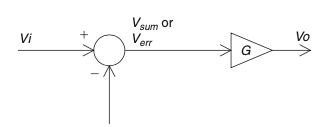
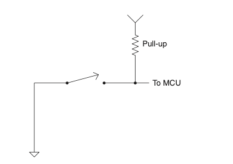

.. _c3:

CHAPTER 3 Pieces Parts
=========================

It takes parts to make a circuit, and lots of pieces, too. The better you know how
these“pieces parts” work, as a friend of mine likes to say, the better stuff you
will build. These days all these parts (as well as the basic three) come in differ-
ent package types but generally two categories, SMT and TH. SMT stands for
surface mount technology and TH means through hole. Through hole is the
older of the two types. It was and is easy to prototype with and typically has
pins poking through holes in the PCB or printed circuit board. [1]_ Surface mount
was invented to make things smaller generally speaking and also accelerated
automatic assembly. Its distinguishing factor is that it mounts to the surface
of one side of a PCB. While the shape and sizes change the functions do not.
As we look at some pictures of typical parts please note that the pin-out and
actual parts may vary. [2]_

PARTIALLY CONDUCTING ELECTRICITY
------------------------------------

Semiconductors
~~~~~~~~~~~~~~~~~~

Texts are available that can give you the quantum mechanical principles on which
a semiconductor works. However, in this context I think the better thing to do is
to give you a basic intuitive understanding of semiconductor components.

First, what is a semiconductor? Conductor in this case refers to the conduction of
electricity. Think of a semiconductor as a material that partially conducts elec-
tricity or a material that is only semi-good at conducting electricity. It is similar
to the resistor [3]_ that we just learned about; it’s a component that will conduct
electricity but not easily. In fact, the more you push through it, the hotter it gets
as it resists this flow of electricity.

.. [1] It even predates the idea of soldering on a PCB; the first Apple computers were built using a technique called wire wrap to connect components.
.. [2] In working on the third edition I found that this book is getting used quite a bit as a primer for those who haven’t experienced electronics at all so I figured a few pictures to help recognize parts couldn’t hurt!
.. [3] Though the ubiquitous resistor originally was just really thin wires (you can still find that type in power resistors), these days in terms of sheer quantities most resistors are based on a semiconductor.

.. _Figure 3.1:

.. figure:: ./img/75-0.png
    :scale: 50%
    :align: center

    **FIGURE 3.1 A diode.**

Before we move on, there is one other point to make. The world of semicon-
ductor devices can be grouped into two categories: current driven and voltage
driven. [4]_ Current-driven parts require current flow to get them to act. Voltage-
driven devices respond to a change in voltage at the input. How much current
or voltage is needed depends on the device you are dealing with.

Diodes
~~~~~~~~~

We will start our discussion with the diode (see :ref:`Figure 3.1 <Figure 3.1>`). A diode is made of
two types of semiconductors pushed together. They are known as type P and
type N. They are created by a process called doping. In doping the silicon, an
impurity is created in the crystal that affects the structure of the crystal. The type
of impurity created can cause some very cool effects in silicon as it relates to
electron flow.

.. [4] I have seen texts argue this point as“current” really being simply movement of charges (that are “voltage”). However, I believe that using these categories will help you gain an intuitive understanding of these parts.

.. _Figure 3.2:

    **FIGURE 3.2 The PN junction of the diode.**

Some dopants will create a type N structure in which there are some extra
electrons simply hanging out with nowhere to go. Other dopants will create a
type P structure in which there are missing electrons, also called holes. So we
have one type N that will conduct negative charges with a little effort. We have
another type that not only does not conduct but actually has holes that
need filling. A cool thing happens when we smash these two types together;
:ref:`Figure 3.2 <Figure 3.2>` shows a sort of one-way electron valve known as the diode.

Due to the interaction of the holes and the free electrons, [5]_ a diode allows cur-
rent to flow in only one direction. A perfect diode would conduct electricity in
one direction without any effect on the signal. In actuality, a diode has two
important characteristics to consider: the forward voltage drop and the reverse
breakdown voltage—see :ref:`Figure 3.3 <Figure 3.3>`.

.. _Figure 3.3:

    **FIGURE 3.3 Typical diode voltage–current response.**

.. [5] When smashed together, some of the free electrons in the type N material crowd up next to the type P material (they are attracted there because of the positive charge). This creates what is known as a depletion region—an area where there aren’t any free electrons (or charges) to move around, effectively blocking current flow. When you apply a voltage in the correct polarity on the diode, this region gets filled up with free charges, and thus current can pass through it.

Forward Voltage
~~~~~~~~~~~~~~~~~~

The forward voltage is the amount of voltage needed to get current to flow across a
diode. This is important to know because if you are trying to get a signal through a
diode that is less than the forward voltage, you will be disappointed. Another often
overlooked fact is that the forward voltage times the current through the diode is
the amount of power being dissipated at the diode junction (the junction is simply
the place where the P and N materials meet). If this power exceeds the wattage rat-
ing of the diode, you will soon see the magic smoke come out and the diode will
be toast.

For example, you have a diode with a forward-voltage rating of 0.7 V and the
circuit draws 2 A. This diode will be dissipating 1.4 W of energy as heat (just
like a resistor). Verifying that your selection of diode can handle the power
needed is an important rule of thumb.

Reverse Breakdown Voltage
~~~~~~~~~~~~~~~~~~~~~~~~~~~~~~

Although a perfect diode could block any amount of voltage, the fact is, just
like humans, every diode has its price. If the voltage in the reverse direction gets
high enough, current will flow. The point at which this happens is called the
*breakdown voltage or the peak inverse voltage*. [6]_ This voltage usually is pretty high,
but keep in mind that it can be reached, especially if you are switching an
inductor or motor in your circuit.

Transistors
~~~~~~~~~~~~~

The next type of semiconductor is made by tacking on another type P or type
N junction to the diode structure. It is called a BJT, for bipolar junction transistor,
or transistor for short. One the following page is a picture of a couple common
transistor packages—surface mount and through hole (:ref:`Figure 3.4 <Figure 3.4>`). They come
in two flavors: NPN and PNP-—see :ref:`Figure 3.5 <Figure 3.5>`. I presume you can guess where
those labels came from.

At first glance you would probably say,“Isn’t this just a couple of diodes
hooked up back to back? Wouldn’t that prevent current from flowing in either
direction?” Well, you would be correct. It is a couple of diodes tied together,
and yes, that prevents current flow. That is, unless you apply a current to the
middle part, also known as the base of the transistor. When a current is applied
to the base, the junction is energized [7]_ and current flows through the transistor.
The other connections on the transistor are called the *collector* and the *emitter*.

The NPN needs current to be pushed into the base to turn the transistor on,
whereas the PNP needs current to be pulled out of the base to turn it on. [8]_ In
other words, the NPN needs the base to be more positive than the emitter,

.. [6] It is interesting to note that there is a type of diode called a zener in which this breakdown voltage is controlled and counted on. I would further stress the importance of calculating power in a zener. In this case, however, it is the zener voltage or the reverse voltage that you must multiply by current to calculate the power dissipation. Isn’t zener a cool word to say?!
.. [7] Like the diode, charges from the base connection fill up the depletion region and thus current can begin flowing.
.. [8] In this case I am referring to *conventional flow*, as it is called. For more about this, read the AC/DC and a dirty little secret section in :ref:`Chapter 2 <c2>`.

.. _Figure 3.4:

    **FIGURE 3.4 Transistor SMT and TH.**

whereas the PNP needs the base to be more negative than the emitter. Remember
the similarity to the diode? It is so close that the base-to-emitter junction behaves
exactly like a diode, which means that you need to overcome the forward-voltage
drop to get it to conduct.

.. _Figure 3.5:

    **FIGURE 3.5 Smash diodes together to make a transistor.**

Whoever is in charge of making up component symbols has made it easy for us.
There is a very“diode-like” symbol on the emitter-to-base junction that indicates
the presence of this diode. Also, please note that I keep talking about current into
and out of the base of the transistors. Transistors are current-driven devices; they
require significant current flow to operate. Most times the current flow needed
in the base is 50 to 100 times less than the amount flowing through the emitter
and collector, but it is significant compared to what are called voltage-driven devices.

Transistors can be used as amplifiers and switches. We should consider both
types of applications.

Transistors as Switches
~~~~~~~~~~~~~~~~~~~~~~~~~~~

In today’s digital world, transistors are often used as switches amplifying the
output capability of a microcontroller for example. Since this is such a common
application, we will discuss some design guidelines for using transistors in this
manner.

Saturation
~~~~~~~~~~~~~~~~~~~~~~~~~~~

When you use a transistor as a switch, always consider if you are driving the
device into saturation. Saturation occurs when you are putting enough current
into the base to get the transistor to move the maximum amount through the
collector. Many times I have seen an engineer scratching his head over a transis-
tor that wasn’t working right, only to find that there was not enough current
going into the base.

Use the Right Transistor for the Job
~~~~~~~~~~~~~~~~~~~~~~~~~~~

Use an NPN to switch a ground leg and a PNP to switch a Vcc leg. This might
seem odd to you at first. After all, they are both like a switch, right? Well, they
are like a switch, but the diode drop in the base causes an important difference,
especially when you only have 0 to 5 V to deal with. Consider the two designs
shown in :ref:`Figure 3.6 <Figure 3.6>`.

.. _Figure 3.6:

.. figure:: ./img/f3.6.png
    :align: center

    **FIGURE 3.6 Comparison of different transistors in the same circuit.**

Let’s do a little ISA [9]_ on the less robust circuit. As you decrease the voltage at the
input, current will flow through the base, but the emitter base junction is a
diode, right? That means that whatever voltage the base is at, the emitter is
always 0.7 V higher. Even if you get the input to 0 V exactly, since current has to
flow, the voltage at the base will be a little higher. The voltage at the emitter
will be 0.7 V above that. Notice now that any voltage change at this point will
be reflected at the output. Now contrast that with the more robust design.
When you pull the signal at the input low, current will flow through the base
just like the other design, but do you see the difference? In the second design,
the input voltage can vary quite a bit, and as long as the transistor is in satura-
tion, the voltage drop at the output from collector to emitter will remain the
same.

.. [9] Intuitive signal analysis—see Chapter 1. I have to get an acronym out there if I am to change the engineering world. Too bad all good acronyms mean more than one thing!

The PNP transistor works best in the opposite configuration (see :ref:`Figure 3.7 <Figure 3.7>`).
For a switching application it is more robust when it controls the Vcc leg of
the load. In both cases turning the transistor off is not too difficult; just get
the base within 0.7 V of the emitter and the current will stop flowing.

.. _Figure 3.7:

.. figure:: ./img/f3.7.png
    :align: center

    **FIGURE 3.7 Comparison of different transistors in the same circuit.**

Transistors as Linear Amplifiers
~~~~~~~~~~~~~~~~~~~~~~~~~~~~~~~~~~

Transistors can also be used as linear amplifiers. This is because the amount of
current flowing through the collector is proportional [10]_ to the current through
the base. This is called the beta or HFE of the transistor. For example, if you
put 5 μA into the base of a transistor with a beta of 100, you would get
0.5 mA of collector current. Making this work correctly depends on keeping
the transistor operating inside a couple of important limits.

.. [10] This is also the reason that they are often referred to as current-driven devices.

One limit is created by the diode in the base-to-emitter connection. This diode
needs to remain forward-biased for the transistor to amplify linearly. It is also
important to keep the transistor out of saturation. This can push the transistor
out of its linear region, creating funny results such as clipping. What all this means
is that setting up linear transistor amplifiers can be a bit of a trick. You need to pay
attention to biasing and the HFE, which unfortunately varies considerably from
part to part. These days I rarely use transistors alone as linear amplifiers for two
reasons: The first is the amount of variation from part to part mentioned before
(a real issue when you make millions of circuits), and the second is the fact that
operational amplifiers (which we will discuss later) are so inexpensive [11]_ and easy
to use. If you need the power capability of a transistor, you should try teaming it
up with an op-amp to make life easier!

.. [11] You can buy a quad op-amp for less than three or four transistors these days, so why make it hard on yourself if you don’t have to?

FETs
~~~~~~~~

FETs, or *field effect transistors*, were developed more recently than transistors and
diodes (see Figure 3.8). Why come up with something new? Simple: FETs have
some properties that make them very desirable components. The primary rea-
son they are so slick is that the output of a FET is basically a resistance that var-
ies depending on the voltage at the input. The outputs on an FET are called the
drain and source, whereas the input is known as the *gate*.

.. _Figure 3.8:

    **FIGURE 3.8 The FET.**

Virtually no current is needed at the gate to control an FET; this makes it an
ideal component for amplifying a signal that is weak, since the FET will not
load the signal significantly. In fact, some of the better op-amps use FETs at
their inputs for just this reason. One downside to an FET is that the parts tend
to be easier to break than their transistor cousins. They are sensitive to static
and over-voltage conditions, so be sure to pay attention to the maximum rat-
ings when you use these parts.

One very cool thing about an FET is the drain-to-source connection. It acts just
like a resistor that you control by the voltage at the gate. This in effect makes it
an electronically controlled variable resistor. For this reason, it is common to
find FETs in circuits creating variable gain control. The drain-to-source connec-
tion acts like a resistor in either direction. That is, current can flow either way.
However, you should expect an FET to have a built-in, reverse-biased diode
across the drain-to-source pins. (It is the nature of the construction of the FET
that creates this diode.)

When used in switch mode, a term you should pay attention to is RDSon. This
is the resistance drain to source when the device is turned all the way on. The
lower this number, the less power you will lose across the device as heat. The
voltage across the device will be the current times RDSon, and the power dissi-
pated in heat will be this voltage times the current through the device.
An ohm equals volts divided by current if Ohm’s Law still holds true (by this
point in the book, a resounding Yes! should be on the tip of your tongue).
The inverse of an ohm or 1/R equals current divided by voltage. This is known
as a mho. [12]_ Mhos are to FETs as beta or HFE is to a transistor. This is the unit of
gain, also known as transconductance, that defines the output of the FET. Put X
volts into the gate of the FET, multiply that by the transconductance, and you
will get Y current drain to source.

Just as with transistors, this gain from input to output varies significantly from
part to part. When using the transistors in linear mode, you need to either char-
acterize the component you are using or develop some type of feedback control
method that compensates for the variation to achieve the desired result.

In my experience, some engineers really like FETs and some like the good old
BJT. I say keep both tools in your chest and use the right one for the job at hand.

.. [12] This unit is also known as a Siemens, after that well-known brand name on many electronic gadgets you see around today. (Okay, so it is really named after the guy who started the company that makes the stuff today.) Anyway, I like mho better; it just makes sense, since it is the inverse of an ohm after all. I still have no idea as to the origin of the word mho. Drop me a line if you know where it came from!

PCB
~~~~~~

The printed circuit board is not a specific component like the rest, but the
part that carries all the other parts. :ref:`Figure 3.9 <Figure 3.9>` is an example of a PCB,
one from my very own little development company. You might notice that
it is a combination of SMT and TH technology. Often green in color [13]_ these
parts connect the other parts together using things called traces (the lines
that are really copper wires), and vias (holes that connect layers of traces
together) solder to connect the parts to the PCB. One key item to remember
is that these traces have all of the three basic components, that is, resistance,
inductance, and capacitance. We will cover this in more depth in Chapter 4
when parts aren’t perfect, but one hint that I will give now is you need to
ask first, is it enough to matter given the signals that are on these traces?
At higher frequencies these effects can be very significant, at lower values
not so much. There are plenty of tomes dedicated to PCB layout methodol-
ogies so we won’t get into that depth here. I only hope to help you realize
that the PCB itself is as much a part of your circuit as all the components on
it. Don’t forget that.

.. _Figure 3.9:

.. figure:: ./img/83-0.png
    :align: center

    **FIGURE 3.9 A PCB.**

.. [13] I’m not sure why green is so prolific as you can get any color you want; if any of you know the historical tidbit on that one, send me an email—I’m dying to know!

Random List of Additional Parts
~~~~~~~~~~~~~~~~~~~~~~~~~~~~~~~

Here are a few parts in the semiconductor world that you may or may not have heard of:

.. note::

    **Darlington transistor**. 
        This type of transistor consists of two transistors hooked together to increase the gain, as can be seen by the symbol used to represent it. Note that the base emitter diode drop is basically doubled in a Darlington transistor.

    **SCR**. 
        This is what you get when you create a PNPN junction, called a silicon- controlled rectifier. Basically the combination of a diode and a transistor, it can switch large currents easily. But one caveat—you can turn it on but not off. The current through the SCR must get below the holding current (very small) before it turns itself off. The SCR is part of the thyristor family. TRIAC. This is a cousin to the SCR and also is in the thyristor family. Think of it as two SCRs back to back, making it an effective AC switch. It is often found in solid-state relays and the like.

    **IGBT**. 
        The isolated gate bipolar transistor is best thought of as a combination between a transistor and an FET. An FET is used to push a load of current through a big transistor.

There aren’t really a lot of different variations in semiconductors; they all boil
down to some basic configurations of the P and N materials. It is amazing to
me that such a level of complexity is achieved from just a few parts, but semi-
conductors have truly revolutionized the world as we know it today. The devil
is in the details, however. I can’t stress too much the need to look at the data-
sheet of the part you are using. The more you know about its idiosyncrasies, the
better your designs will be.

.. admonition:: Thumb Rules

   - Diodes are a“one-way” valve for electrons.
   - Diodes have a forward-voltage drop you must overcome before they will conduct.
   - Transistors are current driven.
   - Transistors have a diode in the base that needs to be biased to work right.
   - When using transistors as switches, check saturation current.
   - FETs are voltage driven.
   - FETs tend to be less robust; take care to design plenty of headroom between your circuit and the maximum ratings of the part.
   - FETs are static sensitive.
   - Meticulously study the datasheet of the part you are using.
   - PCB traces have the three basic components: resistance, inductance, and capacitance.

POWER AND HEAT MANAGEMENT
---------------------------

One thing in common with all electrical devices (this side of superconductors)
is the fact that as they operate, heat is generated. This is because in every component (as we will learn later) there is some amount of equivalent resistance.

Resistance times current flow equals a voltage drop, and a voltage drop times
current equals power. Since Ohm’s Law is unavoidable, this power must turn
into heat. Heat is the premier cause of wear and tear in electronic components,
so managing heat is a good thing to know something about. Let’s start from the
inside out.

Junction Temp
~~~~~~~~~~~~~~~~~

Inside a semiconductor, the place where all the magic happens, is called the
junction. This is the point where all the heat comes from as the part operates.
The junction will have a maximum temperature that it can reach before some-
thing goes wrong. You guessed it; you find out just how much it can handle by
reading the datasheet for the part.

Case Temp
~~~~~~~~~~~~~~~~~

The junction is always inside some type of case. Since you can’t measure junction
temperature when you need to test a design, you have to measure case tempera-
ture. There will always be a temperature drop from the junction to the case.
The amount will typically be indicated in the part’s spec sheet. If it says the
case-to-junction thermal drop is 15°C, expect the junction temp to be 15° warmer
than what you measure. Here is where a good engineer will fudge the numbers in
his favor. If the boss asks you to run this part as close to the edge as possible, tell
her you need to be 30° under the junction temp per the spec sheet. Most likely she
won’t know where to look for this information, so will probably believe you and
you will have a more robust design.

Heat Sinking
~~~~~~~~~~~~~~~~~

How hot the case gets depends on the heat sink attached to it. The case itself will
be able to radiate a certain amount into the air around it. If this isn’t sufficient, a
heat sink can be added. One point you should recognize is that a heat sink
(contrary to what you might think, given the name) is not a hole into which
you can dump the heat from the part. A heat sink is more accurately described
as a way to more efficiently transfer heat into the surrounding environment (this
happens to be the air in most cases).

Heat sinks capture that thermal rise and dissipate it into the surrounding air.
Heat sinks are rated by a°C/W number. This number represents how much
the temperature of the device on the sink will rise for every watt of heat gen-
erated. For example, if you put 20 watts of heat on a 3°C/W heat sink, the
power device hooked up to that heat sink will rise 60°C above the ambient
temperature.

Heat sinks can be thought of as heat conductors. Just as some metals are better
electric conductors than others, some metals are better heat conductors. Usually
one goes with the other. Aluminum is a better electrical conductor than steel,
and it is also a better heat conductor. Copper, one of the best electrical
conductors around, is also one of the best heat conductors. Thought of in these
terms, the heat sink conducts heat away from the part. Like the fact that current
always flows in one direction, heat always flows from hot to cold. There are a
couple of ways for this to happen, as we will see now.

Radiation
~~~~~~~~~~~~

Once the heat sink is warm, it will emit infrared radiation; as this energy is
radiated away, the heat sink will cool. Have you ever wondered why so many
heat sinks are black? This is because the color black [14]_ is an efficient radiator,
as this color tends to absorb more infrared radiation (as you probably have
noticed if you have ever worn a black shirt on a sunny day). It will radiate this
heat away as well, as long as the part is in a cooler environment and the sun
isn’t shining on it! Although radiation is a way of getting heat moving away
from your part, in most electronic devices today there are much better ways
to get rid of heat.

.. [14] The color is not a major player when it comes to getting rid of heat, but it does help, so if you really need that last little bit of power handling, go black (but a little more metal will work just as well).

Convection
~~~~~~~~~~~~

The best way to get rid of heat is by moving some air across your heat sink. This
is called convection. There are two ways to achieve convection: one is by placing
the sink so that air that is warmed by proximity to the heat sink rises. As this
happens, cooler air takes its place to be warmed up and the whole process
repeats. (See :ref:`Figure 3.10 <Figure 3.10>`.) Most heat sinks have some type of spec as to free-
air operation that describes their function in this case.

.. _Figure 3.10:

.. figure:: ./img/83-0.png
    :align: center

    **FIGURE 3.10 Convection on a heat sink.**

One quick side note: Free-air convection relies on the presence of gravity (hot
air won’t rise to be replaced by the cooler air without gravity), so if you happen
to be working on a space shuttle experiment, don’t count on free-air convection
for cooling!

A huge difference in cooling a heat sink can be achieved by moving more air
across it. This is commonly accomplished by some type of fan. It is not unusual
to see a heat sink handle 10 times as much power just by placing a fan next to
it. This is the reason that so many devices these days have acquired that prover-
bial hum of a fan that is so prevalent.

The more heat sink area you have in contact with the air, the better it can trans-
fer heat. For this reason, you will see a lot of fins on these parts. More fins mean
more surface area, which means more efficient heat transfer.

Hmmm, here’s a thought: Wouldn’t it really be nice to recapture this heat and
turn it back into power? I know there are thermoelectric devices that generate
electricity when you heat them up, so this seems like a no-brainer. I guess I will
get to that design later, but if any of you reading this get to the punch before
me and make millions with this idea, all I ask is 1%!

Conduction
~~~~~~~~~~~

Another way of moving heat is by conduction. This is how the heat gets from
the part into the heat sink, and it is how the heat travels across the sink as
well. Conduction moves heat very, very well (that is how it gets from the part
into the heat sink), but whatever it is conducting to must be cooler than
where the heat is coming from in order for the heat to flow. Often a liquid
is used to conduct heat away from stuff that gets hot, such as a nuclear reactor
or your car engine. At the end of the day, though, that heat has to go some-
where. That’s why you see a radiator in the front of your car dumping all that
heat collected by the antifreeze into the atmosphere. The engine in my boat
uses the entire lake as a heat sink, with no radiator needed, since it should
be fairly obvious that my piddling little boat isn’t going to have enough
power to raise the average temperature of millions of gallons of water by even
a fraction of a degree. [15]_

.. [15] You might even say,“Forget about the greenhouse effect—what about all this energy we are pouring into the atmosphere off our heat sinks?” If you consider that on average every house in the world dumps 500 W of heat from light bulbs alone into the atmosphere, and you figure there are about a billion houses, that comes out to a lot of energy! Is it enough to raise the temperature of the Earth? I would have to dig a lot further back into chemistry classes than I would like to figure that out. However, since it is fun to simply spout generalities, I predict that sooner or later, if we keep making more heat, we will cook ourselves! Of course, if the sun were to sneeze even just a bit, we could find ourselves wishing we had those heaters going!

Can You Dump It into a PCB?
~~~~~~~~~~~~~~~~~~~~~~~~~~~~

This is a question that I have often heard: Can you use the PCB as a heat sink?
The answer is yes. In fact, the PCB is simply copper plating, and we know that
copper is a good heat conductor, so it follows that it can be used as a heat sink.
Okay, here it comes… but… how do you know how well the PCB radiates the
heat into the atmosphere? That is something you will most likely have to test to
figure out. There are just so many variables in calculating this that it is faster to
lay out the PCB, stick the part on, and try it. Here are some items to note when
you’re using a PCB as a heat sink:

- A lot of little vias connecting the top layer to the bottom one will help increase the amount of surface area you have to dissipate the heat.
- The PCB in this area is going to get warm. That means expansion and contraction of the PCB. You might find that this could cause mechanical damage over time or even crack solder joints and PCB connections.
- I would recommend keeping the PCB heat sinks under 60°C. A cool rule of thumb I have learned is that if a metal surface is hot enough to burn you at the touch, it is more than 60°C. [16]_

Heat Spreading
~~~~~~~~~~~~~~~~~

One of the major factors that control heat conduction when you have two
materials next to each other is the surface area of the two materials that are
touching. One other thing that affects conduction of a single material is the
thickness of the material.

This gives rise to a technique known as heat spreading. A big, thick, very ther-
mally conductive material is bolted up to the“hot part” to serve as a high-speed
conduit to a bigger heat sink, where all the fins for radiating the heat are
located. [17]_ The idea is to keep the junction temperature of the device lower by
getting the heat away faster.

Does it work, you ask? Truth is, it can work, but there are many variables involved
(such as the thermal conductivity between the heat spreader block and the rest of
the heat sink, for example). As in the case of using the PCB as a heat sink, you should
take it to the test lab to see if it is really working well or even helping. Remember,
though, there will be a temperature gradient everywhere that there is a junction
between two parts; the fewer junctions, the better your heat sink will work.

.. [16] By no means am I endorsing touching a hot component as a way of checking its temperature! I hope that this disclaimer is enough to keep the lawsuit-happy people out there off my case. I wouldn’t want anyone to get burned. I could go on about the legal ills that are crippling our world, but that is a whole other topic. Suffice it to say, if you happen to get burned by accident, you can be reasonably sure the metal you touched was more than 60°C. Please don’t touch it on purpose; there are much more accurate ways of measuring temperature than by using your finger.
.. [17] If you take a close look at power heat sinks, you will notice a varying thickness in the aluminum, from the attachment point to the fins, that serves this very purpose.

.. admonition:: Thumb Rules

   - Meticulously study the datasheet of the part you are using (repeated for emphasis).
   - Heat is the biggest killer of electronic components.
   - Most heat sinks dump heat into the air around them, most commonly by convection.
   - If a part burns you when you touch it, it is more than 60°C.
   - You can use a PCB as a heat sink, but take care to test it.

THE MAGICAL MYSTERIOUS OP-AMP
---------------------------------

Op-Amps: The Misunderstood Magical Tool!
~~~~~~~~~~~~~~~~~~~~~~~~~~~~~~~~~~~~~~~~~~~~

In my opinion, op-amps are probably the most misunderstood yet potentially
useful IC at the engineer’s disposal. It makes sense that if you can understand
this device, you can put it to use, giving you a great advantage in designing suc-
cessful products.

What Is an Op-Amp, Really?
~~~~~~~~~~~~~~~~~~~~~~~~~~~~

Do you understand how an op-amp works? Would you believe that op-amps
were designed to make it easier to create a circuit? You probably didn’t
think that the last time you were puzzling over a misbehaving breadboard
in the lab.

In today’s digital world it seems to be common practice to breeze over the topic
of op-amps, giving the student a dusting of commonly used formulas without
really explaining the purpose or theory behind them. Then the first time a new
engineer designs an op-amp circuit, the result is utter confusion when the cir-
cuit doesn’t work as expected. This discussion is intended to give some insight
into the guts of an operational amplifier and to give the reader an intuitive
understanding of op-amps.

.. _Figure 3.11:

.. figure:: ./img/f3.11.png
    :align: right

    **FIGURE 3.11 Your basic op-amp.**

One last point: Make sure that you read this section first! It is my opinion that
one of the causes of“op-fusion” (op-amp confusion), as I like to call it, is that
the theory is taught out of order. There is a very specific order to learning the
theory, so please understand each section before moving on. First, let’s take a
look at the symbol of an op-amp (see :ref:`Figure 3.11 <Figure 3.11>`).
There are two inputs, one positive and one negative, identified by the + and – signs. There is one output.

The inputs are high impedance. I repeat. The inputs are high impedance. Let me
say that one more time. The inputs are high impedance! This means that they have
(virtually) no effect on the circuit to which they are attached. Write this down
because it is very important. We will talk about this in more detail later. This
important fact is commonly forgotten and contributes to the confusion I mentioned earlier.

The output is low impedance. For most analyses it is best to consider it a voltage source. Now let’s represent the op-amp, as in :ref:`Figure 3.12 <Figure 3.12>`, with two separate symbols.

You see here a summing block and an amplification block. You may remem-
ber similar symbols from your control theory class. Actually, they are not just
similar—they are exactly the same. Control theory works for op-amps. (There
will be more on this topic coming up later.)

.. _Figure 3.12:

.. figure:: ./img/f3.12.png
    :align: center

    **FIGURE 3.12 What is really inside an op-amp?**

First, let’s discuss the summing block. You will notice that there is a positive
input and a negative input on the summing block, just as on the op-amp.
Recognize that the negative input is as though the voltage at that point is
multiplied by–1. Thus, if you have 1 V at the positive input and 2 V at the
negative input, the output of this block is–1. The output of this block is
the sum of the two inputs where one of the inputs is multiplied by–1. It
can also be thought of as the difference of the two inputs and represented
by this equation:

.. math::
   :label: equation 3.1

   V_{sum} = (V+) - (V-)

Now we come to the amplification block. The variable G inside this block
represents the amount of amplification that the op-amp applies to the sum
of the input voltages. This is also known as the open-loop gain of the op-amp.
In this case, we will use a value of 50,000. I hear you say,“How can that be?
The amplification circuit I just built with an op-amp doesn’t go that high!” Just
trust me for a moment. We will get to the amplification applications shortly.
Just go find the open-loop gain in the manufacturer’s datasheet. You will see
this level of gain or even higher is typical of most op-amps.

Now let’s do a little analysis. What will happen at the output if you put 2 V on
the positive input and 3 V on the negative input? I recommend that you
actually try this on a breadboard. I want you to see that an op-amp can and will
operate with different voltages at the inputs. However, a little math and some
common sense will also show us what will happen. For example:

.. math::
   :label: equation 3.2

   V_{out} = 50,000 * (2 - 3), \text{or} - 50,000V

Now, unless you have a 50,000 V op-amp hooked up to a 50,000 V bipolar sup-
ply, you won’t see–50,000 V at the output. What will you see? Think about it a
minute before you read on. The output will go to the minimum rail. In other
words, it will try to go as negative as possible. This makes a lot of sense if
you think about it like this. The output wants to go to–50,000 V and obey
the preceding mathematics. It can’t get there, so it will go as close as possible.
The rails of an op-amp are like the rails of a train track; a train will stay within
its rails if at all possible. Similarly, if an op-amp is forced outside its rails, dis-
aster occurs and the proverbial magic smoke will be let out of the chip. The rail
is the maximum and minimum voltage the op-amp can output. As you can
intuit, this depends on the power supply and the output specifics of the
op-amp. Okay, reverse the inputs. Now the following is true:

.. math::
   :label: equation 3.3

   V_{out} = 50,000 * (3 - 2), \text{or} + 50,000V

What will happen now? The output will go to the maximum rail. How do you
know where the output rails of the op-amp are? As noted before, that depends
on the power supply you are using and the specific op-amp. You will need to
check the manufacturer’s datasheet for that information. Let’s assume that we
are using an LM324, with a +5 V single-sided supply. In this case, the output
would get very close to 0 V when trying to go negative and around 4 V when
trying to go positive.

At this time I would like to point something out. The inputs of the op-amp are
not equal to each other. Many times I have seen engineers expect these inputs to
be the same value. During the analysis stage, the designer comes up with
currents going into the inputs of the device to make this happen (remember,
high impedance inputs, virtually zero current flow). Then when he tries it out,
he is confused by the fact that he can measure different voltages at the inputs.

In a special case we will discuss in the next section, you can make the assumption that these inputs are equal. It is not the general case! This is a common
misconception. You must not fall into this trap or you will not understand
op-amps at all.

The previous examples indicate a very neat application of op-amps: the comparator circuit. This is a great little circuit to convert from the analog world to
the digital one. Using this circuit you can determine whether one input signal
is higher or lower than another. In fact, many microcontrollers use a comparator circuit in analog-to-digital conversion processes. Comparator circuits
are in use all around us. How do you think the streetlight knows when it is
dark enough to turn on? It uses a comparator circuit hooked up to a light
sensor. How does a traffic light know when there is car present above the
sensors to trigger a cycle to green? You can bet there is a comparator circuit
in there.

.. admonition:: Thumb Rules

   - The inputs are high impedance; they have negligible effects on the circuit to which they are hooked.
   - The inputs can have different voltages applied to them; they do not have to be equal.
   - The open-loop gain of an op-amp is very high.
   - Due to the high open-loop gain and the output limitations of the op-amp, if one input is higher than the other, the output will“rail” to its maximum or minimum value. (This application is often called a comparator circuit.)

NEGATIVE FEEDBACK
------------------

If you didn’t just finish reading them, go back and read the last section’s thumb
rules. They are very important in developing a correct understanding of what an
op-amp does. Why are these points important? Let’s go over a little history.

Up until the invention of op-amps, engineers were limited to the use of
transistors in amplification circuits. The problem with transistors is that,
being“current-driven” devices, they always affect the signal of the circuit that
the designer wants to amplify by loading the circuit. Also, due to manufacturing
tolerances of transistors, the gain of the circuits would vary significantly. All in all,
designing an amplifier circuit was a tedious process that required much trial and
error. What engineers wanted was a simple device that they could attach to a signal
that could multiply the value by any desired amount. The device should be easy to
use and require very few external components. To paraphrase, operation of this
amplifier should be a“piece of cake.” At least that is the way I remember it. The
other way the name operational amplifier, or op-amp, came into being was to
describe the fact that these amplifiers were used to create circuits in analog compu-
ters, performing such operations as multiplication, among others.

To begin with, let’s take a look at the special case I mentioned in the previous
discussion. First, return to the previous block diagram and add a feedback loop,
as shown in :ref:`Figure 3.13 <Figure 3.13>`.

.. _Figure 3.13:

.. figure:: ./img/f3.13.png
    :align: center

    **FIGURE 3.13 Original op-amp symbol with negative feedback.**

You will see that I have represented the forward or open-loop gain with the
value G and the feedback gain with the value H. The first thing you should
notice is that the output is tied to the negative input. This is called negative feedback. What good is negative feedback? Let’s try an experiment. Hold your hand
an inch over your desk and keep it there. You are experiencing negative feedback right now. You are observing via sight and feel the distance from your
hand to the desk. If your hand moves, you respond with a movement in the
opposite direction. This is negative feedback. You invert the signal you receive
via your senses and send it back to your arm. The same thing occurs when nega-
tive feedback is applied to an op-amp. The output signal is sent back to the
negative input. A signal change in one direction at the output causes a Vsum to
change in the opposite direction.

You should get an intuitive grasp of this negative feedback configuration. Look at
the previous diagram and assume a value of 50,000 for G and a value of 1 for H.
Now start by applying a 1 to the positive input. Assume that the negative input is
at 0 to begin with. That puts a value of 1 at the input of the gain block G and the
output will start heading for the positive rail. But what happens as the output
approaches 1? The negative input also approaches 1. The output of the summing
block is getting smaller and smaller. If the negative input goes higher than 1,
the input to the gain block G will go negative as well, forcing the output to go
in the negative direction. Of course, that will cause a positive error to appear at
the input of the gain block G, starting the whole process over again. Where will
this all stop? It will stop when the negative input is equal to the positive input.
In this case, since H is 1, the output will also be 1.

You have learned (or will learn) this in control theory. Look at the basic control
equation in reference to :ref:`Figure 3.13 <Figure 3.13>`:

.. math::
   :label: equation 3.4

   Vo = Vi * \frac{G}{1 + G * H}

What happens when G is very large? [18]_ The 1 in the denominator becomes insignificant and the equation becomes:

.. math::
   :label: equation 3.5

   Vo = \text{approximately} \space Vi * (1/H)

H in this case is 1, [19]_ so it follows that:

.. math::
   :label: equation 3.6

   Vo = \text{approximately} \space Vi * (1/1)

or:

.. math::
   :label: equation 3.7

   Vo =  Vi

.. [18] Remember, an op-amp has a very large G!
.. [19] H doesn’t have to be 1 for this special case to occur; there simply needs to be negative feedback present.

.. _Figure 3.14:

    **FIGURE 3.14 Original op-amp symbol with negative feedback.**

This is the special case in which you can assume that the inputs of the op-amp
are equal. Apply it only when there is negative feedback. When feedback gain is
1, this also demonstrates another neat op-amp circuit: the voltage follower.
Whatever voltage is put on the positive input will appear at the output.

Take a look at Figure 3.14. This is an op-amp in the negative feedback configuration. When you look at this, you should see a summer and an amplifier, just as in the previous drawing. In this configuration, you can make the assumption that the positive and negative inputs are equal.

Negative feedback is the case that is drilled into you in school and is the one
that often causes confusion. It is a special case—a very widely used special case.
Nonetheless, if you do not have negative feedback and the inputs and output
are within operational limits, you must not assume that the inputs of the
op-amp are equal.

Why is this negative feedback configuration used so much? Remember the rea-
son that op-amps were invented? Amplifiers were tough to make. There had to
be an easier way. Take a look at the control equation again:

.. math::
   :label: equation 3.8

   Vo =  Vi * \frac{G}{1 + G * H}

I have already shown that for large values of G, the equation approximates:

.. math::
   :label: equation 3.9

   Vo =  Vi * \frac{1}{H}

You will see that the amplification of Vi depends on the value of H. For example, if we can make H equal 1/10, then it follows that:

.. math::
   :label: equation 3.10

   Vo =  Vi * (1 / (1/ 10))

or:

.. math::
   :label: equation 3.11

   Vo =  Vi * 10

How do we go about doing that? Do you remember the voltage divider circuit?
That would be very useful here, since we would like H to be the equivalent of
dividing by 10. Let’s insert the voltage divider circuit in place of H.

.. _Figure 3.15:

.. figure:: ./img/f3.15.png
    :align: right

    **FIGURE 3.15 Negative feedback is a voltage divider.**

Notice that the input to the voltage divider comes from the output of the op-amp
Vo. The output of the voltage divider goes to the negative input of the op-amp
V–. Now, will the op-amp input V– affect the voltage divider circuit? No! It has
high impedance. It will not affect the divider. (If you didn’t get that, go back
and read the“What Is an Op-Amp, Really?” section’til you do!)

Since the input to the divider is hooked to a voltage source, and the output is
not affected by the circuit, we can calculate the gain from Vo to V– very easily
with the voltage divider rule shown in :ref:`Figure 3.15 <Figure 3.15>`.

.. math::
   :label: equation 3.12

   \frac{V-}{Vo} = \frac{Ri}{Ri + Rf} = H

Thus it follows that:

.. math::
   :label: equation 3.13

   \frac{1}{H} = \frac{Ri + Rf}{Ri} = H

or, with a little algebra:

.. math::
   :label: equation 3.14

   \frac{1}{H} = \frac{Ri}{Ri} + \frac{Rf}{Ri} = \frac{Rf}{Ri} + 1 \text{or} + \frac{1}{H} = \frac{Rf}{Ri} + 1

There you have it—the gain of this op-amp circuit. Let’s look at it another way.
Go back to the previous equation:

.. math::
   :label: equation 3.15

   \frac{V-}{Vo} = \frac{Ri}{Ri + Rf}

We learned that in this special case of negative feedback, we can assume that ``V– = V+``. This is because the negative feedback loop is pushing the output around, trying to reach this state. So let’s assume that ``Vi= V–``, which is where the input to our amplifier will be hooked up. Now we can replace ``V+`` with ``Vi``, and the equation looks like the following:

.. math::
   :label: equation 3.16

   \frac{Vi}{Vo} = \frac{Ri}{Ri + Rf}

What we really want to know is, what does the circuit do to Vi to get Vo? Let’s do a little math to come up with this equation:

.. math::
   :label: equation 3.17

   Vo = Vi * \frac{Ri + Rf}{Ri} = Vi * \frac{Rf}{Ri + 1} \text{or} \frac{Vo}{Vi} = \frac{Rf}{Ri} + 1

Please note that this is equal to 1/H. You see, the gain of this circuit is con-
trolled by two simple resistors. Believe me, this is a whole lot easier to define
and calculate than a transistor amplification circuit. As you can see, the opera-
tion of this amplifier is pretty easy to understand.

.. admonition:: Thumb Rules

   - The negative feedback configuration is the only time you can assume that ``V– = V+``.
   - The high impedance inputs and the low impedance output make it easy to calculate the effects simple resistor networks can have in a feedback loop.
   - The high open-loop gain of the op-amp is what makes the output gain of this special case equal to approximately 1/H.
   - Op-amps were meant to make amplification easy, so don’t make it hard!

POSITIVE FEEDBACK
--------------------

What is positive feedback? Let’s take a look at a real-world example. You are hard
at work one day when your boss stops by and says,“Hey, you should know that
you’ve handled your project very well, and that new op-amp circuit you built is
awesome!” After you bask in his praise for a while, you find yourself working
even harder than before. [20]_ This is positive feedback. The output is sent back to
the positive input, which in turn causes the output to move further in the same
direction. Let’s look at the op-amp diagram again—see :ref:`Figure 3.16 <Figure 3.16>`.

.. [20] Ok, this is only true if you actually believe your boss.

Now we will do a little intuitive analysis. Don’t forget the Thumb Rules we learned
in the last two sections. Review them now if you need to.

Begin by applying 0 V to :math:`V_{in}` . In this case the input is connected to V–. You also see
that the output is connected via a resistor to a reference voltage, Vref . What is the
voltage at V–? Does the voltage at V– equal the voltage at V+? No! (Don’t believe
me? Check the Thumb Rules!)

What is the voltage at V+? That depends on two things: the voltage at Vref and the
output voltage of the amplifier, Vo. Does the V+ input load the circuit at all?

.. _Figure 3.16:

    **FIGURE 3.16 Positive feedback on an op-amp.**

No, it does not. To begin the analysis, let :math:`V_{ref} = 2.5 V`, and assume that the
output is equal to 0 V. Now what is the voltage at V+? What do you know—since
Vo is equal to 0, we have a basic voltage divider again. Assume :math:`R_{ref} = 10 K` and
``Rh= 100 K``:

.. math::
   :label: equation 3.18

   V+ = V_{ref} * \frac{Rh}{Rh + R_{ref}} = 2.5 * \frac{100k}{110k} = 2.275V

So now there is 2.275 V at V+ and 0 V at V–. What will the op-amp do? Let’
refer to the op-amp block diagram we learned earlier—see :ref:`Figure 3.17 <Figure 3.17>`.

.. _Figure 3.17:

    **FIGURE 3.17 Start with what is really inside**

What do we have? :math:`V_{sum}` is equal to ``V+ – V–`` or, in this case, :math:`V_{sum} = 2.275 V`. ``Vo`` is
equal to :math:`V_{sum} * G`. The output will obviously go to the positive rail. (If this is not
obvious to you, you need to review“What Is an Op-Amp, Really?” again.) Now
we have Vo at the positive rail. Let’s assume that it is 4 V for this particular
op-amp. (Remember, the output rails depend on the op-amp used, and you
should always refer to the datasheets for that information. 4 V used in this case
is typical for an LM324 with a 0 to 5 V supply.)

The output is at 4 V and V– is at 0 V, but what about V+? It has changed. We
must go back and analyze it again. (Do you feel like you are going in circles?
You should. That is what feedback is all about; outputs affect inputs, which
affect the outputs, and so on, and so on.) The analysis this time has changed
slightly. It is no longer possible to use just the voltage divider rule to calculate
V+. We must also use *superposition*.

In superposition, you set one voltage source to 0 and analyze the results, and
then you set the other source to 0 and analyze the results. Then you add the
two results together to get the complete equation. Let’s do that now. We already
know the result due to :math:`V_{ref}` from our previous example. :ref:`Figure 3.18 <Figure 3.18>` shows the
positive feedback diagram again for reference.

.. _Figure 3.18:

    **FIGURE 3.18 Positive feedback on an op-amp.**

Here is the result due to :math:`V_{ref}` using the voltage divider rule:

.. math::
   :label: equation 3.19

   V + \text{due to } V_{ref} = \frac{V_{ref} * Rh}{Rh + R_{ref}}

Here is the result due to Vo using the voltage divider rule:

.. math::
   :label: equation 3.20

   V + \text{due to } Vo = \frac{Vo * R_{ref}}{R_{ref} + Rh}

The result due to both is thus:

.. math::
   :label: equation 3.21

   & V + = (V + \text{due to } V_{ref}) + (V + \text{due to } Vo) \text{ or}, \\
   & V + = \frac{V_{ref} * Rh}{Rh + R_{ref}} + \frac{Vo * R_{ref}}{Rh + R_{ref}}

Now insert all the current values and we have:

.. math::
   :label: equation 3.22

   V + = \frac{2.5 * 100K}{110K} + \frac{4 * 10K}{110K} = 2.64V

Is this circuit stable now? Yes, it is. We have 0 V at V– and 2.64 V at V+. This
results in a positive error, which, when amplified by the open-loop gain of
the op-amp, causes the output to go to the positive rail. This is 4 V, which is
the state that we just analyzed.

Now let’s change something and see what happens. Let’s start slowly ramping
up the voltage at V–. At what point will the op-amp output change? Right after
the voltage at V– exceeds the voltage at V+. This results in a negative error,
causing the output to swing to the negative rail. And what happens to V+? It
changes back to 2.275 V, as we calculated above. So how do we get the output
to go positive again? We adjust the input to less than 2.275 V. The positive
feedback reinforces the change in the output, making it necessary to move the
input farther in the opposite direction to affect another change in the output.

.. _Figure 3.19:

.. figure:: ./img/f3.19.png
    :align: center

    **FIGURE 3.19 Simple op-amp circuit for your bench to help you understand both positive and negative feedback.**

The effect that I have just described is called hysteresis. It is an effect very commonly created using a positive feedback loop with an op-amp.“What is hysteresis good for?” you ask. Well, heating your house, for one thing. It is hysteresis
that keeps your furnace from clicking on and off every few seconds. Your oven
and refrigerator use this principle as well. In fact, the disk drive on the
computer I used to write this paragraph uses hysteresis to store information.

*One important item to note*: The size of the hysteresis window depends on the
ratio of the two resistors :math:`R_{ref}` and Rh. In most typical applications, Rh is much
larger than :math:`R_{ref}` . If the signal at Vi is smaller than the window, it is possible to
create a circuit that latches high or low and never changes. This is usually not
desired and can be avoided by performing the preceding analysis and compar-
ing the calculated limits to the input signal range.

Now that we have covered the three basic configurations of an op-amp, let’s put
together a simple circuit that uses them. Here, we have a voltage follower, hooked
to a comparator using hysteresis, with an LED as an indicator (:ref:`Figure 3.19 <Figure 3.19>`).
You should build this in your lab to gain an intuitive understanding of what
has been discussed. Experiment with feedback changes in all parts of the circuit.
Note that you can change the input potentiometers from 5 to 100 K without
affecting the voltage at which the comparator switches.

All About Op-Amps
~~~~~~~~~~~~~~~~~~~~

There you have it—the basics of op-amp circuits. With this information, you
can analyze most op-amp circuits you come across and build some really neat
ones yourself. What about filters, you say! Well, a filter is nothing more than an
amplifier that changes gain, depending on the frequency. Simply replace the resistors with a cap or inductor and thus add a frequency component to the circuit.

What about oscillators, you say? These are feedback circuits where timing of the
signals is important. [21]_ They still follow the preceding rules. I must reiterate my
belief that grasping the basics of any discipline is the most important thing you
can do. If you understand the basics, you can always build on that foundation
to obtain higher knowledge, but if you do not“get the basics,” you will flounder
in your chosen field.

.. [21] Just the right amount of delay in the feedback and you can get a signal to chase itself back and forth and thus oscillate.

.. admonition:: Thumb Rules

   - Op-amp inputs are high impedance (that means no current flows into the inputs); this can’t be said too often, so forgive me for repeating it.
   - Op-amp outputs are low impedance.
   - ``V+ = V–`` only if negative feedback is present; they don’t have to be equal if feedback is positive.
   - Positive feedback creates hysteresis when properly set up.
   - Positive feedback can make an output latch to a state and stay there.
   - Positive feedback with a delay can cause an oscillation.
   - Op-amps were designed to make it easy, so don’t make it hard!

IT’S SUPPOSED TO BE LOGICAL
-----------------------------

Binary Numbers
~~~~~~~~~~~~~~~~~~~

**Binary numbers** are so basic to electrical engineering that I nearly omitted this
section on the premise that you would already know about them. However,
my own words,“drill the basics,” kept haunting me. So if you already know
this stuff forward and backward, you are authorized to skip this section, but
if those same words start to haunt you, as I hope they will, you should at least
skim through it.

Binary numbers are simply a way to count with only two values, 1 and 0—
convenient numbers for reasons we will discuss later. Binary is also known as
base 2. There are other bases, such as base 8 (octal) and base 16 (hexadecimal),
that are often used in this field, but it is primarily for the reason that they rep-
resent binary numbers easily. The common base that everyone is used to is
decimal, [22]_ also known as base 10. Think of it this way: The base of the counting
system is the point at which you move a digit into the left column and start
over at 0. For example, in base 10 you count 0, 1, 2, 3… 7, 8, 9 and then
you chalk one up in the left column and start over at 0 for the number 10. In
base 8 you only get to 7 before you have to start over: 0, 1, 2… 5, 6, 7, 10,
11, and so on. Base 16 starts over at 15 in the same way, but to adhere to the
rule of one digit in the column before we roll over into the next digit, we use
letters to represent 10 through 15. :ref:`Table 3.1 <Table 3.1>` shows an easy way to see this
relationship.

.. [22] You can chalk that up to the fact that we have 10 fingers on our hands. In fact, the ancient Mayans used a base-20 system of counting, presumably due to the fact that they ran around without any shoes.

.. _Table 3.1:

**Table 3.1 Decimal and Hexadecimal Numbers**

.. list-table::

    * - **Decimal, Base 10**
      - **Hexadecimal, Base 16**
    * - 0 
      - 0
    * - 1 
      - 1
    * - 2 
      - 2
    * - 3 
      - 3
    * - 4 
      - 4
    * - 5 
      - 5
    * - 6 
      - 6
    * - 7 
      - 7
    * - 8 
      - 8
    * - 9 
      - 9
    * - 10 
      - A
    * - 11 
      - B
    * - 12 
      - C
    * - 13 
      - D
    * - And so on… 
      - 

Note again how the numbers start over at the corresponding base. You might
also notice that I started at 0 in the counting process. [23]_ It should be stressed
that 0 is an important part of any counting system, a fact that I think tends
to get overlooked. If you think about it, when 0 is included, the point at
which base 10 rolls over is the 10th digit and the point at which base 8 rolls
over is the 8th digit. The same relationship exists for any base number you
use.

So, let’s get back to binary or base 2. The first time I saw binary numbers I
thought,“Wow, what a tantalizing [24]_ numeric system; just as soon as you
make one move to get where you are going, it is time to start over again.”
The numbers go like this: 0, 1, 10, 11, 100…. Again, I think a table is in
order—see :ref:`Table 3.2 <Table 3.2>`.

.. [23] Here is your chance to giggle at the fact that this new version of my book has a Chapter 0—that is, if you are inclined to think that my dry engineering sense of humor is in fact funny.
.. [24] Again, it is an odd sort of person who will find a numeric system“tantalizing,” but I never said I wasn ’t odd!

.. _Table 3.2:

**Table 3.2 Decimal, Binary, Octal, and Hexadecimal Number Comparison**

.. list-table::

    * - **Decimal, Base 10**
      - **Binary, Base 2**
      - **Octal, Base 8**
      - **Hexadecimal, Base 16**
    * - 0 
      - 0
      - 0 
      - 0
    * - 1 
      - 1 
      - 1 
      - 1
    * - 2 
      - 10 
      - 2 
      - 2
    * - 3 
      - 11 
      - 3 
      - 3
    * - 4 
      - 100 
      - 4 
      - 4
    * - 5 
      - 101 
      - 5 
      - 5
    * - 6 
      - 110 
      - 6 
      - 6
    * - 7 
      - 111 
      - 7 
      - 7
    * - 8 
      - 1000 
      - 10 
      - 8      
    * - 9 
      - 1001 
      - 11 
      - 9      
    * - 10 
      - 1010 
      - 12 
      - A      
    * - 11 
      - 1011 
      - 13 
      - B
    * - 12 
      - 1100 
      - 14 
      - C
    * - 13 
      - 1101 
      - 15 
      - D
    * - 14 
      - 1110 
      - 16 
      - E
    * - 15 
      - 1111 
      - 17 
      - F
    * - 16 
      - 10000 
      - 20 
      - 10
    * - 17 
      - 10001 
      - 21 
      - 11
    * - 18 
      - 10010 
      - 22 
      - 12
    * - And so on ...
      - 
      - 
      - 

.. _Table 3.3:

**Table 3.3 Doubling Digits**

.. list-table::

    * - Decimal 
      - 128 
      - 64 
      - 32 
      - 16 
      - 8 
      - 4 
      - 2 
      - 1
    * - Binary 
      - 10000000 
      - 1000000 
      - 100000 
      - 10000 
      - 1000 
      - 100 
      - 10 
      - 1

Notice how base 8 and base 16 roll over right at the same point that the binary
numbers get an extra digit. That is why they are convenient to use in representing binary numbers. You might also have noticed that decimal numbers don’t
line up as nicely.

Another pattern you should see in this table is that you hit 20 in base 8 at the
same point at which you see 10 in base 16. This makes sense because one base
is exactly double the other. Can you extrapolate what base 4 might do?
This leads to another trick with binary numbers. Each significant digit doubles
the value of the previous one (just as every digit you add in decimal is worth
10 times the previous one). Let’s look at yet another table—see :ref:`Table 3.3 <Table 3.3>`.

You can add up the values of each digit where you have a 1 in binary to get the decimal equivalent. For example, take the binary number 101. There is a 1 in the 1s
column and in the 4s column. Add 1 plus 4 and you get 5, which is 101 in binary.
You might also notice that the numbers you can represent double for every digit
you add to the number. For example, four digits let you count to 15, and eight
digits will get you to 255. (This causes some of us more extroverted engineers to
attempt to become the life of the party by showing their friends that they can count
to 1023 with the fingers on their hands. These attempts usually fail.)

All the math tricks you learned with decimal numbers apply to binary as well,
as long as you consider the base you are working in.

For example, when you multiply by 10 in decimal, you simply put a 0 on
the end, right? The same idea applies to binary, but the base is 2, so to
multiply by 2, you simply stick a 0 on the end, shifting everything else to the
left. When dividing by 10 in decimal you simply lop off the last digit and keep
whatever was there as a remainder. Dividing by 2 in binary works the same
way, shifting everything to the right, but the remainder is always 0 or 1—a fact
that is convenient for math routines, as we will learn later.

For whatever reason, most electronic components like to manage binary num-
bers in groups of four digits. This makes hexadecimal (or hex) numbers a type
of shorthand for referring to binary numbers. It is a good shorthand to know.
In the electronics world, each binary digit is commonly referred to as a bit.
A group of eight bits is called a byte and four bits is called a nibble. So if
you“byte” off more than you can chew, maybe you should try a“nibble”
next time.

Back to the point: Since a hex number nicely represents a nibble, and there are
two nibbles in a byte, you will often see two hex numbers used to describe a
byte of binary information. For example, 0101 1111 can be described as 5 F
or 1110 0001 as E 1. In fact, you can easily determine this by looking up the
hex equivalent to any nibble using :ref:`Table 3.2 <Table 3.2>`.

To sum things up, binary numbers are a way to count using only two symbols;
they are commonly referred to using hex numbers as a type of shorthand nota-
tion. When logic circuits came along, the fact that they represented information
with only two symbols—on or off, high or low—made them dovetail nicely
with binary numbers and binary math.

Logic
~~~~~~~~

One of the most incredible growth industries over the last 50 years has come
from the application of electronics to manipulate data based on the principles
of Boolean logic. Originally developed by George Boole in the mid-1800s, Boo-
lean logic is based on a very simple concept yet allows creation of some very
complex stuff.

Let the value 1 mean true, and let the value 0 mean false. In an actual circuit,
1 might typically be any signal between 3 to 5 V, and 0 any signal between
0 to 2.9 V, but what is important in the world of logic is that there are only
two states, 1 or 0. The world is black or white. That said, it is no wonder that
engineers have so quickly grasped the digital domain. I haven’t met an engineer
who doesn’t like his world to follow nice, predictable rules.“Keep it simple” is
a common mantra, and resolving the world into two states sure does simplify
things. It is important to note that at some point in the circuit a decision needs
to be made whether the current value represents a 1 or a 0.

During our study of logic we will refer to a description of logic inputs and out-
puts known as truth tables. In these tables, the inputs are generally shown on the
left and the outputs are on the right. Some basic components that manipulate
logic are called gates. Let’s start with these basics.

The NOT Gate
~~~~~~~~~~~~~~

This is as simple as it gets. The NOT gate inverts whatever signal you put into it;
put in a 1, get a 0 out, and vice versa. Let’s take a transistor and make a NOT
gate, as shown in :ref:`Figure 3.20 <Figure 3.20>`.

.. _Figure 3.20:

.. figure:: ./img/f3.20.png
    :align: center

    **FIGURE 3.20 Transistor NOT gate.**

If you put 0 V into this, you will get 5 V out. If you put 5 V into this, you will get
nearly [25]_ 0 V out. You have effectively inverted the logic symbol. The NOT gate,
also called the inverter, is commonly represented by the symbol shown in
:ref:`Figure 3.21 <Figure 3.21>`. :ref:`Table 3.4 <Table 3.4>` shows the truth table. [26]_

.. [25] Please note that I said nearly 0 volts. The output of this circuit does not quite get all the way to 0, but that doesn’t matter as long as the value is below the maximum level for a 0. That right there is the reason digital is so pervasive.
.. [26] A truth table is a “map” of inputs vs. outputs on a logic device. Kind of makes me wonder what a “lie” table might look like.

.. _Figure 3.21:

    **FIGURE 3.21 Inverter or NOT symbol.**

.. _Table 3.4:

**Table 3.4 NOT Gate Truth Table**

.. list-table::

    * - **Input A** 
      - **Output Q**
    * - 1 
      - 0 
    * - 0 
      - 1

The AND Gate
~~~~~~~~~~~~

The AND function is described by the rule that all inputs need to be true or 1 in
order for the output to be true. If this is true and that is true, this AND that
must be true. However, if either is false, the output must be false. It is defined
by the truth table shown in :ref:`Table 3.5 <Table 3.5>`.

.. _Table 3.5:

**Table 3.5 AND Gate Truth Table**

.. list-table::

    * - **Input A** 
      - **Input B** 
      - **Output Q**
    * - 0
      - 0 
      - 0 
    * - 0
      - 1
      - 0 
    * - 1
      - 0 
      - 0 
    * - 1
      - 1 
      - 1 

We can build this circuit with only a couple of diodes. One way to think of it is that if either input is false, the output will be false—see :ref:`Figure 3.22 <Figure 3.22>`. This function is commonly referred to by the symbol in :ref:`Figure 3.23 <Figure 3.23>`.

.. _Figure 3.22:

    **FIGURE 3.22 Diode AND gate.**

.. _Figure 3.23:

.. figure:: ./img/f3.23.png
    :align: center

    **FIGURE 3.23 AND gate.**

The OR Gate
~~~~~~~~~~~~~~~

Did you notice that three of the input conditions on the AND gate resulted in
a false, or 0, at the output? The OR gate is sort of the opposite, but not exactly.
Three of the input conditions result in a true at the output, whereas only one
condition creates a 0. If this is true OR that is true, it only takes one true input
to create a true output. :math:`Table 3.6 <Table 3.6>` shows the truth table.

.. _Table 3.6:

**Table 3.6 OR Gate Truth Table**

.. list-table::

    * - **Input A** 
      - **Input B** 
      - **Output Q**
    * - 0
      - 0 
      - 0 
    * - 0
      - 1
      - 1
    * - 1
      - 0 
      - 1
    * - 1
      - 1 
      - 1 

We can make this circuit with diodes, too; we just flip them around, as in :ref:`Figure 3.24 <Figure 3.24>`. The more common OR symbol looks like the one shown in :ref:`Figure 3.25 <Figure 3.25>`.

.. _Figure 3.24:

.. figure:: ./img/f3.24.png
    :align: left

    **FIGURE 3.24 Diode OR gate.**

.. _Figure 3.25:

.. figure:: ./img/f3.25.png
    :align: center

    **FIGURE 3.25 Most common OR symbol.**

That’s it—those are the basic gates. There are only three of them.“Now wait a
minute,” you may be saying, there were a lot more when I had logic circuits
in class, weren’t there? There are more gates, but they are all built from these
three basic gates. If you understand these, you can derive the rest. With that
in mind, see if you can make these other logic gates using only the previous
three components.

The NAND gate
~~~~~~~~~~~~~~~~~

NAND means NOT AND, and it is what it says. Invert the output of an AND gate
with the NOT gate and you have a NAND gate. Table 3.7 shows the truth table.

.. _Table 3.7:

**Table 3.7 NAND Gate Truth Table**

.. list-table::

    * - **Input A** 
      - **Input B** 
      - **Output Q**
    * - 0
      - 0 
      - 1
    * - 0
      - 1
      - 1
    * - 1
      - 0 
      - 1
    * - 1
      - 1 
      - 0

Let’s build one with the basic symbols we have already learned, as shown
in :ref:`Figure 3.26 <Figure 3.26>`. This gate is so commonly used that it has its own symbol. Note
the little bubble on the output, which is used to indicate an inverted signal.

.. _Figure 3.26:

.. figure:: ./img/f3.26.png
    :align: center

    **FIGURE 3.26 How to build a NAND gate.**

Can you make this gate with basic semiconductors as well? The answer is yes. In fact, you only need two transistors—see :ref:`Figure 3.27 <Figure 3.27>`.

.. _Figure 3.27:

.. figure:: ./img/f3.27.png
    :align: center

    **FIGURE 3.27 Simple transistor NAND gate.**

The NOR Gate
~~~~~~~~~~~~~~~

Yep, you guessed it, this is the NOT OR gate. It is made by inverting the output of the OR gate, just like the NAND gate. :ref:`Table 3.8 <Table 3.8>` shows the truth table. The NOR gate is an inverted OR gate with a symbol like the one shown in :ref:`Figure 3.28 <Figure 3.28>`. Better yet, as Figure 3.29 shows, you can make this gate with only two transistors as well.

.. _Table 3.8:

**Table 3.8 NOR Gate Truth Table**

.. list-table::

    * - **Input A** 
      - **Input B** 
      - **Output Q**
    * - 0
      - 0 
      - 1
    * - 0
      - 1
      - 0
    * - 1
      - 0 
      - 0
    * - 1
      - 1 
      - 0

.. _Figure 3.28:

.. figure:: ./img/f3.28.png
    :align: center

    **FIGURE 3.28 NOR gate symbol.**

.. _Figure 3.29:

    **FIGURE 3.29 Transistor NOR gate.**

The XOR Gate
~~~~~~~~~~~~~~~

XOR means exclusive or—see Figure 3.30. In other words, think of it like this: It’ s true if this or that is true, but not if both are true. :ref:`Table 3.9 <Table 3.9>` shows the truth table.

.. _Figure 3.30:

.. figure:: ./img/f3.30.png
    :align: center

    **FIGURE 3.30 XOR (exclusive OR) gate.**

.. _Table 3.9:

**Table 3.9 XOR Gate Truth Table**

.. list-table::

    * - **Input A** 
      - **Input B** 
      - **Output Q**
    * - 0
      - 0 
      - 0
    * - 0
      - 1
      - 1
    * - 1
      - 0 
      - 1
    * - 1
      - 1 
      - 0

Let’s see whether we can make this with basic semiconductor components the same as we did with the other logic circuits, as shown in :ref:`Figure 3.31 <Figure 3.31>`.

.. _Figure 3.31:

    **FIGURE 3.31 Diode- and transistor-based XOR gate.**

The XNOR gate looks like the one in :ref:`Figure 3.32 <Figure 3.32>`. If I have done a good job with
my explanations, the function of this gate should be obvious. It is an XOR with
an inverted output. :ref:`Table 3.10 <Table 3.10>` shows its truth table.

.. _Figure 3.32:

    **FIGURE 3.32 The XNOR gate.**

.. _Table 3.10:

**Table 3.10 XNOR Gate Truth Table**

.. list-table::

    * - **Input A** 
      - **Input B** 
      - **Output Q**
    * - 0
      - 0 
      - 1
    * - 0
      - 1
      - 0
    * - 1
      - 0 
      - 0
    * - 1
      - 1 
      - 1

Adders
~~~~~~~~~~

As you already know, it is possible to count with these ubiquitous 1s and 0s.
The logical extension of counting is math! Joining several of these gates
together, we can create a binary adder; string a bunch of these adders together
to add any number of binary digits and, since any number can be represented
by a string of those pesky 1s and 0s, we now have the basis of computation. Are
you beginning to see how that calculator [27]_ on your desk works?

.. [27] Technically, most calculators use a CORDIC algorithm. It is a slick way to handle things like sine, cosine, and other stuff and still keep the electronics simple. At the end of the day, though, deep down inside that desktop appliance there are still logic elements doing all the work.

Memory Cells
~~~~~~~~~~~~~~

It is possible to use these devices to create what is called a memory cell.
:ref:`Figure 3.33 <Figure 3.33>` presents a diagram of one.

The basic premise is that the cell will retain the state you set it to. Some mem-
ory will lose the data that was stored if power is lost; this is known as volatile
memory. This is like the RAM in your computer. Another category of memory
is known as nonvolatile memory. In this type the data is retained even when
power is removed. An example of this is Flash memory, commonly found
in the now-ubiquitous thumb drive.

Now that you have the ability to make a decision, compute mathematical
functions, and remember the results so you can make more decisions later,
you have the basics of a Turing machine. Alan Turing was a cryptographer who
laid much of the foundation for computational theory. He described the Turing
machine, a system that has an infinite amount of memory, the ability to go
back and forth along that memory, and the capability to follow the instructions
at any location. Aside from infinite memory, today’s computers are as close as
anything comes to a Turing machine.

.. _Figure 3.33:

.. figure:: ./img/f3.33.png
    :align: center

    **FIGURE 3.33 NAND-based memory cell.**

From the simple gates that started it all to supercomputers, ever more complex
systems are based on these simple logic components. It is no wonder that every
new mega-cool processor has a gazillion transistors in it. There is a sort of“in-between” device that is worth mentioning, though, since it will help you grasp
the complexities such a simple device can create. It is known as a state machine.

State machines
~~~~~~~~~~~~~~~~~

State machines lie in the realm between discrete logic and microcontrollers.
They usually have a clock of some type, memory, and most of the basic parts
a micro has; however, they don’t need all these parts to operate.

As the name implies, the output of a state machine is a function of the“state”
of the inputs at any given moment in time. Often a clock signal of some type is
used to determine the moment that these inputs should be evaluated. Memory
cells, also called flip-flops, are used to store information. A flip-flop reflects the
state of the input at the time a clock signal was present. Thus conditions used
for evaluation can be stored in memory.

The inputs of a logic element can be detected at three different points in time
on the clock signal, falling edge, rising edge, or level detect. The one that is used
depends on the part itself; you will need to check that source of all knowledge,
the datasheet.

These terms are self-explanatory: Data is assessed when the clock signal rises,
falls, or remains level. This makes the timing of the signals important. This
importance of timing will come up again as we explore microcontrollers (which
are really just hopped-up state machines with a defined group of instructions,
but more on that later).

Due to the falling cost of microcontrollers, I believe that purely implemented
state machines are going out of fashion these days. When they do appear, they
are usually in a programmable logic device, also called a PLD. Gone are the days of
soldering a slew of D flip-flops onto a board and wire-wrapping a circuit
together. [28]_ Even PLDs now have an MCU core that you can cram in there for
general computing needs.

In conclusion, Boolean logic is the foundation of all things digital. It is a
relatively simple concept that can do some very complex things. Ours is clearly
becoming a digital world. When was the last time you saw the latest widget
marketed as the coolest new“analog” technology?

.. [28] Have you noticed that the older you get, the more natural it seems to enter a state of blissful reminiscing? What could be the evolutionary benefit of that?

.. admonition:: Thumb Rules

   - Every significant digit you add in binary doubles the value of the previous digit.
   - A bit is a single piece of information with only two states, 1 or 0.
   - There are 4 bits to a nibble and 8 bits to a byte.
   - 1 is true, 0 is false.
   - Always look at the truth table.
   - At some point in the circuit, a signal is considered either high, 1, or low, 0; what it is depends on the thresholds of the part.
   - Timing is very important in setting up more complex logic circuits.

MICROPROCESSOR/MICROCONTROLLER BASICS
----------------------------------------

This is one of the most rapidly changing fields in the electronics industry. You
can purchase microcontrollers today with only six pins with just a few lines of
memory at a cost of 25 cents and for just a few bucks more, high-end
embedded processors that just a few years ago would have been labeled super-
computers. All this from the few semiconductor types we have discussed. I will
not try to cover specific processors since there are libraries of books dedicated
to understanding particular micros. Instead, I will try to cover some fundamen-
tal rules that can be applied in general.

Add a bunch of logic gates together and mix with some adders, instruction
decoders, and memory cells. Hook it all up to some input/output pins, apply
a clock source, and you get a microcontroller or microprocessor.

These two devices are very similar, and you will hear the names used some-what interchangeably. Generally, however, the microcontroller is more all
inclusive, with all the elements it needs to operate included in one piece of silicon, typically making them a little (but not much) more specialized. The
microprocessor by contrast needs external memory and interface devices to
operate. This makes it more open ended, allowing memory upgrades without
changing the chip, for example. As this area of technology has progressed, the
line of distinction between these two components has blurred considerably.
Hence, much of the design philosophy needed to make the most of these
devices is the same.

What’s Inside a Micro?
~~~~~~~~~~~~~~~~~~~~~~~~

It might seem like magic, but all that is inside a microcontroller is a whole lot
of transistors. The transistors form gates, and the gates form logic machines.
Let’s go over some of the parts that are in a micro.

INSTRUCTION MEMORY
    I would call instruction memory ROM, or read-only memory, but these days there are a lot of micros that can write to their own instruction memory. This can be programmable memory, hard coded, Flash, or even an external chip that the core reads to get its instructions. The instructions are stored as digital bits, 1s and 0s, that form bytes that represent instructions.

DATABUS
    The databus is the backbone of the micro, the internal connections that allow different parts of the micro to connect internally. Virtually everything that happens inside a micro will at some point move through the databus.

INSTRUCTION DECODER
    An instruction decoder is one of those logic-type circuits. It interprets the instruction that is presented and sets the corresponding tasks into motion.

REGISTERS
    Registers are places to store data; they are literally the memory cells that we discussed earlier. This is the RAM inside the micro. It is the scratch pad for manipulating data. It can also be accessed on an external chip in some cases.

ACCUMULATOR
    An accumulator is a type of special register that usually connects directly to the arithmetic logic unit (ALU). When a math function is performed on a piece of data in the accumulator, the answer is left in the accumulator; hence it accumulates the data. On a lot of the newer micros, nearly any register can be used in a similar manner.

ALU
    The arithmetic logic unit, or ALU, is a part that can perform various mathematical and logic operations on a piece of data.

PROGRAM COUNTER
    The program counter keeps track of where the micro is in its program. If each piece of memory were a sheet of paper with a number on it, the program counter is the part that keeps track of the number on the sheets. It indexes or addresses which sheet it is on.

TIMER COUNTERS
    Timer counters are useful for creating a structure for your code to operate in. Sometimes called real-time clock counters (RTCC), they are counters that usually can run from an independent source. They will“tick” at whatever interval you set them up to tick, without any other intervention. Sometimes they can be hooked up to external clock sources and inputs. Usually they can be set to generate an interrupt at a preset time.

INTERRUPT
    Not exactly a specific hardware component in a micro, the interrupt is so important that it warrants mention. An interrupt is a monitoring circuit that, if triggered, makes the micro stop what it is doing and execute a piece of code associated with the interrupt. These signals can be generated by internal conditions or external inputs. Typically only certain pins can drive interrupts.

MNEMONICS AND ASSEMBLERS
    We humans, unlike machines, have a tough time remembering endless streams of binary data. Even trying to remember all the hex codes for a micro is very dif ficult. For this reason mnemonics were invented. Mnemonics are nothing more than code words for the actual binary data stored in the instruction memory.

    An assembler takes these code words and changes them to the actual data, creat-
    ing a file that is then copied into the instruction memory. This differs somewhat
    from compilers used to compile code that you write for a computer. The compi-
    ler takes a code language such as C, for example, and creates code that will run on
    the computer. However, the compiler will handle tasks such as addressing mem-
    ory without any need for you to worry about it, unlike an assembler. This is why
    they are called higher-level languages. Assembly language, as it is called, works
    directly with the hardware that the chip is hooked up to.

    There are a lot of micros these days that have C assemblers, allowing you to use
    a language you are familiar with to write code for your micro. However, use
    caution with this approach. It is possible to lose a lot of efficiency this way.
    I know of one case where a micro with 4 K of memory was being used to con-
    trol an electric toothbrush. The developers coding in C kept coming back for
    micros with more memory because they couldn’t get their code to fit. Once it
    was written in assembly, the whole thing took about 500 bytes of code. This
    is an extreme case. I’m sure there are much more efficient designs out there
    using C. Just be sure you have an idea of what your code is turning into.

Structure
~~~~~~~~~~~~

The various ways you can structure your code are as infinite as numbers themselves. There are some basic methodologies that I wish I had been taught before someone handed me a chip and an application note in the lab.

Most microcontrollers only do one thing at a time. [29]_ Granted, they can do things very fast so as to appear to be multitasking, but the fact is, at each specific instruction only one thing is being accomplished. What this means is that timing structure can have a huge effect on the efficiency of a design. 

.. [29] Due to Moore’s Law, this is becoming a less true statement these days. Today, readily available multicore processors are out there that can do more than one thing at a time. The same general rules apply; you just have some additional ability to consider.

Consider this simple problem. You have a design where you need to look at an input pin once per second. One way of doing this is as follows (note the use of “darrencode,” a powerful and intuitive coding tool. Too bad it doesn’t run on any known micro!):

.. code:: text 

    Initialization
    
    Clear counters
    
    Setup I/O
    
    Sense input

        Read pin
        
        Store reading

    Delay loop

        Do nothing for 1 microsecond
        
        Jump to Delay loop 100,000 times
    
    Delay done

        Jump to Sense input

There is a slight problem with this method that you might have already noticed.
The processor spent the whole time waiting for the next input, doing nothing.
This is fine if you don’t need the chip to do anything else. However, if you want
to get the most out of your micro, you need to find a way to make it do some-
thing else while you wait and come back to the input at the right time. The best
way to do this is with timing interrupts.

An interrupt is just what it says. Imagine you have an assistant that you have
told to watch the clock and remind you right before 5:00 p.m. that you need
to go to that important meeting. You are hard at work when your assistant
walks in and interrupts you to let you know it is time to go. Now if you are as
punctual as one of these chips, you drop whatever you are doing and go take
care of business, coming back to your task at hand after you have taken care
of the interruption. In micro terms this is known as servicing the interrupt.

Most micros have a timer that runs off the main clock, which can be set to trig-
ger an interrupt every so often. Let’s solve the previous problem using interrupt
timing and see how it looks:

.. code:: text 

    Initialization
    
    Setup Timer Interrupt to trigger every 1 microsecond
    
    Clear counters
    
    Setup I/O
    
    Main loop
    
        Calculate really fast stuff
    
    Tenth second loop
    
        Check tenth second flag
        
        Jump to End tenth if not set
        
        Do more tasks
        
        Call some routines
        
        End tenth
    
    Second loop
    
        Check second flag
        
        Jump to End second if not set
        
        Read pin
        
        Store reading
    
    End second
    
        Jump to Main loop
    
    Timer Interrupt
    
        Increment microsecond counter
        
        If microsecond count equals 10,000
        
            set tenth second flag
            
            increment tenth counter
            
            clear microsecond count
        
        Else clear microsecond flag
    
    If tenth count equals 10
    
        set second flag
        
        clear tenth count
    
    end interrupt

One thing to note is that you don’t want to put a lot of stuff to do inside the
interrupt. If you put too much in there you can have a problem known as over-
flow, where you are getting interrupted so much that you never get anything
done. (I’m sure you have had a boss or two who helped you understand exactly
how that feels.) In the darrencode example, the only thing that happens in the
interrupt is incrementing counters and setting flags. Everything that needs to
happen on a timed base is done in the main loop whenever the corresponding
flag is set.

The cool thing is that now we have a structure that can read the input when
you need it to and still have time to do other things, such as figure out what
that input means and what needs to be done about it. This structure is a
rudimentary operating system. In my case, I like to call it darrenOS. Feel free
to insert your name in front of a capital O and S for the timed code you create
on your next micro. (Insert your name here) OS is a free domain, and I promise
you won’t get any spyware using it!

The biggest downside to this type of structure, in my opinion, is the added
complexity in understanding how it works. The first example is straightforward,
but as you step through the second example, you might notice it is a bit harder
to follow. This can lead to bugs in your code simply because of the increased
difficulty in following the logic of your design. There is nothing wrong with
the first example if you don’t need your micro to be doing anything else. How-
ever, the timing structure in the second design is ultimately much more flexible
and powerful. The trade-off here is simplicity as well as limited code execution
for complexity and the ability to get more out of your micro.

Some of you out there with some coding experience might now be saying,
“Why not just run the input pin you need to check into an interrupt directly
and look at it only when it changes?” That is a good question. There are times
when this interrupt-driven I/O approach is clearly warranted, such as when
extreme speed in response to this input is needed. However, in any given micro,
you have only a few interrupts available. If you did that on every I/O pin, you
would soon run out of interrupts. Another benefit of this structure is that it will
tend to ignore noise or signal bounce that sometimes happens on input pins
that are connected to the outside world.

Some Slick Math Routines
~~~~~~~~~~~~~~~~~~~~~~~~~~~

It’s not too hard to write a routine to multiply or divide. It can be difficult,
however, to write good multiply and divide routines. Some of the characteristics
of good routines are that they are short and concise and that they consistently
use as little memory as possible.

I’ve talked with students and other professionals and asked them how they
would write multiply and divide routines. Remember, you only get to use
add, subtract, and other basic programming commands in these small micros
that are so cost-effective. The most common approach that engineers come
up with is the same method that I first came up with when I tackled the pro-
blem. The following is an example.

We want to multiply two numbers A * B:

1. Result = 0
2. If (B = 0) Then Exit
3. Result = Result + A
4. B = B– 1
5. If (B = 0) Then Exit Else GOTO 3

We want to divide two numbers A/B:

1. Result = 0
2. Remainder = A
3. If (B < A) Then Exit
4. Remainder = Remainder– B
5. Result = Result + 1
6. GOTO 3

These routines will work and they have some advantages: You use very little RAM
or code space, and they are very straightforward and easy to follow. However, they
have one significant disadvantage: These routines could take a long time to execute.
The multiplication routine, for example, would execute quickly if B = 3, but if
B = 5,000, the routine would take much, much longer. The divide routine runs
into the same problem because the ratio of A to B becomes very large. Anyone
who spends their days trying to squeeze performance out of the bits and bytes
world knows that this is a no-no. Routines like this would cause you to spend
all your time trying to find out why the chip resets, because of watchdog timers
expiring when a big number gets processed.

Fortunately, there is a better way. I was shown the following methods and
I pass them on to you as useful tools. It isn’t a great secret; you just need to
get out of that old mundane base-10 world and think like a computer.

The binary world has one reoccurring advantage: When you shift numbers to
the left once, you multiply that number by 2. If you shift numbers right once,
you divide by 2. Not too hard, right? After all, we’ve followed a similar rule
since we were little in our decimal world. Shift one digit to the left and we mul-
tiply by 10, shift 1 digit to the right and we divide by 10.

Using this simple rule with addition and subtraction, we can write multiply and
divide routines that are accurate, expandable, use very little code or RAM, and
take approximately the same number of cycles no matter what the numbers
are. The examples that follow will be byte-sized for simplicity, but the same
pattern can be used on operands of any size. You just need the register space
available to expand on this idea.

Multiplication
~~~~~~~~~~~~~

Let’s start with two numbers A * B. For this example, we will say that A = 11 and B = 5.

In binary, A = 00001011 and B = 0000101.

When multiplying two byte-sized numbers, you should know that the result
can always be expressed in two bytes. Therefore, RESULT is word sized, and
TEMP is word sized. COUNT needs only to be one byte.

   1. RESULT = 0; This is where the answer will end up
   2. TEMP = A; necessary to have a word-sized equivalent for shifting
   3. COUNT = 8; This is because we are multiplying by an 8-bit number
   4. Shift B right through carry; Find out if the lowest bit is 1
   5. If (carry = 1) then RESULT = RESULT + TEMP
   6. TEMP = TEMP + TEMP; Multiply TEMP * 2 to set up for next loop
   7. COUNT = COUNT + 1
   8. If (COUNTER = 0) then exit else GOTO 4

Look at the mechanics of this. As we rotate or shift B through carry each time,
we are simply moving left in B each time through the loop and deciding
whether B has a 1 or a 0 in that location. (Remember, moving left is multiply-
ing by two.) At the same time, we are shifting TEMP left each time since the
binary digit we are checking in B is double the magnitude it was the previous
time through the loop.

Then all that is left to do is add the TEMP value if the value of the binary digit in B
is 1, or don’t add it if B has a 0 in that location. By the time COUNT = 0, you have
the final result in RESULT. The loop works the same way no matter how large your
numbers are. The subroutine has a somewhat small range of possible machine
cycles that it takes and still remains compact and uses a minimal amount of RAM.

Let’s look at our example problem in table form, as shown in :ref:`Table 3.11 <Table 3.11>`; by
the time it reaches step 8 the operation is complete. (Note that x = Don’t care.)

.. _Table 3.11:

**Table 3.11 Example Problem**

.. list-table::

   * - **Loop Count** 
     - **RESULT** 
     - **B** 
     - **TEMP** 
     - **COUNT**
   * - 1 
     - 00000000 00001011
     - x0000010 
     - 00000000 00010110
     - 7
   * - 2 
     - 00000000 00001011
     - xx000001 
     - 00000000 00101100
     - 6
   * - 3 
     - 00000000 00110111
     - xxx00000 
     - 00000000 01011000
     - 5
   * - 4 
     - 00000000 00110111
     - xxxx0000 
     - 00000000 10110000
     - 4
   * - 5 
     - 00000000 00110111
     - xxxxx000 
     - 00000001 01100000
     - 3
   * - 6 
     - 00000000 00110111
     - xxxxxx00 
     - 00000010 11000000
     - 2
   * - 7 
     - 00000000 00110111
     - xxxxxxx0 
     - 00000101 10000000
     - 1
   * - 8 
     - 00000000 00110111
     - xxxxxxxx 
     - 00001011 00000000
     - 0

Division
~~~~~~~~~~~

Now that multiplication is clear, division is simply multiplication in reverse. Let’s take the numbers A = 102 and B = 20 and perform A/B. In binary: A = 01100110 B = 00010100.

Since we are dealing with integers, we know that A/B has a RESULT less than or equal to A. Therefore, RESULT is one byte, and REMAINDER is one byte. TEMP is two bytes.

1. RESULT = 0; This is where the answer will end up
2. REMAINDER = 0; This is for the remainder
3. COUNT = 8; This is because we are dividing by an 8-bit number
4. RESULT = RESULT + RESULT
5. Shift A left through carry
6. Shift REMAINDER left through carry
7. If REMAINDER ≥ B then RESULT = RESULT + 1 and REMAINDER = REMAINDER– B
8. COUNT = COUNT– 1
9. If (COUNTER = 0) then exit else GOTO 4

This might seem somewhat foreign, but it’s really the same type of division that
you’ve always known. First, we look at how many digits in the top part of A we
need before B will divide into those digits. Once we have the number of digits,
we subtract that division and then continue. Follow through the table with our
example numbers and see if it becomes clear.

Let’s look at our example problem again as in :ref:`Table 3.12 <Table 3.12>`; just like before, by
the time it reaches step 8 the operation is complete.

.. _Table 3.12:

**Table 3.12 Another Example Problem**

.. list-table::

   * - **Loop Count** 
     - **A** 
     - **RESULT** 
     - **REMAINDER** 
     - **COUNT**
   * - 1 
     - 1100110x 
     - 00000000 
     - 00000000 
     - 7
   * - 2 
     - 100110xx 
     - 00000000 
     - 00000001 
     - 6
   * - 3 
     - 00110xxx 
     - 00000000 
     - 00000011 
     - 5
   * - 4 
     - 0110xxxx 
     - 00000000 
     - 00000110 
     - 4
   * - 5 
     - 110xxxxx 
     - 00000000 
     - 00001100 
     - 3
   * - 6 
     - 10xxxxxx 
     - 00000001 
     - 00000101 
     - 2
   * - 7 
     - 0xxxxxxx 
     - 00000010 
     - 00001011 
     - 1
   * - 8 
     - Xxxxxxxx 
     - 00000101 
     - 00000010 
     - 0

Slick, Isn’t It?
~~~~~~~~~~~~~~~~~~~~~

There are always several ways to do things, and I would never say to you that
these are the best math routines for all situations. However, they are very flex-
ible and easy to use. They can easily be adapted for 16-bit, 32-bit, 64-bit, or
higher math and still work just as well.

The time that it takes for the math to execute depends on the size of the
operands in bits, not the actual value of the operands, giving you more or less
consistent time for the routine—a very desirable trait.

Get to Know Your I/O
~~~~~~~~~~~~~~~~~~~~~~

One of the most important pages of the datasheet for any micro is the section
that covers the I/O, or the input and output pins. You should be able to answer
some simple questions about the I/O of your micro. For example, how much
current can the output source? How much can it sink?

Often I have had a problem getting a micro to work as I expected it to, pouring
over the code trying to figure out what went wrong, only to find out that I
didn’t understand the limitations of the I/O pins. Don’t ever assume that all
I/O is the same.

Knowing what your I/O is and how it works makes you infinitely more valuable as a programming resource. It sets apart the men from the boys [30]_ in the
embedded programming world.

.. [30] Or,“women from the girls,” to make the idiom more politically correct.

These are some things you should know about input pins:

1. What is the input impedance?
2. Is there an internal pull-up or pull-down resistor?
3. How long does a signal need to be present before it can be read?
4. How do you set it to an input state?

The last might seem like a strange question, but I once worked with a micro
that had an input that was an input only when you wrote a high to the output
port. If you wrote a low to the output port, it became an output. It was a kind
of funky open-drain I/O combination. Here are some things you should know
about output pins:

1. What is the output impedance?
2. How much current can it sink?
3. How much current can it source?
4. How long will it take to change state under load?
5. How do you configure it to be an output?

Did you notice the timing questions? Timing, especially when accessing stuff
like external memory, is important. You need to know how fast you can get
the signal out of the micro and how long it takes the micro to see the signal.
With timing problems, your design might work great on a few prototypes only
to manifest all sorts of odd behavior later in production on a percentage of the
production run. To sum it up, it is very important to understand what your I/O
can and can’t do.

Where to Begin
~~~~~~~~~~~~~~~~

Many times I have seen an engineer (myself included) work for hours, even
days, on his or her code only to program a micro, sit back, and… watch it
do nothing. You wiggle some wires, check power, and… still nothing. Where
do you go from here?

Sometimes the best thing you can do is try to get the simplest of operations going—something like toggling an LED on and off every second. If you use the timing
structure that we discussed earlier, getting an LED to flash will verify several things:

- You will know that your clock is going.
- You will know that your interrupts are working.
- You will know that your timing structure is in place.

If you do not have an LED to flash, hook up a meter or a scope to an output
pin and toggle that signal. Once you have this LED that you can toggle on
and off at will, you can begin adding to your code base the more and more
complex routines you will need for a particular project. The moral of the story
is: Don’t try to get all your code functional all at once. Try to do some simple
operations (so simple they are probably not even in the functional specifica-
tion) first. Once you get some simple things down, the more complex stuff will
come much easier. It is easier to chase down code-structure problems on a sin-
gle LED than it is on a 32-bit DRAM data interface!

.. admonition:: Thumb Rules

   - Understand the main components of the micro.
   - There are times when coding in a lower-level language is preferable.
   - Creating a timing structure is a way to get more out of your micro.
   - Don’t be afraid to use darrencode or darrenOS or create your own code and OS to help you better understand what is going on.
   - Know your I/O.
   - Start by simply toggling an LED with your code and go from there.
   - Have a smart brother who thinks in binary. [31]_
   - Do simple things with your code first. Flash an LED.

.. [31] The part on math routines is adapted with permission from an article my brother Robert Ashby wrote several years ago. Pretty cool, isn’t it! He has a book on Cypress PSoC micros that I highly recommend if you want to use that chip. Next to the guys who designed the part, he knows more than anyone I know about the ins and outs of that dog! The book is Designer’s Guide to the Cypress PSoC (Elsevier, 2005).

CLIMBING THE SOFTWARE LANGUAGE MOUNTAIN
------------------------------------------

Awhile back I was explaining to my boss that software was written in layers; he
looked at me and wondered why we would do that at all—seemed like a waste
of time to him. Like extra work to have all those layers when it’s not needed.
What I realized is that in today’s world SW (software) has become as ubiquitous
as electricity itself; it is also as magical. Nowadays networks are common, and
software is updated all the time. My phone, my computer, and even my
treadmill are all getting software updates regularly. This has led to a complete
misunderstanding by the layman of the complexity of software. To him or her
it just takes care of itself. If we were making one product one time one layer
of software would be sufficient, but the fact is that software is fundamentally
integrated into more and more products in our everyday lives at an ever-increasing rate. To allow faster development, software engineers have created
all sorts of tools. Now when I am speaking of software here, I am covering the
full gambit of the term, including what we often call firmware, etc. —anything that
executes lines of code. Building on this we will learn how and why software is
layered and hopefully learn some more about general design and good practices
when coding.

Take a look at :ref:`Figure 3.34 <Figure 3.34>`. At the bottom of the pile is the foundation, assem-
bly or machine code. Machine code is the actual 1 and 0, true and false
information that is processed in the CPU; assembly is one level slightly higher.
I lump them together because not many write in machine code anymore. At the
lowest level assembly is used; this is a set of mnemonics that represent the
machine code, it which is turned into machine code by a piece of SW called
an assembler. [32]_ It is a pretty direct translation from the mnemonic to the 1s
and 0s the system can process.

.. [32] I have concluded that SW engineers like to name things what they are, but at some point the names get so long that they are turned into another set of mnemonics (just like I used SW to mean software so I didn’t have to go to all that effort to type it). It strikes me that software engineering is an endless cycle of creating more complex procedures then reducing them to something easy to type.

.. _Figure 3.34:

.. figure:: ./img/f3.34.png
    :align: center

    **FIGURE 3.34 Software language mountain.**

The next level up is C code. C has pretty much won out at this level. There were
others like Pascal and such that competed, but there are very few systems today
that do not have a C compiler. C was designed around the same time Unix
came into being (that kind of explains why it is so foundational to Apple’
s pro-
ducts). C and variants like C++ all use a compiler, which is something more
complex than an assembler. A compiler makes decisions as it creates the run
time file, choosing ways to create the machine code that actually runs on the
CPU. The important aggregate thing to know is that while a compiler can affect
the size of the code and the speed of execution, it is not a direct translation of
the language written to the 1s and 0s. One very powerful aspect of C, though,
is that you can slip in assembly code as you like when using it, giving you a tool
that can reach down into the bowels of the system so to speak when you need
it. C has become so ubiquitous that the most simple micros will have a C com-
piler, giving you the ability to use that language in systems without an OS (note
that it is often used with an OS as well).

There is one trade off as you move up the SW mountain that happens over
and over. You get speed of development and portability but at a cost of using
more system resources in terms of RAM and ROM and processing power.
For example, you write a piece of code for one micro using their assembly
language, but then you have to change out the MCU for some reason. To redo
that work in assembly is very time consuming; however, if it is written in C you
can go through it relatively quickly (compared to rewriting the assembly ver-
sion, that is) and run the new compiler on it to get what you need. You will
get more bang for your buck using assembly, but at the sacrifice of develop-
ment time and portability. Now generally speaking, if I told someone today
the most important language for them to learn, it would be C. [33]_ One reason
for this is the effect of Moore’s law, the cost of RAM, ROM, and CPU power
keep falling as densities increase; in just the 6 years since this book came out,
the costs of midrange MCUs has fallen 70–80%. That means you can write in
the higher level C language without suffering a cost penalty in many cases. Even
if it costs more, the cost savings of using a smaller MCU often will not offset the
development costs of using assembly. I realize this is a different take on things
than in my toothbrush controller example from earlier, but the world changes
and we have to keep up. Assembly still has its place, and I still think you will
get many benefits learning it. It will certainly help you understand what the
machine that you are working on is doing, and if you want to take full advan-
tage of it to make whatever gadget you are building amazing, that foundation
will always help. I also know that it is typically easier for a programmer to
climb up the software ladder than it is for one to come down from the top.
If you want to build a really flexible organization, get the types who know
the foundation well. One of my EEs put it this way,“to transition up you have
to find that one command that does the 30 lines of code you would have writ-
ten (often accomplished by a Google search), but to transition down, you need
to understand how to write those 30 lines of code.”

Next up we encounter operating systems. These aren’t exactly programming
languages, but they are very important in the software mountain of layers. Oper-
ating systems were designed to disconnect the code writers from the hardware
they are working on. The reason for doing that was to make the code interface
common for many, many, many different developers. An OS will manage the
hardware, handle the I/O, memory, and other system resources so that the code
writer doesn’t need to worry about it. You can, however, write script and macros
that the OS will do as needed. Operating systems use things called drivers and
APIs [34]_ to communicate with programs and with hardware in the system. Drivers
are lower-level, typically C or assembly code that handle a piece of hardware, such
as a USB port. Since software is layered, there needs to be a way to communicate
between the layers from the OS to the programs; this is the job of an API.

On top of the OS layer are all sorts of programs—one type that changed the
world was the browser. First invented to create a common interface for pro-
grams connected on the Internet, it quickly became a mainstay of our compu-
ters. To program for a browser, even higher level languages were created: Java,
PHP, and so on. Programs to make programming easier are all over the place.
For example, Adobe Flash is a tool that makes it easier for graphic artists to pro-
gram web pages. However, still having limitations on the visual elements,
Adobe created something called action script, which is yet an even higher level
language for programming. As you move up the programming ladder you find
that the language becomes more readable to the layperson. [35]_ Some of these
higher level languages became widely used, and variations were created for
“regular” programming. For example, Google’s Andriod is a GUI layer on Linux
that is a Dalvik Java machine, which lets a huge crowd of Java programmers
make slick graphic interfaces quickly.

.. [33] Is C the best language for programming out there? No, but it is very prolific. English isn’t the slickest language in terms of understanding it and using it, but it is still very good to know!
.. [34] API = application programming interface, more mnemonic fun for all!
.. [35] Personally, I think that some day in the future will we just talk to a computer and it will figure out the program based on your verbal description, essentially letting the smarts inside do all the rest. (I wonder what will happen once we abstract ourselves that far from the source, is that when the machines will rise up and take charge?)

As you climb up the software mountain you find that there are always trade-offs
of speed and performance versus ease, quickness, and universality of design. If
you can afford the faster processor, you can generally get to market faster, but
ironically as this software mountain builds year after year, layer on layer, it
opens up spaces for software to be rewritten to run better and faster. Google
Chrome is an example of this; it is a browser recoded from the ground up to
be quicker and faster than before. Apple’s OSX Snow Leopard release trimmed
nonessential layers to improve performance.

As you develop code you invariably add layers to avoid rewriting sections of
code, but at some point it becomes unwieldy for the system it is running on.
The trick for an engineer or technical manager is knowing the right balance
between the factors—you need to understand product costs, development costs,
and speed to market costs to pick the best path for success.

.. admonition:: Thumb rules

   - Assemblers are typically a direct translation from mnemonics to machine code.
   - Higher level languages use more system resources, but are generally more portable and quicker to program in.
   - Programmers can transition up the software ladder easier than down it.

INPUT AND OUTPUT
----------------------

The whole point of these devices is to put something in just to get something
out. So it stands to reason that it’s worthwhile to devote a few words to this
topic.

Input
~~~~~~~~~

Like the robot in the movie Short Circuit, all the circuits you will ever design
will need input. Let’s review some common input devices and a little info
about them.

There are a few different ways to get these signals into your MCU. One method
is via an interrupt. You can hook a signal into a pin that can interrupt the
micro. When it does, the micro decides what to do about it and moves on. This
has the advantage of getting immediate attention from the micro.

Another way to monitor an input line is to use a method called polling. Polling
works the same way those annoying telemarketers [36]_ do. They decide when to
call you and ask for information. In the same way, the micro decides when to
look at a pin and polls the pin for information.

.. [36] This is assuming they are the micro. If you are the micro, I guess they would be an interrupt.

A third way, becoming more and more common with even the smallest
micro, is to take an analog reading. By nature this is a polling operation.
You need to tell the A/D when to take a reading. In some cases, however, a
pin can be set up as a comparator, and the output of that comparison can
drive an interrupt. With that in mind, let’s take a look at some common input
devices.

SWITCHES
''''''''''''

Probably the most basic input device you will encounter is the switch. A switch is
a low-impedance device when it is closed and the perfect high-impedance connection when it is open. This is because an open switch is disconnected and a
closed switch is about as close as you can get to a perfect short. This is important
to note because if you are connecting a switch to a high-impedance port on your
MCU, when it is open you will have a high impedance [37]_ connected to a high
impedance. This is a sure way to get some weird results. The higher the impedance, the more easily disrupted the signal. To combat this, use a pull-up or
pull-down resistor.

A pull-up (or -down) resistor is used to make sure that when nothing else is
going on you get a known state on your input line, as shown in :ref:`Figure 3.35 <Figure 3.35>`.
If you have a switch that, when pressed, connects the line to ground or reference, use a pull-up resistor to“pull” the signal “up” to Vcc. For the opposite situation, use a pull-down resistor, [38]_ as shown in :ref:`Figure 3.36 Figure 3.36>`.

.. [37] When you see the words high impedance, think high resistance to both DC and AC signals.
.. [38] The value of the resistor in a pull-up or pull-down circuit can be a bit of a trade-off. The higher the value, the easier the signal will be disrupted by noise; the lower the value, the more current will be used when the switch is closed. You will need to balance those efforts to optimize performance. A good place to start is about 10 K.

.. _Figure 3.35:

    **FIGURE 3.35 Switch with pull-up.**

.. _Figure 3.36:

    **FIGURE 3.36 Switch with pull-down.**

Generally it is better to poll a switch input than to let it trigger an interrupt. This
is due to a phenomenon called switch bounce. Being mechanical in nature, a
switch internally has two points that come in contact with each other. As they
close, it is possible for them to bang open and shut a few times before they
close all the way. The contact actually bounces a few times. The input signal
to the micro looks like the diagram in :ref:`Figure 3.37 <Figure 3.37>`.

.. _Figure 3.37:

.. figure:: ./img/f3.37.png
    :align: center

    **FIGURE 3.37 What happens on a signal line when a switch bounces.**

If this is an interrupt-driven system, you can see what might happen. Every
time the signal goes high, an interrupt is tripped in the micro. When you
really only wanted a single action to occur from the switch closing, you might
get five or six trips of the interrupt. If you poll this line, you can determine
the frequency of the bounce and essentially overlook this problem by check-
ing less often than the frequency of the bounce. [39]_ Another way to add some
robustness is to require two polled signals in a row before you consider the
switch closed. This will make it difficult for glitches or noise to be considered
a valid input.

.. [39] Another way to deal with this is to filter the input with a capacitor.

TRANSISTORS
''''''''''''

Because of the ubiquitous usage of the transistor, it is likely that you will need
to interface to it as an input device at some time or another. Like the switch, the
transistor is low impedance when it is on and high impedance when it is off,
necessitating the need for a pull-up or pull-down resistor. Which one you need
depends on the type of transistor you are reading. (See the beginning of this
chapter.) Generally you want a pull-up for an NPN type and a pull-down for
a PNP type.

PHOTOTRANSISTORS
''''''''''''''''''''''''

A cousin to the transistor is the phototransistor. This is a transistor that responds
to light, often used to detect some type of movement, such as an encoder on
the shaft of a motor.

You should treat it the same way as a regular transistor. Note, though, that
phototransistors have a gain or beta that can vary much more than a regular
transistor. You will need to account for that in your design. Another thing
you should check with these transistors is their current capability. Usually they
won’t sink nearly as much current as the basic plain old transistor will, so don’t
put too much of a load on them.

HALL OR MAGNETIC SENSORS
''''''''''''''''''''''''

Hall or magnetic sensors are devices that can sense the presence of a magnetic
field. They come in all types and flavors, from items called reed switches (little
pieces of metal in a tube that close when near a magnet) to ICs that can output
an analog or digital signal. You will need to look at the output specs on these
parts to determine how to set them up. For example, the reed switch you treat
like a switch (yes, it can“bounce,” too) whereas the hall device might have
a transistor output and need a different setup.

DIGITAL ENCODERS
''''''''''''''''''''''''

A cousin to the switch, a digital encoder switches lines together as you rotate the
knob. Like the switch, you will need pull-up or pull-down resistors to ensure
reliable readings.

OTHER ICs
''''''''''''''''''''''''

There are a multitude of other chips out there from which you can get signals.
One thing that is important when talking to other chips is timing. Often you
activate the chip you are talking to with an output signal, and then you look
at the data coming back. A memory chip is an example of this. You present
the address on the address pins and then grab the data from the data pins.
One thing you need to consider is the time it takes for the chip to respond to
this command. Every digital IC has a response time or propagation delay for
it to respond to a signal. You need to make sure you wait long enough for
the signal to be present before you try to get it. If there is more than one IC
between you and the chip you are talking to, you need to add those delays in
as well. Don’t just put it together and see if it works without checking this
out. It is not uncommon for a chip to be faster than the spec, so one in the
lab might work fine, yet when you get into production you will see a seemingly
random failure that defies explanation.

INPUT SPECS
''''''''''''''''''''''''

Before we move on to analog inputs, there is an important thing to consider
when we’re dealing with digital inputs. Every micro has input specifications
known as thresholds. These are the minimum and maximum voltages a signal
must reach to be considered a high or a low. You need to make sure that your
signal gets above the maximum and below the minimum. If it spends any time
in between, even if it seems to be working right, you can be sure it will cause you
trouble down the road. Just remember, between those two values you can’t be sure
what the micro will consider the signal to be. You won’t know if it is a high or low;
the micro will resolve it as one or the other. You just can’t be sure which one.

POTENTIOMETERS
''''''''''''''''''''''''

Potentiometers (also called pots) are a type of variable resistor with three connec-
tions, commonly called high, wiper, and low. Measuring between pins high and
low, you will see a resistor. The wiper is a connection that as it moves touches
the aforementioned resistor at various locations. :ref:`Figure 3.38 <Figure 3.38>` shows a diagram
of one.

.. _Figure 3.38:

.. figure:: ./img/f3.38.png
    :align: center

    **FIGURE 3.38 Diagram of a potentio-meter.**

If you hook the input voltage to high, wiper to the output, and low to ground,
you have nothing more than the voltage divider that we learned about earlier.
What is more convenient about the pot is that this voltage divider is easily
adjustable by the turn of a knob. If you tie the wiper to one end or the other
as shown in :ref:`Figure 3.39 <Figure 3.39>`, you will have created a variable resistor that changes
as you move the knob. These are used in myriad ways—to adjust values in a
circuit (one without a micro, if you can believe it!) or to tune a device into the
correct operation and many other cool things. As it relates to an MCU you
might find yourself hooking one of these up as a slick way to dial a value on
your project. Commonly you will read these with an A/D input.

.. _Figure 3.39:

.. figure:: ./img/f3.39.png
    :align: center

    **FIGURE 3.39 Potentiometer made into a variable resistor.**

Generally, pots have a large tolerance, changing by as much as ±20% in resis-
tance, high to low. However, if used in a voltage divider configuration, this var-
iance is canceled out considerably. This is because, while the overall resistance
changes, the percentage of resistance for a given position of the wiper doesn’t
vary nearly as much.

Analog Sensors
~~~~~~~~~~~~~~~~~~

Thermal couples, photodiodes, pressure sensors, strain gauges, and micro-
phones are just a few of the plethora of analog sensors available. There are so
many options that there is no way to cover them all, but here are some good
guidelines for using various sensors.

Grounding
~~~~~~~~~~

Where does the sensor ground go? Dealing with analog sensors requires pay-
ing attention to the ground as well as the power source for the sensor. Often
the signal line will come right back to the chip reading it, but the ground or
power leg might run past multiple ICs before getting to the corresponding
pin on the chip reading the signal. This allows currents from all those other
ICs to interfere with the current from the sensor. If your sensor is looking
at some small signals such as a strain gauge or the like, this can be a bad
thing.

Bad: Ground currents from ICs cause noise on the sensor signal—see :ref:`Figure 3.40 <Figure 3.40>`. Good: Traces go back to the chip, keeping the A/D reference where the
A/D input is, as shown in :ref:`Figure 3.41 <Figure 3.41>`.

.. _Figure 3.40:

    **FIGURE 3.40 Poor analog ground layout.**

.. _Figure 3.41:

.. figure:: ./img/f3.41.png
    :align: center

    **FIGURE 3.41 Much better analog ground layout.**

Sensor Impedance
~~~~~~~~~~~~~~~~~~

What is the output impedance of your sensor? If this is too high with respect
to the load [40]_ it is hooked up to, it might not change the signal in the way you
expect. You might need to buffer the sensor so that it is not affected by
loading.

.. [40] This is another place to put to work those estimation skills from Chapter 1. If you have a sensor with a 1 K output impedance, it wouldn’t work well to run a 1 K load. Think of it in terms of ratios: Keeping your load higher than 100 K would give you a 100:1 ratio of the output to the load, keeping the amount that could affect it at less than 1%.

Input Impedance
~~~~~~~~~~~~~~~~~

Most A/D converters have some type of input impedance, usually significantly
lower than a digital input. A digital input is often 5 to 10 M ohms of impedance,
whereas an A/D may be 100 K ohms. Get to know your input impedance, and
make sure it is adequately higher than the sensor output impedance so that it’s not an issue. A ratio of at least 100:1 is a good place to start. That means that
if your A/D is 100 K and your sensor has less than 1 K output impedance, you
will have a maximum error of 1%; if that is acceptable in your design you are
probably okay.

Output
~~~~~~~~~~~~~~~~~
There are numerous devices that you can output a signal to. We will cover a few
of them here. Let’s start with some common indicators and displays. Two that
are the most common these days are the LED and the LCD.

LEDs
~~~~~~~~~~~~~~~~~

LED stands for light-emitting diode. LEDs need current to drive them. Too little
and you won’t get any light, too much and they will fail, so you typically need
a series resistor. How much current is needed depends on the type of LED, but
20 mA is a common normal operating current. LEDs are current-driven devices;
this means that their brightness depends on the amount of current flowing
through them (not the voltage drop across them). This also means that you
can control the brightness by changing the series resistor (:ref:`Figure 3.42 <Figure 3.42>`).
An important thing you should consider when driving an LED with a micro is
the output capability of the chip. Does the output pin have the ability to source
enough current? Can it sink enough current? There are plenty of micros out
there that can sink current into a pin but can’t source it. For this reason I will
typically drive an LED by sinking it—see :ref:`Figure 3.43 <Figure 3.43>`.

.. _Figure 3.42:

    **FIGURE 3.42 Switch-controlled LED circuit.**

.. _Figure 3.43:

.. figure:: ./img/f3.43.png
    :align: center

    **FIGURE 3.43 Diode controlled by MCU.**

Do you see how the current flows into the micro? You need to make sure the
output pin can handle it! Also, take note that the current flows out of the
ground pin on the micro and back to the source.

LEDs have a voltage drop across them, just like the diode that we have already
learned about. The new cool blue and white ones are quite a bit higher than the
ones I was raised on. Red, green, and yellow LEDs are around 1.0 to 1.5 V,
whereas the blues can easily be 3.5 V.

:ref:`Figure 3.44 <Figure 3.44>` shows a way that you might consider driving one if your MCU has
only 3.3 V available as a supply. I wouldn’t recommend it, though, because it
has a potential problem. Do you see what it is?

The problem with this circuit comes when you try to use the less-expensive,
older red/yellow/green diodes. With a smaller voltage drop, current might still
flow if the output pin is at a high of 3.3 V and the other end of that diode is at 5 V. Do the math: That would leave 1.7 V across the resistor and the diode,
enough to turn it on, albeit weakly in most cases.

.. _Figure 3.44:

    **FIGURE 3.44 Less robust way to control a 3.5-V LED with a 3.3-V MCU.**

.. _Figure 3.45:

    **FIGURE 3.45 More robust way to control a 3.5-V LED with a 3.3-V MCU.**
 
:ref:`Figure 3.45 <Figure 3.45>` shows a better way to drive a blue LED under the same constraints.
The moral of the LED story is pay attention to the voltage drop needed to get
current moving through it.

Well, enough of the pretty blinky lights; let’s examine something that is more
fluid.

LCDs
''''''''

LCD stands for liquid crystal display. The liquid crystal in an LCD is a material
that responds to an electric field—see :ref:`Figure 3.46 <Figure 3.46>`. Applying an electric field
to either side of the crystal will make the crystal molecules line up in a certain
direction. If you get enough of these crystals lined up, light will be blocked
from passing through it.

If you leave an LCD biased for too long, the liquid crystal will permanently
twist and you won’t be able to twist it back. It is like the crick in your neck that
you get from sitting in front of the computer too long. If you don’t get up and
move a bit every so often, you will tend to stay that way. Though that’s good
entertainment for fellow employees, a little motion will save you the pain.

The same philosophy works with LCDs. Every so often, reverse the polarity
on the LCD and all the crystals will swap direction. They still block the light,
but they are all pointing the other way.

This makes driving an LCD a bit high maintenance, since you have to keep
coming back to it to tell it to swap things up. It gets even more complex when
you begin to multiplex the LCDs, too. You need to make sure you don’t leave a
cumulative DC bias on one of the segments too long, etc. [41]_

.. _Figure 3.46:

.. figure:: ./img/f3.46.png
    :align: center

    **FIGURE 3.46 Inside an LCD.**

For this reason, there are LCD driver chips. Sometimes this feature is built right
into the micro; in other cases, it will require a separate chip. You can go it alone
and make your own driver, but I don’t recommend it. It is easy to mess this up,
and LCD drivers are pretty cheap.

Since it is an electric field that changes the LCD, driving the LCD is a bit
like driving a capacitor. Every time you switch the LCD, a little current is
used. Remember the RC circuit? It is not much—in comparison to LEDs, it
is virtually insignificant. You can get the current so low that a watch
display can last for years on a battery. Remember, though, the larger the
segment, the larger the cap, [42]_ and this means more current is needed to
run the LCD.

Multiplexing
~~~~~~~~~~~~~~

How do you do more than one thing at a time? Actually, you don’t—you do
several things quickly one at a time so that it appears that you are multitasking.
(Like listening to your spouse while you are watching TV. A timely nod of the
head can do wonders.)

.. [41] This isn’t intended to be an exhaustive dissertation on the ins and outs of LCD displays. My hope is to simply give you enough information to convince you to use a driver chip and save yourself a lot of headaches. It just isn’t worth it. One chip I use extensively costs a mere 13 cents and handles 128 segments. I’ll pay that dime any day!
.. [42] Remember that capacitance is a function of surface area.

.. _Figure 3.47:

    **FIGURE 3.47 Multiplexing LEDs.**

In the world of sparkies, it can be useful to multitask. One way to do this is
by the art of multiplexing, that is, using fewer inputs to drive more outputs.
Take a look at the example in Figure 3.47. In this case you can enable current
to go through L1 and L2 by putting a low signal on pin 1 and a high signal
on pin 2.

Due to the diode nature of the LED (think one-way valve) with a low on pin 1,
putting a high on pin A or B will illuminate the appropriate LED. Reversing
pins 1 and 2 will enable L3 and L4 to be illuminated. Repeat this process fast
enough and to the human eye the LED will appear to be continuously lit. In
this example we use four pins to talk to four LEDs, just to keep things simple,
but increase the number of LEDs in each bank and you will quickly see how
fast the number of LEDs you can talk to increases compared to the pins used.
With three LEDs per bank, you have five pins running six lights; with four
you have six pins running eight lights, and so on. If you have two banks of
eight, you will have 10 lines controlling 16 LEDs! That is handy, especially
when I/O is critical on that project where the PHB told you no, you can’t
have that more expensive micro with all the extra I/O. Remember, though,
this application relies on the fact that the diodes pass current in only one
direction.

Incandescent 
~~~~~~~~~~~~~~~

Another indicator, the incandescent bulb, is basically a light bulb. A resistive
element in a vacuum tube heats up so much it gives off light. The fact that it heats
up so much should trigger the light bulb over your head, so you are saying to
yourself,“I bet that it uses a lot of current!” Which it does; it is rare that a micro
has enough current capability to drive a lamp directly from a port pin.

Transistors and FETs
~~~~~~~~~~~~~~~~~~~~~~

A bipolar junction transistor (BJT) or an FET is a great way to change the
voltage (as we saw with the blue LED circuit) or to step up the output current
capability of a micro. Don’t forget to use a series resistor to the base with the
BJT; you need to limit the current as you are switching a diode to ground. With
the FET, protect the device from overvoltage or static shocks.

Coils
~~~~~~~

All sorts of devices have coils or inductors in them that you can send signals to.
Let’s take relays, for example. You might be able to drive them directly, but
check the current requirements first! You will often need to use a transistor to
handle the load. Also, you will need a reverse-biased diode in parallel with
the coil (to prevent excessive voltage spikes from causing damage). You can
look at the section“Catching Flies” in :ref:`Chapter 4 <c4>` to learn more about the inductive kick on a coil and what to do about it.

.. admonition:: Thumb Rules

   - Use pull-up or pull-down resistors to assert an input signal when the input device is high impedance.
   - Interrupt-driven inputs stop whatever the micro is doing while the line is active.
   - Polling inputs allow you to control when you want to look at the inputs.
   - Input devices come in an infinite variety of packages and capabilities, making the datasheet on the device very important.
   - You can multiplex LEDs to scare up some needed I/O.
   - Transistors are a great way to change voltage levels.
   - Watch out for coils or inductors in devices; they will need some special consideration.

