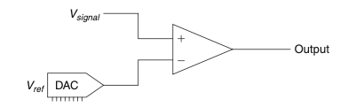
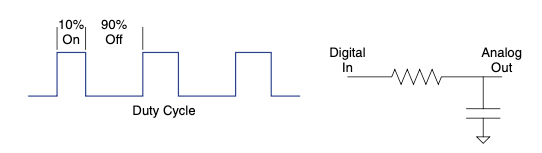
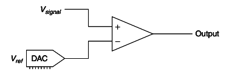
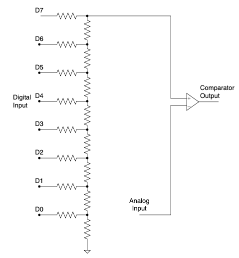
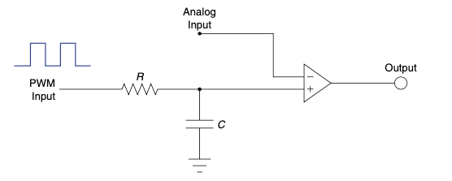
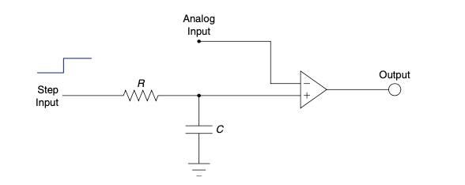
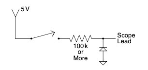
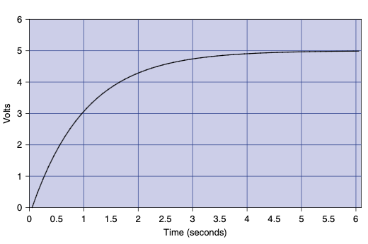
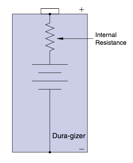

.. _c4:

CHAPTER 4 The Real World
============================

The real world is the place where you and I live. It isn’t in this book or in a
simulation or even the scribbles on a schematic. All those things are representa-
tions of the real world. They help us understand how the real world works. At
some point, all the circuits we create and design will interface with the real
world, even if it is just a button to press or display to look at. It follows that
we should talk a bit about some of the things we use to hook our circuits up
to the big, bad world.

BRIDGING THE GAP
--------------------

If this book had been written back when computers were analog, this section
wouldn’t even be needed. As it is, the proliferation of those pesky little digital
chips gives it top billing. You need to bridge the gap between the analog and
the digital at some point if you want to market your latest gadget as“way cool
digital technology.” Knowing a bit about how to make the analog-to-digital
leap seems like a good idea.

Analog vs. Digital
~~~~~~~~~~~~~~~~~~~~~~

If we put analog in one corner of a boxing ring and we put digital in the other
corner and then we let them duke it out, who do you think would win? In
today’s world, digital is all the rage, but what really sets it apart from analog?
Let’s find out.

What is analog? Is it merely some ancient term lost in the world of today’s digital engineers? No, analog basically means a continuously variable signal. It means
that the item being measured can be chopped up into infinite little pieces over
time. Say, for example, a signal changes from A to B over a 1-second interval. If
you look at it before 1 second is over it will be somewhere between A and B. It
is a continuous variable. No matter how small you slice up the time segments,
there is still a signal with information there.

The world as we perceive it is analog in nature. Colors blend infinitely from one
end of the spectrum into the other. The sound as a car races by on the street
is heard in a continuously increasing and then decreasing volume level.

As you drive a car, you continuously change speed in response to the traffic and
environment around you. The world around you is analog.

So what, then, is digital?“My computer is,” you say. Yes, this is true. But let’s get a little more basic with it. Hold up one of the digits on your hand. (A digit
is your finger, in case you were wondering.) Now put it down, now put it up
again. This is digital. It is either there, or it is not. I don’t know if digit (as in
finger [1]_) is where the term digital came from, but it helps me remember what
it means. So the simplest form of digital is two states: It’s either there or not.

Let’s go even deeper. What about the time it takes to change state? What if we
look at our digital finger as it moves from all the way down to all the way up? If
you look at it carefully, you see that a digital signal is really analog in nature.
This is true. As one of my engineer friends is fond of saying,“There is no such
thing as digital, really—just funny-lookin’ analog.” So digital is really just a
mode of perception. You look at something in a specifically determined time
frame and define whether it is there or it is not. Digital is a predetermined defi-
nition of analog levels.

If digital is really analog in disguise, why even bother with it? Early on it was
discovered that digital signals worked well in communication. Remember the
telegraph? It used a digital dot/dash series to represent a letter. Why does it
work well? Let’s look at our digital finger signal example again. At a distance,
it is obvious to the observer whether your finger is up or down. In fact, this
sort of signal is used on the freeway every day! All kidding aside, the point
is that you can avoid communication errors by using digital signals for
communication.

So what is the drawback to using digital signals? The telegraph didn’t last long.
It was quickly replaced by analog forms of communication. The reason for this
has to do with bandwidth, a measure of the amount of information a signal can
carry. The analog signal can carry vast amounts of information. It can, in fact,
have an infinite number of levels for a given signal range.

Back to the finger example: If you have a good telescope and can focus in on
the finger from far away, you can easily see the varying levels that the finger
can represent. The same thing can be accomplished without a telescope if you
have a very large finger. This implies that analog signals can represent large
amounts of information much more easily than digital signals can. To do this,
though, you just need *more power*! [2]_ (Imagine a manly grunt here.) If you can’t
get more power out of the signal, noise or other unwanted information can
easily disrupt the signal. This is what happens when you get too far away from
your favorite radio station and it starts to sound fuzzy. Sometimes you can give
the receiver“

.. [1] Okay, so depending on the finger you pick for your personal example, you will either laugh or be offended. Either way, you don’t want to let anyone see you give yourself the“digit” as you read this book in your cubicle. So I suggest the use of your index finger in this example.
.. [2] I haven’t met an engineer yet who doesn’t like the idea of more power. Problem is, the need to meet the design specs (i.e., cost, design spec, weird management ideas, and so on) typically limits us in terms of the power that’s available.

more power” with better filters, amplifiers, or the like. Nevertheless, signal integrity is one of the struggles with analog systems.
On the other hand, to get a digital signal to move a lot of information, it has to
work fast. Back when people wanted to hear each other talk, it was much easier
to use analog signals. The digital technology of the time simply couldn’t work
fast enough to represent all the complexities of the audio information. Thus
for many years communication efforts focused on analog encoding and decod-
ing of information. However, digital was being used in another domain
entirely, in the application of Boolean logic. [3]_

Digital signals could be used to represent Boolean statements, one level indi-
cating true and the other indicating false. The computer was born. Statements
such as,“If this is true, then do that,” could now be executed by machines. Boolean logic is based on a digital representation of the world. Don’t think that
there are only digital computers, though. For a while there were many analog
computers in use to handle computations involving large amounts of informa-
tion. Digital processing speeds eventually increased enough to take over these
applications.

So We Have Analog
~~~~~~~~~~~~~~~~~~~~~~

The upsides are that analog can represent lots of information, and the world
around us can easily be represented by analog signals. The downsides are that
it takes more power in either the transmitter or receiver to resolve the analog
signals, and small analog signals can be easily disrupted by outside influences.

Then There Is Digital
~~~~~~~~~~~~~~~~~~~~~~

The pros of digital are low power transmission and the ability to represent logic
statements. The cons are information limits (low bandwidth), requiring it to
work fast to process large pieces of information, and the fact that the world
around us is analog, not digital in nature.

The Best of Both Worlds
~~~~~~~~~~~~~~~~~~~~~~

Wouldn’t it be great to have the best of both worlds? That’s what engineers
thought, so they coined a couple of acronyms to get the process started: ADC
(the analog-to-digital converter) and DAC (the digital-to-analog converter).
Let’s find out what these are.

.. [3] If you like to immerse yourself in fascinating historical Internet research, I suggest you wiki or Google the name Claude Shannon. Shannon was considered the father of making circuits handle digital Boolean logic; his is an interesting story. Make sure you dig into his exploits in Vegas using information theory to take the house for a mint.

A-TO-D AND BACK AGAIN
------------------------

What is A-to-D conversion (or ADC)? Is it a religious experience? Is it the oppo-
site of D-to-A conversion (or DAC)? A to D is all about taking the real world
and making it into ones and zeros so that digital technology can manipulate
it. You can reasonably say that D to A reverses the process. Here we will explore
what this A to D to A is and what it is good for.

A Is for Analog
~~~~~~~~~~~~~~~~~~~~~~

An analog signal is converted to digital by chopping it up into chunks at prede-
termined time intervals. (This chopping is called the sample rate. The faster the
sample rate, the higher the frequency that can be digitized.) Then the signal is
measured at that point in time and assigned a digital value, which is called
sampling the signal. Digital signals (typically represented as 1 or 0) can be crammed
together to indicate different levels of analog. A single digit can indicate two
levels. If you use a binary numbering system, you get more levels by using more
digits. The number of levels goes up by 2 raised to the power of the number of
digits. Four digits give you 16 levels (2^4). Eight digits gives you 256 levels
(2^8) and so on. One common way of determining the level of a signal is to
use a comparator, as shown in :ref:`Figure 4.1 <Figure 4.1>`.

.. _Figure 4.1:

    **FIGURE 4.1 Comparator-driven ADC.**

Study this application. In this case, the signal is compared to a reference voltage.
You increase the reference voltage from min to max. When the signal is larger
than the reference voltage, the op-amp comparator will output a high, or a 1.
When the reference voltage is the larger of the two, the output will be low, or
a 0. If the circuit knows the value of :math:`V_{ref}` at the time the output changes state, this
is when :math:`V_{ref}` is approximately equal to :math:`V_{signal}`. I say approximately because there is
always a question of resolution. For more on this topic, read on.

D Is for Digital
~~~~~~~~~~~~~~~~~~~~

Now that we have a digital signal we can do lots of fun things with it. We can trans-
mit it, receive it, and manipulate it without worrying much about signal loss. But
what is next? Say we convert guitar music into digital format to add some neat
sound effects. You can’t simply send the digital data back out to be heard. It must
be converted back to analog. Why? Because there are certain things we perceive
well in an analog format. If you don’t believe me, take a look at the speedometer
in your car; I’ll bet it is an analog gauge. (There are some things we like to see
digitally, but usually that’s so we don’t have to deal with infinite increments; look
at the odometer in your car for this example. [4]_)

To convert a digital signal back to analog, the circuit has to simulate the ana-
log signal it represents. This always requires some kind of filtering. There are
many ways to convert digital to analog. One of my favorites is by pulse width
modulation (PWM). In a PWM circuit, the device’s output switches on and off
at a given frequency—see :ref:`Figure 4.2 <Figure 4.2>`. The percentage of time it is on versus off
is the amount of analog signal it represents. This percentage is called the duty
cycle.

.. _Figure 4.2:

    **FIGURE 4.2 Duty cycle-controlled analog output.**

The digital PWM is fed into a low-pass filter that removes the switching fre-
quency of the signal, essentially leaving an analog signal. The number of levels
that this signal can represent depends on the resolution of the PWM signal. This
is the capability of the PWM to be switched on and off at varying duty cycles. For
example, a PWM that could switch on and off in increments of 5% duty
cycle would have less resolution than a circuit that can handle increments
of 1% duty cycle—see :ref:`Figure 4.2 <Figure 4.2>`. This means that digital signals can repre-
sent only discrete levels of analog signal. These levels are the resolution of
the signal.

Why is resolution so important? We stated earlier in the comparator example
that the circuit knows what level Vref is at. How does it know that? It must
generate it somehow. It does so with some type of DAC process. It is the
resolution of that DAC process that will determine the resolution of the
ADC process.

So there we are. We went from analog to digital and right back to analog again.
It really is a circle. Let’s look at some examples to see this concept in action.

.. [4] That makes me think a bit. Is it human nature to prefer instantaneous signal references to be displayed in analog format whereas cumulative information is preferred in a digital format? Maybe some bright student out there will make this a thesis project so I don’t have to think so hard about it. If you do, make sure you send me a copy; I’d love to know the results!

IT TAKES A LITTLE D TO A TO GET A LITTLE A TO D
--------------------------------------------------

A while ago I was explaining my thoughts on the world being analog in nature
to a fellow engineer. He emailed me the following response:

I would like to provide counterpoint to your assertion that“the world as
we perceive it is analog in nature.” I think that there are as many, if not
more, natural digital perceptions as there are analog. Some samples:
alive or dead, night or day, open or closed, wet or dry, flora or fauna,
dominant or submissive, predator or prey, hungry or full, coarse or
smooth, hot or cold, fuzzy or sharp, open or closed, single or multi,
camouflage or warning, flat or mountainous, forest or desert, stormy or
clear, noise or silence, blind or seeing, male or female, feast or famine,
survive or die, on or off and so on. Granted, things like warm, breezy,
sunsets, and omnivorous are there, but for the most part, I think our
nature perceptions are digital. [5]_

In many ways he is correct in his eloquent comments; however, he refers to
our perception. We place the analog information from the world into“digital
buckets.” (There are certainly levels between hot and cold, for example.) I think
the reason we do this is to facilitate decision making, to limit the store of infor-
mation, and to ease communication. We impose a digital perception when it
makes sense to do so. A better phrase I could have used is something like,
“The world is analog in nature, upon which we impose our digital perceptions.” With
that in mind, let’s look at some more of the nuts and bolts of A-to-D conver-
sion. We’ll start with the DAC and a simple comparator from a couple of
pages back.

A simple comparator will output a high or low signal depending on whether
one input was above or below the other (:ref:`Figure 4.3 <Figure 4.3>`). This is a great time to
use a comparator, since digital circuits like obvious signals such as high and
low. Let’s drill the basic process of this circuit: You convert a digital number
to a known analog level, compare that to an analog signal, and if it is close
to the same value (here is where resolution counts), the digital number you
output represents the analog value.

.. _Figure 4.3:

    **FIGURE 4.3 Comparator-driven ADC.**

.. [5] This quote is from a good friend of mine by the name of Michael Angeli. I’ve always liked his writing style; maybe someday I can get him to collaborate on something with me.

Let’s do an example. You are converting an analog signal with the actual value
of 4.45. You try outputting a 1 on your DAC. The comparator says“higher” (it
does this by outputting a 1, or a high signal [6] ). You then try outputting a 2.
The comparator says“higher.” Now you try a 3, then a 4. Guess what the com-
parator says each time. That’s right, it says“higher.” So what do you try next? Of
course, you try a 5. Then the comparator says“lower.” Now your circuit knows
that the value is between 4 and 5. At this point you pick one of these two
values [7]_ (assuming in this case that the DAC only outputs six discrete levels over
a range from 0–5). The smaller the steps or increments that you can output
with the DAC, the closer you can estimate the value of the analog signal. When
you make the steps in the DAC smaller you increase the resolution of the
signal.

There is a better and faster way than merely sweeping across all the values in the
range. (We will increase the resolution of our DAC now to illustrate this point.)
Start by making your first output on the DAC equal to ½ of the entire range. In
this case you output 2.5 on the DAC. Now look at what the comparator says
and make a logic decision (digital is good for this sort of thing). You can see
whether the comparator says“higher,” and you can eliminate everything below
2.5. So you make your next output equal to half of the remaining range—in
this case, you output 3.75. Look at the comparator again and eliminate some
more possibilities (a high eliminates everything below the number, whereas a
low eliminates everything above the number), then output half the remaining
range. Repeat this process until you are out of resolution and you will have
an approximation of the analog signal. This is a very fast way of converting
an analog signal known as successive approximation. It is often used when high-
speed analog-to-digital conversion is needed.

Did you notice that I often use the word approximation as the A-to-D process takes
place? This is because a digital signal can never truly equal an analog signal; it
must always draw the line somewhere. Do not forget that digital means that there
are discrete steps involved. Analog has, by definition, infinite increments.
Now that you have the basic idea behind the A-to-D conversion process,
let’s look at some examples of DAC circuits to develop a more intuitive
understanding. [8]

.. [6] Remember that the specific voltage output of the comparator isn’t important. At this point in the circuit you only care about the“state” of the signal. Is it high or low, 1 or 0, true or false? You get only those two options in a digital signal.
.. [7] It is important to note that you do not know to which value the actual signal is closer. You simply need to pick one. It really is an arbitrary decision and is fundamental to digital processing. This is the reason that resolution is so important. It narrows the gap and thus the lack of exact knowledge of the signal.
.. [8] More and more often these different types of DAC and ADC circuits are built into whatever part you are using. You might process a command that says,“Get me a sample of that signal.” However, it is important to have an idea of what is going on in these parts if you want to be able to figure out why it isn’t working the way you expected it to.

.. _Figure 4.4:

    **FIGURE 4.4 The R2R ladder.**

This is a slick way to get a digital voltage level, and you can get the R2R ladder
in a nice compact package, as shown in :ref:`Figure 4.4 <Figure 4.4>`. You must take care not to
hook it up to any low-impedance devices without buffering, since its output
level can be easily affected by external loads.

How does the ladder work? A digital byte is output to the ladder, which changes
the voltage level to the input of the comparator. You should note that the MSB
(most significant bit) has the most effect on the output. The LSB (least significant bit) affects the output the least. This works very well with the approximation method described earlier. You simply load the DAC value you want on
the resistors and look at the output signal. It is very fast. The biggest downside
is that it uses a lot of output pins. (The output pins must be able to sink or
source sufficient current to work correctly.) One caution: Make sure your processor can handle the output load of the ladder. The Zilog processor I used
in one application of this circuit years ago worked fine and even had an
onboard comparator for the ADC process, but I did use every pin, leaving little
room for additional signals if needed.

In this circuit, the duty cycle of the PWM signal is ramped up from 0% until it
passes the value of the analog signal, as indicated by the comparator—see
:ref:`Figure 4.5 <Figure 4.5>`. The analog voltage is represented by the percentage of the PWM signal when the comparator changes state. The RC filter must turn the PWM into
basically an analog level. This means that the PWM must switch significantly
faster than the speed of the signal you are trying to digitize.

This method relies on the transient response of the basic RC circuit (:ref:`Figure 4.6 <Figure 4.6>`).
The step input causes the input to the comparator to increase according to the
response time of the RC circuit. The output of the RC circuit is equal to
:math:`Vi(1 - e^{-(t/\tau)})`. So if you know the value of tau, which is ``R * C``, you can calculate
the voltage based on the time it takes to pass the input. This can be tedious to
calculate in some micros, but often high accuracy is not needed and a lookup
table of the values can be implemented. In many cases, a lower-resistance discharge path is added to this circuit to ensure that the output of the RC circuit
begins at zero.

.. _Figure 4.5:

    **FIGURE 4.5 PWM ramp.**

.. _Figure 4.6:

    **FIGURE 4.6 RC charge time.**

The downsides to this circuit are the curve calculations, but the first three tau of
the signal are a fairly linear approximation. Depending on the application, that
might be good enough. (Review the connection between electronics and hand
grenades way back at the beginning of Chapter 1 to see when things are“good
enough.”) If your task isn’t too demanding and you don’t get too close to the
upper rail, you can simply count time and toss out that complex calculation,
making this a quick, cheap, and dirty ADC.

So there you have three easy ways to get a digital approximation of an analog
signal. All these circuits are perfectly fine to use as DACs only.
One last thought: These days a built-in A/D converter is an increasingly com-
mon feature on a microcontroller. However, they nearly all work on the princi-
ple of using a DAC to make an ADC. Studying this section can help you to get
an idea of what is really going on in there. The more you know about how it
works on the inside, the better engineer you will be!

Digital Signal Processing
~~~~~~~~~~~~~~~~~~~~~~~~~~~

DSP, or *digital signal processing*, refers to manipulating data that is digitized from
an analog signal. In many cases, such as audio and video, the signal is converted back to analog after DSP occurs. Many books on DSP are available that
offer far better coverage of this subject than this one. However, here I only hope
to create a bit of understanding on this topic.

One of the advantages of a DSP is the ability to change parameters of the filters
on the fly. This allows engineers to create all sorts of new solutions to processing signals that are very difficult to achieve with comparable analog designs.
Typically, a DSP solution is also more expensive than an analog one, so be sure
you really need it. Don’t slap a five-dollar DSP chip in the circuit when a 25-cent
op-amp will do the job. That is not to say DSP doesn’t have its place. Without
DSP, we wouldn’t have MP3, WMA, AC3, AAC, MP4, WiFi, and a whole other
slew of acronyms to spout about! Come to think of it, DSP technology might
be responsible for more acronyms than any other!

.. admonition:: Thumb Rules

   - Analog is a continuously variable signal.
   - Digital is a predetermined definition of a specific analog level.
   - Digital signals have discrete steps.
   - Resolution is the distance between the discrete steps.
   - DAC is often used for ADC.

WHEN PARTS AREN’T PERFECT
-----------------------------

Before we get into the problems that parts can have, we need to introduce the
concept of an equivalent circuit. It is pretty simple: To create an equivalent circuit,
you represent all its idiosyncrasies with combinations of perfect components.

This is good for two reasons: First and most obvious, it makes it possible to
model the effects of the imperfections. Second, and most important in the World
of Darren, is that seeing the combinations of the parts that make up a real com-
ponent makes it easier for you to apply the basic understanding of the perfect
parts to grasp what the real part is doing.

Everything Is Everywhere
~~~~~~~~~~~~~~~~~~~~~~~~~~

The basic three electrical components are like sand at the beach. They get into
everything. In a way they are more prolific than sand in your sandals since
the effect of one basic component can be found in another. This fact is one
of the most common causes of error you will have between the way the equa-
tion predicts a circuit will work and the way it actually operates. Chalk this up
as one of the reasons datasheets are so important, even the ones that describe
the most basic components. Datasheets will characterize the components,
describing these error sources.

Most texts call these effects *error sources* since they are what makes the difference
between a perfect or ideal component and what you actually have to work with.
There are other types of error sources in every component, and we will discuss a
few of them later on, but those pesky R, L, and C in some combination or
another are pretty much everywhere. (I hope the reason for drilling the basics
of these components is becoming more and more clear. It is appropriate to
experience an“a-ha!” moment right now and say to yourself,“Now I see why
I need to know those basic parts by heart!”)

The most general guideline to follow when you are looking for error sources is to
ask yourself the following: Is this error source enough to account for the effect
I am seeing?” Let’s consider a diode as an example for a moment. A diode has
a bit of capacitance when it is reverse-biased, typically in the picofarad range.

Consider the circuit shown in :ref:`Figure 4.7 <Figure 4.7>`. If you hook your scope lead to the
output, and flip the switch, you see what’s shown in :ref:`Figure 4.8 <Figure 4.8>`. Since there is
capacitance in this diode, an RC curve is what you would expect to see in a
situation like this, but is it really due to the error source in this diode or is it
caused by something else?

.. _Figure 4.7:

    **FIGURE 4.7 Circuit to examine.**

.. _Figure 4.8:

    **FIGURE 4.8 RC curve seen on your scope.**

Here is where the datasheet comes in; looking at the specs on the diode you are
using, you find out that this capacitance is typically 100 pf. Plug that into the
equation for the response time of an RC circuit:

.. math::

    \tau = RC

The number that pops out is 10 μS. Taking a look at the scope again, you now
pay attention to the time it takes for this curve to get to about 63%, remembering that is about how far this curve gets in one time constant, or tau. Being such
an astute scope operator, you use the cursors on your tool and you measure a
time of about 1 second for the signal to get a little over halfway to its final
value.“That doesn’t make sense,” you should be saying to yourself,“If the
diode is responsible, it would have to be much faster.”

The moral of the story is to expect every component to have some amount of the
basic three, but understand the magnitude so you can decide if it is causing the
effect you are seeing.

Error Sources, Ideal vs. Real
~~~~~~~~~~~~~~~~~~~~~~~~~~~~~~~~

In any circuit you design, there will be sources of error—things that simply aren’t
perfect, sensors that are off a little, parts that aren’t quite to spec, or any myriad of
problems.

What do you do about it? Nothing, if the error source isn’t causing you any problems. For example, a leaky cap might not really matter if you have plenty of
power available. However, if the circuit is running on batteries you could have
a problem on your hands. First and most important, determine whether the
source of error is an issue or not before you go about trying to solve it.

Once you figure you have a problem on your hands with a particular source of
error, there are three ways to deal with it:

1. **Get a better component**. It’s tough to plug the hole in a leaky cap; [9]_ it isn’t like the boy at the dike—you can’t put your finger in the hole and stop the leak. Sometimes your only choice is another component. In this case you might specify a tantalum cap instead of an electrolytic. Consider, however, that often the better component costs more, so spend wisely, not indiscriminately. Do note, however, that this is usually the quickest way to solve the problem since the design doesn’t have to change.
2. **Shore up the weak component with another component**. For example, the frequency response problems with electrolytic caps can be dealt with by adding another cap in parallel, a smaller one that has no problems with higher frequencies. (You might have noticed regulator reference designs do just that to assure a stable output. Now you know why.)
3. **Design the error out**. This approach will take the most engineering effort, since the goal is to change the design so that the error is no longer significant. The proverbial op-amp is an example of this type of effort. [10]_ Now that we know how to deal with the problem, let’s look at some common parts and typical sources of error. This will be an overview based on personal experience. It is no substitute for curing insomnia with a good datasheet. 

.. [9] A very common source of error in a capacitor is a DC current flow. Remember, the ideal cap will block all DC signals. You can think of it as a large resistor in parallel with a perfect cap. It is common enough to have acquired its own slang term: If this current flow is significant, the cap is said to be leaky, because DC current seems to leak through it.
.. [10] The whole point of the op-amp was to eliminate error sources in designing transistor amplifiers. It was a pretty cool idea, but it did take some real work!

Resistors
~~~~~~~~~~~~~

I would have to say that resistors are the most stable and predictable of the
three basic components. Carbon film resistors have very little inductance or
capacitance. It is rare that you will have a problem with this unless you are
dealing with radio frequencies and high clock speeds. In most cases the effect
of the PCB design will be worse than the resistor itself.

The biggest issue with these common resistors will likely be heat. Exceeding or
coming close to the wattage rating of these parts will make them vary significantly from their nominal value, so it is a good idea to give yourself plenty
of headroom with these resistors.

Another common resistor typically used in higher-power applications is a wirewound coil with a ceramic block molded around it. In this case inductance can
be a significant effect since there is a coil of wire and, as we know, coils of wire
make inductors. There is a whole industry of low-inductance power resistors
that you can get to work around this problem.

Capacitors
~~~~~~~~~~~

In my personal experience, I have never seen a cap that even comes close to
being perfect. A perfect cap would not heat up, but in fact they do. The natural conclusion you should come to is that capacitors have some type of
resistive component. In fact they do, and it is called ESR, or equivalent series
resistance.

According to the equations, a 10-μf cap should have nearly the same impedance
at 100 K Hz as a 0.1 μf cap does, but alas this is not the case. That is why you
often see a large cap with a small cap next to it on a power-supply circuit.
Nearly all caps vary in capacitance over a frequency range.

Big electrolytic caps often“leak” like a sieve. There is no particularly easy way to
deal with that. You have to live with it or get a better part. Believe me, if you are
trying to make a really low-power circuit, the last thing you want is a cap spilling electrons all over the place.

One other thing I had to learn the hard way is that a cap only meets the
rated capacitance when at the rated voltage. Sometimes overrating the voltage
on the cap too much can leave you with a different capacitance than you expect.
Polarized capacitors will act like a diode if you don’t bias them according to
their markings. Many caps will vary 20% over their temperature range; you
might not want them next to a power resistor on your PCB.

The moral of the cap story: You need to peruse capacitor datasheets carefully when
you are picking them for a particular application.

Inductors
~~~~~~~~~~~

Since these are most often coils of wire, you might imagine that resistance is
one of the most common sources of error in an inductor, and you’d be right.
Resistance is a major source of error in inductors. This usually causes heat
and power usage that you may or may not want. Minimizing the current
flow through the inductor makes the resistance less of an effect and is something you might be able to do at the design stage.

Many inductors are warped around some type of ferrous core. An effect called core
saturation occurs when the magnetic field exceeds the amount the core can handle.

There are some capacitive effects between the coils of wire, but they are so small
that we will ignore them in this text. If you are cranking out the gigahertz
needed to make this important, you are probably reading a book about this
stuff written by someone much smarter than I am.

Semiconductors
~~~~~~~~~~~~~~~~~~~~~~

One of the things that every diode, and every semiconductor based on the
diode, has in it is a voltage drop. For example, if your transistor amplifier
doesn’t see a base voltage over 0.7 V, you won’t get it to work.

Rail-to-rail op-amps are more expensive than their predecessors because they
employ circuitry that eliminates these voltage drops so that outputs and inputs
can get to their power rails.

In the datasheet of these parts, you should look for output impedances and
capacitive effects. Inductive effects are generally small and insignificant in
semiconductors.

Heat can also cause error in semiconductors. It generally affects the internal
resistance and can cause avalanche [11]_ failures. It also seems to me that the most
often overlooked part of the design is heat dissipation. The same engineers who
can easily calculate the wattage needed for that specific resistor value will overlook the amount of heat dissipation in a semiconductor. Take the current
through the part times the voltage drop across it and you will see how much
power is being dissipated.

.. [11] Like an avalanche, when it starts to fail all hell breaks loose, usually resulting in an interesting smell.

The world of semiconductors is so widely varied that there is no way this overview can be anywhere near comprehensive. I have to sound like a broken record
(or should I say scratched CD?) and tell you to refer to the datasheet.

Voltage Sources
~~~~~~~~~~~~~~~~~

What would cause a voltage source not to maintain the voltage output? Let me
give you a hint: When put under load, a voltage source will heat up. So what
creates heat? You got it: resistance. A voltage source has an internal resistance.
A battery is a good example—see :ref:`Figure 4.9 <Figure 4.9>`.

.. _Figure 4.9:

    **FIGURE 4.9 The Dura-gizer; now that is one tough battery!**

As current is applied to the load, the voltage drop occurs across this internal
resistance, just like the voltage divider rule says it will. This resistor inside heats
up just like one on the outside does, making the voltage source warm. If the
source doesn’t compensate for it, you will see less voltage at the output.

When Parts Aren’t Perfect Conclusion
~~~~~~~~~~~~~~~~~~~~~~~~~~~~~~~~~~~~~~

Parts simply aren’t perfect. I have seen motor bearings wear out prematurely due
to capacitive effects and have seen caps overheat and pop their tops. Truly the
best thing to do is keep looking at the datasheet. Parts engineers do their best
to characterize the deficiencies of the part and put it in the datasheet for you.

.. admonition:: Thumb Rules

    - Always ask, is the error source in this component enough to cause the effect I am seeing?
    - If the source of error isn’t large enough to be an issue, forget about it and move on.
    - When fixing errors, get a better part, shore it up, or design it out.
    - Caps vary with frequency.
    - Inductors have internal resistance.
    - Semiconductors have voltage drops and heat issues.
    - Voltage sources have internal impedance.
    - You can’t study the datasheet too much.

ROBUST DESIGN
----------------

Most engineers want to overdesign, give themselves plenty of headroom, and use
parts that are double or triple the spec they need. Usually the manager is there
saying,“It needs to cost less or it won’t sell,” or “Do you really, really need that
part?” To be honest, the answer lies somewhere between these extremes.

Can You Tolerate It?
~~~~~~~~~~~~~~~~~~~~~~~

Let’s start with a completely general off-the-wall statement that you might hear
from someone with a sharpened, somewhat devilish hairdo:“A robust design
handles two things well: the inside world and the outside world.” A look
of consternation scrambles across your forehead.“What in the world does
that mean?” you ask yourself. Let me proceed to enlighten you on this bit of
pointy-speak.

The inside world is all the parts that make up the design. In any production pro-
cess, these parts will vary in specification. The question to ask is,“Will the circuit
operate correctly over the tolerance ranges of the parts?” If the answer is yes, the
design is robust internally. The inside world is good to go. Don’t assume, how-
ever, that only electronic components have tolerances. This point is best taught
by example. In a design I worked on some time ago, we were using an optic sen-
sor to detect the motion of a belt. We correctly analyzed the tolerance of the
sensor, but as we began testing on a pilot run we discovered that the belt we were
using varied in opacity. If the optic sensor was at the high end of its tolerance and
the belt was at its most transparent, the signal from the sensor wouldn’t get high
enough to guarantee that the logic input would read it correctly.

In a production run, a problem like this would appear as a random failure.
This type of failure is known as a tolerance stack-up. It occurs when the stack-
up (the additive effect of the variations) of two or more components combine
to create a failure. It is more difficult to analyze than a single-component tol-
erance issue. Probably the best way to preempt this type of failure is with the
help of simulators. Take caution, though: Make sure that your simulation accu-
rately represents the design with nominal perfect components before you start
running tolerance analysis on it. (See the section on simulators for more sug-
gestions.) The great thing about a simulator, though, is the ability to vary all
the components over their tolerances and see the effects without building a
whole bunch of parts. You can then adjust your design and component
specs to increase the robustness of the product as far as the inside world is
concerned.

Now the outside world is a different animal. A good design can handle the
things the outside world throws at it. In the electronic realm all sorts of inter-
ference can disrupt your design. I once read an article that described something
called a rusty file test. After the engineer was done with the part, he would plug
it into the wall and plug in a home-built test fixture next to it. It consisted of a
wire from AC neutral connected to a file. The hot wire had a bare end that he
would proceed to rub up and down the rusty old file, sparks flying everywhere. [12]_
If the circuit passed this test without a hitch, he figured it was good to go. This is
known as EMI, or electromagnetic interference. It really is a whole topic unto itself,
so I have dedicated a chapter to it. Skip ahead to :ref:`Chapter 6 <c6>` if you can’t handle the
suspense!

Don’t limit your focus on the outside world to electrical interference. There are
many cases where other things can cause a problem. Vibration, for example, can
cause traces on a PCB to crack and solder joints to become faulty. Increased
humidity can swell a cheap PCB, causing mechanical deformation and cracked
connections. It can also combine with debris to create electrical shorts on cir-
cuits that you don’t want shorted. Temperature can be particularly tough on
electrical components. You should review the temperature range your circuit
will be subject to and compare that to the specs in the datasheet. Don’t forget
to include the operating temps of the device you are using in this analysis.
For example, power components usually get pretty warm just operating. Toss
them into a 70ºC ambient and you could easily push them over the max tem-
perature spec.

.. [12] It was written by Ron Mancini in EDN, but I have to say: Do not try this test at home. There are much safer ways than the procedure described; I mention this test because it creates a vivid picture of the junk out there that is trying to mess up your circuit.

How do you go about making your design robust externally? There are several
approaches to take:

- The most important, in my opinion, is doing everything you can in the fundamental design to get it to handle the environment it is in. Often a few changes to the PCB layout itself can make a circuit handle EMI better than putting all the shielding around it you can fit. Larger traces can combat mechanical deformation, and a few wellplaced holes can help manage temperatures.
- Reading, reading, and rereading the datasheet for the component you are using is probably the next most important thing you can do. The more you know about the parts you are using, the better you will recognize things that might upset your design.
- The third and most extensive effort that will help you is to test, check, test, and retest the design. You need to recreate the environments that it will be subject to and see what happens.

Now, to top it off, you can have a situation where the problem is a combination of the tolerance of the internal design and the environmental effects it is
subject to. These situations are nearly impossible to predict and are often sim-
ply discovered in the course of business. There is only one thing you can do
about that: Figure out what is needed to prevent it, make the change, and docu-
ment it for future use on similar designs.

I recommend that every engineer and engineering group keep a document of
design guidelines [13]_ where you write down those rules of thumb that you dis-
cover along the way. Don’t just write it down, but read it regularly to keep those
things you have learned fresh as you do each new design. This alone can be a
powerful tool. Some years back I took over an engineering group. When I first
started managing it, it seemed like we were always being called to the produc-
tion line for some weird problem or another. We spent more time chasing pro-
blems than engineering new products.

.. [13] I like to call them gauntlets. If the design can run the gauntlet of passing guidelines and tests, that is
when I deem it good enough.

We began to focus on robust design principles, and one of the first things I
implemented was the design guideline documents. Every time we found a new
design rule to follow, we wrote it down and referred to it regularly so that it
would be implemented with each new design.

Over about a three-year period, those urgent calls to production began to drop
off. We went from spending over 50% of our time in production support to
spending less than 10%. A couple years after that, we were spending less than
1% of our time dealing with production problems. Considering that we were
moving tens of thousands of products out per day, it was a great achievement.
Months would go by without a call, where before we got calls every day. When
problems did occur you could nearly always trace back to a guideline that we
had written down and simply neglected to follow. The hard part became refer-
ring back to those documents each time we created a new design. That being
the case, I suggest you try not to let your guidelines get too large. The bigger
these documents, the less likely you are to read through them. So try to keep
them to a few pages, since they will have a tendency to grow a lot.

In an effort to quantify what the outside world can do, many standards have been
written. They are some great yawners (meaning they will knock you out in about
5 minutes of reading); however, they can give you some real insight into what
your design will be subject to from the outside in. I’m referring to documents like
IEEE 62.41, which describes the world of EMI, or UL 991, which describes how to
make a control safe. The list goes on and on. Do a little research into what you
are working on and see if someone has written something about it. If your boss
doesn’t understand the need for time to do this, show him this paragraph:

    Boss, it might seem like nothing is getting done when the engineer is
    sitting there reading, but trust me, this effort can save you millions in
    production downtime, so give your engineer a chance to succeed and you
    will not regret it.

Engineer, this doesn’t mean that you should just read and never design any-
thing; I would limit this research to about a 10 to 20% ratio of design versus
research; double it if you are doing something you have never done before.

Reading these documents works particularly well if you are tossing and turning
all night as you try to figure out what is wrong with your design. I would keep
them by the side of my bed. That way I could learn some more for a few
minutes and also get some sleep. They not only help with the design, they are
a great cure for insomnia!

Learn to Adapt
~~~~~~~~~~~~~~~~~