.. _c4:

CHAPTER 4 The Real World
============================

The real world is the place where you and I live. It isn’t in this book or in a
simulation or even the scribbles on a schematic. All those things are representa-
tions of the real world. They help us understand how the real world works. At
some point, all the circuits we create and design will interface with the real
world, even if it is just a button to press or display to look at. It follows that
we should talk a bit about some of the things we use to hook our circuits up
to the big, bad world.

BRIDGING THE GAP
--------------------

If this book had been written back when computers were analog, this section
wouldn’t even be needed. As it is, the proliferation of those pesky little digital
chips gives it top billing. You need to bridge the gap between the analog and
the digital at some point if you want to market your latest gadget as“way cool
digital technology.” Knowing a bit about how to make the analog-to-digital
leap seems like a good idea.

Analog vs. Digital
~~~~~~~~~~~~~~~~~~~~~~

If we put analog in one corner of a boxing ring and we put digital in the other
corner and then we let them duke it out, who do you think would win? In
today’s world, digital is all the rage, but what really sets it apart from analog?
Let’s find out.

What is analog? Is it merely some ancient term lost in the world of today’s digital engineers? No, analog basically means a continuously variable signal. It means
that the item being measured can be chopped up into infinite little pieces over
time. Say, for example, a signal changes from A to B over a 1-second interval. If
you look at it before 1 second is over it will be somewhere between A and B. It
is a continuous variable. No matter how small you slice up the time segments,
there is still a signal with information there.

The world as we perceive it is analog in nature. Colors blend infinitely from one
end of the spectrum into the other. The sound as a car races by on the street
is heard in a continuously increasing and then decreasing volume level.

As you drive a car, you continuously change speed in response to the traffic and
environment around you. The world around you is analog.

So what, then, is digital?“My computer is,” you say. Yes, this is true. But let’s get a little more basic with it. Hold up one of the digits on your hand. (A digit
is your finger, in case you were wondering.) Now put it down, now put it up
again. This is digital. It is either there, or it is not. I don’t know if digit (as in
finger [1]_) is where the term digital came from, but it helps me remember what
it means. So the simplest form of digital is two states: It’s either there or not.

Let’s go even deeper. What about the time it takes to change state? What if we
look at our digital finger as it moves from all the way down to all the way up? If
you look at it carefully, you see that a digital signal is really analog in nature.
This is true. As one of my engineer friends is fond of saying,“There is no such
thing as digital, really—just funny-lookin’ analog.” So digital is really just a
mode of perception. You look at something in a specifically determined time
frame and define whether it is there or it is not. Digital is a predetermined defi-
nition of analog levels.

If digital is really analog in disguise, why even bother with it? Early on it was
discovered that digital signals worked well in communication. Remember the
telegraph? It used a digital dot/dash series to represent a letter. Why does it
work well? Let’s look at our digital finger signal example again. At a distance,
it is obvious to the observer whether your finger is up or down. In fact, this
sort of signal is used on the freeway every day! All kidding aside, the point
is that you can avoid communication errors by using digital signals for
communication.

So what is the drawback to using digital signals? The telegraph didn’t last long.
It was quickly replaced by analog forms of communication. The reason for this
has to do with bandwidth, a measure of the amount of information a signal can
carry. The analog signal can carry vast amounts of information. It can, in fact,
have an infinite number of levels for a given signal range.

Back to the finger example: If you have a good telescope and can focus in on
the finger from far away, you can easily see the varying levels that the finger
can represent. The same thing can be accomplished without a telescope if you
have a very large finger. This implies that analog signals can represent large
amounts of information much more easily than digital signals can. To do this,
though, you just need *more power*! [2]_ (Imagine a manly grunt here.) If you can’t
get more power out of the signal, noise or other unwanted information can
easily disrupt the signal. This is what happens when you get too far away from
your favorite radio station and it starts to sound fuzzy. Sometimes you can give
the receiver“

.. [1] Okay, so depending on the finger you pick for your personal example, you will either laugh or be offended. Either way, you don’t want to let anyone see you give yourself the“digit” as you read this book in your cubicle. So I suggest the use of your index finger in this example.
.. [2] I haven’t met an engineer yet who doesn’t like the idea of more power. Problem is, the need to meet the design specs (i.e., cost, design spec, weird management ideas, and so on) typically limits us in terms of the power that’s available.

more power” with better filters, amplifiers, or the like. Nevertheless, signal integrity is one of the struggles with analog systems.
On the other hand, to get a digital signal to move a lot of information, it has to
work fast. Back when people wanted to hear each other talk, it was much easier
to use analog signals. The digital technology of the time simply couldn’t work
fast enough to represent all the complexities of the audio information. Thus
for many years communication efforts focused on analog encoding and decod-
ing of information. However, digital was being used in another domain
entirely, in the application of Boolean logic. [3]_

Digital signals could be used to represent Boolean statements, one level indi-
cating true and the other indicating false. The computer was born. Statements
such as,“If this is true, then do that,” could now be executed by machines. Boolean logic is based on a digital representation of the world. Don’t think that
there are only digital computers, though. For a while there were many analog
computers in use to handle computations involving large amounts of informa-
tion. Digital processing speeds eventually increased enough to take over these
applications.

So We Have Analog
~~~~~~~~~~~~~~~~~~~~~~

The upsides are that analog can represent lots of information, and the world
around us can easily be represented by analog signals. The downsides are that
it takes more power in either the transmitter or receiver to resolve the analog
signals, and small analog signals can be easily disrupted by outside influences.

Then There Is Digital
~~~~~~~~~~~~~~~~~~~~~~

The pros of digital are low power transmission and the ability to represent logic
statements. The cons are information limits (low bandwidth), requiring it to
work fast to process large pieces of information, and the fact that the world
around us is analog, not digital in nature.

The Best of Both Worlds
~~~~~~~~~~~~~~~~~~~~~~

Wouldn’t it be great to have the best of both worlds? That’s what engineers
thought, so they coined a couple of acronyms to get the process started: ADC
(the analog-to-digital converter) and DAC (the digital-to-analog converter).
Let’s find out what these are.

.. [3] If you like to immerse yourself in fascinating historical Internet research, I suggest you wiki or Google the name Claude Shannon. Shannon was considered the father of making circuits handle digital Boolean logic; his is an interesting story. Make sure you dig into his exploits in Vegas using information theory to take the house for a mint.

A-TO-D AND BACK AGAIN
------------------------

What is A-to-D conversion (or ADC)? Is it a religious experience? Is it the oppo-
site of D-to-A conversion (or DAC)? A to D is all about taking the real world
and making it into ones and zeros so that digital technology can manipulate
it. You can reasonably say that D to A reverses the process. Here we will explore
what this A to D to A is and what it is good for.

A Is for Analog
~~~~~~~~~~~~~~~~~~~~~~

An analog signal is converted to digital by chopping it up into chunks at prede-
termined time intervals. (This chopping is called the sample rate. The faster the
sample rate, the higher the frequency that can be digitized.) Then the signal is
measured at that point in time and assigned a digital value, which is called
sampling the signal. Digital signals (typically represented as 1 or 0) can be crammed
together to indicate different levels of analog. A single digit can indicate two
levels. If you use a binary numbering system, you get more levels by using more
digits. The number of levels goes up by 2 raised to the power of the number of
digits. Four digits give you 16 levels (2^4). Eight digits gives you 256 levels
(2^8) and so on. One common way of determining the level of a signal is to
use a comparator, as shown in :ref:`Figure 4.1 <Figure 4.1>`.

.. _Figure 4.1:

.. figure:: ./img/f4.1.png
    :align: center

    **FIGURE 4.1 Comparator-driven ADC.**

Study this application. In this case, the signal is compared to a reference voltage.
You increase the reference voltage from min to max. When the signal is larger
than the reference voltage, the op-amp comparator will output a high, or a 1.
When the reference voltage is the larger of the two, the output will be low, or
a 0. If the circuit knows the value of :math:`V_{ref}` at the time the output changes state, this
is when :math:`V_{ref}` is approximately equal to :math:`V_{signal}`. I say approximately because there is
always a question of resolution. For more on this topic, read on.

D Is for Digital
~~~~~~~~~~~~~~~~~~~~

Now that we have a digital signal we can do lots of fun things with it. We can trans-
mit it, receive it, and manipulate it without worrying much about signal loss. But
what is next? Say we convert guitar music into digital format to add some neat
sound effects. You can’t simply send the digital data back out to be heard. It must
be converted back to analog. Why? Because there are certain things we perceive
well in an analog format. If you don’t believe me, take a look at the speedometer
in your car; I’ll bet it is an analog gauge. (There are some things we like to see
digitally, but usually that’s so we don’t have to deal with infinite increments; look
at the odometer in your car for this example. [4]_)

To convert a digital signal back to analog, the circuit has to simulate the ana-
log signal it represents. This always requires some kind of filtering. There are
many ways to convert digital to analog. One of my favorites is by pulse width
modulation (PWM). In a PWM circuit, the device’s output switches on and off
at a given frequency—see :ref:`Figure 4.2 <Figure 4.2>`. The percentage of time it is on versus off
is the amount of analog signal it represents. This percentage is called the duty
cycle.

.. _Figure 4.2:

.. figure:: ./img/f4.2.png
    :align: center

    **FIGURE 4.2 Duty cycle-controlled analog output.**

The digital PWM is fed into a low-pass filter that removes the switching fre-
quency of the signal, essentially leaving an analog signal. The number of levels
that this signal can represent depends on the resolution of the PWM signal. This
is the capability of the PWM to be switched on and off at varying duty cycles. For
example, a PWM that could switch on and off in increments of 5% duty
cycle would have less resolution than a circuit that can handle increments
of 1% duty cycle—see :ref:`Figure 4.2 <Figure 4.2>`. This means that digital signals can repre-
sent only discrete levels of analog signal. These levels are the resolution of
the signal.

Why is resolution so important? We stated earlier in the comparator example
that the circuit knows what level Vref is at. How does it know that? It must
generate it somehow. It does so with some type of DAC process. It is the
resolution of that DAC process that will determine the resolution of the
ADC process.

So there we are. We went from analog to digital and right back to analog again.
It really is a circle. Let’s look at some examples to see this concept in action.

.. [4] That makes me think a bit. Is it human nature to prefer instantaneous signal references to be displayed in analog format whereas cumulative information is preferred in a digital format? Maybe some bright student out there will make this a thesis project so I don’t have to think so hard about it. If you do, make sure you send me a copy; I’d love to know the results!

IT TAKES A LITTLE D TO A TO GET A LITTLE A TO D
--------------------------------------------------

A while ago I was explaining my thoughts on the world being analog in nature
to a fellow engineer. He emailed me the following response:

I would like to provide counterpoint to your assertion that“the world as
we perceive it is analog in nature.” I think that there are as many, if not
more, natural digital perceptions as there are analog. Some samples:
alive or dead, night or day, open or closed, wet or dry, flora or fauna,
dominant or submissive, predator or prey, hungry or full, coarse or
smooth, hot or cold, fuzzy or sharp, open or closed, single or multi,
camouflage or warning, flat or mountainous, forest or desert, stormy or
clear, noise or silence, blind or seeing, male or female, feast or famine,
survive or die, on or off and so on. Granted, things like warm, breezy,
sunsets, and omnivorous are there, but for the most part, I think our
nature perceptions are digital. [5]_

In many ways he is correct in his eloquent comments; however, he refers to
our perception. We place the analog information from the world into“digital
buckets.” (There are certainly levels between hot and cold, for example.) I think
the reason we do this is to facilitate decision making, to limit the store of infor-
mation, and to ease communication. We impose a digital perception when it
makes sense to do so. A better phrase I could have used is something like,
“The world is analog in nature, upon which we impose our digital perceptions.” With
that in mind, let’s look at some more of the nuts and bolts of A-to-D conver-
sion. We’ll start with the DAC and a simple comparator from a couple of
pages back.

A simple comparator will output a high or low signal depending on whether
one input was above or below the other (:ref:`Figure 4.3 <Figure 4.3>`). This is a great time to
use a comparator, since digital circuits like obvious signals such as high and
low. Let’s drill the basic process of this circuit: You convert a digital number
to a known analog level, compare that to an analog signal, and if it is close
to the same value (here is where resolution counts), the digital number you
output represents the analog value.

.. _Figure 4.3:

.. figure:: ./img/f4.3.png
    :align: center

    **FIGURE 4.3 Comparator-driven ADC.**

.. [5] This quote is from a good friend of mine by the name of Michael Angeli. I’ve always liked his writing style; maybe someday I can get him to collaborate on something with me.

Let’s do an example. You are converting an analog signal with the actual value
of 4.45. You try outputting a 1 on your DAC. The comparator says“higher” (it
does this by outputting a 1, or a high signal [6] ). You then try outputting a 2.
The comparator says“higher.” Now you try a 3, then a 4. Guess what the com-
parator says each time. That’s right, it says“higher.” So what do you try next? Of
course, you try a 5. Then the comparator says“lower.” Now your circuit knows
that the value is between 4 and 5. At this point you pick one of these two
values [7]_ (assuming in this case that the DAC only outputs six discrete levels over
a range from 0–5). The smaller the steps or increments that you can output
with the DAC, the closer you can estimate the value of the analog signal. When
you make the steps in the DAC smaller you increase the resolution of the
signal.

There is a better and faster way than merely sweeping across all the values in the
range. (We will increase the resolution of our DAC now to illustrate this point.)
Start by making your first output on the DAC equal to ½ of the entire range. In
this case you output 2.5 on the DAC. Now look at what the comparator says
and make a logic decision (digital is good for this sort of thing). You can see
whether the comparator says“higher,” and you can eliminate everything below
2.5. So you make your next output equal to half of the remaining range—in
this case, you output 3.75. Look at the comparator again and eliminate some
more possibilities (a high eliminates everything below the number, whereas a
low eliminates everything above the number), then output half the remaining
range. Repeat this process until you are out of resolution and you will have
an approximation of the analog signal. This is a very fast way of converting
an analog signal known as successive approximation. It is often used when high-
speed analog-to-digital conversion is needed.

Did you notice that I often use the word approximation as the A-to-D process takes
place? This is because a digital signal can never truly equal an analog signal; it
must always draw the line somewhere. Do not forget that digital means that there
are discrete steps involved. Analog has, by definition, infinite increments.
Now that you have the basic idea behind the A-to-D conversion process,
let’s look at some examples of DAC circuits to develop a more intuitive
understanding. [8]

.. [6] Remember that the specific voltage output of the comparator isn’t important. At this point in the circuit you only care about the“state” of the signal. Is it high or low, 1 or 0, true or false? You get only those two options in a digital signal.
.. [7] It is important to note that you do not know to which value the actual signal is closer. You simply need to pick one. It really is an arbitrary decision and is fundamental to digital processing. This is the reason that resolution is so important. It narrows the gap and thus the lack of exact knowledge of the signal.
.. [8] More and more often these different types of DAC and ADC circuits are built into whatever part you are using. You might process a command that says,“Get me a sample of that signal.” However, it is important to have an idea of what is going on in these parts if you want to be able to figure out why it isn’t working the way you expected it to.

.. _Figure 4.4:

.. figure:: ./img/f4.4.png
    :align: center

    **FIGURE 4.4 The R2R ladder.**

This is a slick way to get a digital voltage level, and you can get the R2R ladder
in a nice compact package, as shown in :ref:`Figure 4.4 <Figure 4.4>`. You must take care not to
hook it up to any low-impedance devices without buffering, since its output
level can be easily affected by external loads.

How does the ladder work? A digital byte is output to the ladder, which changes
the voltage level to the input of the comparator. You should note that the MSB
(most significant bit) has the most effect on the output. The LSB (least significant bit) affects the output the least. This works very well with the approximation method described earlier. You simply load the DAC value you want on
the resistors and look at the output signal. It is very fast. The biggest downside
is that it uses a lot of output pins. (The output pins must be able to sink or
source sufficient current to work correctly.) One caution: Make sure your processor can handle the output load of the ladder. The Zilog processor I used
in one application of this circuit years ago worked fine and even had an
onboard comparator for the ADC process, but I did use every pin, leaving little
room for additional signals if needed.

In this circuit, the duty cycle of the PWM signal is ramped up from 0% until it
passes the value of the analog signal, as indicated by the comparator—see
:ref:`Figure 4.5 <Figure 4.5>`. The analog voltage is represented by the percentage of the PWM signal when the comparator changes state. The RC filter must turn the PWM into
basically an analog level. This means that the PWM must switch significantly
faster than the speed of the signal you are trying to digitize.

This method relies on the transient response of the basic RC circuit (:ref:`Figure 4.6 <Figure 4.6>`).
The step input causes the input to the comparator to increase according to the
response time of the RC circuit. The output of the RC circuit is equal to
:math:`Vi(1 - e^{-(t/\tau)})`. So if you know the value of tau, which is ``R * C``, you can calculate
the voltage based on the time it takes to pass the input. This can be tedious to
calculate in some micros, but often high accuracy is not needed and a lookup
table of the values can be implemented. In many cases, a lower-resistance discharge path is added to this circuit to ensure that the output of the RC circuit
begins at zero.

.. _Figure 4.5:

.. figure:: ./img/f4.5.png
    :align: center

    **FIGURE 4.5 PWM ramp.**

.. _Figure 4.6:

.. figure:: ./img/f4.6.png
    :align: center

    **FIGURE 4.6 RC charge time.**

The downsides to this circuit are the curve calculations, but the first three tau of
the signal are a fairly linear approximation. Depending on the application, that
might be good enough. (Review the connection between electronics and hand
grenades way back at the beginning of Chapter 1 to see when things are“good
enough.”) If your task isn’t too demanding and you don’t get too close to the
upper rail, you can simply count time and toss out that complex calculation,
making this a quick, cheap, and dirty ADC.

So there you have three easy ways to get a digital approximation of an analog
signal. All these circuits are perfectly fine to use as DACs only.
One last thought: These days a built-in A/D converter is an increasingly com-
mon feature on a microcontroller. However, they nearly all work on the princi-
ple of using a DAC to make an ADC. Studying this section can help you to get
an idea of what is really going on in there. The more you know about how it
works on the inside, the better engineer you will be!

Digital Signal Processing
~~~~~~~~~~~~~~~~~~~~~~~~~~~

DSP, or *digital signal processing*, refers to manipulating data that is digitized from
an analog signal. In many cases, such as audio and video, the signal is converted back to analog after DSP occurs. Many books on DSP are available that
offer far better coverage of this subject than this one. However, here I only hope
to create a bit of understanding on this topic.

One of the advantages of a DSP is the ability to change parameters of the filters
on the fly. This allows engineers to create all sorts of new solutions to processing signals that are very difficult to achieve with comparable analog designs.
Typically, a DSP solution is also more expensive than an analog one, so be sure
you really need it. Don’t slap a five-dollar DSP chip in the circuit when a 25-cent
op-amp will do the job. That is not to say DSP doesn’t have its place. Without
DSP, we wouldn’t have MP3, WMA, AC3, AAC, MP4, WiFi, and a whole other
slew of acronyms to spout about! Come to think of it, DSP technology might
be responsible for more acronyms than any other!

.. admonition:: Thumb Rules

   - Analog is a continuously variable signal.
   - Digital is a predetermined definition of a specific analog level.
   - Digital signals have discrete steps.
   - Resolution is the distance between the discrete steps.
   - DAC is often used for ADC.

WHEN PARTS AREN’T PERFECT
-----------------------------

Before we get into the problems that parts can have, we need to introduce the
concept of an equivalent circuit. It is pretty simple: To create an equivalent circuit,
you represent all its idiosyncrasies with combinations of perfect components.

This is good for two reasons: First and most obvious, it makes it possible to
model the effects of the imperfections. Second, and most important in the World
of Darren, is that seeing the combinations of the parts that make up a real com-
ponent makes it easier for you to apply the basic understanding of the perfect
parts to grasp what the real part is doing.

Everything Is Everywhere
~~~~~~~~~~~~~~~~~~~~~~~~~~

The basic three electrical components are like sand at the beach. They get into
everything. In a way they are more prolific than sand in your sandals since
the effect of one basic component can be found in another. This fact is one
of the most common causes of error you will have between the way the equa-
tion predicts a circuit will work and the way it actually operates. Chalk this up
as one of the reasons datasheets are so important, even the ones that describe
the most basic components. Datasheets will characterize the components,
describing these error sources.

Most texts call these effects *error sources* since they are what makes the difference
between a perfect or ideal component and what you actually have to work with.
There are other types of error sources in every component, and we will discuss a
few of them later on, but those pesky R, L, and C in some combination or
another are pretty much everywhere. (I hope the reason for drilling the basics
of these components is becoming more and more clear. It is appropriate to
experience an“a-ha!” moment right now and say to yourself,“Now I see why
I need to know those basic parts by heart!”)

The most general guideline to follow when you are looking for error sources is to
ask yourself the following: Is this error source enough to account for the effect
I am seeing?” Let’s consider a diode as an example for a moment. A diode has
a bit of capacitance when it is reverse-biased, typically in the picofarad range.

Consider the circuit shown in :ref:`Figure 4.7 <Figure 4.7>`. If you hook your scope lead to the
output, and flip the switch, you see what’s shown in :ref:`Figure 4.8 <Figure 4.8>`. Since there is
capacitance in this diode, an RC curve is what you would expect to see in a
situation like this, but is it really due to the error source in this diode or is it
caused by something else?

.. _Figure 4.7:

.. figure:: ./img/f4.7.png
    :align: center

    **FIGURE 4.7 Circuit to examine.**

.. _Figure 4.8:

.. figure:: ./img/f4.8.png
    :align: center

    **FIGURE 4.8 RC curve seen on your scope.**

Here is where the datasheet comes in; looking at the specs on the diode you are
using, you find out that this capacitance is typically 100 pf. Plug that into the
equation for the response time of an RC circuit:

.. math::

    \tau = RC

The number that pops out is 10 μS. Taking a look at the scope again, you now
pay attention to the time it takes for this curve to get to about 63%, remembering that is about how far this curve gets in one time constant, or tau. Being such
an astute scope operator, you use the cursors on your tool and you measure a
time of about 1 second for the signal to get a little over halfway to its final
value.“That doesn’t make sense,” you should be saying to yourself,“If the
diode is responsible, it would have to be much faster.”

The moral of the story is to expect every component to have some amount of the
basic three, but understand the magnitude so you can decide if it is causing the
effect you are seeing.

Error Sources, Ideal vs. Real
~~~~~~~~~~~~~~~~~~~~~~~~~~~~~~~~

In any circuit you design, there will be sources of error—things that simply aren’t
perfect, sensors that are off a little, parts that aren’t quite to spec, or any myriad of
problems.

What do you do about it? Nothing, if the error source isn’t causing you any problems. For example, a leaky cap might not really matter if you have plenty of
power available. However, if the circuit is running on batteries you could have
a problem on your hands. First and most important, determine whether the
source of error is an issue or not before you go about trying to solve it.

Once you figure you have a problem on your hands with a particular source of
error, there are three ways to deal with it:

1. **Get a better component**. It’s tough to plug the hole in a leaky cap; [9]_ it isn’t like the boy at the dike—you can’t put your finger in the hole and stop the leak. Sometimes your only choice is another component. In this case you might specify a tantalum cap instead of an electrolytic. Consider, however, that often the better component costs more, so spend wisely, not indiscriminately. Do note, however, that this is usually the quickest way to solve the problem since the design doesn’t have to change.
2. **Shore up the weak component with another component**. For example, the frequency response problems with electrolytic caps can be dealt with by adding another cap in parallel, a smaller one that has no problems with higher frequencies. (You might have noticed regulator reference designs do just that to assure a stable output. Now you know why.)
3. **Design the error out**. This approach will take the most engineering effort, since the goal is to change the design so that the error is no longer significant. The proverbial op-amp is an example of this type of effort. [10]_ Now that we know how to deal with the problem, let’s look at some common parts and typical sources of error. This will be an overview based on personal experience. It is no substitute for curing insomnia with a good datasheet. 

.. [9] A very common source of error in a capacitor is a DC current flow. Remember, the ideal cap will block all DC signals. You can think of it as a large resistor in parallel with a perfect cap. It is common enough to have acquired its own slang term: If this current flow is significant, the cap is said to be leaky, because DC current seems to leak through it.
.. [10] The whole point of the op-amp was to eliminate error sources in designing transistor amplifiers. It was a pretty cool idea, but it did take some real work!

Resistors
~~~~~~~~~~~~~

I would have to say that resistors are the most stable and predictable of the
three basic components. Carbon film resistors have very little inductance or
capacitance. It is rare that you will have a problem with this unless you are
dealing with radio frequencies and high clock speeds. In most cases the effect
of the PCB design will be worse than the resistor itself.

The biggest issue with these common resistors will likely be heat. Exceeding or
coming close to the wattage rating of these parts will make them vary significantly from their nominal value, so it is a good idea to give yourself plenty
of headroom with these resistors.

Another common resistor typically used in higher-power applications is a wirewound coil with a ceramic block molded around it. In this case inductance can
be a significant effect since there is a coil of wire and, as we know, coils of wire
make inductors. There is a whole industry of low-inductance power resistors
that you can get to work around this problem.

Capacitors
~~~~~~~~~~~

In my personal experience, I have never seen a cap that even comes close to
being perfect. A perfect cap would not heat up, but in fact they do. The natural conclusion you should come to is that capacitors have some type of
resistive component. In fact they do, and it is called ESR, or equivalent series
resistance.

According to the equations, a 10-μf cap should have nearly the same impedance
at 100 K Hz as a 0.1 μf cap does, but alas this is not the case. That is why you
often see a large cap with a small cap next to it on a power-supply circuit.
Nearly all caps vary in capacitance over a frequency range.

Big electrolytic caps often“leak” like a sieve. There is no particularly easy way to
deal with that. You have to live with it or get a better part. Believe me, if you are
trying to make a really low-power circuit, the last thing you want is a cap spilling electrons all over the place.

One other thing I had to learn the hard way is that a cap only meets the
rated capacitance when at the rated voltage. Sometimes overrating the voltage
on the cap too much can leave you with a different capacitance than you expect.
Polarized capacitors will act like a diode if you don’t bias them according to
their markings. Many caps will vary 20% over their temperature range; you
might not want them next to a power resistor on your PCB.

The moral of the cap story: You need to peruse capacitor datasheets carefully when
you are picking them for a particular application.

Inductors
~~~~~~~~~~~

Since these are most often coils of wire, you might imagine that resistance is
one of the most common sources of error in an inductor, and you’d be right.
Resistance is a major source of error in inductors. This usually causes heat
and power usage that you may or may not want. Minimizing the current
flow through the inductor makes the resistance less of an effect and is something you might be able to do at the design stage.

Many inductors are warped around some type of ferrous core. An effect called core
saturation occurs when the magnetic field exceeds the amount the core can handle.

There are some capacitive effects between the coils of wire, but they are so small
that we will ignore them in this text. If you are cranking out the gigahertz
needed to make this important, you are probably reading a book about this
stuff written by someone much smarter than I am.

Semiconductors
~~~~~~~~~~~~~~~~~~~~~~

One of the things that every diode, and every semiconductor based on the
diode, has in it is a voltage drop. For example, if your transistor amplifier
doesn’t see a base voltage over 0.7 V, you won’t get it to work.

Rail-to-rail op-amps are more expensive than their predecessors because they
employ circuitry that eliminates these voltage drops so that outputs and inputs
can get to their power rails.

In the datasheet of these parts, you should look for output impedances and
capacitive effects. Inductive effects are generally small and insignificant in
semiconductors.

Heat can also cause error in semiconductors. It generally affects the internal
resistance and can cause avalanche [11]_ failures. It also seems to me that the most
often overlooked part of the design is heat dissipation. The same engineers who
can easily calculate the wattage needed for that specific resistor value will overlook the amount of heat dissipation in a semiconductor. Take the current
through the part times the voltage drop across it and you will see how much
power is being dissipated.

.. [11] Like an avalanche, when it starts to fail all hell breaks loose, usually resulting in an interesting smell.

The world of semiconductors is so widely varied that there is no way this overview can be anywhere near comprehensive. I have to sound like a broken record
(or should I say scratched CD?) and tell you to refer to the datasheet.

Voltage Sources
~~~~~~~~~~~~~~~~~

What would cause a voltage source not to maintain the voltage output? Let me
give you a hint: When put under load, a voltage source will heat up. So what
creates heat? You got it: resistance. A voltage source has an internal resistance.
A battery is a good example—see :ref:`Figure 4.9 <Figure 4.9>`.

.. _Figure 4.9:

.. figure:: ./img/f4.9.png
    :align: center

    **FIGURE 4.9 The Dura-gizer; now that is one tough battery!**

As current is applied to the load, the voltage drop occurs across this internal
resistance, just like the voltage divider rule says it will. This resistor inside heats
up just like one on the outside does, making the voltage source warm. If the
source doesn’t compensate for it, you will see less voltage at the output.

When Parts Aren’t Perfect Conclusion
~~~~~~~~~~~~~~~~~~~~~~~~~~~~~~~~~~~~~~

Parts simply aren’t perfect. I have seen motor bearings wear out prematurely due
to capacitive effects and have seen caps overheat and pop their tops. Truly the
best thing to do is keep looking at the datasheet. Parts engineers do their best
to characterize the deficiencies of the part and put it in the datasheet for you.

.. admonition:: Thumb Rules

    - Always ask, is the error source in this component enough to cause the effect I am seeing?
    - If the source of error isn’t large enough to be an issue, forget about it and move on.
    - When fixing errors, get a better part, shore it up, or design it out.
    - Caps vary with frequency.
    - Inductors have internal resistance.
    - Semiconductors have voltage drops and heat issues.
    - Voltage sources have internal impedance.
    - You can’t study the datasheet too much.

ROBUST DESIGN
----------------

Most engineers want to overdesign, give themselves plenty of headroom, and use
parts that are double or triple the spec they need. Usually the manager is there
saying,“It needs to cost less or it won’t sell,” or “Do you really, really need that
part?” To be honest, the answer lies somewhere between these extremes.

Can You Tolerate It?
~~~~~~~~~~~~~~~~~~~~~~~

Let’s start with a completely general off-the-wall statement that you might hear
from someone with a sharpened, somewhat devilish hairdo:“A robust design
handles two things well: the inside world and the outside world.” A look
of consternation scrambles across your forehead.“What in the world does
that mean?” you ask yourself. Let me proceed to enlighten you on this bit of
pointy-speak.

The inside world is all the parts that make up the design. In any production pro-
cess, these parts will vary in specification. The question to ask is,“Will the circuit
operate correctly over the tolerance ranges of the parts?” If the answer is yes, the
design is robust internally. The inside world is good to go. Don’t assume, how-
ever, that only electronic components have tolerances. This point is best taught
by example. In a design I worked on some time ago, we were using an optic sen-
sor to detect the motion of a belt. We correctly analyzed the tolerance of the
sensor, but as we began testing on a pilot run we discovered that the belt we were
using varied in opacity. If the optic sensor was at the high end of its tolerance and
the belt was at its most transparent, the signal from the sensor wouldn’t get high
enough to guarantee that the logic input would read it correctly.

In a production run, a problem like this would appear as a random failure.
This type of failure is known as a tolerance stack-up. It occurs when the stack-
up (the additive effect of the variations) of two or more components combine
to create a failure. It is more difficult to analyze than a single-component tol-
erance issue. Probably the best way to preempt this type of failure is with the
help of simulators. Take caution, though: Make sure that your simulation accu-
rately represents the design with nominal perfect components before you start
running tolerance analysis on it. (See the section on simulators for more sug-
gestions.) The great thing about a simulator, though, is the ability to vary all
the components over their tolerances and see the effects without building a
whole bunch of parts. You can then adjust your design and component
specs to increase the robustness of the product as far as the inside world is
concerned.

Now the outside world is a different animal. A good design can handle the
things the outside world throws at it. In the electronic realm all sorts of inter-
ference can disrupt your design. I once read an article that described something
called a rusty file test. After the engineer was done with the part, he would plug
it into the wall and plug in a home-built test fixture next to it. It consisted of a
wire from AC neutral connected to a file. The hot wire had a bare end that he
would proceed to rub up and down the rusty old file, sparks flying everywhere. [12]_
If the circuit passed this test without a hitch, he figured it was good to go. This is
known as EMI, or electromagnetic interference. It really is a whole topic unto itself,
so I have dedicated a chapter to it. Skip ahead to :ref:`Chapter 6 <c6>` if you can’t handle the
suspense!

Don’t limit your focus on the outside world to electrical interference. There are
many cases where other things can cause a problem. Vibration, for example, can
cause traces on a PCB to crack and solder joints to become faulty. Increased
humidity can swell a cheap PCB, causing mechanical deformation and cracked
connections. It can also combine with debris to create electrical shorts on cir-
cuits that you don’t want shorted. Temperature can be particularly tough on
electrical components. You should review the temperature range your circuit
will be subject to and compare that to the specs in the datasheet. Don’t forget
to include the operating temps of the device you are using in this analysis.
For example, power components usually get pretty warm just operating. Toss
them into a 70ºC ambient and you could easily push them over the max tem-
perature spec.

.. [12] It was written by Ron Mancini in EDN, but I have to say: Do not try this test at home. There are much safer ways than the procedure described; I mention this test because it creates a vivid picture of the junk out there that is trying to mess up your circuit.

How do you go about making your design robust externally? There are several
approaches to take:

- The most important, in my opinion, is doing everything you can in the fundamental design to get it to handle the environment it is in. Often a few changes to the PCB layout itself can make a circuit handle EMI better than putting all the shielding around it you can fit. Larger traces can combat mechanical deformation, and a few wellplaced holes can help manage temperatures.
- Reading, reading, and rereading the datasheet for the component you are using is probably the next most important thing you can do. The more you know about the parts you are using, the better you will recognize things that might upset your design.
- The third and most extensive effort that will help you is to test, check, test, and retest the design. You need to recreate the environments that it will be subject to and see what happens.

Now, to top it off, you can have a situation where the problem is a combination of the tolerance of the internal design and the environmental effects it is
subject to. These situations are nearly impossible to predict and are often sim-
ply discovered in the course of business. There is only one thing you can do
about that: Figure out what is needed to prevent it, make the change, and docu-
ment it for future use on similar designs.

I recommend that every engineer and engineering group keep a document of
design guidelines [13]_ where you write down those rules of thumb that you dis-
cover along the way. Don’t just write it down, but read it regularly to keep those
things you have learned fresh as you do each new design. This alone can be a
powerful tool. Some years back I took over an engineering group. When I first
started managing it, it seemed like we were always being called to the produc-
tion line for some weird problem or another. We spent more time chasing pro-
blems than engineering new products.

.. [13] I like to call them gauntlets. If the design can run the gauntlet of passing guidelines and tests, that is
when I deem it good enough.

We began to focus on robust design principles, and one of the first things I
implemented was the design guideline documents. Every time we found a new
design rule to follow, we wrote it down and referred to it regularly so that it
would be implemented with each new design.

Over about a three-year period, those urgent calls to production began to drop
off. We went from spending over 50% of our time in production support to
spending less than 10%. A couple years after that, we were spending less than
1% of our time dealing with production problems. Considering that we were
moving tens of thousands of products out per day, it was a great achievement.
Months would go by without a call, where before we got calls every day. When
problems did occur you could nearly always trace back to a guideline that we
had written down and simply neglected to follow. The hard part became refer-
ring back to those documents each time we created a new design. That being
the case, I suggest you try not to let your guidelines get too large. The bigger
these documents, the less likely you are to read through them. So try to keep
them to a few pages, since they will have a tendency to grow a lot.

In an effort to quantify what the outside world can do, many standards have been
written. They are some great yawners (meaning they will knock you out in about
5 minutes of reading); however, they can give you some real insight into what
your design will be subject to from the outside in. I’m referring to documents like
IEEE 62.41, which describes the world of EMI, or UL 991, which describes how to
make a control safe. The list goes on and on. Do a little research into what you
are working on and see if someone has written something about it. If your boss
doesn’t understand the need for time to do this, show him this paragraph:

    Boss, it might seem like nothing is getting done when the engineer is
    sitting there reading, but trust me, this effort can save you millions in
    production downtime, so give your engineer a chance to succeed and you
    will not regret it.

Engineer, this doesn’t mean that you should just read and never design any-
thing; I would limit this research to about a 10 to 20% ratio of design versus
research; double it if you are doing something you have never done before.

Reading these documents works particularly well if you are tossing and turning
all night as you try to figure out what is wrong with your design. I would keep
them by the side of my bed. That way I could learn some more for a few
minutes and also get some sleep. They not only help with the design, they are
a great cure for insomnia!

Learn to Adapt
~~~~~~~~~~~~~~~~~

Have you ever finished a product design after which some change was required
that you desperately wished you had been told about at the beginning? Have
you ever said,“If you had just told me sooner, this feature would have cost half
as much to add on now?” You might even have had your boss say,“Why didn’t
you do what I told you to do?” (when you did exactly what he or she wanted).
I’ll let you in on a secret: Most of your pointy-haired bosses don’t want you to
fail. They just want to ship a killer product so their bonus will be bigger.

They don’t tell you sooner because they don’t know sooner. They try to guess
what the customers want and give it to them. In his mind your boss didn’t say,
“Do such and such a product,” he said,“Make this product successful.” As companies chase the market around, new products are developed, changed, and
changed again. I call this Management Always chasing the Market Around, or
MAMA for short. (There is nothing like an acronym if you want a point to be
remembered. I predict that some day in the far future acronyms will be the prime
method of communication due to their efficiency!) Now, because of MAMA,
many engineers experience consternation when their product definition changes.

In the world of consumer products, this is bound to happen often. When I
took over the engineering group in the first company I worked for, this particular
frustration was often felt. As I worked with the various designers in the company,
I found that it was possible to anticipate these changes and prepare for them.
When you get good at this, you can respond to changes easily and quickly, and
you can also develop a number of derivative products quickly and inexpensively.

Modular Design
~~~~~~~~~~~~~~~~

One of the most important things that you need to do to anticipate change is to
modularize your designs. Here, hardware designers can take note from their
counterparts in software design. Good software engineers build blocks of code
that can be used and reused again and again. However, I often see hardware
designers start with a clean sheet for every new design.

To make your modular design work for you, you must evaluate the products you
are designing. Are there any components that are commonly removed and installed on various designs? What parts are common to all or most of your products? Sit down and draw lots of block diagrams and ask yourself,“Is this
a part that needs to be easy to take on and off?” If it is, it might be a candidate
for a separate PCB or a section of the PCB all to itself. In a line of stereo products,
for example, you keep the tuner section separate from the pre-amp and so on.
(As a side note, this often improves the robustness of a design as well.)
A great advantage of this modular approach is the way it can accelerate the
development process by using separate engineers on the various modules. It
also allows you to upgrade or improve parts of the design without redoing
the whole thing. Most important in my world and best of all, it makes it easy
to change a feature when your boss decides he really didn’t want that there
on this particular model.

One word of warning, however: You need to be careful what parts you choose
to modularize. Too many modules can add up to extra cost in every product
you ship. *Make sure your choices make sense*.

Anticipate Changes
~~~~~~~~~~~~~~~~~~~~~

Try to get involved in the creation process so that you can see various phases of
evolution the product design has gone through. Often, changes that are made
will be back or forth on this evolutionary path. Keep asking yourself,“Where
else could this be used? How would I change it to work there?”
Look for places where a part seems to be missing. For example, say that you
are asked to make a PCB with a row of LEDs that look like :ref:`Figure 4.10 <Figure 4.10>`.
Say“Great, no problem,” and then create a PCB with this row of LEDs, as shown
in :ref:`Figure 4.11 <Figure 4.11>`, and simply do not install the missing one for now.
Don’t hesitate to tell your coworkers or boss what you are doing. They can be a
great asset in anticipating changes they might come up with later. The bottom line
is that it takes a tremendous amount of work to redesign every product every time, but if you can develop effective modules and anticipate changes when you are
engineering the product, you can bring things to market faster and cheaper than
anyone else. A nice benefit of this type of anticipative design is that when you are
asked to develop a similar product, you have all the pieces in place. You simply
add or subtract the required feature and are done with it. Finally, best of all,
MAMA will not drive you berserk!

.. _Figure 4.10:

    **FIGURE 4.10 Row of LEDs management wants.**

.. _Figure 4.11:

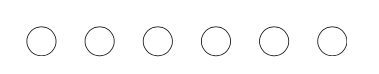

    **FIGURE 4.11 Row of LEDs you actually put in.**

One Last Word of Caution
~~~~~~~~~~~~~~~~~~~~~~~~~~~~

It is possible to go too far with this philosophy. Don’t try to make your design
so universal that it comes at the expense of getting the product to market or
adds so much cost for all the options that it is no longer viable. Remember,
there is also a chance you will never use the option you built in, so choose
wisely, young Jedi. [14]_

.. admonition:: Thumb Rules

   - Read the datasheet.
   - Consider tolerances.
   - Know the environment.
   - Test, check, and retest.
   - Make your own list of Thumb Rules or design guidelines.
   - Do research on standards or guidelines that exist for your product.
   - MAMA can be frustrating.
   - Modularize the design.
   - Anticipate changes.
   - Don’t go too far.

SOME OF MY FAVORITE CIRCUITS
------------------------------

Every engineer has their favorite batch of circuits, and I’m no exception. There
are tons of circuit cookbooks out there that show how to implement no end
of cool features. There are so many that you could spend all your time searching
them and never getting anything done. I suggest you develop your own favorite
basic circuits that you know well and intuitively understand. This is simply an
extension of the Lego philosophy that we discussed way back at the beginning
of the book. Here are a few of my favorites. These are in addition to all the cir-
cuits I have used as examples up to this point. One reason they make such good
examples is that they are so useful.

.. [14] Do Jedi mind tricks work in the cooperate world? I think so. Now, that is a cool idea for a book. Email
and let me know if you would buy it. If I get enough responses I definitely will explore that idea!

Hybrid Darlington Pair
~~~~~~~~~~~~~~~~~~~~~~~

Cool application note: using two transistors to switch a signal level Vcc PNP
switched by NPN.

:ref:`Figure 4.12 <Figure 4.12>` shows a handy circuit that switches a higher-level voltage with a
lower-level one. Say, for example, you have a micro with a 5 V output and
you need to drive a 12 V load. For a reason you can’t change, you have to
switch the Vcc leg. In this circuit you turn on one transistor with a 5 V signal,
which in turn activates the other transistor, switching the higher voltage to the
load.

.. _Figure 4.12:

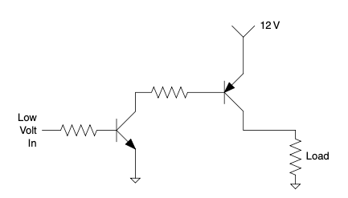

    **FIGURE 4.12 Vcc PNP switched by NPN.**

This works because the transistors are current driven; when you shut off the
current flow to the PNP transistor, it shuts off regardless of the voltage.
Another plus is that this circuit has Darlington-like properties without one of
the downsides. You won’t need a lot of current to the input to switch the out-
put and, unlike a traditional Darlington pair, the voltage drop across the out-
put is much smaller. You don’t have two series base junctions to contend
with at the output. If you still don’t follow, try a little ISA [15]_ on it.

.. [15] Intuitive signal analysis (ISA). I still hope to someday cement my legacy in an acronym.

DC Level Shifter
~~~~~~~~~~~~~~~~~~

This is really the high-pass filter that we have already studied but with a slight
twist, as shown in :ref:`Figure 4.13 <Figure 4.13>`. Instead of ground, we hook the resistor to a refer-
ence voltage. Since DC has a frequency of zero, only the AC component will pass
and in the process a DC bias will be applied to the signal. Make sure that you
don’t size the cap and resistor so that the signal you want is attenuated.

.. _Figure 4.13:

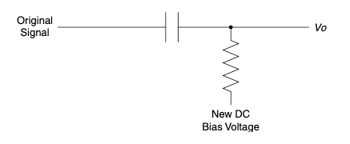

    **FIGURE 4.13 Change the DC bias on an AC signal.**

Virtual Ground
~~~~~~~~~~~~~~~~

Using the voltage divider as a reference, the op-amp becomes a voltage source
with the output matching the voltage at the divider—see :ref:`Figure 4.14 <Figure 4.14>`. This can
be very useful when you are trying to handle AC signals with only a single-ended
supply circuit.

.. _Figure 4.14:

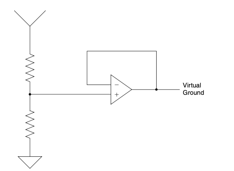

    **FIGURE 4.14 Create a“ground” at any level you want.**

Voltage Follower
~~~~~~~~~~~~~~~~~

As :ref:`Figure 4.15 <Figure 4.15>` shows, this one is mighty useful when you’re trying to measure a
signal that is easily affected by load. Vi= Vo, but, best of all, Vi isn’t loaded at
all, thanks to the buffering effect of the op-amp.

.. _Figure 4.15:

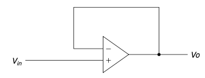

    **FIGURE 4.15 Voltage follower.**

AC-Only Amplifier
~~~~~~~~~~~~~~~~~

:ref:`Figure 4.16 <Figure 4.16>` shows another great circuit that works nicely in amplifying AC
signals with a single-ended supply. It also has the benefit of not amplifying
any DC signal components, keeping things like DC offsets from making your
signal rail. This happens because of the cap in the feedback circuit. Since the
cap only passes AC current, DC signals see that point as disconnected. When
the resistor to ground is disconnected, the op-amp acts like the voltage follower
in the previous circuit.

.. _Figure 4.16:

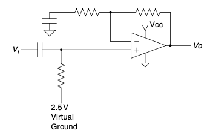

    **FIGURE 4.16 AC-only amplifier.**

Inverter Oscillator
~~~~~~~~~~~~~~~~~~~~

I saw this in the back of a data book years ago; I think it was a Motorola
logic data book. This was way back before the Internet. You used to have
to turn actual pages to find this stuff! The way it works is based on the
fact that the Schmidt trigger inverter has hysteresis built into the input
(:ref:`Figure 4.17 <Figure 4.17>`). This makes the output stick at a high or low level until the
cap on the input charges to the threshold voltage that trips the inverter. Out-
put flips and everything goes in the other direction, repeating indefinitely.
Adding some diodes to the charge and discharge path can affect the duty
cycle of the output.

.. _Figure 4.17:

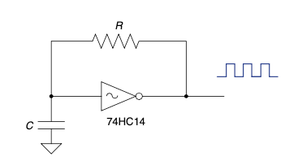

    **FIGURE 4.17 Schmidt trigger oscillator.**

Constant Current Source
~~~~~~~~~~~~~~~~~~~~~~~~~~

Using negative feedback, the op-amp tries to maintain the voltage drop across R
input. Even if the resistance of the load changes, the drop across R input stays
the same. According to Ohm’s Law, keeping R and V the same will keep current
the same, too—see :ref:`Figure 4.18 <Figure 4.18>`. Remember, though, this current control has
operational limits; it can only swing the output voltage so far to compensate
for load variance. Once these limits are reached, the current regulation can no
longer exist.

.. _Figure 4.18:

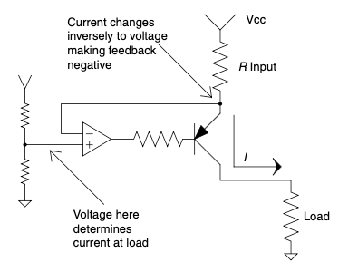

    **FIGURE 4.18 Voltage-controlled constant current source.**

GET YOUR OWN—HERE ARE A FEW
-----------------------------

I have just a few favorite circuit concepts. Get your own and know them well.
You will be better served knowing a few circuit concepts inside-out than know-
ing thousands superficially.

Following this advice, several readers of the first edition sent in some of their
favorite circuits. Without further ado, they are presented next.
Steve Petersen sent in the circuit shown in :ref:`Figure 4.19 <Figure 4.19>`, saying something about
being fun for parties and the potential to add a delay circuit to really surprise
someone [16]_ when they picked up whatever interesting device the circuit was
embedded in.

.. _Figure 4.19:

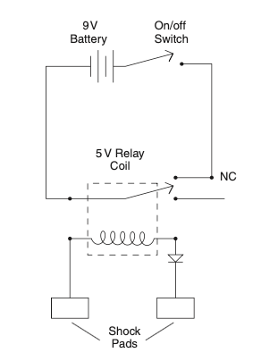

    **FIGURE 4.19 Toy shocker circuit.**

Travis Hayes sent in the diagram of a sleek little circuit, as shown in :ref:`Figure 4.20 <Figure 4.20>`,
that uses the inverter oscillator from my list to drive a voltage doubler circuit.
He said it was a pretty slick and inexpensive way to get a higher voltage for
an LCD he was using. I’d have to agree!

.. [16] I hereby claim no responsibility whatsoever for anyone out there hurting themselves using a design
they found in this book when I took the effort in this footnote to say,“Don’t try this at home!” We book
writers are professionals and know how to do a practical joke without really hurting anyone, at least not too
badly!

.. _Figure 4.20:

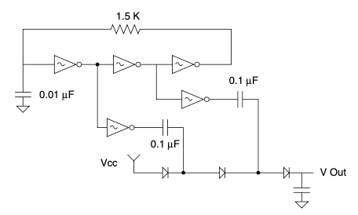

    **FIGURE 4.20 Inverter-driven voltage doubler.**

.. _Figure 4.21:

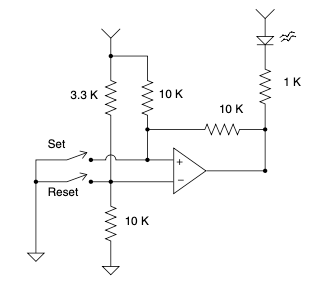

    **FIGURE 4.21 Flip-flop memory op-amp.**

Alan Tyger just might be as big a fan of op-amps as I am. He sent in the circuit
diagram shown in :ref:`Figure 4.21 <Figure 4.21>` ; it uses just such a device to store a piece of
information.

Michael Covington [17]_ sent in the cool circuit shown in :ref:`Figure 4.22 <Figure 4.22>`; it combines the fun of remote controls with a laser pointer. The 555 acts as a memory cell (not unlike Alan’s circuit), but this one has the added bonus that you
use a laser to control it. How cool is that! I don’t know any engineer who
doesn’t like lasers, and I’m pretty sure they all have to control the remote when
they are home watching TV.

.. [17] This circuit was published in the“Q&A” column of Electronics Now some time in the late 1990s when I was
writing that column for the magazine. The publisher has given permission to republish it elsewhere.

.. _Figure 4.22:

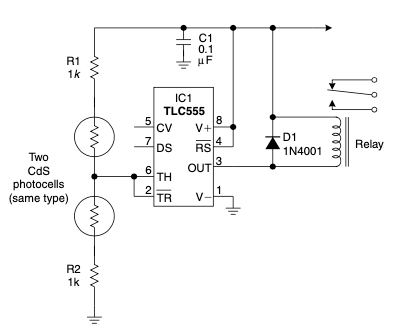

    Hit one or the other photocell with a laser pointer to change states. Supply voltage is not critical (5 to 15 V depending on requirements of relay). Note: Either R1 or R2 (not both) can be omitted to make up for imbalance between the photocells and provide better performance in bright-light conditions.

    **FIGURE 4.22 Laser light switch.**

Mike Angeli sent in this cool circuit in :ref:`Figure 4.23 <Figure 4.23>`. He said he used it to posi-
tion a load using a potentiometer feedback (thus the high-impedance
requirement).

Sam Nay sent in the circuit shown in :ref:`Figure 4.24 <Figure 4.24>`, saying he was always
fascinated by the ability to transmit data without wires. I’ll bet he hooks
up the laser-controlled switch that we saw just moment ago. Also, I happen
to know of a secret circuit that I am not at liberty to disclose that uses a variation of optical circuits not that different from this one to take biometric
readings. Bet you wish I could show you that one, don’t you!?

Finally, Mourly Thov sent in the circuit shown in :ref:`Figure 4.25 <Figure 4.25>`. He said he just
thought it was a slick way to change the DC voltage (and have some power
capacity, which could be an issue with the one Travis sent in), so if you find yourself
in need of a different voltage that can move some current, try an idea like this one.

On a final note, I have to say that from my communication with these engineers, I think they all fall in the RSP [18]_ category. Then again, maybe that is just
because they emailed me and really liked the first edition of this book. Either
way, I thank them for their submissions and completely absolve myself from
any responsibility for these circuits actually working. I hope they bring you luck
and help you to fill up a notebook with your favorite circuits.

.. [18] Look it up in the glossary at the back of this book. I’ll bet you know some RSPs too!

.. _Figure 4.23:

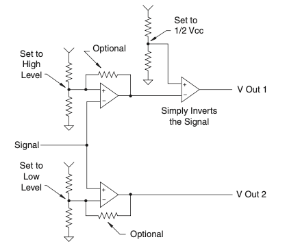

    **FIGURE 4.23 Laser light switch.**

.. _Figure 4.24:

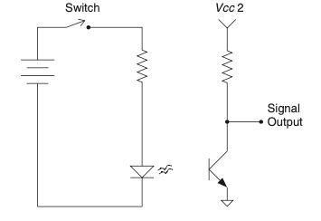

    **FIGURE 4.24 Laser light switch.**

.. _Figure 4.25:

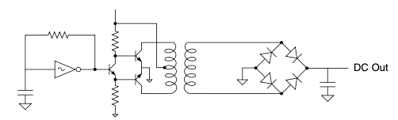

    **FIGURE 4.25 Laser light switch.**

.. admonition:: Thumb Rules

   - Keep your own cookbook of cool circuits.
   - Learn them well.

POWER SUPPLIES
----------------

Whatever you do with electronics, you are going to need power to accomplish
it. It will be useful to understand the basics of power supplies, since you are
nearly guaranteed to deal with them at some point in your career.

It’s All About the Voltage, Baby!
~~~~~~~~~~~~~~~~~~~~~~~~~~~~~~~~~~~~~

Most devices today want to keep the voltage constant. This means that current can
vary as needed. In the world of power, particularly as it relates to the ubiquitous
IC, it often seems that you never have the exact voltage you want.
A huge number of products run off 120 V AC out of a wall socket. Another huge
group runs off batteries that are charged from those wall sockets, and another
significant number runs off batteries that you can buy by the caseload at any
super-duper-mart. Just ask yourself, how many batteries did you buy last Christmas?
The problem is that most ICs these days want 5, 3.3, or even 1.5 V DC. This is
nowhere near 120 V, and definitely not AC! Enter the power supply. They come
in two flavors, linear and switcher.

Linear Power Supplies
~~~~~~~~~~~~~~~~~~~~~~~~

AC rules! It is everywhere. It might seem like the world runs on batteries these
days, but AC still has the majority foothold. Back when Edison and Tesla
argued over what type of electrical power distribution we should have, I’ll bet
they had no idea of the type of integration that would occur in the world of
electricity over the next 100 years. [19]_
One thing they did know about was the transformer. The basis of the transformer
is AC current. Put AC into one side of the transformer and, depending on the
ratio of windings, you get AC out the other side. So, put 120 V AC into a 10-
to-1 ratio transformer and you will get 12 V AC out (minus heat losses due to
the resistance of the windings).

The basic transformer is a very simple design. It is coils of wire on hunks of
metal. That makes it robust. A transformer is a perfectly acceptable way to
change the voltage of an AC signal. Transformers are used to jack the voltage
way up to minimize losses over long wires, and then they are used again to
bring the voltage back down to something safer to bring into your house.

.. [19] Man, did their argument get heated! To the point of electrocuting cats, that is. I won’t get into
details but point the reader to Margaret Cheney’s great biography of Tesla, called Man Out of Time
(Touchstone, 2001).

They further knock the voltage down again in millions of products, but at that
point they still output an AC signal. However, most of our chips want a DC signal,
so what happens next? It goes through a rectifier. There are two commonly used
options: a bridge rectifier, shown in :ref:`Figure 4.26 <Figure 4.26>`, and a center tap rectifier, shown
in :ref:`Figure 4.27 <Figure 4.27>`. Note how this uses two fewer diodes and another wire to the transformer, yet the rectified output is the same. Notice the“bumpy” DC output?

The output at this point of either rectifier is still too“bumpy” to be of much use
to our sensitive DC circuits. The next step is to add a large filter capacitor to
smooth out the bumps, as shown in :ref:`Figure 4.28 <Figure 4.28>`.

.. _Figure 4.26:

.. figure:: ./img/f4.26.png
    :align: center

    **FIGURE 4.26 Bridge rectifier.**

.. _Figure 4.27:

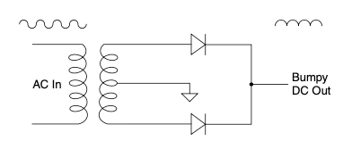

    **FIGURE 4.27 Center tap bridge rectifier.**

.. _Figure 4.28:

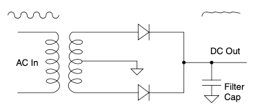

    **FIGURE 4.28 Center tap bridge rectifier with cap filter.**

It’s time to learn the principle of output impedance. Every power supply has it.
The more current you pull out of the circuit, the bigger issue the output impe-
dance is. Remember that Ohm’s Law says that as current increases through an
impedance, the voltage drop across it increases. This means that the voltage
at the output will drop as load increases. To further complicate things, the
rectifier in this circuit will contribute to an increased ripple voltage on the
output as load increases.

So, two important things affect the voltage on the output of this circuit: the
voltage going into it (which on most AC circuits can vary 10% or more)
and the amount of current being drawn, increasing voltage drop and voltage
ripple.

This is important to know as we feed this into the next part of the circuit, called
a regulator. The regulator is a part that adjusts its output to maintain a constant
voltage in the face of a changing load and a changing input voltage.
A linear regulator typically has a voltage reference (like a zener [20]_ diode) inside
it running on a small current that isn’t disrupted by the load. It uses this
reference and a negative feedback loop to control a transistor or other part
inside to maintain a constant voltage at the output. This gets you to the nice
DC voltage that your IC wants. The whole circuit from the wall looks some-
thing like :ref:`Figure 4.29 <Figure 4.29>`.

.. _Figure 4.29:

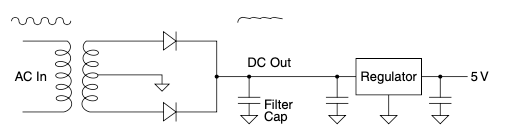

    **FIGURE 4.29 Typical linear regulated power supply.**

There are a couple of important things to know about linear regulators.
They have a minimum input voltage. If the input voltage falls below this
rating due to circumstances described earlier, the output will fall out of regulation. If this happens you can get ripple on the power supply to your
chip. If it is small enough, you might never notice it, but if you have some
high-gain circuits picking up AC noise, check out the power supply for problems first.

The other often-overlooked important spec is the power rating of the regulator.
A regulator can only handle so much power, even with a heat sink. The power
being dissipated by the regulator is the current times the voltage drop across the
regulator, *not the voltage at the output*! There are many other specs you should
review in the datasheet, but these are the most important and often overlooked.
Check them first. You can use linear regulators in any DC-in, DC-out situation.
They will do very well in most cases and, to top that, they are very simple and
robust circuits. Use them whenever you can. There is nothing wrong with this
technology in certain applications, but if you need more efficiency or maybe
less heat, you should consider a switcher.

.. [20] Zener, zener, zener, man that is a fun word to say! Way more fun to say than a word like coulomb or
Schottky.

Switchers
~~~~~~~~~~~~

A type of regulator and power supply rapidly gaining footholds over the older,
linear designs is called a switcher. As implied by the name, the switcher regulates
power to a load by switching current (or voltage) on and off. In this book we
will focus on the current method. (Don’t forget, however, that current and
voltage are invariably linked, as Ohm proved so well.) The secret to these sup-
plies is the inductor, and the secret to understanding an inductor for me is to
think in terms of current. In the same way a capacitor wants to keep voltage
across it constant, an inductor wants to keep the current flowing through it
constant as well.

DC IS WHAT WE START WITH
''''''''''''''''''''''''''

Switching power supplies are DC-to-DC converters. Even those that have an AC
input create a DC bus, using a rectifier circuit before implementing a switcher.
You will see switchers replacing just the regulator in our earlier circuit working
off a DC bus voltage that has already been stepped down by a transformer. You
will also see switchers that use rectified voltage right off the AC line and drop
and regulate all in one step from 120 V down to 5 V.

The most basic current-switching supply I know of is the buck converter.
A buck converter will knock a DC voltage from a higher level to a lower level.
Figure 4.30 shows the heart of a buck circuit.

.. _Figure 4.30:

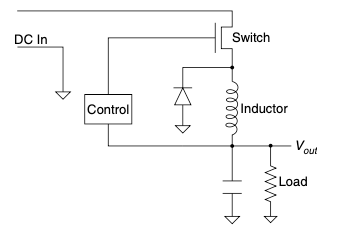

    **FIGURE 4.30 Basic switching buck converter.**

First, let’s identify the four main parts: the inductor, the switch, the diode, and
the load.

FLIP THE SWITCH
''''''''''''''''

Let’s start with the load and work our way backward. To begin with, switching
supplies like to have a load. Without a load funny things can happen, but more
on that later. What the load wants (in most cases) is a constant voltage. If
I remember Ohm’s Law correctly, one can control the voltage across a resistor
(i.e., load) by controlling the current through it, so let’s consider the flow of
current in this circuit. We will begin with the switch closed. With the switch
closed, current will flow through the inductor into the load. The current will
rise based on the time constant of the inductor and the impedance of the load.
Since the current rises, so does the voltage across the load. Assume now that we
have a circuit that is monitoring the voltage across the load, and as soon as it
gets too high it opens the switch.

Now what happens? First, remember this fact. Just as a capacitor resists a change
in voltage, an inductor resists a change in current. When the switch opens, the
inductor tries to keep the current flowing. If there is nowhere for it to go, you will
see a large voltage develop across the inductor as the magnetic field collapses. In
fact, at time = 0 the value of this voltage is infinite or undefined, whichever suits
you. That doesn’t happen in this case due to the diode and the load.

The current flows into the load, and the reason it does so is because of the
diode. Consider it this way: Current wants to keep flowing out of the inductor
and into the other side of the inductor. Without the diode there would not be a
path for this current to follow. However, with the diode, this current is pushed
through the load. So now the switch is open, and current is still flowing into
the load. This current starts out at the same level it was when the switch opened
(an inductor wants to keep current the same, remember!) and it decays from
there. As the current falls, so does the voltage. Of course we still have a circuit
monitoring the voltage across the load, and as soon as it gets too low, it closes
the switch again.

Voilà, the process starts all over. There are two important things I noticed once
the pieces fell into place in my head. The first is that this control circuit I just
described can be implemented with a simple comparator and a little hysteresis.
Of course, that would lead to the frequency of the switcher being determined
by the value of the inductor and the impedance of the load. That may or
may not be a desirable trait. The other thing I realized was that when you first
turned it on, the circuit would want to slam the switch shut and keep it there
for a long time while current builds up in the circuit. Are you beginning to
see why switchers need a load?

Luckily, others much smarter than I have dealt with these problems already.
That is why you hear terms like soft start and built-in PWM when you start study-
ing switching supplies.

Some Final Thoughts
~~~~~~~~~~~~~~~~~~~~~

Since designing switching supplies, getting them stable, and dealing with the
inductor specs can be a bit demanding, technical, and tedious, all sorts of
industry help has sprung up in the effort of various companies trying to get
you to use their parts. You will find design guides and even Web design plat-
forms out there to help you build a switcher for your design, and I highly sug-
gest you take advantage of them.

These days you will often find all the brains, switching components, and feed-
back parts in one cute little package, [21]_ making the design nicely compact and
small. You can make switchers that boost voltage as well as the buck versions,
and some that even go both ways, but ultimately they rely on the fact that the
inductor wants to keep current flow the same. We will save the more in-depth
review for another book on another day.

.. [21] I know, only real nerdy engineers would think an IC could have cute packaging, but I have never denied my nerdhood.

The best thing about switching supplies is the fact you can get by with
relatively little copper and attain very high efficiency (meaning less heat).
The reason for this is that the decay rate of the current in the inductor
depends on the size of it, but if you switch it faster, the average current and
thus the average voltage is still maintained. So you can get by with much less
copper, especially for larger current draws at low voltages. The efficiency is
good because much less power is spent heating the copper in the small
inductor than in an equivalent transformer design. However, all this comes
at a price. Switchers are known for their high-frequency noise that has dis-
rupted many a sensitive analog design. But who cares about analog anymore,
right?

.. admonition:: Thumb Rules

   - Make sure the lowest dip on the ripple voltage doesn’t go below the minimum input of the regulator.
   - Check your supply at ±15% of the AC input signal.
   - Linear regulators dissipate heat/power based on the current times the voltage from input to output (i.e., across it).
   - Switchers exploit the fact that inductors want to keep current flowing even when the switch is open.
   - Switchers are more efficient and create less heat but generally are more finicky to set up.
   - Linear supplies are very quiet when it comes to EMI.
   - Switchers tend to be very noisy when it comes to EMI.
   - Switchers need a minimum load to work correctly.

MAKING STUFF MOVE: THE ELECTROMECHANICAL WORLD
--------------------------------------------------

One thing that happens in the real world is moving stuff. Eliminating moving
parts is a commonly sought-after goal in the world of electronics. However, I
suspect that sometime in your career you will need to make things move and
you will be thrust into the world of electromechanical devices. Considering
that what I knew about motors when I left school could be written on the
thin edge of a postage stamp, [22]_ I feel the need to cover some of the basics
behind motors and a few other electromechanical devices here.

.. [22] My father was fond of this saying, so as a boy I spent more than a little bit of time looking at a stamp on edge and wondering just what you could fit there.

DC Motors
~~~~~~~~~~~~

My eldest son was elated when he got a Lego Mindstorms kit for Christmas when
he was about 8 years old. For those who don’t know, this is a ready-made robot kit
based on—you guessed it—Legos. My wife claims I was much more excited than
our son was. I beg to differ, but we won’t go into that now. The whole point of
a robot is that it moves (a fact that my son wanted to exploit to make a robot to
clean his room). The Lego kit uses little DC permanent magnet motors with gears
and such to get along. Since this type of motor is so popular, a little discussion
about DC permanent magnet motors and how to control them seems prudent.

The DC permanent magnet (PM) brush motor is probably the easiest motor to
understand. It consists of just a few parts: an armature, some magnets, a case,
wires, and brushes. I remember as a kid making a motor out of a couple of
nails, a dowel, and some wire. It looked something like what’s in :ref:`Figure 4.31 <Figure 4.31>`.

.. _Figure 4.31:

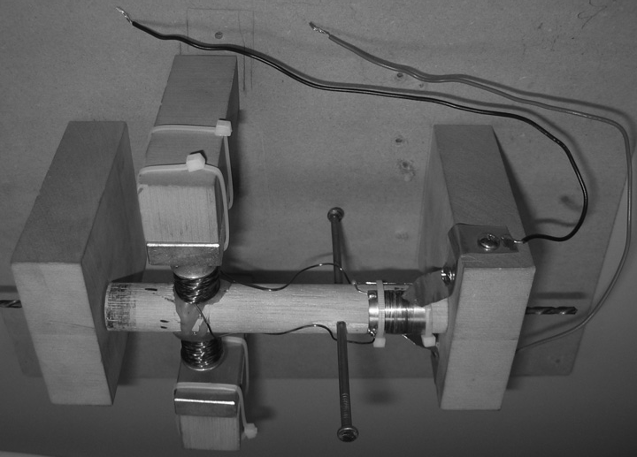

    **FIGURE 4.31 A home-built motor.**

.. _Figure 4.32:

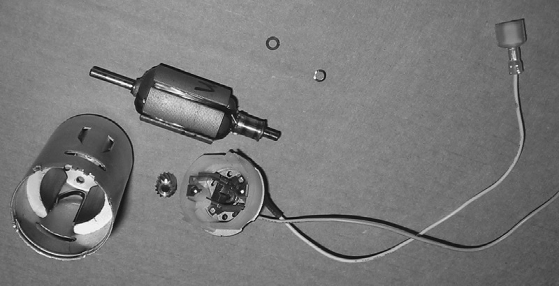

    **FIGURE 4.32 A home-built motor.**

You can make a motor by winding the wire onto the armature in a loop. The
ends of the wire terminate on segments that the brushes rub on, as shown in
:ref:`Figure 4.32 <Figure 4.32>`.

Permanent magnets are attached to the case in such a way as to surround the
armature. The armature is supported in the case by bearings or bushings so that
it can rotate freely. At its most basic, the coil of wire on the armature is nothing
more than an inductor. As we learned earlier, an inductor develops a magnetic
field when you pass current through it. This magnetic field is just like the one
present around the permanent magnet. By controlling when the magnetic field
is present around the armature, you cause the field around the wires to push or
pull against the field around the magnet. The current to the armature is
switched on and off (which turns the magnetic field on and off) in a sequence
that causes the armature to turn. This is called *commutation*. In the DC PM brush
motor, the brushes are the method of commutation. They switch the current
through various sections of the armature as it turns.

A DC PM motor has two inputs and two outputs. You put voltage and current in
and get speed and torque out. One nice thing is that the speed is proportional to
the voltage and the torque is proportional to the current. Motors are devices in
which the physical equivalents of electric components are not only similar in
nature but are actually linked in performance. Think of it this way: Voltage and
current together equal power. Speed and torque together also equal power. So,
in a motor, *you put electrical power in and get mechanical power out*. That actually
makes sense, doesn’t it? The equivalent circuit looks like the one shown in
:ref:`Figure 4.33 <Figure 4.33>`.

.. _Figure 4.33:

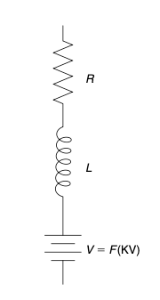

    **FIGURE 4.33 A home-built motor.**

What do you think the resistor is doing in this circuit? Have you ever noticed a
motor getting warm when it operates? This heating comes from the resistive
component in the motor. Any wire short of a superconductor has resistance.
The armature, being made out of wire, also has resistance. Current flowing
through a resistor will create a voltage drop across said resistor, and power
across that resistor turns into heat. Ohm’s Law still works.

The inductor creates the magnetic field that turns the armature. The battery
represents what is called the back EMF, or *electromotive force*. If you were to spin
the shaft of the motor with nothing but a voltmeter hooked up to it, you would
see a voltage appear on this meter that is proportional to the speed at which
you spin the shaft. When you apply a voltage to the motor, the shaft will spin
at a speed in the same proportion. However, not all the voltage you apply to
the leads makes it to this point in the motor. Some of it is lost across the resistor. All this leads to some characteristic equations of this type of motor.

The relationship between voltage and speed is known as the *voltage constant*,
with units of volts per Krpm. It is referred to as :math:`K_e` or :math:`K_v` :

.. math::
    :label: equation 4.1

    k_v = \frac{V - IR}{Krpm}

:V: = the amount of voltage applied at the leads
:I: = the current flowing through the motor
:R: = the equivalent resistance of the motor [23]_
:Krpm: = the speed of the shaft in thousands of revolutions per minute

.. [23] Note that you can get a fairly close idea of this with a simple ohmmeter turning the armature very, very slowly. (Too fast and the voltage generated will mess up the reading.) To be more precise, you need to take the resistance of the brushes and the way they contact the armature into account, a discussion that we will save for another book.

The IR term in this equation accounts for the loss of heat in the motor. As cur-
rent approaches zero, this effect disappears. This is what happened earlier when
we hooked it up to a voltmeter and spun the shaft, reading the voltage gener-
ated. Do you see how that minimizes the error, giving you an accurate idea
of the voltage constant?

The relationship between current and torque is known as the torque constant,
usually referred to as Ki, which has the units inch-ounces per amp (in-oz/amp):

.. math::
    :label: equation 4.2

    k_t = \frac{T}{I}

:T: = torque in inch-ounces
:I: = the current in amps

These two constants are linked; changing one changes the other. In fact, if you
know one, you can calculate the other with these equations:

.. math::
    :label: equation 4.3

    \begin{align}
        K_t &= K_v & [Nm/A;V/rad/s] \\
        K_t &= 9.5493 \times 10 - 3 \times K_v   & [Nm/A;V/Krpm] \\
        K_t &= 1.3524 \times K_v   & [oz-in/A;V/Krpm] \\
    \end{align}

As you can see, it turns out that we are really only dealing with one constant in
the motor. This constant is controlled by the number of windings on the armature and the strength of the magnets. More windings increase the voltage/torque
constant, fewer decrease it. The size of the armature and the strength of the
magnets also affect this constant.

We now know that the main electrical components of a motor are resistance,
inductance, and a voltage source. Can you extrapolate the mechanical properties?
They are friction and inertia. [24]_ The first thing you should note is that the load, or
whatever is hooked to the motor shaft, will likely be the largest contributor to
these two characteristic factors, masking the effects of the armature inertia and
brush or bearing friction.

Inertia will tend to make the motor take time spinning up to speed, increasing
the load and current draw as you accelerate. Once at speed, inertia will tend to
keep the motor spinning, so during deceleration you will notice a lessening of
the current the motor needs.

Friction will create a constant load on the motor that will appear as an increase
in current in our“sparky” universe. To gain further light and knowledge on all
things motor, I refer the reader to the“pink book.” [25]_

.. [24] You could also have a spring-type component, as we discussed way back in the beginning of the book, but it is pretty rare to find that in a DC PM motor.
.. [25] DC Motors Speed Controls and Servo Systems (Electro-Craft Corporation). I like to call it the“pink motor book” due to an interesting choice of color for the cover. I highly recommend it for anyone who is working with DC motors.

DC MOTOR CONTROL
''''''''''''''''''

Given what we just learned about this type of motor, I hope it is apparent that if we
want to control the speed of a DC permanent magnet motor, we should control
the voltage to it. If we want to control the torque, we should control the current.
If this doesn’t make sense, take a look at the DC motor equations once more.

SPEED CONTROL
''''''''''''''''''

Let’s start with a simple application. Say you want to spin a motor at 500 rpm. This
motor has a Kv of 10 V/Krpm. Plug that into the equations we just learned and you
find out you need about 5 V to get this motor going at the speed you want (neglecting load for a moment). But how do you go about getting 5 V to the motor? There
are two different ways to approach this problem: You can use a linear methodology or a switching methodology. In both cases, you will start with a higher voltage
than you want at the motor and then lower it and apply it to the motor leads. We
should go over both types of systems to understand the pros and cons of each.

LINEAR CONTROL
''''''''''''''''''

The simplest way to make a linear control is based on the voltage divider rule. Put
a resistor between the power supply and the motor and adjust the resistor’s value
until you have the amount of voltage you want across the motor—see :ref:`Figure 4.34 <Figure 4.34>`.

.. _Figure 4.34:

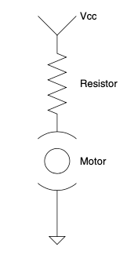

    **FIGURE 4.34 A motor with a resistor in series.**

The biggest drawback to this design is that the motor can be a dynamic load. As
the load on the motor changes, the amount of current through the motor changes,
which, following Ohm’s Law, changes the voltage drop across the resistor, which
changes the voltage across the motor and hence the speed of the motor is destined
to change.

However, if the load is consistent or if variability is okay, you can dial this
design in and make it work fine. You should note that the resistor will heat
up based on the current through it and the voltage across it. For example, if
Vcc is 10 V and you set the resistor value such that 5 V is across the motor, this
means that there is 5 V across the resistor. If the current drawn by the motor in
this case is 1 A, you will need a 5 W resistor to handle the power. (Actually, any
engineer worth his salt will not run the power resistor at its maximum wattage
but will overrate it liberally.)

In this linear control design, the resistor can be replaced by an FET or transistor
or some other type of amplifier operating in linear mode, allowing the voltage
to the motor to be adjusted as desired. By using feedback methods as previously learned, the variation in load can also be compensated for so that
you can maintain the desired voltage to the output. Take a look at :ref:`Figure 4.35 <Figure 4.35>`.

.. _Figure 4.35:

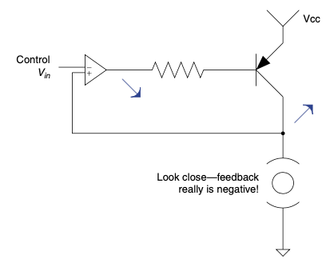

    **FIGURE 4.35 Op-amp-controlled motor.**

This design has the significant advantage over the previous one of maintaining
the voltage to the motor at a desired level, regardless of the changes in load.
This will maintain a more constant speed than the previous design, but there
is still room for improvement, as we will see later.

The biggest drawback to this type of design is the same as the resistor. Excess
power is turned into heat. One benefit, though, is that as far as EMI is con-
cerned, it is a quiet design.

SWITCHING CONTROL
''''''''''''''''''

In contrast to linear control, a motor can also be controlled by switching power
on and off to the motor. The similarities of switching motor control to
switching power supplies are many. In many switching supply designs you will
find an inductor that stores the energy when the switch is on and discharges it
to the load when the switch is off. The same thing can happen in a switching
motor control. The inductor, however, is inside the motor. In the switching
supply you will find a diode that directs the current from this inductor to the
load. In a correctly designed switching motor control, you will find a diode that
performs exactly this function, as shown in :ref:`Figure 4.36 <Figure 4.36>`.

.. _Figure 4.36:

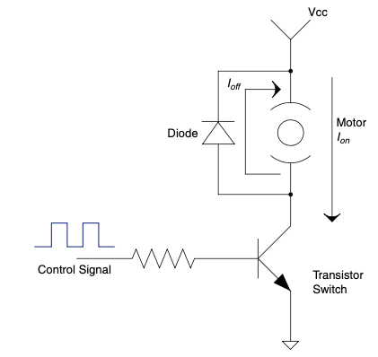

    **FIGURE 4.36 Transistor with motor and diode.**

When the switch is closed, current flows through the motor. When the switch
opens, the current from the inductor goes through the freewheel diode back
around through the motor. Since this current is recaptured and applied
to the load, switching motor controls are more efficient than their linear
counterparts.

Some important things to note: The switching frequency of this type of control
needs to be fast enough for the inductor in the motor to act this way. If the switch
doesn’t turn back on before all the current has discharged from the inductor, you
will feel the torque change in the motor (it will manifest itself as a vibration).

In a way, the inductor filters the high frequency of the switching power, reducing torque ripple and thus vibration. The most common form of control in
this case is called PWM for *pulse width modulation*. By varying the duty cycle of
the PWM, the amount of power to the motor is varied.

Switching motor controls are very prevalent these days. This is primarily due to
their efficiency and the proliferation of high-power, high-frequency switching
devices.

MAINTAINING SPEED
---------------------

Often some sort of voltage feedback is used to maintain the output voltage of the
control to a desired level. Remember that in the DC PM motor the speed of the
output shaft is proportional to the voltage applied. That makes it nice for main-
taining speed. However, if you flip back a few pages you will notice the IR com-
ponent of that equation represents what are known as losses. These losses are
burned up as heat across the resistance of the wire in the motor armature (plus
a little in the brushes). The loss is proportional to the current (I) through the
motor, and the current is proportional to the load on the motor shaft.

This means that as load varies on the motor, the amount of loss varies. This
results in a change of speed. Think of it like this: The voltage that gets burned
up as heat never makes it to spinning the motor shaft—see :ref:`Figure 4.37 <Figure 4.37>`.

.. _Figure 4.37:

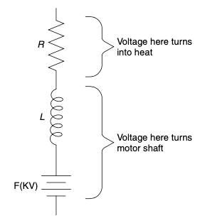

    **FIGURE 4.37 What happens inside the motor?**

There are two ways to compensate for this. One way is to use speed feedback
to adjust the voltage output to the motor to maintain a constant speed. The
other is to compensate for the losses themselves.

In most DC motor control designs, you will find a voltage feedback loop that
does 90% of the speed control work. Then, external to that, you will find a speed
feedback control loop that will compensate for the rest of the variation—see
:ref:`Figure 4.38 <Figure 4.38>`.

.. _Figure 4.38:

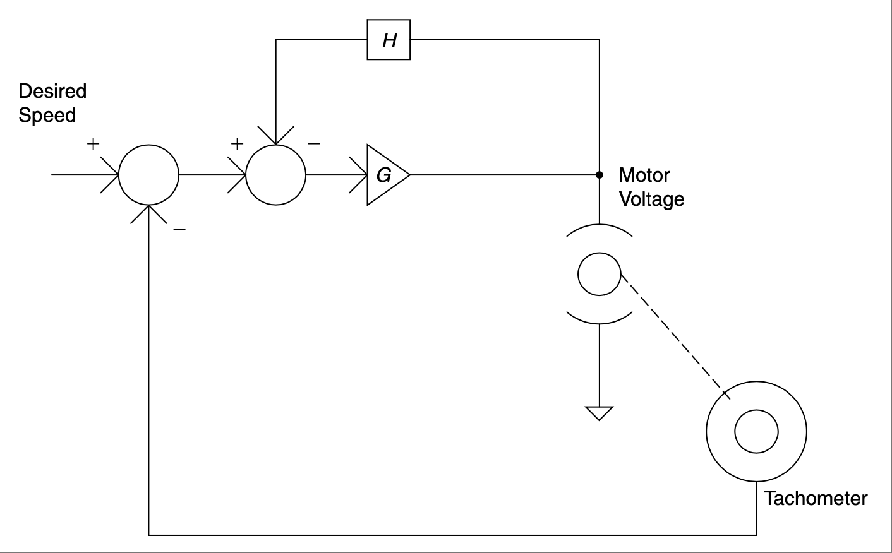

    **FIGURE 4.38 Block diagram of speed feedback.**

Though it is generally a good idea to feed back the signal you want to control,
there could be times you do not have that luxury, or maybe there are reasons
you do not want to use speed feedback. If this is the case, you can use another
speed control approximation called IR *compensation*—see :ref:`Figure 4.39 <Figure 4.39>`. This is a
method in which you monitor the load on the motor by sensing the current
through the motor. The loss due to heat is proportional to this current. If you
know the resistance of the motor, you can calculate how much voltage turns into
heat, never making it to the output shaft. Add this much voltage to the input to
the motor and you have a fairly good approximate speed control and you didn’t
need a tachometer!

.. _Figure 4.39:

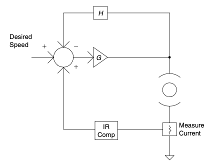

    **FIGURE 4.39 Block diagram of IR comp feedback.**

All in all, controlling a DC PM motor speed is one of the simplest motion-
control problems to tackle, but it is simple only relative to the other options
out there. It is still a significant“chunk o’ learnin’” to swallow. For this reason
I suggest starting here if you want to learn motion control before moving on to
some of the other available motors.

Torque Control
~~~~~~~~~~~~~~~~~

One thing that happens when you take a motor and stop the rotor is a huge
increase in current. Depending on the motor and your design, this could be
more current than your control can handle. In this case you might need a
current-limiting circuit.

This is a circuit that monitors the current used by the motor and, at a preset
level, scales back the output, limiting the current available to the motor.

In a DC PM motor, when you control the current, you control the torque. Don’t
believe me? Flip back a few pages and look at the torque constant equations.
The units are in-oz per amp. This is a linear relationship—the more current
through the motor, the more torque at the output shaft.

What all this means is that a constant current supply will create a constant torque
when hooked up to a motor. This is essentially what happens when a control
hits its current limit. The control goes from being a constant voltage supply to a
constant current supply. This protects the motor and the control from damage.

Braking
~~~~~~~~~~

Imagine careening down a hill on your electric scooter.“Gosh,” you think to
yourself,“it would be nice to use some of the energy I’m wasting to slow this
vehicle down. There ought to be a way to make it recharge the batteries. Hey,
I’m an engineer,” you say to yourself,“Why don’t I design a regenerative
brake?” Just such a thought has come into my head and I have been able to
ignore [26]_ it quite effectively until now.

.. [26] I find it very easy to ignore such thoughts when I am playing Nintendo (or Xbox 360). In fact, back in my college days, I had to redo an entire quarter of school due to a severe Nintendo addiction (except for one class that I passed due to a very persuasive paper on said topic). But we’ll save that story for some other time.

Some time ago I was asked to design a motor control with a regenerative braking circuit. Having done several controls, but none with regenerative braking,
I started by perusing the Internet. I don’t follow Star Trek’s creed to boldly go
where no man has gone before on a whim. That is to say, if someone has been
there already, I would sure like to know the path he or she took. Once the end
of that path has been found, I will then venture into the unknown.

Anyway, in this case, several hours of searching were somewhat futile. A simple
and concise explanation and possibly a schematic (particularly for a PM DC
motor) were all I needed. There were reams [27]_ of information explaining what
it does but not much was there showing exactly how it was done. Alas, my
effort to find the simple explanation was to no avail. Maybe it was out there
somewhere, but I got sick of all the pop-ups.

.. [27] Can you use the word reams when referring to the Internet? After all, it isn’t really on paper, is it?

As you might have guessed by now, I take such a lack as a personal affront that
I must correct. The following is what I have pieced together in my own
mind, distilled down to my level of intelligence (the longer I spend in management, the lower this level seems to be), then ousted to my readers in a form I
hope is easy to understand. After I looked at the best idea since raw toast and
the nice read about the Honda Insight’s regenerative brake, the following is
what came out.

No More Secrets!
~~~~~~~~~~~~~~~~~

One place I found said that regenerative braking is the well-kept secret of motor
control. However, when I learned the truth, I think it is just poorly explained.
Let’s start with :ref:`Figure 4.40 <Figure 4.40>`, a diagram of a simple PWM controller for a DC
PM motor.

.. _Figure 4.40:

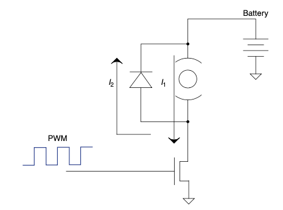

    **FIGURE 4.40 PWM motor control.**

A PWM is fed into a switch, such as a MOSFET, at a frequency that is high
enough to keep current flowing in the inductor inside the motor, not at all
unlike a switching power supply. When the PWM shuts off, the current flows
through the diode (sometimes referred to as a freewheeler diode). That part I
could understand, but the question that I kept asking myself was how do you
get a motor, which is spinning at a lower voltage than the output of the battery,
to push current back into the battery?

Let’s start with a small change to our earlier circuit, as shown in :ref:`Figure 4.41 <Figure 4.41>`. We
will replace the diode with a synchronous switch that goes off when the primary goes on, and vice versa. For the purpose of this discussion we will ignore
the fact that the FETs need particular driving methodologies for the high side
and the low side of a motor.

.. _Figure 4.41:

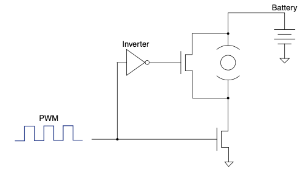

    **FIGURE 4.41 PWM motor control with FET in place of diode.**

I had read about this topology many times. It is usually brought up as a way to
make your controller more efficient in terms of heat loss. This is because the
FET has a significantly lower voltage drop across it than the diode does. I had
no idea that it also functions as a regenerative brake, until I figured it out for
myself. Here is how it works.

A Little Elaboration
~~~~~~~~~~~~~~~~~~~~~

Keep in mind that in the original version of this controller there is a voltage
across the motor that depends on the duty cycle of the PWM, but it is refer-
enced to the positive output of the battery, not the negative side. That helped
me to keep it in perspective.

Assume that we have a 12 V DC battery and there is 6 V DC across the motor.
That means you would see an average of 6 V DC from the bottom of the motor
to ground. Now let’s say that you spin the motor faster than 6 V—for example,
7 V. If you keep the same average voltage at the bottom of the motor, you will
have 1 V extra to dump into the battery. This explanation doesn’t entirely jive,
but I think it will get you in the right frame of thinking. If you follow it to its
conclusion, you will think that the previous version with the diode should also
regenerate, but it does not.

Let me elaborate. With the diode version, there is no braking force generated.
That comes into play when the diode is replaced by the FET. When the free-
wheel FET turns on, the voltage generated by the motor is shorted back into
itself. This provides the braking force and a current flow in the opposite direc-
tion through the motor. Remember the rule of inductors (since there is a
decent-sized inductor in the motor). Once a current is flowing, it doesn’t like
to stop. So when the high side opens and the low side closes, current is pushed
into the battery. Wave of the wand and voilà, you have regeneration!

Regeneration Ain’t So Bad
~~~~~~~~~~~~~~~~~~~~~~~~~~

It turns out that regeneration isn’t so tough at all. In fact, it is almost a side
benefit of making your controller more efficient, if you want to look at it that
way. Now if there were just some way of making it more than 100% efficient,
hmm . . . .

Changing Directions
~~~~~~~~~~~~~~~~~~~~

In a DC PM motor, it is fairly easy to change the direction of spin of the arma-
ture. You simply need to reverse the voltage to the motor leads. A common way
to do this is known as an H bridge, so called for the way it looks when drawn on
a piece of paper, as shown in :ref:`Figure 4.42 <Figure 4.42>`.

.. _Figure 4.42:

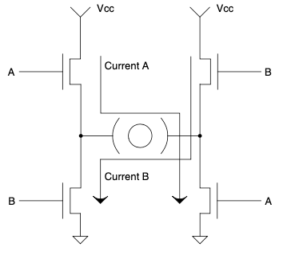

    **FIGURE 4.42 H bridge motor control.**

As previously discussed, the H bridge can be a linear or switch mode design.
The same theory is applicable, but it does become more complex. For example,
you don’t want to turn on both legs on one side of the bridge because you will
create a short across your power supply. This is known as shoot through and will
usually cause copious emissions of magic smoke. [28]_

Synchronous switching of the opposing high and low legs with the appropriate
devices (like FETs) will create the braking/regenerative effect that we have already
mentioned. Voltage and current feedback become more complex due to the fact
that one leg of the motor is no longer tied to one spot all the time. You will need
some differential amplifiers that can handle some large voltage swings to get
things working right.

Making Stuff Move Conclusion
~~~~~~~~~~~~~~~~~~~~~~~~~~~~~~~

Controlling motors is one of the most complex and rewarding things you will
do in electrical engineering. Setback and frustration will be rewarded with the
pride of seeing something move! There is no way I can possibly cover all
aspects of motor control in this text. I do hope, however, that I have given
you enough basic understanding that when you tackle motors and do more
research on the topic, you will be able to understand what you find out there.

SOME OTHER TYPES OF MOTORS
---------------------------

You will run into many types of motors. People have been goofing around with
different ways to make a motor nearly as long as they have been messing with
electricity. Here is a bit of overview on some various types of DC motors.

Brushless DC Motors
~~~~~~~~~~~~~~~~~~~~~~~~~~~~~~~

The brushless DC motors shown in :ref:`Figure 4.43 <Figure 4.43>` are cousins to the DC PM
motor we discussed earlier, but instead of using brushes for commutation, they
usually use some type of electronic control. To accomplish this, usually the
inside of the motor has the permanent magnets (where the armature is in the
DC PM motor). This is known as the rotor. The windings are on the outside
and are usually referred to as the stator, or field windings. [29]_ There is no require-
ment for the magnets to be on the inside and the windings on the outside, but
the windings are stationary and the magnets rotate. The rotor is turned by
switching the stator windings on and off in a sequence that creates torque on
the rotor. This is known as electronic commutation, as opposed to brush commu-
tation, which we already learned about.

.. [28] I have found that letting the magic smoke out of a component can be very entertaining. But once the magic smoke is gone, those parts just aren’t the same anymore.
.. [29] You can flip-flop the magnets and the windings. You might see a motor with the magnets on the outside and the windings in the center. The windings are still stationary and the magnets still move. The RC world calls them outrunners.

.. _Figure 4.43:

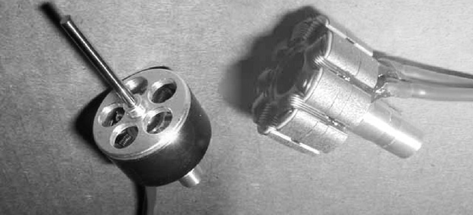

    **FIGURE 4.43 Cool little brushless DC motor out of my RC airplane.**

Often you will be told how a DC brushless motor is so much more efficient
than a DC PM brush motor. There is some hype to dig through here. Though
this claim can be true, it is not entirely due to the fact that it is a brushless
motor, as the brushless motor guys would have you believe. You will see numbers showing improved efficiency, but that is generally due to the choice of
magnets. Most brushless motors are using rare Earth magnets that have a much
higher flux density than the more common ceramic kind. What this results in is
fewer turns of wire for the same torque and speed. Fewer turns of wire means
shorter wire, which means lower resistance. Since the resistance of the windings
is the largest loss in the motor, this makes the motor more efficient.

DC PM motors commonly use the ceramic magnets, resulting in more turns of
wire. To make them more efficient, you need to increase the wire diameter to
lower its resistance. It is possible to use the stronger magnets in a DC brush
motor. The most common place I have seen this is in hobby stores. There are
some pretty cool motors like this for RC airplanes. When built with these
“super” magnets, the DC PM motor is pretty close to the same efficiency as
the DC brushless motor.

Assuming good bearings, the next point of loss in a motor is in commutation.
In the DC PM motor the brushes and brush contacts are the method of commu-
tation. This interface is not perfect and creates a resistive loss. In the DC brush-
less motor, commutation is done with some type of silicon switch such as an
FET, for example. Typically, it takes at least six of these parts to commutate a
DC brushless motor. These FETs have a resistive component (called RDS on)
that causes loss in the form of heat.

The biggest advantage to a brushless motor is right there in its name. It has no
brushes. The brush in the DC PM motor will nearly always be the first thing to
wear out. Brushes by their nature are designed to wear out, but don’t let that
stop you. There are many types of brush motors available, and often they will
be just fine for the application.

One thing to note about brushless motors is that the controllers are more com-
plex, requiring three to six times the power devices that brush motors use. But
once you have them under control, you have already spent most of the money
needed to make them go in both directions. So if that is a feature needed, it
could make a brushless motor more of a candidate.

Stepper Motors
~~~~~~~~~~~~~~~~

Stepper motors are a type of DC motor in which the output moves a specific
distance each time you energize a winding. They are a cousin to the brushless
motor and a weird animal called the switched reluctance motor. [30]_ The ability
to move a specific step makes these devices commonly used in positioning
mechanisms. Printers use them by the bucket load.

Positioning is relatively easy since you can energize the windings and count the
number of steps you have made to determine where the motor shaft is.
Stepper motors are characterized by their moving torque and holding torque.
This is important to know because if you exceed either, your motor could slip,
and that would cause your count to be off.

.. admonition:: Thumb Rules

   - In a motor, you put electrical power in and get mechanical power out.
   - Voltage * current = power; speed * torque = power.
   - Linear controls cause less EMI.
   - Linear controls are simple and cheap.
   - Linear controls are less efficient due to heat loss.
   - Switching controls are more efficient.
   - Switching controls cause more EMI.
   - Switching controls are generally more complex and expensive.
   - Constant voltage makes for constant speed with a DC PM motor.
   - Constant current makes for constant torque with a DC PM motor.
   - Don’t forget the freewheel diode in a switcher.
   - Replace the freewheel diode with an FET and you have a brake.
   - Use an H bridge to change directions.
   - Brushless motor controls are inherently bidirectional.
   - Stepper motors move in small steps or increments.

AC and Universal Motors
~~~~~~~~~~~~~~~~~~~~~~~~~~

As we mentioned earlier, long ago a smart guy by the name of Tesla helped us
all by convincing the powers that be that we should have an AC means of
power distribution (vs. the local DC generators that Edison wanted). One key
factor that helped with this debate was Tesla’s invention of the AC motor.

.. [30] Somewhere between an AC motor and a brushless DC PM motor lies the switched reluctance design. It is rare enough that the reader is left to his or her own resources to find out how this unique design works.

There are many types of AC motors. One of the most common and the one we
are going to review here is the AC *induction motor*.

An AC induction motor induces a current in the armature by varying the magnetic field in the stator. This induced current in turn creates a magnetic field
that causes the rotor to turn, pushing against the first magnetic field. When
I first learned this, it seemed to me that an AC motor can pick itself up by its
bootstraps, so to speak. One result is that the motor tends to have a“sweet
spot” where the rotational speed is just right, generating maximum speed and
torque. At lower speeds the torque drops off pretty fast. This leads to the fact
that AC motors are not known for low-speed torque (unlike the DC versions
we just discussed). For this reason and the fact that AC motors run off a sinusoidal alternating signal, a huge percentage of AC motors are fixed-speed outputs where the speed depends on the frequency of the AC signal. There are
variable frequency drives or controls, similar in architecture to DC brushless
drives. They can vary the frequency into an AC motor, creating a variable-speed
AC drive. Since AC motors do not have such a simple torque speed curve, these
controls can be fairly complex, often using DSP chips to handle all the math
needed to get what you want out of one of them.

AC motors have been around for years, making them relatively inexpensive,
and their lack of brushes makes them last a long time. They can be built synchronously, like a stepper motor, so that you know they have moved a set
distance every cycle of the AC wave. You will see them in all sorts of places:
running compressors in a refrigerator to timing the icemaker circuit in the
same fridge. Back before the“day of the diode,” they were used in millions
of clocks.

Universal motors are like PM motors without the permanent magnet. They use
windings with current flowing through them in the outer field instead of said
magnets. What makes them universal is the ability to wire them to work with
an AC or DC source. I shocked myself more than once rewiring the motor
down in the old milking barn trying to figure this out.

Motors of all shapes, sizes, types, and voltage preferences are out there. Hopefully
I have provided enough background so you at least sound smart when you’re asked about this topic.

Solenoids
~~~~~~~~~~~

The solenoid is an electromagnetic device that typically moves to only two positions. Akin to the stepper motor, solenoids are rated by holding force and moving force.

Take a coil of wire and an iron rod that just fits inside the coil, as shown in :ref:`Figure 4.44 <Figure 4.44>`.

Energize the coil. The rod will center itself in the coil due to the magnetic flux
running through it. It is in fact reluctant to leave the warm home of its cozy
little coil. This tendency for ferrous material to align itself with magnetic fields
is known as reluctance.

.. _Figure 4.44:

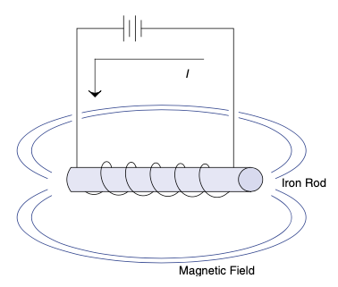

    **FIGURE 4.44 Iron rod in coil of wire.**

Shut the magnetic field down and the rod moves easily. Usually a spring is used
to push the rod out of its cozy coil shell until power is switched back on and
the rod returns to showing its reluctance yet again.

Solenoids are great if you need a short linear motion that is controlled by something electronic. Also, this concept is the basis for an electromagnetic cannon.
We don’t have time to cover that topic in this book, though. Too bad; cannons
are fun.

Relays
~~~~~~~~~

Relays don’t actually make anything move except the part inside them that closes
a switch, so they might seem a little out of place in this discussion. However, they
are definitely electromechanical in nature and I couldn’t think of a better place to
talk about them. Relays are very tough; they predate the transistor by a long
time and are still in use. That should say something. They are basically the combination of a solenoid and a switch. A magnetic force pulls the switch shut or
open, depending on the particular device. Markings on a relay usually indicate
the coil that operates the relay and the labels NO, NC, and C. These abbreviations, also sometimes seen on switches, mean normally open, normally closed,
and common, respectively. NO and NC refer to the state of the switch when the
coil isn’t energized. C is a connection to both these switches.

There are two important specs on a relay: the coil voltage and the contact ratings.
If you under-drive the coil, you might get the switch to close, but there are no
guarantees. Contacts are often rated at a minimum as well as a maximum
current. Most engineers are diligent about paying attention to the max current,
but they often ignore the minimum current. Many relays used in a power setting
(which is very common these days) rely on a certain amount of current to be pre-
sent when the switch opens. This current creates an arc that cleans the contacts
and keeps them from corroding. Do you have a relay that simply stops working
after a while? Chances are you are not meeting this spec. Use a relay in your
design and you get to hear that satisfying click, letting you know that something
is really working in that magic box.

Catching Flies
~~~~~~~~~~~~~~~~~~

One thing all these motors, solenoids, and relays have in common is a coil of
wire that is switching current at some point. A coil of wire is an inductor, and
an inductor doesn’t like current changes. [31]_ So what happens when you shut off
the current in an inductor? As the magnetic field collapses when you cut off the
current, a large voltage spike is generated (because it wants to keep current
flowing). This spike is sometimes called the flyback. To keep this spike from
damaging components and to use the energy in it, most applications employ
a flyback or, as it is also called, a freewheel diode that shunts this spike back to
its source, as shown in :ref:`Figure 4.45 <Figure 4.45>`.

.. [31] By now this phrase should feel natural and intuitive. If it doesn’t, go back and study an inductor and how it relates to current’til this concept makes sense.

.. _Figure 4.45:

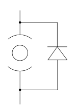

    **FIGURE 4.45 An example of a flyback diode around a motor.**

If the response of the LR in this circuit is slower than the switching frequency,
the diode acts as part of a filter keeping current moving through the motor.
It smoothes out current changes, which in turn smoothes the torque changes.
(Remember how torque is proportional to current?)

In other cases, this diode might simply be capturing a transient signal to prevent circuit damage. :ref:`Figure 4.46 <Figure 4.46>` shows an example using a diode to protect a
relay circuit.

.. _Figure 4.46:

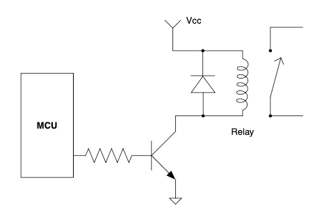

    **FIGURE 4.46 Flyback diode on a relay coil.**

You can see that the voltage spike, inductive kick, or back EMF, as it is called,
never gets over–0.7 V because once it does, it forward-biases the diode and current flows back into the other end of the inductor. Now you know how to make
a fly catcher out of a diode.

Making stuff move is incredibly cool. I recently attended Google IO and had to
hit the class on robotic operating systems. My son never did get those Lego
mindstorms to clean his room, so it is still a mess and he has moved on to making jet engines out of old soup cans, but I just had to send him a video of a
robot folding laundry that I saw there! The room cleaner will soon be a reality!

.. admonition:: Thumb Rules

   - When the thumb rules go on and on, break them into smaller, more digestible pieces.
   - AC induction motors induce a current in the core, which in turn creates a magnetic field that turns the shaft.
   - Universal motors can be wired for AC or DC.
   - Solenoids are reluctant to leave the cozy coil cave when current is on.
   - Pay attention to the minimum switching current on relays.
   - Catch your flies with diodes to keep voltage spikes out of your circuits unless you are trying to make a shock box to surprise your buddy.
   - Who wouldn’t want a robot to clean their room?

