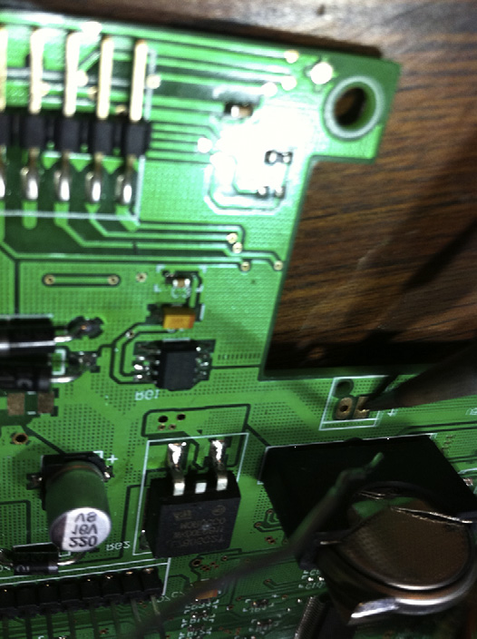

.. _c5:

CHAPTER 5 Tools
================

What tools to use and when to use them? That is the proverbial question. There
are innumerable tools available to the electrical engineer. This chapter is not
intended to be an exhaustive analysis of various tools but rather a guideline
for selecting the proper tool and for setting it up right to get the information
you are looking for.

MAKING THE INVISIBLE VISIBLE
------------------------------

One difficulty that electrical engineers have in general is that the electrons they
work with are not something you can pick up, touch, or feel. (Okay, I take back
the feel part—there are definitely voltage levels that you can feel!) In reality,
you infer the electrons’ existence based on how they affect objects. You don’t
see the current flowing in a light bulb; you see the heat generated by the current
flowing in a light bulb. Given this, tools that can measure various attributes of
electricity are invaluable in electrical engineering.

Meters
~~~~~~~~~

Ahh, the lowly meter—probably the tool you will use most often in your quest
for electrical engineering excellence. Most meters you will encounter today fall
into the DMM (digital multimeter) category (see :ref:`Figure 5.1 <Figure 5.1>`).
The first rule of thumb in using a meter (and this applies generally to all the tools
you use) is to have some idea of what you are looking for. For example, if you
are trying to read an :term:`AC` signal, don’t set your meter to DC. This might sound
overly simplistic, but I believe that poor tool setup is the most common mistake
made by the average engineer. You can extrapolate from this rule to solve other
misreading problems. This leads to a second rule and a case in point. The rule:
Don’t trust auto setups implicitly. The case in point was a motor voltage we were
trying to read; the voltage across the motor was a PWM signal with a peak of
140 V. We were trying to read the average voltage across this motor with a Fluke
87, but the readings didn’t make sense (note the application of rule one). We
found that when the meter was in auto-range mode, the brain of the meter
was confused by the PWM input. Setting the meter manually to the correct range
resulted in an accurate and stable reading.

.. _Figure 5.1:

.. figure:: ./img/195-0.png
    :align: center

    **Figure 5.1 A meter.**

The two most common signals you will examine with a meter are voltage
and current. In setting up a meter to read voltage, remember that you are
hooking the leads up in parallel with the signal you are going to examine.
When reading current, the meter must be hooked up in series in the circuit.
Remember that current is a measurement of flow. Nearly all meters require
you to hook the leads into different plugs when reading voltage than when
measuring current. This is so the signal can be routed through an internal
shunt resistor across which a voltage is measured and scaled to represent
current.

Typically, there is a fuse in the meter to protect this shunt from overload. On
some meters the shunt is a different value for different ranges of current.

All meters will affect the circuit they are hooked to, whether they are in voltage
mode or current mode. The question you should ask is,“How much?” A typical
digital multimeter (DMM) has 1 to 10 M of impedance in the voltage-measuring
circuit. As you hook the leads up to the circuit, consider that you are adding a
resistor to the same points.

Let’s look at the example shown in :ref:`Figure 5.2 <Figure 5.2>`. We will assume that our meter
has a 10-MΩ input impedance and we are measuring the output of a voltage-divider circuit.

.. _Figure 5.2:

.. figure:: ./img/f5.2.png
    :align: center

    **Figure 5.2 Equivalent circuit of a meter on a 1-K voltage divider.**

Let’s calculate the effect this has on the circuit. We will start by calculating the
parallel resistance of the meter and the resistor it is hooked to:

    Hmmm, scribble, scribble, nibble on the pencil eraser, mumble to myself, I just learned
    that rule, it’s the product over the sums, so that would be (1 K * 10 M)/(1 K + 10 M)
    or 0.9999 K.

Now we apply the voltage divider rule. More humming, more scribbling, and we
see that without the meter the output will be at 2.5 V, but with the meter the output will be 2.4999 V. So we will probably all agree that the meter does not have a
significant effect in this case.

Let’s change the value of the resistors and see what happens. We will make
them 1 MΩ resistors, as shown in :ref:`Figure 5.3 <Figure 5.3>`.

.. _Figure 5.3:

    **Figure 5.3 Same meter on a 1-M voltage divider.**

The first thing you should notice is that without the meter the voltage output
will be the same as the previous circuit. But what happens when you hook up
the meter? 1 M//10 M (the // marks mean in parallel with) gives a value of
909.09 K. Run that through the voltage divider rule and you get 2.3809 V as
the output. Do you see how the meter can make a difference? Hopefully,
what your intuition is telling you is that the effect of the meter depends on
the ratio of the meter impedance to the impedance of the circuit you are reading. Now try an experiment. Change either resistor in the 1 M divider to 1 K
and run through the same analysis. You will see that the meter no longer has
a significant effect. This is because the overall impedance of the circuit is
about 1 K. Thevenin taught us that. If you don’t quite follow, now is a good
time to flip back to Chapter 2 and bone up on Thevenizing. Make sure you
consider the overall impedance of the circuit you are measuring when you’re determining the effect a meter will have on your circuit.

Scopes
~~~~~~~~~~

The primary two controls on a scope are just like in the old TV show, *Outer Limits*: “We control the vertical and the horizontal.” [1]_

In other words, on a scope you are controlling the voltage per division and the
time per division. The divisions referred to are the vertical and horizontal marks
that make a checkerboard on the screen. The o-scope, scope, or oscilloscope
represents the electronic signal over time. It does this with a trace on the screen
like the one shown in :ref:`Figure 5.4 <Figure 5.4>`. The data you are looking at in terms of this
line are magnified or reduced by using the time per division or the voltage
per division controls. To reiterate these controls are handling this “zoom” feature independently.

The next most important control is the capture mode, whether you are seeing a
DC or an :term:`AC` signal. Unfortunately, this control is usually somewhat hidden.
This control is important because it can affect the way a signal looks on the
screen. (Just take a 0 to 5 V logic signal and read it with your scope in :term:`AC` mode
and you will see what I mean.) In :term:`AC` mode, the inputs are connected via a series capacitor to the guts of the scope. This removes any DC offset the signal
might have. In DC mode, the voltage level of the signal relative to the ground
lead of the scope is maintained.

.. [1] It is funnier if you think about it in the same deadpan voice that the old TV show used. For those engineers who are too young to have any idea what I am talking about, you’d better Google *Outer Limits*.

.. _Figure 5.4:

.. figure:: ./img/f5.4.png
    :align: center

    **Figure 5.4 Oscilloscope.**

The oscilloscope is, in my opinion, the single most useful tool an electrical engineer can have. That said (imagine a big sigh here), I’ve seen a lot of engineers
chase down blind alleys because they misread their scopes. Correlating these
two facts indicates that it is very important to know how to set up your scope.

First, a word of caution: Never trust the auto setup on a scope. Let me repeat:
Never trust the auto setup on a scope. [2]_ Make sure you know what you are looking for. This is even more important than auto setups on meters because of
what the scope might do.

For example, say you want to measure a 5 V signal that switches to ground
when you press a button. You hook up the scope, press auto set, and then press
the button. The most likely scenario in this case is the scope sees a 5 V DC
signal and starts hunting for some frequency to look at. So it zooms in until
you see a 10 mV :term:`AC` ripple from the power supply at 60 Hz. Now you have a
scope set to 10 mV per division vertically and 10 ms per division horizontally
in :term:`AC` mode. Remember, you were trying to measure a 5 V DC as it switched
to ground on a button press. The auto set totally missed what you were looking
for. You probably won’t even see the switch action at this setting and, to top it
off, there will be a 60 Hz ripple on the screen to confuse you.

.. [2] Note that I didn’t say,“don’t use it,” I said,“don’t trust it.” You can use it if you have an idea of what you are looking for and can tell what the scope set itself to, to see if it is correct. It can save time if you use it carefully, but if you have any doubt at all, set it up manually.

This is the most common mistake I have seen. An engineer hooks up a scope to
the misbehaving circuit, hits auto setup, the scope zooms in on an irrelevant
signal, the engineer, thinking,“A-ha, I have found the glitch!” spends the rest
of the day chasing something that doesn’t matter.

Having an idea of what you are looking for is an equally important rule for
setting up a scope. Ask yourself how long the signal will last. What voltage
levels do you expect? Start with those settings on your scope. Now, once you
are capturing what you expect, zoom in on the details to look for those pesky
glitches. Say, for example, you suspect a switch bounce on our earlier example.
Start by capturing the signal at 5 V and 500 ms per division. After all, you are
pressing this button—just how fast are you? Once you can reliably catch this
signal, start working your way in; go to 2 V or maybe 1 V per division to increase
vertical resolution. Then start working on the time base. Decrease the time per
division while periodically checking the signal you are watching. This way you
drive the scope to look at the signal you want to see. If you let the scope do the
setup, it is kind of like being kidnapped and driven around blindfolded. When
you take the blindfold off, you don’t know where you are. You will be lost,
confused, and disoriented, and that can lead to wrong assumptions. If you are
the driver, on the other hand, you know how you got there and have a better idea
of what is going on.

So setup is important. Here are some other general things you should know.

Ask yourself,“Is the signal really there?” Why? Because it is possible that the
scope with its high impedance is picking up noise that really isn’t affecting what
you are looking for. Try this: Disconnect the leads. Is the signal still there? If it
is, that is a good sign that you are dealing with a radiated noise that might not
even affect what you are looking at. If you are working with high-power circuits
and switch-mode supplies, there will be all sorts of artifacts that really don’t
affect anything but that pick up nicely on the antenna of a scope lead.

Make sure you hook up all your ground leads (even though on most scopes
they are tied together internally). The reason to do this is because small currents
flowing back through your scope ground can lead to incorrect results. You might
even think you have discovered free energy. [3]_

On most scopes the ground lead is connected to the Earth ground of the scope
(for safety reasons), which can be disastrous when looking at certain signals
that may reference to a different point. You can get currents through the ground
leg that throw off your reading at best and blow stuff up at worst. If this is
happening, get an isolated scope.

.. [3] This is a whole other topic for a whole other book.

Just as with a meter, high-impedance circuits can be affected by the scope
leads. Have you ever had a problem go away as soon as you clipped the scope
on? Try a 10 Meg resistor or 100 pf cap across the same connections. It is a
good bet that will fix the problem (in case you were wondering about where
those values come from, they approximate the impedance of most scope
leads).

When all else fails, swallow your pride and read the manual. Yes, I know it’s hard, but the destructions [4]_ usually give you insight into setting up the scope
so that you see what you want.

Scopes these days have myriad features: cool glitch captures, colored screens
(a personal favorite of mine), magnifications, auto setups (yeah, those too),
and much more. The point here is to get the basic setup right so that when
you use those other features, you have an idea of what is going on. Remember,
getting what you want out of the scope is up to you, at least until they get that
mind-reading function working.

Logic Analyzers
~~~~~~~~~~~~~~~~~~

A logic analyzer is similar to an oscilloscope in that it displays a signal over a
time base. It differs in two main aspects: The first is that it displays only logic
levels; the second is that it has many more channels.

Think of a logic analyzer as a digital-only oscilloscope. It is not going to show
you signals between a logic high or low. There are logic analyzers with a couple
of scope channels built in to get around this limitation, but if you don’t have
one of those, make sure that you understand you are seeing the logic level
closest to the signal you are reading. If the level the analyzer considers a high
or low differs from the level of your circuit, this could lead to confusion. If
you suspect that the logic signals are not reaching the required voltages, make
sure you check it with a scope.

The best feature of a logic analyzer is the fact that it has so many channels. This
becomes very useful when you are trying to observe all eight or more lines on a
data bus at the same time. It’s pretty hard to look at eight things at once with
only a couple of channels.

This feature, like all the others, is easy to set up wrong if you have no idea what
you are looking for. Don’t just set it up blindly—have an idea of the time base
needed to find what you are looking for. Also, remember that it is designed to
display logic signals, possibly masking signal levels that you might not expect.

These days, with their digital storage capabilities, scopes are closer than ever
before to logic analyzers, and the fact that many analyzers have some scope-like
capabilities makes them more scope-like than their predecessors. If forced to
categorize, I would say that a scope is a more general tool that can be applied in
nearly any situation except the one where you need to see a whole bunch of
channels at once, and in that case the logic analyzer is definitely the tool of
choice.
Remember that the basic rule of thumb with this tool, as with all others, is to
have an idea of what you are looking for. If you do so, you will find this an
effective tool to have at your disposal.

.. [4] Or instructions, depending on how you look at it.

.. admonition:: Thumb Rules

   - Always have an idea of what you are looking for.
   - Don’t trust auto setups.
   - Is the signal really there? Unhook the leads and see if you still pick it up.
   - Hook up all the ground leads.
   - The higher the impedance of the circuit, the easier it is to disturb with measuring tools.
   - Read the manual!
   - And one last time, don’t trust auto setups.

SIMULATORS
-----------

First, let me make a statement: Simulators are great tools (here it comes), but
too often I see a major mistake made with a simulator. The engineer fires up
the simulator, tries out his or her idea, gets it all designed, then proceeds to
build a real circuit, only to find the circuit does not work as the simulation
did. Here is where the mistake comes in: All too often the engineer spends all
his or her time trying to figure out why the circuit isn’t working right while
implicitly trusting the simulator to spit out the correct answer. For some reason
as soon as the circuit is modeled on a computer, it seems to be an engineer’s nature to trust the result on the simulator without question. Doing so almost
invariably leads to immense frustration and confusion. You should take this
adage to heart: The real world isn’t wrong; your simulation is. It is always true. If
the results don’t match, something in your simulation does not actually represent what is on the prototype in the lab. The simulation is a representation of
the real world, not the other way around.

What Is Real?
~~~~~~~~~~~~~~~

This is not to say that the circuit on the bench is what you want it to be. It very
well could have a mistake in it that is not in your simulation. However, that
doesn’t change the fact that the simulation is not truly modeling your design.
I have found that if you take the perspective of always questioning the simulation, two things happen. First, you gain an intuitive understanding of the way
different components affect your circuit. As you fiddle with the simulation, trying to get it to match the real world, you begin to grasp how large an effect this
or that component has. Second, you learn about the limitations of real-world
components—something that just studying math and formulas will not give
you. Take, for example, a 10 µf electrolytic capacitor in the circuit shown in
:ref:`Figure 5.5 <Figure 5.5>`.

.. _Figure 5.5:

    **Figure 5.5 RC high-pass filter.**

According to all the formulas you have learned, this should pass all the high
frequencies above 1/RC you would ever want. Just about every simulator you
find will do so, but hook this circuit up to a signal generator and you will
find that, as you get up to the higher frequencies, it doesn’t work as well as
the math says it should. The math isn’t wrong; it’s just that the component
isn’t perfect.

Some simulators will allow you to create equivalent circuits to more accurately
represent a given component. Remember, though, that doesn’t negate the need
for you as an engineer to understand the limitations of the components. You
really need to have an idea of what is going on or the simulation can lead
you down a fruitless path. The skill of estimation is immensely important when
using a simulator. Skip back to Chapter 1 if you need to brush up on your hand
grenade skills. [5]_

.. [5] Admittedly, that section is personally my most favorite passage in this whole book!

A Powerful Tool
~~~~~~~~~~~~~~~~~~~

Now that I’ve finished bashing simulators for not dealing well with imperfect
components, let me say that, ironically, they are potentially the best tool you
have to create a design that handles imperfect components well.

Once you truly understand the variability that can occur in the parts you are
using and create an accurate model of what they do, you can do something with
a simulator that you cannot do easily with actual parts: You can build thousands
of pieces of your design in cyberspace, with each part varying a little from its
nominal values. You can swing the tolerances to their extremes with the click
of a mouse, saving a hunt through a drawer for that part that is on the low end
of spec. If used correctly, a simulator is probably the best tool you have to make
your design handle the inherent variability in components.

Develop Your Intuition
~~~~~~~~~~~~~~~~~~~~~~~~~

One of the best things you can do with a simulator is to use it to develop your
intuitive understanding of basic components. Every engineer should simulate
the transient response of the basic RC, RL, and RLC circuit. Try changing the
values of the parts just to see what happens.

If you start modeling simple circuits and getting confidence in making the model
accurate, you will be much more successful as you create more complex simulations. It’s not unlike learning to play the guitar; you don’t just sit down and rip
out a lick Eddie Van Halen would be proud of. You need to be able to handle
the basic chords first. You should learn to“play” a simulator the same way.

Even though it is easy, don’t put together your whole design in the simulator the
first time and press go. If you do, I can nearly guarantee you will get confused by
the results and they will probably be wrong as well. Break your circuit down into
simpler pieces, ones that you can intuitively understand, and simulate those parts
first. Eat the elephant one bite at a time. [6]_ When you are sure your model represents the real world accurately enough [7]_ for the problem at hand, start knitting
those pieces together and see what happens.

One word of warning: Playing around with a simulator can be very time consuming. [8]_ Don’t get so caught up in doing the simulation that you never get around to building an actual circuit. In fact, if you are unsure as to how the circuit will really work, go build it up in the lab and see. When it comes to tolerance analysis, you should already have a real circuit running in the lab when you start simulating. Get the circuit working with nominal values before you start investigating what component variance will do. Simulation should go hand in hand with lab work.

.. [6] See Chapter 1 way back at the beginning for the elephant reference.
.. [7] Remember that accuracy is relative. If you don’t need to know the answer to four decimal places, don’t waste time trying to get that close.
.. [8] Not unlike research on the Internet. Well, maybe that only holds true for a“sparky.”

.. admonition:: Thumb Rules

   - The real world isn’t wrong; your simulation is.
   - Gain confidence that your model accurately represents your design.
   - Use estimation to double-check your simulation (a couple of more‘-tions’ and this could be quite the tongue twister!).
   - Model basic circuits to develop your intuitive understanding of the basic components.
   - Break the model down into pieces that are simple enough to check for accuracy. Then add the models together.
   - Simulation goes hand in hand with lab work.
   - When setting up your tools, have an idea of what you are looking for. How fast is the signal? What voltage level do you expect it to be at? Et cetera!

SOLDERING IRONS
-----------------

I was passing by the lab one day when I saw one of my technicians looking
over the shoulder of one of the engineers who was doing a less than spectacular job of soldering components on a PCB. [9]_ He had but one comment. He said,
“What we have here is an engineer trying to do a technician’s job.” Then he sat
down and proceeded to do a most excellent job of putting the board together.

On the chance that you might not have a skilled tech at your disposal, and due
to the fact that I believe that the more you know about how the product you
are designing goes together, the better designer you will be, here we will go over
the basics of soldering.

The Basic 4
~~~~~~~~~~~~~~~~

Making good solder joints requires four things: cleanliness, solder, flux, and heat.

First, the parts need to be clean and dry. If the pads are corroded, often a little
rubbing alcohol will clean them nicely.

Second, you need solder. Solder is a mixture of lead and tin [10]_ with a melting point
around 100º to 200ºC, depending on the alloy used. When applied properly,
solder will provide an electrical and mechanical connection between the part
and the PCB. Although it is a mechanical connection, remember that it is not a
particularly strong mechanical connection.

Third, you need flux. When hand soldering, this is often inside the solder wire
in the hollow core. What is flux, you ask? Flux is a chemical that cleans when
you heat it up, preparing the joint so that the solder will stick well. In some
cases the flux is applied before the solder, such as before it goes over a solder
wave or into a solder bath. Flux is also called resin.

Last, you need heat. Heat brings it all together. The solder will flow to where the
heat is. This means that you need to get the leads of the part heated to make sure
the solder flows. In prototyping, the typical way you get heat to the part is with a
soldering iron. Use a technique like this: You put the iron on the pad, give it a
moment for the pad to heat up, then bring in the solder (see :ref:`Figure 5.6 <Figure 5.6>`). Done
properly you will avoid solder goobers; if you need a lesson on how to do this,
read on.

Some other ways are hot air pencils and reflow ovens, but the same thing applies.
Heat makes the solder adhere to the pad and the lead of the part. When all is said
and done, a good solder joint looks like the one in :ref:`Figure 5.7 <Figure 5.7>`.

.. [9] One engineer I worked with developed his soldering skills putting stained-glass windows together as a part-time job when he was a student. After quizzing him on the technique, I recommended he do exactly the opposite of what he learned making windows!

.. [10] These days you will be treated to stuff called RHOS-compliant solder, which uses different stuff inside and can be a bit more finicky to use. I suggest a little higher heat on the iron, but take care not to damage your part with too much heat for too long!

.. _Figure 5.6:

    **Figure 5.6 Solder.**

.. _Figure 5.7:

.. figure:: ./img/f5.7.png
    :align: center

    **Figure 5.7 Good solder joint.**

Solder Goobers
~~~~~~~~~~~~~~~~~

Of these four items, the one that usually causes problems is the application
of heat, particularly when you are using a soldering iron. Parts and PCBs
are both sensitive to heat. The parts can be damaged by too much heat,
and the PCB pads are adhered to the PCB with glue that has a lower melting
point than solder. [11]_ Too much heat for too long can be bad. Parts can be
damaged and pads or traces can be lifted (when the glue is melted).

.. [11] It is actually intended to be this way because during soldering the copper traces will expand (due to heat) at a different rate than the PCB substrate. If the glue is melted, this keeps the trace from deforming.

The flip side is that not enough heat will lead to failures. One of these failures is
called the cold solder joint. This happens when you do not get enough heat to
both parts being joined. When this happens, solder will adhere to one part
and not the other. The part that did not get enough heat will not get a good
connection. That is why it is said to be a cold joint. It looks like :ref:`Figure 5.8 <Figure 5.8>`.

.. _Figure 5.8:

    **Figure 5.8 Cold solder joint.**

A cold solder joint is the most common failure of using a soldering iron. You get
going a bit too fast and don’t leave heat on the joint long enough, or you only
touch the iron to the pad and don’t get it on the lead of the part. A good rule
of thumb when soldering by hand is to place the tip of the iron on the joint,
count “one Mississippi,” and then apply the solder, wait a moment, and remove
the iron.

There are two other things you need to do to keep your soldering iron working
right. One is to make sure the tip is tinned. If an iron is left on for some time,
the solder and resin on the tip will evaporate, leaving a dry tip. A dry tip will not
conduct heat to the parts you touch as well as a tip with solder on it will. Applying a little solder to the tip before using it is called tinning. (You can also tin wires
to make them easier to solder to a connection.) If you are having a problem
getting heat to a part, try adding a little solder to help conduct the heat.

The second thing you need to do is clean the tip of the iron often. Any decent
soldering iron will have a sponge in a tray with water. Wiping the tip on it will
effectively clean it. Cleaning the tip keeps the buildup of excess flux from interfering with the soldering process. A word of caution: Don’t soak the sponge
with too much water, and don’t rub the iron on the sponge excessively. Too
much water or rubbing it too long will cause the tip to cool down too much,
affecting the next joint you need to apply solder to. Don’t forget to tin the tip
before going on to the next joint.

SMT Specifics
~~~~~~~~~~~~~~~

In today’s world you will likely be treated to the fun of surface-mount components. Though seemingly impossible to do by hand, they are not as bad as they
might seem. I recommend you use solder paste; you basically paint the leads and
the pads with the paste. Then with a nicely timed sweep of the solder iron you
can get all the leads connected with some very pretty joints. It takes some practice, so be prepared to go through a few parts and possibly PCBs the first time
you attempt it. Too much paste and you will get shorts across the leads, too little
and you get no connection. When you get the right amount and the right timing
of the iron, the solder flows to the right places and does just what you want. [12]_

.. [12] If you ever get a chance, watch an SMT reflow oven do its magic. The solder will actually have enough surface tension to align the part when it is melted. I think it is pretty cool to watch. (Yes, my wife thinks I’m weird to think this is cool, but if you bought this book, chances are you will think it’s cool, too.)

Lead Free
~~~~~~~~~~~~

Over the last several years some standards have been implemented requiring
lead-free solder in almost all products. Turns out lead was a nice thing for making soldering easier. The lead-free materials are a bit more finicky than the old
leaded type. The temperature range that works well is narrower, and it seems to
me that the amount of heat needed to get a proper joint takes longer. All in all
it just doesn’t seem to stick as well.

Desoldering
~~~~~~~~~~~~~~~

Unless you never make a mistake, at some time in your career you will need to
remove a part that has been soldered to a PCB. Desoldering can be a frustrating
experience. It is during desoldering that you are most likely to lift a pad from a
PCB, burn your fingers, and possibly cut loose with a few expletives. Hopefully,
I can share some hints to keep the air from turning blue when desoldering is
required of you. We will also discuss the three main tools for lifting solder:
solder tape, hand pumps, and desoldering stations.

*Hint 1*. 
    Sacrifice the component if possible. If you do not have to salvage the
    part you are taking off, clipping the leads (so that you are not trying to remove
    a 40-pin part all at once) is a great help. Cut all the leads and deal with one
    pin at a time. Once we had a situation where we needed the 40-pin part but
    not the PCB. What was our solution? Take the board down to the shop and
    hit the back of the PCB with a quick burst from a blowtorch while yanking
    the part off of the other side with a pair of pliers. It worked like a charm,
    and the burnt PCB made for a great joke on management later!

*Hint 2*. 
    Add solder to the part. Adding solder can help you conduct heat to the
    joint you are trying to dismantle. The trick to getting the part off is to get heat
    quickly to all the places you need to. For example, you might need to remove
    a radial electrolytic capacitor. On this part both leads are close together.
    You can actually create a solder bridge between the leads and get heat to both
    leads at the same time and quickly pull the part off.

*Hint 3*. 
    Get the part and pin off before you worry about getting the solder
    off. Apply heat, yank the part, then come back and get solder out of the
    hole. Often when you are trying to get the solder completely off before taking the part off, you will find that a small piece of solder still holds the lead
    to the side of the via. Trouble is that it is such a small piece of solder that it
    is difficult to heat it up to get the lead loose. Apply hint 2 and try again.

TAPE
''''''

Solder tape is a copper braid. Copper, being a great conductor of heat, will wick the
solder into the braid when heated up. It is important to apply the heat to the braid
and then press the braid on the solder. If you just try to stick the braid in the mol-
ten solder without heating it up, the solder will just sit there. Remember, solder
flows to heat.

Also note that the braid is made of copper, and copper can tarnish. Once it
has tarnished, solder will have a hard time sticking to it, so old solder tape is
pretty much useless. New tape works well, though, and is cheap and convenient
to use.

HAND PUMP
''''''''''

My own tool of choice, the hand pump, is easy to use, relatively inexpensive, and
easy to maintain. When using the hand pump, you press down the plunger, heat
up the solder you are trying to remove, press the button, and thwoop, in goes the
solder like a spaghetti noodle. Make sure you leave the iron on long enough for
the solder to become molten clear through the via. You might need to apply hint
2 to help things out. The biggest downside to the solder pump is the sore thumb
you are going to get if you need to do a lot of desoldering.

CHIP QUIK
''''''''''

I recently discovered a product called Chip Quik (see www.chipquikinc.com)
that is a type of solder/metal that when heated and mixed with solder keeps it
in a fluid state for a long period of time, giving you the chance to remove the
part you are working on. This is a really slick way to pull off a chip with a lot
of leads, especially SMT versions that you are trying to save. It’s not a super cheap
solution if you are doing a lot of parts, but in some cases it is just what you need.

DESOLDERING STATION
''''''''''''''''''''

If you need to do a lot of desoldering and you have some cash to spend, this is a
tool you need. The desoldering station is a powered version of the hand pump.
The iron is integrated into the tip, where a vacuum is applied to suck out the
solder. Generally you need to maintain these tools regularly. The tips can wear
due to the corrosive nature of the solder removal. They can get plugged easily
when they’re not used properly. Always suck to the side, not straight up. The molten solder has weight, and trying to move that to the side is easier than trying to
lift it straight up. Keep sucking for a couple of seconds after the joint is clear to
make sure that the molten solder gets all the way into the receptacle in the gun
so that it doesn’t solidify midway through the nozzle.

Properly maintained, this is the quickest and easiest way to get solder off a PCB.
It is also possible to get a part off with the pin still in place. This is done by using
a small circular motion to get the pin out of contact with the via as you are suck-
ing the solder. However, it is still easier to sacrifice the part if that is possible.

.. admonition:: Thumb Rules

   - Solder goes where the heat is.
   - Solder goes where the heat is.
   - And if you didn’t get it this time, remember: Solder goes where the heat is!
   - Prevent cold solder joints by counting 1 second while applying heat.
   - Make sure that you tin the iron before using it.
   - Use just the right amount of solder paste with SMT parts and just the right amount of time.
   - Clean the tip often.
   - Practice makes perfect.
   - When desoldering, sacrifice the part if possible.
   - Add solder to promote heat flow.
   - Get the part and pin off before worrying about getting the solder out of the hole.
   - A small circular motion with a desoldering station tip will help clear the solder from the lead and the via.

PEOPLE TOOLS
--------------

When I entered the professional realm for the first time, I had an experience that I
still remember. I got a call from the receptionist. She said,“So and so is here to
see you. He wants to know if you can have lunch with him.” Of course I’m think-
ing,“Hey, free food, but who is this guy who seems to be my instant friend?”
Thus, it was over nacho chips and *arroz con pollo* that I tumbled headlong into
my first experience in the world of reps, distributors, and FAEs.

Lunch was good. I had no problem figuring out what to order from the menu,
but getting to understand the roles of these three people took more than a few
tacos. It can be a bit confusing as to who does what and what that means to the
average“Dilbert” out there, so I figured it wouldn’t hurt to give you some idea
of what these guys do and how they can help you.

First, all these people have some relationship to the company that makes the
product you need, whether an IC, transistor, micro, or whatever. When I say
company in this case, I am referring to the company with the product to sell,
not the company you work for.

The Company
~~~~~~~~~~~~~~

The company selling the widget you are interested in employs several layers of
people to get its product in front of you and sold to you. It also has internal
salespeople and managers you might get to know if you work closely with
them. How closely you work with them often depends on the amount of business or potential business you represent for them.

If you can get to know someone on the inside, it is never a bad thing. These
guys are more accessible now than ever, and if you need to know how a part
will act in some weird situation, talking to the person who actually designed
the part is definitely the best option.

The Rep
~~~~~~~~~

One layer removed from the company, you will find the rep. [13]_ This is the per-
son who represents the company making the part it wants to sell to you. He or
she does not usually draw a salary directly from the company. Reps are paid by
the rep firm that represents the company. The reps and/or their firm are typi-
cally rewarded for their efforts with some percentage of the sales they make,
usually 1 to 5% (depending on volumes and other complicated formulas
designed to cost the company making the product the least amount of money
yet drive sales as much as possible).

The reps will work with the distributor in scheduling parts, getting you samples,
and other such stuff. They are very interested in you using the company’s widget, and it is unlikely they will offer an alternate solution since they’re monetarily tied to the company’s widget. Reps typically are not allowed to represent competing firms. My experience is that reps for the Dilbert-esque products
we are talking about often have an engineering background of some type. [14]_

.. [13] In case you didn’t know, rep is short for representative.

.. [14] If they don’t, I know where they can get a great book that makes it easy to understand the world of “sparkies”!

The Distributor
~~~~~~~~~~~~~~~~~

“What is the difference between the distributor and the rep?” I asked one of
these guys once.“About 15%,” I was told.

Distributors will stock parts and mark up the cost to cover the money they
have expended. They tend to make about 20% on a given part, but that is just a
ballpark figure. The actual number can be all over the place, depending on the
particular business agreements. Some manufacturers force distributors to specific
margins if they carry their parts.

One of the biggest distributors out there watches market trends constantly and
looks to buy stuff that is likely to become rare yet needed in the future. [15]_ Then they go out and buy a whole bunch of said item, sit on them for a bit,
and sell them at a profit later.

Sometimes companies use exclusive distributors. Some use multiple channels.
In the case of multiple distributors, whoever is the first to register [16]_ a part for
a particular application gets a lower price on the part than any of the other distributors. This is designed to reward the distributors for getting out and getting
more business.

.. [15] Slight pun intended; if you get it, I don’t need to explain it, and if you don’t it is no big deal.

.. [16] In registering a part, the distributor basically calls dibs on showing you the part first.

The biggest advantage of a distributor is supply-chain management. By buffering stock for you, they can help handle ups and downs in order sizes, shortening lead times when orders go up unexpectedly.

They are less likely to be tied to a particular manufacturer of a part, and they
often carry multiple solutions to a given problem. They will tend to lead you
to the part that will solve your problem and be the most profitable for them.
Distributors are less likely to have an engineering background. Hopefully many
of them will buy this book and not be upset that I disclosed so much about this
seemingly secret world.

FAEs
~~~~~~

Working for distributors, reps, or even the company, you will sooner or later run
into the field application engineer (FAE). The FAE plays several roles. He is the
main person who helps you get the part to work. He or she also looks at your
application and often will suggest parts that might be a good fit. Lastly, FAEs
often act as translators between you and the distributor. As you might well know,
it can be difficult to understand an EE when he or she gets into technical details.

For many a Dilbert, the FAE has the perfect job. The FAE gets to come up with
all these solutions but has no responsibility for actually making it work at the
end of the day. There have been days I have dreamed of being an FAE for just
that reason. However, the flip side is FAEs also rarely see the finished product
and miss out on the satisfaction of the“being late and over budget, but whew!
It’s finally done” feeling.

FAEs often go to a lot of training sessions with the company to understand how
the part works. They usually know or can contact the engineers in the company
to help answer questions. More and more, in an effort to sell their parts, companies are not only developing new parts but also creating applications for
those parts. FAEs and company engineers are often tasked with coming up with
cool little application demos and the like that show you how great the part is.
Remember, though, for them it is like lab back in school—they only need it to
work that once when they are showing it. Production runs can be a whole other
matter, so do your homework and test an FAE design thoroughly before you
commit to it on a full production run.

Design Wins
~~~~~~~~~~~~~~~

When the distributor registers a part with the rep and thus the company and
then the part actually gets used in the design, it is called a design win. This is
a common term that’s heard often over appetizers. Odd how engineer types
use words that make sense when you think about it, isn’t it?

Remember, whoever registers the parts gets a discount on that item. That usually
makes their price hard to beat compared to other distributors. I say usually because
I have seen a lower price quoted from an unregistered distributor, albeit rarely.

Another thing that can happen is that registration can be moved. If you really
don’t like working with the distributor and you are a big enough customer to
the company, they can move the registration to a distributor you prefer. However, this is rare and usually done as a last resort to appease the customer
because if it happened too much, all incentive to get their part in the door first
dries up.

Going Direct
~~~~~~~~~~~~~~~

Depending on the size of your orders, one thing that you might consider is
going direct. This means that you will buy parts directly from the company,
skipping distribution. The goal is to get a lower price.

The cons to this approach are several. The company will usually have minimum orders, lead times, and terms that are less favorable than working with
a distributor, and if you are a little guy (order wise) they probably won’t even
consider it.

Before you do this, consider the options carefully, because you will be removing
a piece of the support structure that you use in the design and supply manage-
ment of the part.

There are companies that will not even allow you to go direct; they have a pol-
icy of distribution only. However, I happen to know that they also dictate to
those distributors what the final price will be to keep them competitive in the
marketplace.

To Sum It Up
~~~~~~~~~~~~~~~

There are several legs to the stool of getting parts to you. Each leg wants his
piece of the pie and has services to provide to justify their cut. Knowing who
does what will enable you to better work with these“people tools” to succeed
at your job.

In my experience, the more successful reps, distributors, FAEs, and the like will
visit you often enough to know what you are working on and keep you in
mind as they see new technologies and ideas that you can use. They will have
suggestions and solutions and, yes, they might even buy you lunch once in a
while.

.. admonition:: Thumb Rules

   - The rep works for the company under a contract.
   - The distributor works as an independent.
   - The FAE knows how the stuff works.
   - The company wants to sell you a cool widget.
   - Sometimes you can get the company and the FAE to help do some of the design work.
   - All these people tools can help you find parts and get quotes; they work together to provide the best service they can.

