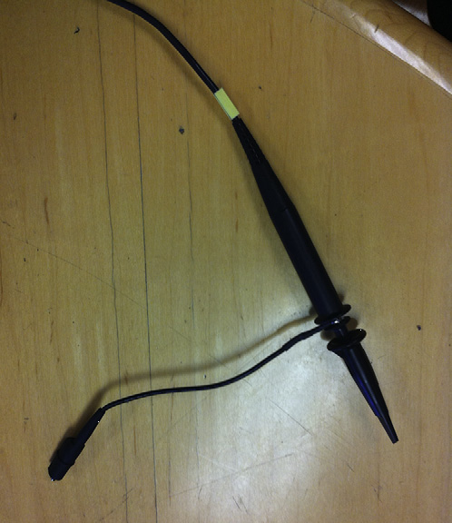
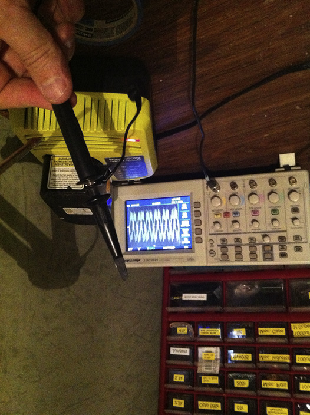
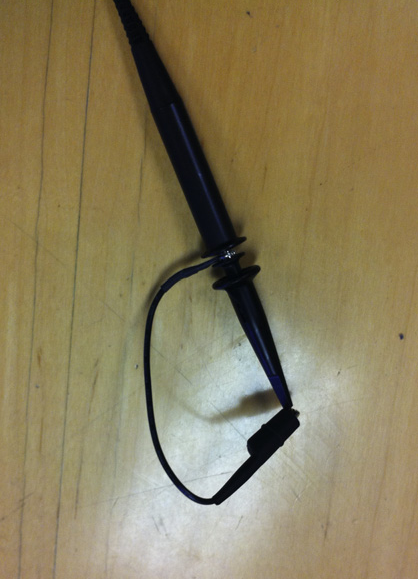
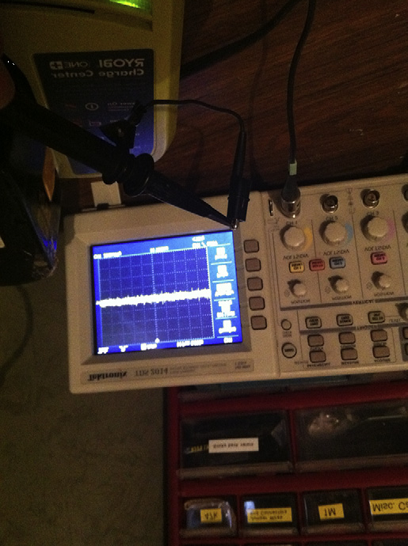

.. _c6:

CHAPTER 6 Troubleshooting
===============================

The perfect design approach doesn’t guarantee that everything will go flawlessly
in production. One engineer I worked with was fond of saying,“I’m not happy
’til ten thousand pieces have gone down the line okay.” I’ve seen tolerance problems appear in production after half a million pieces have been run. It is very
difficult to predict and prevent something like that.

The fact is, the more thoroughly you try to analyze a design, the longer you will
be waiting to produce it, but if a product never gets into production, no one
gets paid (except in government work, of course). So, a balance needs to be
struck among design analysis, testing, and production runs. This being the case,
you will likely be faced with trying to determine a production problem at some
point in your career. How will you go about it? What approach will you take?
Hopefully this chapter will give you some ideas.

GETTING READY FOR THE HUNT
---------------------------

As we discuss the topic of finding trouble and shooting it, I will often refer to
my own experiences. I am sure you will have unique and often completely different results. The idea here isn’t to tell you what the problem is in your design
but to give you some guidelines you can use to troubleshoot the problem
yourself.

Shotgun Wedding
~~~~~~~~~~~~~~~~~

We will get into the interesting section header a bit later. Though it might seem
a little out of order, I think we should cover one item first because it is so
important to the rest of the process. The first rule of thumb is: Don’t discount
a theory (no matter how obvious or ridiculous it might seem). Try to prove it
right or wrong by experiment and then move on to the next idea. Too often
you will be carrying an assumption that you won’t even realize can lead you
to a wrong conclusion. It is vitally important that you have a process to check
and validate a theory. Without that, you will be forever jumping from one idea
to another without ever coming to a conclusion. With that said, let’
s move on.

When it comes to troubleshooting methods, I group them into two common
categories:

*Scientific method*. 
    Do what any good detective would do: Look for all the
    clues you have been given and deduce what the problem might be based
    on experience and knowledge.

    - Advantage. Eventually you will identify the problem.
    - Disadvantage. It takes a lot of patience and time.

*Shotgun method*. 
    Take a shot at as many possibilities as you can and hope
    you get a hit. Sometimes you get lucky and you solve the problem fast.

    - Advantage. If you are lucky, you will solve the problem fast.
    - Disadvantage. If you are not lucky, you will chase around in circles forever.

Although both these methods have their place, what I propose so subtly in my title
is a third approach to troubleshooting. I call it the Scientific Shotgun Method—a
marriage, if you will, of the shotgun method and the scientific method.

Start like this: When a problem first comes to your attention, take a shot at as
many possibilities as you can. Write down all the things you think might be causing it. Use your intuition as well as your experience in this exercise. Speaking
metaphorically, get out the shotgun, take aim, and fire. Then let the scientific
method kick in and figure out a way to evaluate each of your possibilities to
prove or disprove them, and have at it.

When employing the scientific shotgun method, based on my experience,
results like these are typical: 70% of the time it will be something stupid that
the shotgun method catches easily and quickly. For example, using an old software version or if a component wasn’t stuffed or a fuse was burned out, 20% of
the time something more subtle will be found that takes some trial and error
and requires new data to be found and evaluated until the problem is solved.
About 10% of the time the solution takes a while longer but eventually is
found by repetitive applications of both methods. Often the shotgun approach
will open up new areas of research that scientifically lead to the resolution. On
the aggregate, problems are typically solved quickly with a minimum of running in circles when the scientific shotgun approach is used. (Did you ever think
you would see those two words together as something meaningful?) This is a
real boon in a consumer-product world where shipping that new design on
time is all-important.

You Too Can Learn to Shoot Trouble
~~~~~~~~~~~~~~~~~~~~~~~~~~~~~~~~~~~~~

Have you ever seen an engineer having immense difficulty in diagnosing the
cause of a problem when a lowly tech stops by and identifies the bad part right
away? Or maybe you’ve seen a tech struggle for days only to have the engineer
take one look at the schematic and say,“There is your problem.”

Some people have trouble with troubleshooting, and others just seem to have a
knack for it. If you ask them to explain what they do to solve problems so
quickly, they are often at a loss as to how they do it—they just do. Believing
that you can learn anything even if it doesn’t come naturally, I have distilled
down into Thumb Rules some of the things that those with the knack do.

Simple Things First
~~~~~~~~~~~~~~~~~~~~~~~~

After you have made the list of things that could go wrong, start with the sim-
ple things first. My father recounted an experience to me when I was younger
that really stuck with me. He basically rewired an entire car looking for an elec-
trical problem. To his dismay it turned out to be a bad fuse. Looking at it, it
appeared okay, but when measured, it was open. This might seem like a
“duh” moment to the outside observer, but it is an easy trap to fall into. The
way to avoid it is to check out the simple things first. Does the chip have
power at its pins? (Not just to the board.) Is the oscillator running? Walk your
way through the simple stuff, avoiding assumptions and checking everything
for simple failure first.

Look Outside Your Specialty
~~~~~~~~~~~~~~~~~~~~~~~~~~~~~~

It’s hard to make a blanket statement about what is likely to fail, since there
are often many small clues to a particular problem. To further complicate
things, it is often a combination of more than one factor that’s causing the
problem.

It is human nature to focus on what you know; everything else seems somewhat magical after all. Good troubleshooters are often good generalists. They
know a little bit about everything and use that to connect the cause to the
effect. They always want to know why this is that and what does that thing
do, and so on. [1]_

.. [1] You know—the kids who drive moms nutty because they are always asking questions. I know the personality type well. I have five of them!

Sometimes there could be seemingly insignificant clues. One time early in my
career we had a problem with some displays we were producing. A percentage
of them were failing and I was assigned to find out why. When I took the unit
apart, it would function correctly. When I put it back together, it would fail
again. I looked for hours trying to find problems with pinched wires and cold
solder joints, to no avail. So I sat there and stared at the PCB for a while.

As I did, I noticed two small marks on a resistor; I wondered where they had
come from. After some examination, I discovered a screw head coming in contact with that particular resistor when the PCB was installed. It turned out that
the screw head would short across the resistor installed once things were tightened down, making the part fail. When I removed the screw, the console
worked correctly after assembly. Don’t be afraid to look outside what you know
for the cause of the problem.

Don’t Ignore Anything
~~~~~~~~~~~~~~~~~~~~~~~

Try to keep track of all the clues to a particular problem. Keep a list of symptoms
and clues that you can refer to in your deductions. Don’t ignore anything, since
one fact might connect with another to point you in the right direction. Here is a
case in point.

During testing of a control circuit my engineering team had designed, we had
been experiencing random unexplainable problems. The test engineer made
the statement that these problems seemed to have started when we began using
surface-mount PCB designs. We were completely at a loss as to any connection
between this and the problems. Then I remembered, when looking at one of
the circuit boards, I had noticed some small black fibers that appeared to have
dusted the PCB. The test engineer initially dismissed this as small bits of plastic
that accumulated in the environment of the circuit during use (this made sense
because there was a moving belt made of plastic that could leave these bits as it
wore down). He was sure it wouldn’t make a difference.

However, we knew there were points on the PCB that, if they were shorted by
even a few mega-ohms, could make the circuit repeat the problem that we were
seeing. Connecting that with the fact that the surface-mount components
would have closer spacing made such a short more likely. I insisted that we
determine conclusively whether these fibers were conductive.

The first thing we did was collect a sample of this“dust” and bring it near a magnet
(on the presumption that if it is ferrous it is likely conductive). We were surprised
at how much ferrous material was in these presumed plastic shavings. It reminded
me of the classic physics experiment where you put metal filings on a piece of
paper and then move a magnet underneath to see the field interactions. Once
we protected the board from this contamination, the strange behavior stopped.

By not dismissing the obvious presence of these fibers, combined with the clue
that it started when we went to an SMT design, we were able to make a connection that allowed us to solve the problem.

Which of These Things Is Not Like the Other?
~~~~~~~~~~~~~~~~~~~~~~~~~~~~~~~~~~~~~~~~~~~~~~~

Did you watch Sesame Street as a kid? One of my favorite segments was“Which
of These Things Is Not Like the Other?” You were taught to identify similarities
and then point out the one that just didn’t seem to fit. This is a very important
troubleshooting skill. All the good skills work in more than just the“world of
sparkies.” They can be applied in just about any problem hunt. Here is another
case from the Archives of Darren.

Years ago our fridge stopped dispensing water. I figured I should just tear into
it and take a look. [2]_ After all, the water valve was controlled by a solenoid.

.. [2] Early in our marriage my wife was dismayed at my willingness to tear into anything we own to try and fix it. After a few years and a few successes I think she came to appreciate my“knack,” because now she seems to expect me to fix nearly anything and wonders at my inability when I fail to do so.

That was close enough to electricity for me. There were two valves, one for water
and one for ice. I tore these valves apart and noticed some wear on a rubber
washer inside the water valve. The solenoid pressed this washer against a hole
in the valve. Little bits and pieces of rubber were falling off because it was so
worn. This became especially important after I looked at the ice solenoid (it
was operating correctly) and the rubber washer on that one didn’t show wear.

It just didn’t seem right for the washer to be falling apart like that. It just didn’t
fit. So I replaced the rubber washer. Put it all back together and, voilà, it worked
great. The skill in this case was looking for something that simply didn’t seem
right. Sometimes you can figure this out by asking yourself,“Would I have
designed the washer to fall apart?” The obvious answer in this case was no,
hence something was wrong with the washer.

Estimation Revisited
~~~~~~~~~~~~~~~~~~~~~~~~

Sometimes it seems we spend half our time designing a circuit and the other
half trying to figure out why it isn’t doing what we designed it to do.
Back in :ref:`Chapter 1 <c1>` we learned to develop an intuitive understanding of basic
components. An important part of this process was developing the skill of esti-
mation, to get an idea if the circuit is even close to where it is supposed to be.
Estimation plays an important role in troubleshooting as well. If you are good
at estimation, your intuition will be correct and will point you down the right
path to solving the problem. Combine that skill with the power of the modern-
day calculator, and even a circuit simulator as we talked about in :ref:`Chapter 5 <c5>`,
and you have a powerful toolset to diagnose the root cause of a problem.

Can You Break It Again?
~~~~~~~~~~~~~~~~~~~~~~~~~

This is a simple rule that is often overlooked. Once you have found and corrected the problem, can you break it again?

That is, can you remove the fix and see the circuit act up again, doing whatever it
did before? Often, especially with problems that are difficult to repeat, an engineer will apply a fix, have the problem seemingly go away, and figure he is good
to go. However, if the problem is a bit temperamental, meaning it doesn’t always
show up when you want it to, you might just coincidentally have applied the fix
when it happened to go away on its own. In my experience this can happen quite
often, so break it again to see if you are really fixing it or not.

It’s no fun to think you have dealt with a issue only to fire up the production
line and shut it down again when the problem reappears. You can also spend
a lot of money applying fixes that are not really needed. Often it is a good idea
to break it and fix it several times to be sure you have truly solved the problem.

Root Cause
~~~~~~~~~~~~

A good troubleshooter will methodically trace an offending signal back to its
source. As he does so, he will question whether each component in the circuit
is operating correctly. He will ask himself things like“Does the output signal of
this op-amp agree with the signals that are on the input pins?”

This is why the really good engineers seem to always be muttering to themselves. They aren’t schizophrenic, they just ask themselves a lot of questions.
(Okay, maybe they are schizo, but trust me, it’s in a good way.)

Eventually you will find the problem’s root cause—the component that isn’t
doing what it is supposed to—and then you can figure out why and get it
corrected.

Categorize the Problem
~~~~~~~~~~~~~~~~~~~~~~~~

Good troubleshooters will separate the problems into various buckets and use
an approach that works best for the type of problem suspected.

*Design problem*. 
    This is the most common mistake and the easiest to find,
    since it is generally repeatable and consistent.

    - Approach. Since it is repeatable, keep it misbehaving while you use tools (scopes, meters, etc.) to trace down the problem. Make sure you get to the root cause.

*Tolerance problem*. 
    Really a design problem, but I give it a special category because this is typically inconsistent and difficult to repeat. Environmental effects commonly aggravate this type of problem.

    - *Approach*. You will need to repeat the environment that caused it if possible. Here is also a good place to run simulations where you can vary the tolerance of the parts you suspect and see what happens.

*EMI problem*. 
    This can also be difficult to repeat. Who knows when EMI is going to hit? It will often trip up the most competent engineers.

    - *Approach*. This one is so much fun I have dedicated a whole discourse to it, coming up next!

*Software problem*. 
    So many products today use some type of software or firmware. I have seen software exhibit all the preceding symptoms and be used to correct some of these problems, even though it was really a hardware issue. This topic gets its own category for that reason. [3]_

    - *Approach*. Give up, go home. No, not really, but it is a fact that these can be a bugger (pun intended) to figure out in a reasonable amount of time. Combine that with software engineers’ natural fear of oscilloscopes [4]_ and you can see you are in for a treat when diagnosing a software problem. The longer this paragraph gets, the more I think it needs its own discussion, so I put one in. We’ll get to it in a bit (pun intended again!).

.. [3] Here is a metaphorical question that will drive your code jockeys nuts: If you can fix a hardware problem with software, was it really a software problem in the first place?
.. [4] Maybe I am wrong, but it seems like I am constantly reminding the software engineers to get out a scope and have a look at the signals they are making happen with their code.

Go Shoot Some Trouble
~~~~~~~~~~~~~~~~~~~~~~

Now that you have some basic skills, put them to the test: Take aim and blow
that trouble out of the water! As one last idea, keep notes of what you are look-
ing into and the conclusions you are drawing. This is especially important if
what you are looking for is taking a while to find. It is also nice to have when
you are creating your design guidelines. You can refer to these notes to know
what not to do in the next design.

I know it sounds like those dastardly lab books you had to keep while in
school, and it is, but remember, you aren’t getting graded on them. Just keep
the notes in a way that makes sense to you. Take some notes, get out there,
and blast trouble away.

.. admonition:: Thumb Rules

   - Do not discount a theory outright; try to prove it right or wrong by experiment.
   - Use the shotgun wedding approach to get to the root of the problem quickly.
   - Start by checking the simple things first.
   - Look outside your specialty.
   - Don’t ignore anything, and the corollary, don’t assume anything.
   - Look for what doesn’t belong.
   - Use estimation and intuition to lead you in the right direction.
   - Dig for the root cause.
   - Can you break it again?
   - Categorize the problem and customize your approach.

GHOST IN THE MACHINE: EMI
--------------------------

Have you ever had a circuit or design do something you don’t want it to and you
just can’t explain why it does it? Worse yet, it doesn’t do it all the time, just when
the planets are properly aligned. You might just have a circuit haunted by EMI’s
(pronounced Emmy’s) ghost. Dealing with EMI is definitely a school-of-hard-knocks course. Here are a few“CliffsNotes” for those of you who are about to
enroll.

EMI stands for electromagnetic interference and, boy, does it ever interfere!
I remember one of my first bouts with this ghoul. We had recently completed
a design of a display that worked great on the bench and even worked most
of the time on the product. However, about 20% of the time when we turned
the motor on, the display would simply freak out. By an all-night process of
trial and error, we finally stumbled across a solution to get production up
and running again. Since then, I have learned a lot about how to pinpoint an
EMI problem and resolve it. The things I point out here work well when combined with the troubleshooting techniques previously discussed.

Few engineers have ever dealt with EMI on anything other than a troubleshooting basis. Let’s face it, we don’t go looking for EMI, it does just fine finding us
by itself! Let’s start by getting a basic understanding of what EMI is.

What Is EMI?
~~~~~~~~~~~~~~~

EMI is basically an unwanted signal entering your circuit. It is still an electrical
signal, it still obeys Ohm’s Law, and, for all its supernatural behavior, it is still
just a signal. This is good news! It means that you can exorcise these demons
from your design because they still obey the laws of physics.

The Ways of the Ghost
~~~~~~~~~~~~~~~~~~~~~~~~~

First, how does EMI get into a circuit? There are only two ways: It’s conducted
or it’s radiated. In the first case, the unwanted signal has to travel on a trace,
wire, or other directly connected path into the area of disruption. In the second
case, the signal propagates without wires. It is important to know how the signal is getting in because that affects the solution you will need to employ.

Conducted EMI
~~~~~~~~~~~~~~~

How do you know if it is conducted EMI? The easiest thing to do is disconnect
everything part by part until the problem goes away. Case in point: We were
hooking a computer up to a circuit board, both at the audio output of the
sound card as well as the serial port. There was an annoying buzz in the speakers that changed tone in sync with the displays on the board. When I unplugged
the serial connection, the buzz went away. We had what’s known as a ground
loop. This is a specific type of conducted EMI. I usually try to detect whether
the problem is conducted EMI first, since this is the easiest to check. Don’t overlook the connection to a wall outlet if the AC line powers your device. I once
saw a design disrupted every time an overhead projector was plugged in.

Radiated EMI
~~~~~~~~~~~~~~~

The best way I have learned to determine radiated effects is to divide them into
two camps: the *near-field effects* and the *RF effects*.

Near-field effects can be easily divided further into current and voltage disruptions. Consider this rule of thumb: Anything within a wavelength is near field
and anything outside that range is RF. Inside the near-field range, magnetic
fields induce current fluctuations into a circuit and electric fields produce voltage fluctuations.

Here is a simple test with a piece of equipment that you are likely to have on
your bench. Take your oscilloscope probe and leave the ground dangling as
shown in :ref:`Figure 6.1 <Figure 6.1>`. Now move it near an AC outlet. Adjust the voltage range
and quickly you will see a nice 60 Hz sine wave. This scope configuration is
basically a dipole antenna and it responds well to electric fields. :ref:`Figure 6.2 <Figure 6.2>` is
an example where I bring it near the AC input of a battery charger. You can
see the sine wave as well as other frequencies most likely due to the switching
power supply inside this charger.

But what about magnetic fields, you say? Magnetic fields are caused by current
flow. By now, hopefully, when you hear *current* and *magnetic field* in a word
association game, you come up with the answer loop. So let’s turn our scope
lead into a loop antenna by clipping the ground to the probe tip (:ref:`Figure 6.3 <Figure 6.3>`).
You will see that the previous voltage signal from the outlet disappears.

.. _Figure 6.1:

   
    **Figure 6.1 Voltage lead test.**

.. _Figure 6.2:

   
    **Figure 6.2 Voltage scope.**

.. _Figure 6.3:

   
    **Figure 6.3 Voltage scope.**

However, move your new sensor near the power cord of the scope you are
using or some other device that is moving current. Voilà—you pick up magnetic fields with this configuration. Take a look at my example (:ref:`Figure 6.4 <Figure 6.4>`). I
moved it near the battery where I suspected a lot of current flow and you can
see the fast spikes it is picking up. You can often use this simple technique
to determine the type of EMI you are dealing with. (And you didn’t have
to buy expensive sniffers and spectrum analyzers!) It also helps you figure
out the frequency of the problem, and that can lead you to a solution as
often as not.

Once you get more than a wavelength away, the prominence of one field over
the other tends to disappear and that leaves you dealing with RF, or radio frequency, interference. How do you find out if the problem is RF? Try moving
the suspected interference source more than a wavelength away and see whether
you still have a problem.

To sum up, radiated EMI can be divided into three categories: near-field magnetic,
near-field electric, and far-field or RF. The only reason to do this, though, is to
identify ways to eliminate the problem. In all three cases, at some point the
radiated effects have to turn into a conducted effect to disrupt your circuit. The
trick is to stop that from happening.

.. _Figure 6.4:

   
    **Figure 6.4 Voltage scope.**

Deal With It
~~~~~~~~~~~~~~

Whatever the source, at some point in your career you are going to have the opportunity to exorcize the EMI ghost from your circuit. Before we get into specifics, such as when and where to hang a juju bead, [5]_ there are some basic concepts that will help put these demons back in their bottle.

.. [5] Juju bead is a term I use to refer to ferrite beads and clamps. It seemed appropriate in reference to the way ferrites seem to magically eliminate an EMI problem.

Break It to Prove You Can Fix It
~~~~~~~~~~~~~~~~~~~~~~~~~~~~~~~~~~~

Remember that EMI is caused by some sort of electromagnetic field, either conducted or radiated. Often this only occurs on an occasional basis. That in itself
can make it hard to track down. So we will review the concept of breaking it. If
you ever think you have solved a particular problem, you will need to remove
the solution and see whether the problem comes back. Break it, fix it, and break
it again, as we learned earlier. Due to the sneaky nature of EMI it is particularly
important in this case.

Here’s an example: One time I was trying to eliminate a flickering problem on a
display we were using. As I worked out what was going on, I tried putting a
ferrite on the wire harness. The problem went away. Thinking I had solved the
problem, I instructed the production line to install ferrites on all the machines.
You can probably guess what happened. Shortly after the line started up again,
the flicker was back. I later discovered that the problem was caused by motor
brush arcing. I just happened to put the ferrite on when the motor brushes
“burned in,” eliminating the noise source. Now I will always remove and reinstall the fix several times to be sure the problem returns and is eliminated consistently. The first thing I ask any engineer when he or she returns with a fix is,
“Did you remove it and make sure the problem is still there?”
If you can’t break it at will, you can’t be sure the fix is legit.

TIMING IS everything
------------------------

Another thing I have learned is to track down the sick circuit right when it is failing.
Often you might be tempted to leave it until you have time to research it. Then
when you go looking, you can’t find it because it’s working now. You have to catch
it in the act, so to speak. So when it happens, don’t wait, grab your“juju kit” and
go ghost hunting. Don’t be surprised if something happens on the production line
that you can’t get to repeat in the lab. Go to the line and try to figure it out.

Amazing amounts of noise can be found on the production floor. There are
usually all sorts of motors and equipment running and creating EMI on a production floor. A production line where I worked had a metal table that would
mess up a portable CD player whenever it was within about 2 inches of the table
surface. The table was grounded to a steel post holding up the ceiling. I learned
that you can have upward of 50 V of noise between ground in the outlet and the
steel in a building that is tied to that ground. Tying the table to the outlet ground
made the problem go away. I didn’t forget to try to break it by removing the fix.
In fact, I did this several times just to be sure it really was the problem.

It is difficult to get an EMI problem to occur at will, so don’t be afraid to go to
the problem where and when it happens.

UNDER PRESSURE
----------------

Sometimes we are under pressure to develop a solution fast. To do that you
might try throwing everything you’ve got at it at once. If you solve it, then try
removing one piece at a time. EMI problems are often combinations of various
things. If you try one fix at a time, you might overlook a combination of fixes
that would have solved your dilemma. You might need that 0.1 μf cap on the
AC line and the ferrite clamp on the data harness. As often as not, you will need
more than one fix to solve the case.

BE PREPARED FOR SURPRISES
-----------------------

An across-the-line AC cap will do great things to filter out noise coming into
your system. That’s why they put them in surge suppressors. That was an absolute truth for me until a while back when I was tracking down a noise problem
on a communications harness and I noticed something funny. I was observing
the noise on the communication lines when I asked one of my engineers to
plug the unit under test into a surge suppressor instead of directly into the wall.
The noise got worse. I’m still not sure why, but we used it to improve our filtering and the reliability of the data. The moral of the story is: Don’t make any
assumptions. Test everything.

Not All Components Are Created Equal
~~~~~~~~~~~~~~~~~~~~~~~~~~~~~~~~~~~~~~

What is Xc for a 1 μf cap and 0.01 μf cap at a frequency of 1 MHz? Let’s see, Xc=1/(2 * 3.14 * 10 M * C), so multiply, cancel the exponents, mumble, mumble,
grunt, grunt. You get 0.016 Ω and 1.6 Ω, respectively. The larger cap should
effectively short more noise to ground. Too bad this isn’t a perfect world or that
would be the case. Take a look at a regulator data book; what are the recommended capacitors? One large and one small one, right? The reason is that
the larger capacitors often do not work like smaller caps at higher frequencies.
A perfect cap would, but alas, there are no perfect caps, only perfect calculations. Hint: Select a cap with a roll-off close to the frequency you are trying to
clamp.

One other thing: The capacitance printed on the case is only legitimate when
it’s used at the operating voltage on the case of the cap. The moral of the story:
You might have the right component but the wrong value—nothing a little
experimentation can’t solve.

Controlled Environment
~~~~~~~~~~~~~~~~~~~~~~~~~~

Every engineer knows the importance of a controlled environment to determine
the validity of a test, yet I see this concern overlooked often when I’m trying to
track down an EMI problem. Maybe it is because EMI is so difficult to reproduce.
There are some standard techniques for reproducing EMI in a test environment.
If you have ever dealt with the European CE requirements, you might be familiar
with some of them, such as EN 61000-4-4. This standard references one test that
I find particularly useful: the EFTBN test. It stands for *extremely fast* transient burst
noise. This is a great test for finding immunity problems with a given design.

The EFTBN test’s history goes back to the 1960s and 1970s. Some IC-based
clocks that were being developed seemed to become inaccurate during use.
No one ever really located the source of the noise, but they found that if the
clocks could pass this test they developed, they kept time correctly. What they
had developed eventually became the EFTBN test. (It creates a similar noise
profile to the showering arc test that UL used for some time before replacing
it with the EFTBN test.) Remember the rusty file test from Chapter 4? This is
the legit, controllable version of that.

In the same standard, you can find other test protocols, including static, line
surge, and others. As you look into these standards, you will find that even
the humidity of the room where the test is performed can make a difference.
Fully equipping a lab to be able to perform all these tests can be very expensive,
but if you do not, don’t be surprised by some variation in your results. My own
experience with static testing shows it to be one of the most difficult tests to
repeat and get the same results. I have seen a circuit tested and seen it pass
one level only to repeat the test on exactly the same board at a later date and
get a different result. [6]_

.. [6] The moral of that story was that circuits will pass static tests easier on more humid days.

One word of caution: Merely passing all the immunity tests is no guarantee that
your design is good to go. There could still be problems that plague you. In this
case you will need to develop your own internal tests that you need to pass to
guarantee correct operation.

Poor Man’s EMI Tests
~~~~~~~~~~~~~~~~~~~~~~

As we discussed in the previous section, it can be very expensive to set up a
completely controlled test lab. Renting time at one isn’t cheap, either. So, what
do you do if you don’t have much of a budget? Throw your arms up and forget
about it? Though that is certainly appealing (especially when you are really
stumped on a particular problem), it usually isn’t an option.

There is a rule that crops up time and time again in every discipline that I have
studied. It is the 85/15 rule (you might have heard 80/20 or 90/10). What it
means is that it takes 15% of the effort to get 85% of what you need and 85%
of the effort to get the last 15%. This is true in the world of EMI as well. Even
if you do not have a perfectly controlled environment, you can still learn something about EMI. What you will not get is a definite pass or fail conclusion.

I have already mentioned the rusty file test as a cheap and dirty version of an
EFT machine, but it’s not as controlled or even anywhere close to being as safe.
It is a poor man’s version of the showering arc test. (The showering arc test was
used by UL for some time before it was replaced by the EFT test.) I take no
responsibility for injury caused by being so poor that you have to use the rusty
file test, and I do not recommend it. Personally I think you should get your
company to cough up the money for an EFT machine. You will have to spend
a few grand, but you can get a lot from that without the expensive shielding
room and all the environmental control equipment. Besides, I will sleep better
at night if I don’t have to worry about engineers rubbing wires on rusty files.

I have heard of cheap and dirty static tests using Piezo igniters out of barbecue
grills; they pump out 15 to 20 kV in a static jolt. You can get about 5 to 10 kV
with a nice pair of Lycra shorts on a dry day. (Beware, though—you might get
some funny looks from coworkers if they see you shuffling around in your
biker shorts and stocking feet carrying a PCB to test.)

Again, you can purchase a static gun for a lot less than you can get the whole
humidity-controlled room with a grounded floor, and you’ll get 80% of the
controllability that you need.

Line surges can be created by switching AC motors on and off with a simple
switch. An AC fan from Wal-Mart is a common source of this type of noise.
Again, you won’t be able to control the level, but you will get an idea of
whether or not your design can handle EMI at all.

In general, you should do what you can to check your design. If possible, spend
some money for some equipment to test, but you don’t have to dive in whole
hog to get some benefit out of EMI testing. This way, you can do most of the
improvements at your lab, saving time and money when you take it to a certified testing lab.

I Dream of Juju
~~~~~~~~~~~~~~~~~~~

Experience is of great value in the battle against EMI, but you don’t have to
learn all the courses the hard way. You can learn from others’ mistakes. Read
what you can on the subject, but beware: There are many different opinions
on this topic. Don’t take what you find as gospel in your particular situation.

By its nature and complexity, EMI can be a bear to handle. You will find that
some solutions won’t work as well for you as they do for other people you
read about. The best way to deal with this is to document your reasons and
conclusions for a given fix you have found, refer to it, and update it often. Make
yourself a“Juju journal.” (Yeah, sounds a lot like keeping a lab book, doesn’t
it?) You will find after a while that there are some solutions that work particularly well for your product. Armed with this information, you will solve these
problems faster and more cheaply than before. You will even begin anticipating
ways to avoid them after a while. I have even woken up in the middle of the
night with the solution in mind. Don’t overdo it, though; you don’t want all
your dreams to be of Juju beads and PCBs.

It’s in the Air
~~~~~~~~~~~~~~~~~~~

If you are trying to stop EMI out in the air, your most likely solution will involve
some type of shielding, which means putting your design in a conductive box.
If it is RF, you will need to keep the holes in the box smaller than the wavelength
of the signal you don’t want.

If it is near field, there are some variations on the box. Sometimes all you need is a
grounded plate between the circuit you are trying to protect and the source of the
noise. For magnetic fields or current effects, ferrous shielding works well. For voltage or capacitive effects, something simply conductive will work. Whatever your
approach, if you try to stop it in the air, it will involve some type of shielding
and will very much be a trial-and-error process. It is also the most costly solution.
For this reason, I tend to treat shielding as a last resort. I go to the wire first.

It’s in the Wire!
~~~~~~~~~~~~~~~~~~~

At the end of the day, all EMI is conducted. EMI can’t disrupt anything until it is
conducted. Even when you are dealing with near-field and RF disturbances,
when it is all said and done, unless it disrupts a signal on your board, it doesn’t
matter. That alone makes learning how to deal with conducted EMI important. It
also means that the board and circuit design itself can affect EMI tremendously.
Here are some rules of thumb in PCB and circuit design that you can use to
stop EMI in the wire.

Low Current (Power) Signals Are Disrupted Easily
~~~~~~~~~~~~~~~~~~~~~~~~~~~~~~~~~~~~~~~~~~~~~~~~~~~~~~~~~

Signal-to-noise ratio is based on power, both voltage and current. Mostly we
work in a world where we keep voltage the same and current is allowed to vary.
That combined with a need to conserve power often leads to some very lowcurrent signals. The problem is, if the signal is low in power, the corollary is
that it won’t take much power to disrupt it.

For example, you can stick your hand in a stream from a 49-cent squirt gun and
easily deflect the water, disrupting the signal. Try doing that with a fire hose and
you might lose your hand.

In most cases, radiated signals don’t have much power behind them once they are
absorbed into your circuit. That makes it easy to combat them in one simple way:
Make the circuit under distress use more current and thus more power—turn it
into the fire hose so it can’t be easily disrupted.

Take a sensor with a 1 meg pull-up at the end of a 4-foot wire. Change the pullup to 10 K and watch what happens. This is one reason that the old 4/10 mA
current loops are so darn robust. They are hard to disrupt.

If you really can’t spare the extra current, you will need a component that has a
low impedance at the frequency you are trying to suppress and a high impedance at the lower frequency at which your signal is operating. They have those;
they are called capacitors. Putting one of these on back at the input of the
device in question will create a load at a specific frequency, making it harder
for the unwanted signal to disrupt the wanted signal.

Find the Antenna and Break It
~~~~~~~~~~~~~~~~~~~~~~~~~~~~~~~~~~~~~~

Increasing power to a circuit works great unless the signal causing you fits is at
the same frequency as the signal you need to read. When this is the case, you
need to consider antennas.

In a very real sense in the world of electronics, everything is an antenna. The
only question is, how good an antenna is it? But first, what is an antenna?

An antenna is a device that turns a radiated field into a conducted signal. There
are two basic types: the dipole, a ground and a length of wire, and the loop—you
guessed it, a loop of wire. Earlier we learned how to turn a scope lead into both
types of antennas to discover some of the EMI in the world. The loop is particularly good at picking up magnetic effects, whereas the dipole does well with
capacitive effects. At RF levels, there are all sorts of equations and loading
formulas that are more in depth than the scope of this text. Suffice it to say that
RF can be picked up with both antenna types.

The trick is identifying antennas in your design. Once you find them, you can
figure out what to do with them.

Sometimes you might identify an unknown antenna in your circuit when you
are checking for conducted effects. You might unplug a long wire, for example,
and discover that the problem goes away. I have had this exact thing happen
more than once where I unhooked some contacts that were getting a static dis-
charge, only to still have a problem. The problem only went away when the
wires that routed out to these contacts were unplugged. I had removed the
antenna.

Dipole antennas tend to be wire harnesses that plug into the design. One way
to hamper these antennas at higher frequencies is to put a ferrite bead on them.
Now you know why those little bumps are on so many wires these days.

Loop antennas are often found right on the PCB. The higher the frequency, the
smaller the loop needed to have a problem. In general, the smaller these loops,
the better your design. An easy way to improve this, if you have money to
spend, is to go to a four-layer PCB with a ground plane and Vcc plane on the
center two layers. That way you always have the smallest loop area. If you don’t
have the bucks to spend on a four-layer board, it will take some practice and
patience to learn how to do the same thing with a single- or double-layer
PCB. I highly recommend a class on this topic for your PCB designers if this
is the case. There are many available lecturers on the subject.

As a general rule, good radiators are good receivers. This being said, you can
turn your circuit on and, using the scope probes, find hot spots on your PCB
or wire harnesses and get an idea of where the trouble is. If you need to be
more precise, you might want to invest in some near-field and sniffer probes
for your equipment. Find the antennas in your circuit and break them (make
them bad antennas) to stop EMI.

In Conclusion
~~~~~~~~~~~~~~~~~~~

There is no simple approach to dealing with EMI, and experience rules in this
arena, so don’t be afraid to get your hands dirty trying to figure this out. Also,
there are many texts out there on this topic and this discussion is by no means
comprehensive, but I will warn you that not everyone agrees on the same
approach. You will need to find out what works for you and your product
and go with that.

One final note: The things you do to keep EMI out will also keep it in when you
are trying to pass those emissions standards that seem to get tougher and
tougher, with no end in sight. Make your circuits more difficult to disrupt, ferret
out those unknown antennas and break them, and when all else fails, shield
your circuits.

Use the following Thumb Rules to help you exorcize the ghost that’s in the
machine.

.. admonition:: Thumb Rules

   - EMI comes in two flavors: conducted and radiated.
   - Radiated effects can be divided into near field and RF.
   - Near-field effects can be magnetic or electric.
   - Identifying the type of EMI you are dealing with can help you develop a solution.
   - Start with unplugging and unhooking whatever you can.
   - Is the fix repeatable? Can you break it by removing the fix?
   - Chase down the problem where and when it is happening.
   - Remember, components aren’t perfect.
   - Keep a log of solutions.
   - Low-current signals are disrupted easily.
   - Find the antenna and shut it down!
   - Load the dipole antennas to stop electric fields.
   - Minimize loop area on the PCB to stop magnetic fields.
   - Good radiators are good receivers.
   - When all else fails, shield it.

CODE JUNKIES BEWARE
---------------------

Our world relies more and more on software. In saying this, I include firmware,
which is really software that you simply don’t change as often. It is in everything. Even good old analog circuits are evaluated by software in most cases.
This is a good thing because of the flexibility that it has created and the new
features that are available (my home stereo wouldn’t be the same without
DSP!), but it comes at a price. The world of buggy software we live in today
is that price.

Bug-Free Software Might Be Impossible
~~~~~~~~~~~~~~~~~~~~~~~~~~~~~~~~~~~~~~~~~~

If we are talking 20 lines of code, we can make it bug free, but what about a
million lines? Or even 1000? The more code there is, the harder it becomes
to make it bug free. I have no proof as Einstein did, but I think it is akin to
the law of relativity—the closer you get to the speed of light, the harder it is
to get there, basically making it impossible. Likewise, the more code you get,
the harder it is to make bug free.

Whether your code is 50% bug free or 99% bug free depends primarily on one
thing: how much time you have tested it. The more features and complexity in
the code, the more time is required. At some point you have to figure out a balance
between a level of bugs you can live with and when you need to ship the product.
Since we as consumers now demand everything at the lowest possible price, we
have created a world of upgradeability. You can buy my possibly buggy program
now and upgrade it later. This even happens in everyday devices, not just computers. I have upgraded my PDA several times, and I just found out there is a new
version of OS for my PSP. I have even upgraded my GPS unit a couple of times and
I couldn’t tell you how many times my iPod has been updated.

So, if your code is gargantuan and you want really bug-free stuff, your cost will
be high and it will take lots of time. Space Shuttle code is up there in the bugfree realm, and it is possibly the most expensive code per line ever written.

This is why big software companies that start with letters like M sell you code
that you never truly own and aren’t responsible for it malfunctioning. To guarantee it would simply be so expensive that no one would ever buy it. Software
never can be truly perfect, but it can be good enough.“Good enough” is completely subjective, however, and it is up to you and your company to determine
what level that is. Here are some ways to troubleshoot your code and help you
determine whether it is good enough to ship.

Testing, Testing, and More Testing
~~~~~~~~~~~~~~~~~~~~~~~~~~~~~~~~~~~~

Good code takes a lot of testing, if you hadn’t gotten that idea already. I parti-
cularly like human testing, where the person who’s going to use it is involved.
We humans always seem to discover ways to break stuff that you simply didn’t
think of when you designed it.

The problem with human testers, though, is getting them to remember what
they did when it broke. Memory can be a fickle thing, and when you are drud-
ging through a test, exactly what you did when the unit malfunctioned is likely
a poor recording. In one place where I worked, we put cameras in the test lab to
watch the human testers so that we could back up the tape and look at what
happened. It saved us from chasing down more than one dead end.
Automated testing where your code tests itself can be very valuable, but often
writing the code that checks your code takes just as long as the code itself. It
tends to payoff as code becomes more complex. I prefer that the designer
put hooks in to test with, but that an independent person writes the test code.
This prevents tunnel vision for the most part, however it typically will take a
bit longer as the independent view has to understand the design to implement
the test code.

Repeat the Problem
~~~~~~~~~~~~~~~~~~~~

Like most difficult-to-trace problems, the ones that are hard to repeat are the
hardest to find. With software, it is not unusual to have a certain set of condi-
tions required for the bug to manifest—certain key-press combinations, or
maybe timing. If you are chasing down a bug and you just happen to make it
repeat, stop, rewind your brain about 30 seconds, and see if you can do it again.
Keep trying slight variations on whatever it was that made the bug show up
until you get it to happen again, and then try to repeat it one more time. Keep
trying till you can get it to happen whenever you like. If you can get it to hap-
pen on cue, you will be able to track it down much more easily.

Set Up Tracers
~~~~~~~~~~~~~~~~~~~~

In code it is possible to set up tracing registers that can keep track of key infor-
mation that will help you figure out what went wrong. This can take up some
extra time in development, but it will pay huge dividends in the debugging
process.

One time we had a problem with a control panel resetting at apparently ran-
dom intervals. We checked the stack by creating a register that kept track of
how deep the stack would grow. As we watched it, the stack would get so big
it would overwrite other areas of the code and it would go into“la la land”
until a watchdog timeout reset it.

Often you can use an available display to show this information. However,
there are times when you might want the information faster than the display
can update, or maybe the display can’t show you what you want to look at.
In this case you should set up a D/A—some type of circuit or signal that can
take any register in your micro and turn it into an analog signal that you can
hook a scope up to.

You have to debug this and gain trust in it before you use it. Do so by loading
any number into a known register and look at the scope and see whether it is
what you expect. Once it is working well, you can use it to do the same type
of root-cause analysis as the hardware guys. You methodically plug each num-
ber into it at various stages of calculation and work your way back from the
offending output’til you find the cause of it all.

This method can be used with simple RC circuits, serial D/A, or any myriad of
options. Some chips even have some tracers built right into them. The point is
to follow the same root-cause analysis as previously discussed, but in this case
you need an idea of what is happening inside the chip at any given point in its
processing.

Code Reviews
~~~~~~~~~~~~~~~~~~~~

One way to debug code is with a review process: Put your code up onscreen
in front of several engineers, and have one engineer (specifically not the one
who wrote it) walk you through the code step by step. If you can overcome
the natural tendency to nod off in this type of meeting, it can be quite effec-
tive. I suggest using it for specific cases and keeping the review time short,
since focus on understanding what the code is doing is paramount to making
this work.

Break It Again
~~~~~~~~~~~~~~~~~~~~

Just as we already learned, this is a great way to make sure that you have fixed
the problem in software as well as hardware. If you can break it and fix it at
will, chances are that you have found the bug. This is much easier with the
advent of Flash chips. In the old days of OTP manufacturing and EPROM
prototyping chips, you had to wait forever (nearly 20 minutes, can you believe
it?) for them to erase under UV.

Hunting Bugs
~~~~~~~~~~~~~~~

Even though I’m a diehard analog guy at heart, last time I looked software
wasn’t going away anytime soon. So we do have to live with the fact that my
DVD player takes longer to boot up and read a disk than my TV took to warm
up its tubes 30 years ago.

The fact is, code has become a way of life. We are even teaching our children
how to handle the convoluted and twisted thinking you need to write code. Just
take a look at the video games they are playing! I think I need an upgrade to my
noodle just to play them, and I dumped more quarters in the arcades than most
of my peers did years ago.

Enough reminiscing. Software is here to stay, and unless the Internet gains con-
sciousness sometime soon and can debug itself, it is up to us, so good luck on
the bug hunt!

.. admonition:: Thumb Rules

   - Test a lot, record information somehow, and don’t rely on human memory.
   - Rewind your brain 30 seconds and try to repeat the problem.
   - Set up tracers; use what the chip has, and if not there, build in your own.
   - Use code reviews to explain and review your thinking.
   - Repetitively break it and fix it to prove that you have found the bug.

