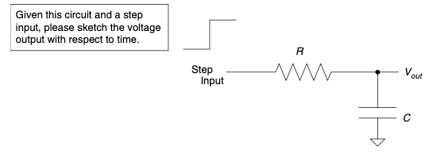

.. _c7:

CHAPTER 7 Touchy-Feely Stuff
==============================

This is the touchy-feely part of the book. Before you say,“Ick!” and chuck it as
far away as you can, please read on. Most“
average” people find the people who
gravitate to the world of electrical engineering a strange lot. If it weren’t true,
*Dilbert* simply wouldn’t be funny. From the point of view of the EE, the rest
of the world often doesn’t seem to “get it.” If you want to be the most successful engineer you can, there are some touchy-feely things you ought to chalk up
on your list of acquired skills. Yes, it is extremely likely that these are going to
be acquired skills; the engineer who comes by these capabilities naturally is a
rare breed. [1]_

PEOPLE SKILLS
---------------

One difficulty engineers often have in dealing with people is the fact that
interactions between us human beings can’t be described by slick mathematical
formulae like the various circuits they are working with. I personally think this
is why you often see engineering groups managed by non-engineering majors. [2]_
So, what should you do? One thing I have found is that, though there is no
perfect equation to describe people, there are some categories into which you
can sort people to help you understand how to interact with them.

In any business organization there are levels of hierarchy—there is no round
table. Someone sits at the head and it goes down from there. There is always
a pecking order, even if it isn’t on the org chart. Let’s sort the personality
categories into various levels of interaction, since that will definitely affect
how you should react. We might as well start at the top.

.. [1] I might venture that these are the people like Steve Jobs, Bill Gates, and other famous and now very rich self-avowed techno-nerds. Maybe if you can grasp these skills, that type of success will be in your future. Trust me, it is much easier for you to develop socially than it is to teach those other types how to pick apart a circuit!
.. [2] If you dig deeper, you will find that these types of managers can somehow interpret typical“sparky speak” into language that is less analytical and somehow more socially skilled types can handle.

Note that I am using masculine pronouns in these people descriptions for
convenience only. Of course, all these people can be either male or female.
Maybe someday we’ll invent some effective gender-neutral pronouns. Until then,
please feel free to use the pronoun that offends you the least or makes you laugh
the most!

Those Over You
~~~~~~~~~~~~~~~~~~

This means your boss, the person you report to, and the person who takes
responsibility for what you do. Of course, that is in a perfect world. [3]_ First, some
general rules:

- *Avoid talking smack about your boss*. Even if he deserves it, constant griping and complaining will usually hurt you more than him.
- *Maintain integrity*. Sometimes lying and deception can get you ahead in the short run, but in virtually every case it will come back to haunt you.
- *Help your boss succeed*. This can be hard sometimes, especially if your boss never gives you credit, but even if that is the case, be a great employee. Someone will notice.

The following sections contain descriptions of some boss types.

THE DILBERT BOSS
''''''''''''''''''''

This is the clueless boss. He has no idea what you do, and he is more concerned
with his position than with the success of the company. He is more than willing
to sacrifice one of his employees to make himself look good. This is the type to
take credit for everything you do right and blame you for everything that goes
wrong. First, do the best job you can. Your boss’s own self-interest will keep
you around if you are a valuable employee. Second, look for opportunities
where others in management can see your skills. This will counter the fact that
your boss tries to hide you away. Transfer out of this group if you can, since it
will be difficult to get far with this boss. [4]_

NEGOTIATOR BOSS
''''''''''''''''''''

This is the salesman type, the supreme negotiator. He will always set the goal
beyond any reasonable point, figuring that somehow this will encourage you to
go further than you think you can. First, don’t be discouraged by these requests.
After that, you have two approaches you can take. Be a negotiator yourself--overestimate the time and money it will take to get the job done so that you have
room to negotiate (like Scotty does for Captain Kirk on *Star Trek*). The other
option is to say what you can do and stick by your guns. Don’t underestimate with
the negotiator, though—he will be disappointed when you don’t meet the goal
you said you would. The negotiator is not necessarily a bad boss to have. You
could do much worse.“Better to aim for the sun and miss than aim for a cow
pie and hit it,” is the creed of this boss.

.. [3] I am well aware that there are plenty of boss types who will take all the credit when you do good and lay all the blame at your feet when you screw up. I truly hope you are never saddled with such a boss, but read on for some rules that will help if you are.
.. [4] This is the“dud” that you will learn about later who was somehow promoted to management. Yes, that happens, and if it is prevalent in your company, it’s best that you start looking elsewhere for employment.

THE“YES MAN” BOSS
''''''''''''''''''''

The“yes man” is the submissive boss. He tells his boss anything he wants
to hear and will often not defend his employees. It is not unusual for this boss
to commit you to impossible deadlines and tasks. Don’t make the mistake
of being a yes man to a yes man, though—that is a disastrous combination.
Let this type of boss know what it is really going to take to get the job done.
If you have a strong personality, you can help this boss by standing up for
him if he does say what it’s going to take to get the job done to his boss.
Generally, this boss will give you the credit for both your successes and
failures.

THE MICROMANAGER
''''''''''''''''''''

The micromanager tries to manage every detail. Try to handle his status report
requests and required updates as quickly as possible so that you can get back to
business. He might even be so obstinate as to be upset when you try to make a
decision for yourself.

I think the best way to deal with this type is to simply make sure you get those
reports and updates in on time. Try to be so reliable that this boss will gain
trust in you. Often you can talk to this boss easily (there will certainly be
enough meetings with this guy). Talk to him about your priorities often, and
stay in sync with his goals for the department. As long as he doesn’t carry it
to extremes, you are better off with this guy than the Dilbert boss. So don’t feel
too bad for yourself.

THE MACRO MANAGER
''''''''''''''''''''

The opposite of the micromanager, the macro manager is the boss who is never
there when you really need some help. He is hard to get hold of and often
difficult to talk to. This leaves you making a lot of decisions that you might
not feel comfortable with. You might even be criticized for decisions you’ve made after you asked repetitively for some feedback on that particular issue
without response.

The best thing to do in this situation is to take advantage of the opportunity to
learn to make decisions on your own. You might screw up, but that is a risk
you take in any decision situation, so don’t be afraid of making a mistake. If your
boss does question your reasoning, try to explain your decision process. Remem-
ber, he wasn’t there for all the things that led to your choice. Don’t assume that
he has the background on the issue that you do. The best thing about this boss is
the opportunity you will have to shine. You will be given plenty of rope; try not
to hang yourself!

THE PERFECT BOSS
''''''''''''''''''''

The best boss gives you some credit while buffering you against mistakes,
giving you a chance to learn and grow. If you have this type of boss, do your
best to succeed and you will! You should hang on for the ride. Often he
will give you plenty of leeway to succeed. He will recognize that his success
depends on yours, and he will help you succeed. Don’t be upset if this boss
gets some credit for something you did. If he is a good boss, he created the
environment that allowed you to be a success and deserves a nod for that.
Often, as this boss succeeds, you will as well because he will bring you along
with him.

YOUR BOSS’S BOSS
''''''''''''''''''''

You might not get a lot of interaction with your boss’s boss, but take care when
you do. This is the most visible you will get as an employee. Try not to be too
nervous. I remember one time I was dealing with the CEO of the first company
I worked for. Our production line was shut down because of an electronic
power problem. I was a lowly part-time student tech in the QC department.
I had just figured out the problem when he came to the line to see what was
up. I was shaking in my shoes as I showed him the cause of failure. He didn’t
believe me at first, so I showed him a broken one, fixed it, then broke it again.
He was satisfied, and production started back up. It only took two or three
more of those situations and the CEO knew my name. If I had panicked in that
position, no matter how right I had been, the results for me would have been a
lot worse.

THOSE OVER YOU SUMMARY
''''''''''''''''''''

A point to consider with these categories is that it is possible to find variations
of these types. After all, as we said originally, this people stuff isn’t an exact
science. If your boss is a blend of these types, you will probably have to blend
your response as well. If it helps, make up your own boss type; figure out his or
her attributes and what seems to make him tick. [5]_ Use what you figure out to
guide your choices.

Those at Your Level
~~~~~~~~~~~~~~~~~~~~~~

Ah, your coworkers, your fellow peons, and sometimes your enemies. This level
of interaction with your network of peers is the best place to create future
opportunities. The following subsections describe some peer types.

THE SNEAK
''''''''''''''''''''

Watch out for the sneak. He is always trying to see what he can get away with.
He will only work hard when the boss is watching. Don’t get caught in any of
his schemes to take advantage of the company. That usually turns out badly
and gets you branded as a sneak as well.

.. [5] Take caution to not expect the same behavior every time. Remember, people aren’t as predictable as circuits. Even so, this can be a very effective exercise. It will help your career more often than not.

THE POWER MONGER
''''''''''''''''''''

A true political figure at work, the power monger believes it is very important to
build power and reputation. What is sad is that he might try to make you look
bad to make himself look good. Try not to give him any ammunition that he
can use to prove how badly you are doing, thus making him look better. You
can make alliances with this guy pretty reliably, but it will be an“I scratch your
back, you scratch mine” type of relationship. If you make deals with this per-
son, you will need to hold up your end of the bargain, since you will be relying
on his self-interest to hold up his end.

THE BADGER
''''''''''''''''''''

The badger will tend to respond emotionally to situations. If he feels he is being
attacked, he will likely get defensive and angry like a badger when cornered.
The best thing to do is back down and give him a chance to calm down. If
you can help this person get past the emotion (or just wait it out), you can
usually reason with him. It is not unusual that the badger is also a workaholic.
Maybe that is why badgers are so ornery.

THE AVERAGE JOE (OR JANE)
''''''''''''''''''''

Companies are filled with average Joes. These people do a decent job, nothing
stellar, but are fairly reliable. I believe that if it weren’t for average Joes, compa-
nies could never be formed and kept together. These people like the security of
someone else making the tough decisions. They will often ask you what they
should do. Average Joes like to look to a leader. If you can gain their respect,
others will notice and it could lead to a promotion.

THE SHOOTING STAR
''''''''''''''''''''

These are the guys (or gals) who get it. They work hard but don’t make them-
selves into badgers. They are reliable and often correct in their decisions. True
shooting stars possess integrity and a desire for the company to succeed. They
often get promoted as these skills are recognized. This is a good friend to have
in a company, but hopefully after reading this book you will be the shooting
star that everyone else wants as a compatriot!

Often the shooting star is a leader and a true mentor; even if the organization
chart doesn’t show it, you should listen to the star’s advice whenever you can.

THOSE AT YOUR LEVEL SUMMARY
''''''''''''''''''''''''''''''

One of the most important things to have at this level is respect, for yourself
and for the others you deal with. You gain respect for yourself by following
through with what you say you will do. Stick to your word. If you make a mis-
take, say so, correct it, and move on. Give others a chance to build respect at the
same time as you. This mutual respect is a way to build a network of contacts
that is synergistic in nature. Here is where you and your colleagues can help
each other out, do each other favors, and be more successful than you would
be on your own.

Those Under You
~~~~~~~~~~~~~~~~~

You might be looking for a chance to lead, or you have had it forced on you.
Either way, you ended up with some subordinates who answer to you. This
is commonly the hardest adjustment for the true engineer type. As these
people below you on the org chart interact, you might be baffled at the
behaviors and personality traits that come out. Here are a few buckets to
sort them into.

THE SMART SLACKER
''''''''''''''''''''''''''''''

Smart slackers are usually pretty smart and can get a job done more quickly than
most others in the group. For this reason they might get some free time when
others don’t. But they don’t go looking for anymore work—they goof off or spend
the time surfing the’Net or other such things. Usually they are quick enough on
the keyboard to get back to looking busy when you walk by. Keep their plates
loaded to the brim. If their slacking becomes a big problem, you might need to
call them in and discuss it.

THE PRAISE DEPRIVED
''''''''''''''''''''''''''''''

Praise-deprived employees often need daily feedback on how they are doing.
They are looking for positive reinforcement and need a little praise. Be sure
to let them know when they are doing a good job. Don’t be afraid to be constructive if they make a mistake or should try a different approach. They will
usually let you know if they are done with a task and need more to do.

Sometimes as a boss, you will wish they would just leave you alone, since they
can seem a little needy. If they are valuable employees, spend a few minutes
with them as needed. They will be very loyal for that little time you spend. If
they aren’t so good, ignore them and they will find a job elsewhere, solving
the problem for you.

THE DUD
''''''''''''''''''''''''''''''

The dud is the person who doesn’t bring a lot to the table. You have to put
more work into him than you are getting out of him. That said, I am a firm
believer that people can change and improve. I prefer to give a dud a chance,
but be firm in laying out the expectations. Let him know what is needed from
him to keep him employed.

This, however, is not a situation that you can keep dealing with forever without
draining resources from the company. If he doesn’t change, he is the person
that you have to make a hard choice with, the one you have to let go. Don’t
run your group with a drain on resources indefinitely. It will hurt all of you
in the long run.

THE AVERAGE JOE (OR JANE)
'''''''''''''''''''''''''''

This is the same guy we talked about earlier. Be a leader for him, show him how
to excel, and you just might turn him into a shooting star.

THE SHOOTING STAR
''''''''''''''''''''

The shooting star is the same kind of person we already discussed. Most impor-
tant: The more of these you have in your group, the better you will perform!
Don’t be afraid of giving them credit, and don’t try to suppress any one of them
into being your peons. It will backfire on you. Share the credit and hook your
wagon to these people; they will get you to the finish line!

FINALLY
''''''''''

Can a truly effective manager get an average Joe or Jane to become a shooting
star? Or make a dud into something more? I think so, and I believe it is the
mark of a good manager to do just that. Anyone can yell and intimidate people
into doing what they want. The manager who persuades and edifies is much
rarer and also more valuable. His or her team will be more efficient, have less
turnover, and just get more stuff done. It doesn’t mean you should be an old
softy. You might need to be firm at times, but if you truly care about your
employees, it will show and make a difference.

Administrative Assistants
~~~~~~~~~~~~~~~~~~~~~~~~~~~

Every organization has an underground method of communication. In most
companies it flows through the assistants. Building a good rapport with the
receptionists and assistants is a good idea. It will allow you to tap into a whole
other communication structure. If they think well of you, you will have a better
reputation with those above you. Help the assistants whenever you can, and treat
them with respect. A lot of unsung greatness lies with the assistants in an organi-
zation. This applies to your assistant if you have one. Don’t ever degrade them; it
will come back to bite you. If they respect you, it will proliferate through the net-
work and help you. If they don’t respect you, that will travel the network and hurt
you. This doesn’t mean you just let them goof off all day. As individuals they will
fit into the categories we’ve described and can be dealt with similarly, with
respect.

.. admonition:: Thumb Rules

   - Work for the perfect boss when you can; work with what you get when you can’t.
   - Gain the respect of the average Joes.
   - Hook up with the shooting star.
   - Be a shooting star yourself.
   - Blend your response to blended personality types.
   - Give the dud a chance; let him go if he doesn’t step up.
   - Make the average Joe into a shooting star.
   - Treat the administrative assistants with respect.

BECOMING AN EXTROVERTED INTROVERT
----------------------------------

It seems to me that, generally speaking, the personality types that do well in
engineering seem to be naturally shy. I would have to say that electrical engi-
neers are probably the most introverted of the bunch. I was once asked,
“How do you tell whether you are talking to an extroverted engineer?” The
answer:

“He is looking at your shoes, not his own.” It’s funny because it’s true.
It is also true that the EE can benefit by overcoming this tendency. Here are a
few ways to do just that.

It All Depends on Your Point of View
~~~~~~~~~~~~~~~~~~~~~~~~~~~~~~~~~~~~~

A wise man once said (and I’m paraphrasing),“You will find that right or
wrong often depends on your point of view.” [6]_ Given that, I will try giving
you an idea of the way things are seen from the most common sides of the
fence. For this discussion we will call the engineer the peon and the manager
the pointy hair. [7]_

.. [6] Obi Wan Kenobi said this; some great life lessons can be learned from Star Wars!

.. [7] Yeah, I keep lifting phraseology from Dilbert. What can I say! Scott Adams struck a chord that rang true throughout the corporate universe!

THE PEON POINT OF VIEW
''''''''''''''''''''''

The decisions and directions of management are often as undecipherable to the
typical engineering peon as ancient Egyptian hieroglyphics are to the average
person. Here are some insights into the thoughts that go through a typical
EE’s head when dealing with a pointy hair:“Why in the world is this the most
important thing now when just yesterday it was the last thing on the list?” Or
maybe,“Why can’t you understand things like the word *impossible*?”

In my early years as a peon I coined the phrase,“Management is an unnecessary
evil.” It accurately summed up my thoughts on the topic. If your manager
couldn’t help you with fixing that circuit that wouldn’t work right or the code
that just didn’t execute the way it should, what good was he? I mean, sure,
he could keep buggin’ me all the time about status reports and the like, but
couldn’t I manage my own time?

Even if you find engineers with a manager that they like and think is very
helpful, they are still at a loss to understand management decisions. This is
often due to a lack of background on the decision process. Good managers
will often help this situation with some explanation as to the way they came
to the decision. Engineers, though usually a little underdeveloped in the
social skills area, still understand numbers and reasons. It helps them to
know why.

There is a natural angst in the role of the engineer verus the manager. After all,
he is the peon in the relationship. At the end of the day the manager is his
boss, not the other way around. Remember, engineers spend their whole lives
asking themselves,“Why this?” and“Why that?” It is what they are trained to
do; it makes them good engineers. Help them answer that question if you are a
manager!

THE POINTY-HAIR POINT OF VIEW
''''''''''''''''''''''''''''''''

First, understand the first and foremost goal of a manager: It is to make the business successful. It’s either that or to make the department he is managing look
good, which coincides with the first unless it is sacrificed for the second. (This
can happen with bad managers. Hopefully their bosses will notice and correct
that before it is too late.)

The good manager wants a successful company; how do you do that? It is pretty
simple really; you make more money than you spend.

While the engineer is more focused on accomplishing the task at hand, the
pointy hair worries about getting it done on time and on budget. This often puts
the peon and the pointy hair on opposite sides of the fence. It is difficult for
a manager to understand that unknown things can come up that mess up the
estimated schedule the peon gave him. Here’s an actual quote from a manager:
“We need to figure out a way to predict unknown problems from happening
and avoid them.” He was completely serious. [8]_ To him, that is how to get from
point A to point B. To the engineer who is trained to think logically, this phrase
will cause his brain to strip a few gears, leaving him generally speechless and
unable to respond.

It is not a bad thing to think so far out of the box. [9]_ If you can shift your head back
into gear after such a phrase and look at it as a problem to solve, you will be
surprised at what you think up. It is logically true that you can’t predict things
you don’t know. However, you might come up with a way to find out some things
you didn’t know before, and avoid those. Which is what that“pointy speak” really
means.

.. [8] I was personally flabbergasted at the time; this was before I developed my personal understanding of the pointy-hair point of view.

.. [9] I’ve seen pointy hairs so far out of the box that I wasn’t sure there was even a box around!

When two engineers start talking, you will often see pointy-hair eyes glaze over
as if you were speaking a language they don’t understand, which you are. To
keep them interested, use words like schedule and budget a lot. Managers like
to speak in absolutes, as in,“This will be done in such and such time and cost
so much.” Engineers like to have some fudge factor. They have seen too many
failed lab experiments to believe it will always go right the first time.

In my experience, if you tell the pointy hair it will cost between 10 and 15
bucks, the only price he hears is 10 bucks. This being the case, if you aren’t
sure you can get to the low price, you’d better not say it, no matter how often
he tells you not to sandbag your numbers. If you have some confidence,
though, go for it—it is also the mark of a good engineer to get to the com-
mitted price and schedule, even if it takes some extra effort. Take caution,
however—you don’t want to sandbag a number so high that you never
build anything because it is always too expensive. Remember, the goal of a
business is to make money, and you can’t do that unless you make stuff
and sell it. [10]_

.. [10] Unless you are doing government work, which is a whole other philosophy!

TALK IT OUT
''''''''''''

If the engineer makes an effort to lay off the acronyms and the manager tries to
explain some of the reasons behind his decisions, it will do wonders for your
mutual understanding. The most important thing you need is a desire to under-
stand each other. We’ll get into the skills a little later.

Visualization
~~~~~~~~~~~~~~~

A few years ago, as I watched an interview with Michael Jordan, I realized that
we have something in common. No, it is not a 40-inch vertical leap or the
ability to dunk the ball. I realized that for years I had been using a method
for success that Miracle Mike also used, a technique called *visualization*.

Everyone who works for a living experiences difficult and stressful situations. It
might be dealing with an irate boss, a lazy employee, or a fellow manager who
just doesn’t seem sane. Have you ever left a difficult situation in which you
were trying to argue your case when you suddenly thought,“I should have said
’blah, blah, blah’ or ’yada, yada, yada’?” You might be saying to yourself,
“Hindsight is 20/20,” but what I am about to tell you is how to turn that
hindsight into foresight.

I remember one of the first conversations I ever had with a CEO. I was a lowly
engineering student; he was the boss of a $700 million company. He hit me
with a couple of questions that I was not prepared to answer. I still remember
how my mind drew a total blank. Afterward, as I thought about it, I knew
exactly what I should have said. I decided that I would not go into such a situa-
tion unprepared again. But how do you prepare for something like that? This is
what I did.

I started to imagine myself in the situation beforehand. I would imagine how
the conversation might go. He would say“this” and I would respond with
“that.” In my imaginary situation I would try out several different approaches
and then imagine a response. I would visualize the person understanding my
point and a resolution to the case at hand that I desired. I found that when
I did this, the real conversation, when it occurred, followed my imaginary
one so closely that I always knew what to say. And better yet, I usually got what
I wanted out of it.

You might think I am full of it, but I have used this technique to visualize
getting raises and promotions, and I can honestly say that I got what I asked for
in nearly every situation. It actually amazes me when I look back at it. I was pro-
moted into engineering positions when I was still a student. Later, I worked with
several people, including a former boss, as an equal or superior. I could hardly
believe this happened to a naturally shy person from a hick town in Utah, a person
who doesn’t like confrontation.

There are no set rules for how to do visualization other than the more often you
do it, the more successful you will be with the technique. If you imagine the
ball going in 1,000 times, the next time you have to shoot that clutch shot, it
will go in. It works for Mike, and it works for me. Give it a try.

Affirmations
~~~~~~~~~~~~~~~~

One of my favorite Saturday Night Live recurring sketches featured the Stuart
Smalley character who repeatedly said,“I’m good enough, I’m smart enough,
and doggone it, people like me!” He mocked a technique similar to that of
visualization. It is called affirmation.

If you get into quantum mechanics, there is a rule called the Heisenberg uncertainty
principle. It was developed to understand some interesting experimental results in
which quantum particles (everyday light being one of these particles) act like a
wave in one experiment and like a particle in another. The problem is, they can’t
be both all the time; the behaviors are mutually exclusive. Anyway, a general conclusion of this principle says that when you measure something at the quantum
level, the very act of observation affects the outcome of the measurement. You,
the observer, basically get what you are looking for.

Please bear with me for a moment while I digress into very un-engineering-like metaphysical rumination. If you get what you look for, can you affect
the outcome by looking for what you want? This is what affirmations
basically say you can do. Affirmations are a lot like the visualization technique we discussed but taken to the next level. You not only imagine what
you are going to say or do in a given situation, you imagine the outcome
you want.

I know it sounds hokey, and I admit that it is not a perfect process, but I also
believe it works. Take any goal you want to achieve and write it down 30 times
every day, such as“I will get a book published,” or “I will get a raise,” for
example. Give it six months and see what happens. My experience is that it
does work; you’re reading this book, aren’t you? Guess how I started that ball
rolling. [11]_

.. [11] It is no coincidence, in my opinion, that the techniques of visualization and affirmation mirror that of faith and prayer so closely. I think they are principles that simply work.

One thing that definitely happens when you use affirmations is that your
mind spends considerable time pondering what you are looking for. This, I
believe, leads to recognizing opportunities when they come your way so that
you act on them. Several years ago I had on my long-term goal list a desire to
publish a book; it was a goal I affirmed regularly. I thought about it a lot.
Then, while reading an electronics magazine, I saw an ad for writers. I sent
in a reply and they asked for a copy of my work. I sat down and wrote my first
column. It was a success and I began writing. One opportunity led to another
and here I am achieving the goal I had set out to do. Imagine, however, if I
hadn’t had this on my mind when I saw that first ad? Would all of this have
happened? I don’t think so.

You get what you look for, so control your destiny. Say to yourself,“I’m good
enough, I’m smart enough, [Insert your desire here], and doggone it, people like
me!” Works for Stuart, works for me, and it will work for you, too.

Breaking Out of Your Shell
~~~~~~~~~~~~~~~~~~~~~~~~~~~~~

These techniques work very well in helping the naturally shy person to break
out of his shell. If you can overcome the natural shyness so common to engineers and learn a bit about the people around you, it will give you career
opportunities you might never get otherwise.

The hardest part of breaking out of your shell is taking that first step toward
doing it. You have to make the first step. After that each one becomes easier.
For example, you need to make a phone call that you really don’t want to
make. You have already spent plenty of time visualizing it; you have thought
through all the possible things that might happen. Now you are stuck—you
simply don’t want to make the call. It is not uncommon to feel apprehension
at this point. Don’t give up hope, though; there is a way through it.

First, clear your head and stop thinking about what is going to happen; concentrate on one thing—picking up the phone. Once the phone is to your ear, worry
only about dialing the number, nothing else. After someone answers, worry only
about initiating the conversation. Once it starts, the preparation you did with
visualization will kick in and from there on things will get progressively easier.

Repeat
~~~~~~~~~

Though it will get easier each time you go into a specific situation, these are not
skills you can learn once and then forget about. They require repetition, a lot of
repetition, not unlike learning to play an instrument or speak a different
language. The more you use them, the better you will become at them. Find
out the way these skills work best for you and practice them.

I still encounter situations today where I use these skills that are more than
20 years old for me. They still work, and I keep finding new ways to apply
them. And yes, I still get nervous when it is time to talk to the CEO, but now
it goes much more smoothly.

.. admonition:: Thumb Rules

   - To the engineer, many management decisions don’t make sense unless they know the why behind the what.
   - Managers have difficulty understanding techno-speak.
   - Talk it out’til you understand each other.
   - Visualize the situation, what is going to happen, and what you will say.
   - Write your goals down 30 times a day’til you achieve them.
   - Break out of your shell one step at a time.
   - Practice makes perfect; keep working on these skills forever more.

COMMUNICATION SKILLS
----------------------

Engineers are notorious for their poor communication skills. I was once asked
why it is that engineers who deal in logic that is either true or false have such a
hard time answering yes or no to a simple question.

It is something that I myself am plagued with. Given a typical question, for
example,“Will such and such project take long?” my answer usually begins
with,“It depends…” If I’m not careful from that point on, it can quickly lead
to my listener’s eyes glazing over.

When you are a better communicator, you will be more successful. Simply put,
everything we do in the world today requires communication. It is somewhat
ironic that things that enable communication to be better (like the Internet,
for example) are designed by engineers who could often use a course on the
subject themselves. So here are some pointers.

Verbal
~~~~~~~

The brunt of day-to-day communication is verbal. It is also the hardest kind for
engineering types to handle well. (I think it goes back to that shy thing we were
talking about earlier.) However, it is also the most important communication
skill to have. Face-to-face verbal communication is the best situation in which
you can (a) make sure you are understood, and (b) make sure you understand.

WATCH FOR BODY LANGUAGE
''''''''''''''''''''''''''

Some say as much as 90% of what we communicate in a verbal conversation is
in fact not verbal at all. If you really want to get deep into it, there are whole
books on this topic that tell you the meaning of things like glancing right or
left, up or down, and all sorts of looks. Most of the time, however, I believe that
if you simply pay attention, you can get a lot out of how a person presents him-
self and the way he acts. You have been doing this from a very young age and it
comes naturally if you give it a chance. Too often we get so rushed or distracted
that we don’t notice simple signs. For example, let’s say that a person on your
staff looks uncomfortable when he agrees to a deadline. If you don’t notice and
dig deeper, you could have a nasty surprise coming later.

CONSIDER WHO YOU ARE TALKING TO
''''''''''''''''''''''''''''''''''

The background of the person you are talking to should be considered as you
communicate. Don’t get caught in the trap of trying to explain details of
quantum theory to the CEO who has an MBA. You should try to distill what
you are communicating to the points that matter to the person you are talking
to. Take note of one important point, though: Don’t ever treat the person like
he is dumb! You can distill information without talking down to a person. If
invited to, you can elaborate. You might be surprised at what your boss can
understand—especially if he has read this book!

If you are dealing with a person from a different culture or who speaks a different
first language, it helps to simplify your phrases to be sure you are understood.
Don’t get into vocabulary words that they might not know without being sure
they understand what you are referring to. This particularly applies to words that
have meaning only in your corporate culture. Everyone perceives the world
through experiences they have based on the culture they come from. You don’t
need to speak louder. It doesn’t help. Try to enunciate your words, though; if
you are like me, you are probably carrying some hick accent that would cause
you communication problems in your own native tongue.

SHOULD YOU GET ANGRY?
''''''''''''''''''''''''''

Sometimes getting angry is a correct response. There are occasions when that is
what it takes for the person or people to whom you are talking to understand
the seriousness of the point you are trying to communicate. You might have
no other resort to get the point across. However, it should be rare, and if it is
rare, it will carry a lot more weight than if you are someone who pops a cork
every time something goes wrong.

REFLECTIVE LISTENING
''''''''''''''''''''''''''

A great way to improve verbal communication is to use a technique called
reflective listening. The idea behind this type of communication is to further your
understanding of what is being said by repeating it back to the person you are
talking to. Take care, however, not to be annoying. No one likes a copycat.
The trick is to rephrase it in terms you understand and see if the other party
agrees with you. This is particularly useful in dealing with persons from a different culture, say, a guy from engineering talking to a guy from management, for
example.

READ
'''''''''

I believe that the single best way to improve your verbal skills is by reading.
When you read, you experience how others communicate. It works with spy
novels to white papers—the more you read, the better you will communicate
with others. You will add to your vocabulary, you will understand cultural
differences, and you will be able to order your thoughts in a way that is easier
for others to understand.

Written
~~~~~~~~~~~~

Whether for emails, reports, or very official-type documents, writing skills are
extremely important in the field of engineering. Considering that nearly every
engineer I have ever dealt with has had some issue or another with writing,
I figure this is an often-overlooked skill.

PROOFREAD IT
'''''''''''''''

Writing has one distinct advantage over verbal communication: You can look it
over before you print it, send it, post it, or publish it. You should proof every
written communication you create. The only question is how much. If it is
short and you are going to follow up verbally, a quick glance will be enough.
On the contrary, if it is going to be read by a superior or someone who might
have reason to pick it apart, go over it a few times.

The most basic skill that I think should be used to proof writing is to read it out
loud to yourself to see how it sounds. Don’t forget to pause at commas and
stop at periods, as you were told to in grade school. This technique will help
you root out all sorts of odd-sounding phrases.

If you are particularly concerned, try it out on someone else and see whether they
understand it. Make sure the person has a similar background to the audience for
which the document is intended.

USE APPROPRIATE EMPHASIS
'''''''''''''''''''''''''''

In written communication you lose the ability to create inflection with your
voice, and you can’t tie body language to what you are saying. This can be com-
pensated for by emphasizing what you are saying with fonts, capitals, italics,
boldface, bullet points, and numerous other options. If you SAY SOMETHING
IN CAPS, you create the idea of yelling or raising your voice. Boldface words
can imply importance, and italics can help you draw attention to something in
particular.

There is, of course, a whole world of winks, smiles, and other punctuation types
of communication out there, but I believe, although most will get the smile, the
rest is a code that is known to only a few.

Note that I said appropriate emphasis. It is easy to get carried away. Don’t
cause death by bullets. Use too many bullet points and they no longer have
meaning; too much boldface and it does no good; too many caps and people
will think you are always angry. The trick is to be skillful in applying these
skills.

USE VERBAL SKILLS IN WRITING
'''''''''''''''''''''''''''''''

Some of these verbal skills are a great way to improve your writing skills. Things
such as considering your audience and reflective listening (or reading/writing in
this case) can help you understand and get your point across.

EMAIL SPECIFICS
'''''''''''''''''''''''''''''''

Watch out for flame-mail. In the realm of email, it is very easy to be misunder-
stood, and people often respond with less tact than they might have in person.
If you see a flame war starting, I think the best thing to do is talk to the person
in person.

Watch the CC list on your emails, take care to whom you forward what, and
always consider that what you have written can be easily forwarded to an unin-
tended audience.

Get to the Point
~~~~~~~~~~~~~~~~~~~

Written and verbal communications have a few things in common. One of
them is the importance of getting to the point. Use what you need to create
understanding, but don’t overelaborate. If 10 words will do, don’t use 100.
Here are some other ways to get to the point.

USE ANALOGY
'''''''''''''''''''''''''''''''

One of the most powerful methods of communication is the use of analogy.
This works well for trying to explain a problem, concept, or theory. Analogy
helps the person receiving information visualize what is being talked about.
For example, analogy can help a person understand the details of a topic the
same way that a telescope can help you see details of the moon. (Or maybe
the apartment next door.)

There you go. I just used an analogy to explain analogy, and possibly a little
humor too. Analogy is the art of comparing the new idea to something already
known. It works very well.

SKETCH A PICTURE
'''''''''''''''''''''''''''''''

You’ve all heard the phrase“A picture is worth 1000 words.” Engineers typically
get this; after all, they use schematics, which are simply pictures to represent
ideas. In the world of email, however, we often ignore what we know so well.
We will spend three paragraphs trying to explain what we want when a simple
sketch will get the point across. Get yourself a scanner and use it to send a
sketch with that email!

WATCH OUT FOR CORPORATE CULTURE CODE WORDS
'''''''''''''''''''''''''''''''''''''''''''''

Every conglomeration of people will develop code words to speed their com-
munication. In a corporation, everyday words will take on completely different
meanings. When you are dealing with people outside the company, be sure you
don’t assume that they know what you’re talking about if you use a corporate
word or phrase.

.. admonition:: Thumb Rules

    - Watch body language.
    - Consider who you are talking to.
    - Anger is sometimes appropriate, but it should be rare.
    - Listen reflectively.
    - Read.
    - Proofread your written communication.
    - Use appropriate emphasis.
    - Use analogy.
    - Sketch a picture.
    - Explain corporate culture code words to those not of your culture.

ESPECIALLY FOR MANAGERS
------------------------

Early in my career, I developed an outlook on management that can be summed
up in a single phrase I wrote in my day planner in a boring meeting many years
ago:“Management is an unnecessary evil.” Years later I got my own“pointy
hairs” and I discovered a few reasons for management to exist. (They might be
good and true reasons or simply an attempt to justify my own existence; you will
have to decide which.)

The Facilitator
~~~~~~~~~~~~~~~~
To facilitate is to make easy or easier. Management should be a facilitator; it is
up to you to create the environment in which an engineer can succeed. You
need to get your engineers the tools they need to succeed. You need to help
translate to your superiors the techno garble that engineers are so fond of. Most
engineers just like to design stuff and really don’t want to be in charge and
manage things. They like to leave that up to you.

The Buffer
~~~~~~~~~~~~~~~~
The best managers are a buffer between the top-level antics of illogical requests
with unreasonable timelines and the real world of actual schedules and needs.
They bring some order to the world of the engineer out of the chaos of pointy-
hair decisions. This is something the engineer needs to be successful. Don’t
forget that in their world, it helps considerably if things make sense.

The Advocate
~~~~~~~~~~~~~~~~

Good managers understand their employees and are their advocates. If an
employee always has to beg for a raise, he will soon be looking elsewhere for
a job. If he or she is a shooting star or even an average Joe, you will find that
a reasonable show of appreciation raise-wise is much cheaper than hiring and
training a new guy. It is not only right to be the advocate for your employees;
it is good for the interests of the company as well. I get sick of hearing managers
over-hype recognition and promotion as a way to make an employee happy in
lieu of a raise. It is true that these things are nice, but that only matters if basic
needs are being met—needs like food and shelter. If you are underpaying too
much, no amount of awards will keep employees around.

The Gift of Focus
''''''''''''''''''''

Good managers will develop the gift of focus. I find that this often comes
naturally to an engineering type; they sometimes get so focused on the task at
hand they might forget to even eat. For managers, though, their day is typically
one of continuous and repetitive interruption. You can even get a false sense of
accomplishment due to the fact that you are so busy being interrupted. To top
it off, interruptions can spill over onto your engineering staff. Take caution that
you don’t find yourself constantly interrupting your engineers’ focus. Be sure to
find time to focus on your tasks; take advantage of that office door and close it
on occasion to allow you to focus on things that need to get done. Keep meetings
focused on the topic. Keep your team focused on your goals. Remember, the
more difficult tasks require focus to complete. In today’s information-rich world,
focus can be hard to come by, so make it a priority in everything you do.

Understanding Engineers
~~~~~~~~~~~~~~~~~~~~~~~~~~

Here are a couple of things you might or might not know about engineers but
that will help you be a better manager of engineers.

WEASEL ROOM
''''''''''''''''''''

Engineers need a little weasel room. Have you ever asked an engineer if he is 100%
confident he has the solution? If you have, you were likely treated to a look of
complete loss. It is not possible for an engineer to be 100% confident in anything.
In this discipline you are constantly assaulted with the fact that you don’t and can’t
know everything. You discover new ways for things to go wrong daily and are
constantly working to fix and prevent them from happening. If an engineer gives
you a range, take the conservative number for your estimate. Give the guy a little
weasel room. Try to pin him down too hard and it could backfire on you.

THE ETERNAL OPTIMIST
''''''''''''''''''''

I haven’t met a good engineer yet who didn’t regularly underestimate how long
it takes to do something. This is simply a fact: Good engineers by nature are
optimistic, and the really great engineers will push themselves so hard that they
will meet the optimistic schedules they set for themselves. I heard a rule of
thumb once about writing software that I have found to be true: Take the
engineering estimate of time a job will take and multiply by three.

DESIRE TO GROW
''''''''''''''''''''

The better you understand the“sparky” viewpoint, the more successful you
will be at managing engineers. If you take this to the next level you can help
your engineers take on more and more, literally turning an average Joe into a
shooting star or even possibly rescuing someone from dudsville. [12]_ Most engineers want to grow and become better at what they do, but they need a little
encouragement, a chance, and maybe a bit of a buffer against failure.

The Best Manager is Right Most of the Time
~~~~~~~~~~~~~~~~~~~~~~~~~~~~~~~~~~~~~~~~~~~~

Some time after I decided that management is an unnecessary evil and then
later found some purpose in life after being inducted into management, I came
up with a formula that describes a good manager. Remember, a manager
spends nearly all his time making decisions—what tools to buy, what people
to hire, what to do about a particular problem, what to eat for lunch, [13]_ and
so on. How good he is depends on how often he is right. If he is right more
often than not, the company makes money. If he is wrong too much, down
the tubes it goes. So without further ado….

.. [13] I believe there is a correlation here: The further up the corporate ladder a person climbs, the longer it takes him or her to decide what to have for lunch.

A good manager is right 51% of the time. A great manager is right 70%, 80%, even
90% of the time. If your decisions are right most of the time, you will succeed.

Remember this when faced with a decision. You don’t have to be right all the
time. Don’t let indecision and too much worry prevent you from making a
choice. Often that in itself can cause you to fail. Consider the situation, take
action, and watch the results. Don’t be afraid to admit you were wrong if you
see you’ve made a mistake. Learn from the mistakes and don’t repeat them.

Finding the Shooting Star in a Forest of Average Joes
~~~~~~~~~~~~~~~~~~~~~~~~~~~~~~~~~~~~~~~~~~~~~~~~~~~~~~~~

One of the most challenging things a manager has to do, after spending an
hour or so with someone, is to decide whether that person would be a good
employee and hire him or her. As we learned in previous discussions, you really
want to stock your group with shooting stars, but how do you find them? How
do you weed out the duds so that you aren’t saddled with a problem down the
road? Though there is no perfect solution, here are some key points to look for
in a perspective engineer.

DRESS
''''''''

Don’t put a lot of value on how a person is dressed. Casual attire is the norm
where I work, so unless someone comes in with serious hygiene problems, I
don’t chalk up any negative points. Once, however, a potential employee asked
what the dress code was. His consideration impressed me. However, it is of
minor importance. Our company is interested in results and product, neither
of which is significantly affected by the dress of R&D employees. [14]_
12 If you don’t get the references to shooting stars, average Joes, and duds, you either skipped a few pages
or have a serious memory problem.

.. [14] Okay, that’s not entirely true. When I think about it, the casual atmosphere we maintain makes us more productive, but that comes after the hiring decision, so it doesn’t count.

FUNDAMENTAL KNOWLEDGE
''''''''''''''''''''''''

This is very important to me as a manager. There are some skills I don’t want to
have to teach you, skills I expect you to know for this position. A degree or
some type of schooling tips the scale favorably, but I do not consider it a
shoe-in. I have seen too many college graduates who got through school by
the“assimilate and regurgitate” method. They passed all their tests with great
grades, but they didn’t focus on retaining the knowledge. I weed these people
out with questions such as the one shown in :ref:`Figure 7.1 <Figure 7.1>`.

.. _Figure 7.1:

    Given this circuit and a step input, please sketch the voltage output with respect to time.

    **FIGURE 7.1 Standard“sparky” interview test question.**

You might laugh, but being located right next to a major university with a
reputation as a good engineering school, I constantly interview fresh graduates
who should know this stuff. Fully half the applicants I see get this question
wrong! The basics are important. If you don’t have them, you are just guessing
when you design. Worse yet is if you think you know them and you really
don’t. After all the hammering on basics at the beginning of this book, I hope
the importance of this concept is understood. I’d rather hire someone with the
basics down pat and a 2.9 grade point average than the person that has a 4.0
and stumbles on basic understanding.

CAN YOU LEARN?
''''''''''''''''

I have yet to see any employee get into a new job and not need to learn. Sometime
during the interview, I will intentionally teach the candidate something new, and
then hit the subject later in the interview, to see if he or she has picked it up. This
ability to learn quickly and have it stick is important to the success of any engineer-
ing group. Technology will quickly outstrip those who can’t learn.

ARE YOU WILLING TO LEARN?
''''''''''''''''''''''''''

You might think this was covered in the preceding question, but I consider it a
separate point. I will often ask interviewees a question that I am fairly sure they
do not know the answer to, simply to see how they respond. Do they try to BS
their way through it? Or are they willing to admit that they don’t know and ask
for help? In the rapid design cycles of today, there isn’t time to play games. That
means “I don’t know, but I will find out” is an appropriate answer. You can
take this to a higher level, too. On call-back interviews, ask a question again
that stumped them the first time to see if they were interested enough to figure
out the answer.

PEOPLE SKILLS
''''''''''''''

Is there a job out there that requires zero contact with other human beings?
I doubt it. The best engineering teams get along well, which is why I value peo-
ple skills significantly. How do you handle pressure? Can you get along with
people you don’t care for? This is a fairly tough item to evaluate in an interview.
I invite my leads to fire questions at the candidate and watch how he or she
responds under pressure.

ATTITUDE/MOTIVATION
''''''''''''''''''''''

A positive attitude always impresses me. I quote my father:“Can’t is a sucker
too lazy [15]_ to try.” I think it is important to believe that something can be done.
Look for signs of giving up on a problem. Is the candidate persistent? Does he
or she complain during the interview? Does he moan about his last job? I have
seen all types. Whiners don’t get hired.

.. [15] Can laziness actually be an asset? If it motivates creativity, it can. Remember, if you give the hardest job to the laziest man, he will find the easiest way to do it. So I guess you could look for motivated lazy people, if that makes sense at all.

COMMON SENSE
''''''''''''''

This is all about getting the job done in the least amount of time. Too often a
person can be“book smart” but not be able to apply what he or she has
learned. If you don’t have common sense you will struggle with applying the
knowledge you have. Here is a brain teaser [16]_ I often use to determine a person’ s level of common sense:

    You are standing in a room with two strings hanging from a high ceiling. If you grab just
    one string and walk to the other, the second string is several feet out of reach (because it
    is hanging straight down). Your task is to tie the two strings together. You have just three
    things to perform this task: a book of matches, a single square of toilet paper, and a
    screwdriver. How do you tie the strings together?

.. [16] I’m not sure I want to reveal the answer. People who are smart but with less common sense will overthink it too much. (You wouldn’t believe some of the answers I’ve heard!) If you have a high common-sense quotient, you will get the solution in a second and wonder why it was so simple. Email me for a hint if you are struggling! Heck, email me if it is obvious, maybe I’ll put in a good word for you at my company!

IN GENERAL
''''''''''''''

Should you be looking for the person who can do differential equations in his
head? I don’t think so. I will buy Mathcad for that. I want to know if the
candidate has the fundamentals and if he can and will learn the rest.

Remember, great managers are rare; mediocre managers are commonplace. You
don’t have to be a great manager for a company to be successful. Why stop
there, though? Great managers are huge assets to any company; great managers
can turn average Joes into shooting stars who can make incredible things
happen.

Being a great manager isn’t all that hard. Listen, look, and learn until you are
right most of the time. Then you won’t be unnecessary or evil!

.. admonition:: Thumb Rules

   - Management is an unnecessary evil?
   - Be a facilitator.
   - Be the buffer.
   - Be an advocate.
   - Develop the gift of focus.
   - Understand your engineers.
   - Be right most of the time.
   - Hire shooting stars; make shooting stars from average Joes.
   - Don’t be unnecessary.
   - Don’t be evil.

ESPECIALLY FOR EMPLOYEES
---------------------------

As an employee your motivation, like the pointy-hair boss you work for,
eventually boils down to money. You want to do a job and get paid for it. True,
job satisfaction is important, but that comes as a far second to the need to buy
food to eat and have a dry place to sleep. This means that an employee needs to
know two things: how to get a job and how to keep a job. This chapter is a
guideline to those things.

How to Get a Job
~~~~~~~~~~~~~~~~~~~

It all starts with the interview. Having interviewed more engineers than I care to
remember, I have compiled seven definite no-nos [17]_ extracted from real interviews. Giggle, laugh, and snicker if you will, but please do not try these during
your next interview. The people described in the following paragraphs are

.. [17] Come to think of it, these don’ts aren’t just for engineering interviews; you could make a pretty good case for each one as a rule of thumb in almost any job interview.
professionals.

DON’T BE CONDESCENDING
''''''''''''''''''''''''''

Be careful how you come across to your potential employer. One candidate
I interviewed seemed to really disdain coming to us for a job. It was as though
he would work for us if he really had to, but he sure wasn’t going to like it. The
“you don’t have anything to teach me” vibe was very strong. Being an engineer
who believes the ratio of what we know to what we don’t know is extremely
small, I have a tough time with that. This is especially disconcerting when some
simple circuit diagrams are requested and you get the response,“Everyone
knows that,” a little hand waving, and then nothing is written down and no
answer is forthcoming. I immediately think you don’t actually know it, and this
is all an act to cover up the lack of knowledge.

DON’T WORRY ABOUT SAYING“I DON’T KNOW”
''''''''''''''''''''''''''''''''''''''''''''''''''''

The stress of an interview might make it the toughest place to say“I don’t
know,” but that is not a bad answer. Especially if you follow up with,“I’ll find
out, though.” One of the best impressions I had from a potential employee was
when he sent me an email afterward that explained the answer to one of our
questions in the interview that he didn’t know at the time. The fact that he took
the effort to look it up showed perseverance and a desire to learn. That alone
will many times make up for a current lack in knowledge.

DON’T LOSE YOUR COOL
''''''''''''''''''''''''''''''''''''''''''''''''''''

One person I interviewed was clearly thrown a bit off balance by some of the
questions I asked. What really put marks in the cons column was when he
got so upset trying to solve the problem that he threw down his pencil and
repeatedly smacked the table. Our work environment can be much more stressful than an interview; I really don’t want to worry about someone going mental
on the job.

DON’T GIVE UP EASILY
''''''''''''''''''''''''''''''''''''''''''''''''''''

If you don’t know the answer to a particular problem, try to figure it out if you
can. I will often ask questions that I know the candidate won’t know, just to see
how he or she handles it. Someone who takes one look and walks away has
never impressed me. Remember, while someone is standing there saying it can’t
be done, someone else is out there doing it.

DON’T BE AFRAID TO ASK QUESTIONS
''''''''''''''''''''''''''''''''''''''''''''''''''''

Along with the preceding point, you are not expected to know it all. If a person
asks a question about a particular task or problem I’ve given him or her in an
interview, it usually shows that a person who doesn’t know is willing to find
out. That is a very important trait in the engineering world. Also use the inter-
view as a chance to find out about your prospective workplace.

DON’T LAY YOUR HEAD ON THE TABLE
''''''''''''''''''''''''''''''''''''''''''''''''''''

Yep, it really happened and I have witnesses to prove it. This potential employee
laid his head on the table several times during the interview. I couldn’t figure
out whether he was tired or just listening for some type of table vibration that
might indicate how well the interview was going. This would never be my
only reason for not hiring someone. (I get some of my best ideas in that twilight between almost asleep and almost awake.) However, this was coupled
with some other blatant problems. I just knew it wouldn’t work. Let’s just say
this particular interviewee will have plenty of time to nap now.

DON’T CALL YOURSELF STUPID
''''''''''''''''''''''''''''''''''''''''''''''''''''

I wouldn’t have believed it if it hadn’t happened to me. One applicant we had
got a little flustered with a couple of basic questions, but that wasn’t what did
him in. The first time he said“Man, I am stupid,” I didn’t think much of it;
however, as the interview wore on, I heard,“Oh, I’m an idiot,” and,“I am soooo
stupid,” probably a dozen times or more. By the end of the interview, I was sure
of one thing: I definitely didn’t want to hire an idiot, especially one so stupid.

A FINAL THOUGHT
''''''''''''''''''''''''''''''''''''''''''''''''''''

There are a lot of guides out there on getting an interview and getting through
an interview. They are even a bit more conventional than my seven don’ts. It
can’t hurt to study up on some of these pointers. I also think it helps to know
a bit about the company you are interviewing with. Take advantage of today’s ability to look up anything on the Internet. It will help you decide where you
want to be, and it also doesn’t hurt to have a little background before going
into an interview.

How to Keep a Job
~~~~~~~~~~~~~~~~~~~~~

When the ax falls, will you be the one to get chopped? How do you increase
your stability in a given company? What makes an employer keep one person
and let another go? Here are five key areas that can give you a little more secur-
ity in this layoff-prone world—things you can do besides simply being good at
your job.

VALUE
'''''''''''

Here’s a Thumb Rule: Companies exist to make money. Even non-profit companies
need to bring in money to cover their salaries and expenses. When your employ-
ers start reviewing you and your coworkers, you need to realize that this is fore-
most in their mind.

This is the question the manager must ask himself: If I had to start all over with
just one employee, who would it be? Or in other words, who would most likely
make this company a success? In my analysis, this person is the“shooting star.”
He or she works hard, has great talent, can handle pressure, and works well
with others. If you ask him for something, you get it. You don’t have to keep
checking up on him. You know she is going places. He very directly affects
the profitability of the company.

Therefore, you must remember that your total value is of top importance. What
if you add value, though, and no one notices? This can happen, especially in
larger companies. My answer is this: It is not bad to toot your own horn a
bit. A good way to do this, both for you and your employer, is to do a regular
self-evaluation. List the things you accomplished last year and compare them to
what you did this year. Do you show improvement? If not, commit yourself
until you do. Then give that to your boss. He’ll appreciate that you look at
yourself critically and it’s a good chance for him to see what you have done
for the company.

POSITION
''''''''''''''''''''''''

Repeat the thumb rule we just learned: Companies exist to make money. They
don’t do that without a product. So the most important job you can have is one
that is directly related to the product. Don’t get stuck in a one-off job. What is a
one-off job, you ask? A one-off job is one you can eliminate and still sell
product. It is one level removed from delivering a product to the customer.
The ISO 9000“Corporate Coordinator” might sound like a pretty neat title,
but when you get right down to it, the company could do without it. If you find
yourself in a one-off job, it’s time to start looking for a transfer.

LOYALTY
''''''''''''''''''''''''

It’s human nature to complain. Because of that, an easy yet subtle trap to fall
into is right by the water cooler. In this trap you discuss the latest smack about
the boss. Every leader I have ever met appreciates loyalty. If you succumb to
spreading rumors, whether true or false, you put yourself on shaky ground.
I am not saying the pointy hairs don’t make mistakes. In fact, I believe that a
manager only needs to be right 51% of the time to be successful, as you already
know. So remember this: They might have their faults, but so do you. If you
have a serious issue with your boss that you can’t overlook and can’t help talk-
ing about, you’d better start looking for a new job, because in today’s market,
you soon will be.

EFFORT
''''''''''''''''''''''''

Effort is important for two reasons. First, a great effort can compensate for a
lack of skill. Remember that the guy who tinkers in the lab for hours on end
can get to the finish line faster than the brilliant engineer who spent the morn-
ing surfing the’Net. It’s all about getting to the market the fastest these days. It
is the entire reason that MAMA [18]_ exists. All the pointy hairs want to do is to
deliver product, make the sale—in general, to do business. So a supreme effort
is usually noticed. Remember, the same rumor mill you should avoid yourself
can have a tremendous effect on you. You can be known for hard work, or you
can be known as a slacker. The choice is up to you.

.. [18] Look it up in the glossary; I promise you will find some of the more entertaining parts of the book there.

IF THE WORST HAPPENS
''''''''''''''''''''''''

It is possible that no matter what you do, you still get laid off. At times when a
company has to cut deep, there is nothing that can be done. I suggest you take
this as best you can and leave on a good note. If things pick up again, it is a lot
easier for a boss to rehire someone he knows will do a good job rather than any
Joe off the street. So don’t burn any bridges.

A Final, Final Thought
~~~~~~~~~~~~~~~~~~~~~~~~

By no means do I consider this list comprehensive. There can definitely be more
to it. People skills, attitude, and other things are considered by an employer
when making this tough decision. To make it worse, the world is not all sugar
and spice. There are sadistic pointy hairs out there who give the rest of us a
bad name (I just hope they are the exception, not the rule). If you have one of
those, don’t complain, just start looking.

Remember, dealing with people is not a very exact science. There is no Ohm’ s
Law for corporate culture. These are things that I have found that generally
work. You can sum it all up by referring to the different types of employees
we have previously discussed: the shooting stars, average Joes, and duds. When
it comes time for layoffs, you don’t want to be a dud, and if you can, try to be a
shooting star.

.. admonition:: Thumb Rules

   - Avoid the seven interview don’ts.
   - Companies exist to make money.
   - Companies exist to make money (duplicated to indicate importance).
   - Take care of the five key areas.
   - It isn’t a perfect science.
   - Don’t be a dud.
   - Be a shooting star.

HOW TO MAKE A GREAT PRODUCT
-----------------------------

The Slinky, Legos, the PC, Silly Putty, weed eaters, Velcro, cell phones, DVDs,
pet rocks, and the microwave—the list of killer products seems endless. How
do you go about designing a great product? What makes a product successful?
Believe you me, the list of great ideas that never went anywhere is much larger
than the list of things that made it! For those of you with a more entrepreneurial spirit, here some pointers on how great products come into existence.

The Idea
~~~~~~~~~~~~

Usually the core of a great product addresses a need or desire. The more people
who share that need or desire, the more success potential an idea has. Here is a
real live example. My car windows are always frosty during the winter here in
Logan, Utah. I don’t have the patience to start my car early and wait for the
defroster to clean the window, so I scrape. Scraping is not much fun, and last
year I had a great idea for an invention. Why not put a heater in the windshield
washer fluid so that I could have a quickly defrosted window without having to
scrape? I am sure there are other people like me who would want this product.

Let’s evaluate this idea for a second: first, the buyer of such a product would
need to own a car. That limits the primary market to Canada, the United States,
and Europe. Then it has to get cold enough to frost your windows where you
live. There goes half the United States. Next, to be like me, you can’t afford to
park your car in a garage, and that eliminates a bunch of people. I figure that
Canadians like to scrape, knocking off another large part of the market. So will
this idea make me a million? Probably not, but if I worked hard enough at it, it
might generate a decent income for a while.

Compare that to the market of the weed eater (string trimmer, to be more correct).
When George C. Ballas stuck some twine in an old tin can and spun it on his
electric drill, he was addressing a need that many a man felt. Not only did it chop
those pesky weeds, it involved a motor as well and, oh, the power rush!

His market was anyone who had ever wished for an easier way to trim those hard-to-reach places in his lawn. To top it off, it also stroked the male ego. I think it had
a larger success potential than my defroster idea, don’t you? Notice that I said
potential. A lot more than potential is needed to make a product a success.

Design
~~~~~~~~~

The product needs to work well. This means that the design needs to do what
the customer expects from it. If everyone sends the product back, it won’t be
a success for long. There is one all-too-evident exception to this rule: software!
Sometimes people will deal with glaring product faults (also known as GPFs) if
that is the only game in town. It is that or you really need a particular feature
and are willing to deal with the bugs. [19]_ It bothers me, though, that you can’t
send it back because you clicked“I accept” on the 40-page EULA that no one
reads, which prohibited you from even taking Bill’s name in vain, let alone
returning a product. But… here I am using that same popular word-processing
program because of the features I like. [20]_

It also needs to look good. Ever since the 1950s, industrial designers have
convinced the consumer that you can have a functional product that looks
good as well. There are successful ugly products out there, but if they looked
good they would be even more successful. Have you ever said,“That’s a sweet
little package,” in reference to something other than the opposite sex? [21]_

.. [19] Okay, I’m slamming on a certain large software company here. To be fair I will say that my more current versions of this software are significantly better than the versions I learned on many years ago. The best thing that ever happened to software was the ability to update it. Yes, they can lock out the hackers and pirates who believe that all IP should be free, but for me and most of the world it is nice to get a free update that fixes that pesky bug.
.. [20] I still hate EULAs though. Software, unlike every other consumer product, carries no responsibility for any damage it may cause. Someday this may change, but it would likely drive the cost of software up and I’m a cheapskate, so I guess I’d better stop complaining.
.. [21] Possibly a bad analogy, since I have heard an engineer say exactly those words in reference to an IC, but you get the point.

Timing
~~~~~~~~~~

Ahhhh, timing… it is as important in launching a product as it is in telling a joke.
I don’t think the weed eater would have sold before America moved into the sub-
urbs and the lawn wars began. The Slinky wouldn’t have made it very far if it came
after the Nintendo. A company I worked for had an idea that changed our market-
place. It was featured on some 30 different news channels and became a raging
success. It didn’t stick until the third time it was tried. The first two times were utter
failures. It needed the Internet as a global community to be a success. The first two
times it was tried, the global data community just wasn’t there to give it the buzz it
needed. Timing is important.

Funding
~~~~~~~~~~

It takes a million to make a million, right? This is usually the case unless you
listen to late-night TV. Now, if you believe that stuff, I have a book on how
to get a perfect stranger to give you 50 bucks. I will sell it to you for only
$47.95 plus shipping and handling.

I think that funding (or lack of ) stops more great products from coming into
being than most other reasons combined. You have to take some type of finan-
cial risk. One way is the OPM method: Use Other People’s Money. Unfortu-
nately, it takes a smooth talker to get other people to part with their money,
so you might have to run up your credit card or go deep into your savings.
There are many ways to get the money, but it will cost money to get your idea
to market. You will have to take some risk at some point to make it happen.

Marketing
~~~~~~~~~~

You have to sell your product. No one will buy a product that isn’t sold. That
takes marketing.‘Nuff said’.

Okay, maybe not. I used to think this was pretty obvious, but when I started a
business helping people get stuff to market, I found that marketing is often the
most ignored part of getting a business off the ground.

If you build a better mouse trap, the world will not pound a path to your door
without an infomercial, a store, or a way to know it exists. You will need to be a
salesman of some type to get your idea off the ground. If someone doesn’t buy
it, you don’t have a product—just another idea that didn’t go anywhere. The
patent libraries are full of mouse traps that you can’t buy.

Making a Great Product Summary
~~~~~~~~~~~~~~~~~~~~~~~~~~~~~~

So, will you be the next Bill Gates? Just think of a product that everyone wants.
Get a couple of rich relatives to put in a good word and pitch in a few bucks,
and who knows. If your timing is right, it just might happen. If not, I still have
that book for sale….

.. admonition:: Thumb Rules

   - Have a good idea (this is the easy part).
   - Consider the market potential.
   - Your product needs to work well.
   - Looking good helps.
   - Timing is everything.
   - It won’t happen without risk.
   - You need to sell it.
